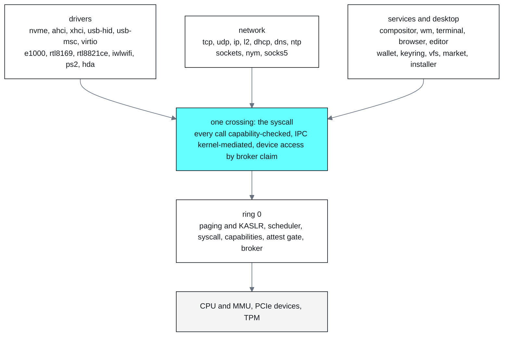
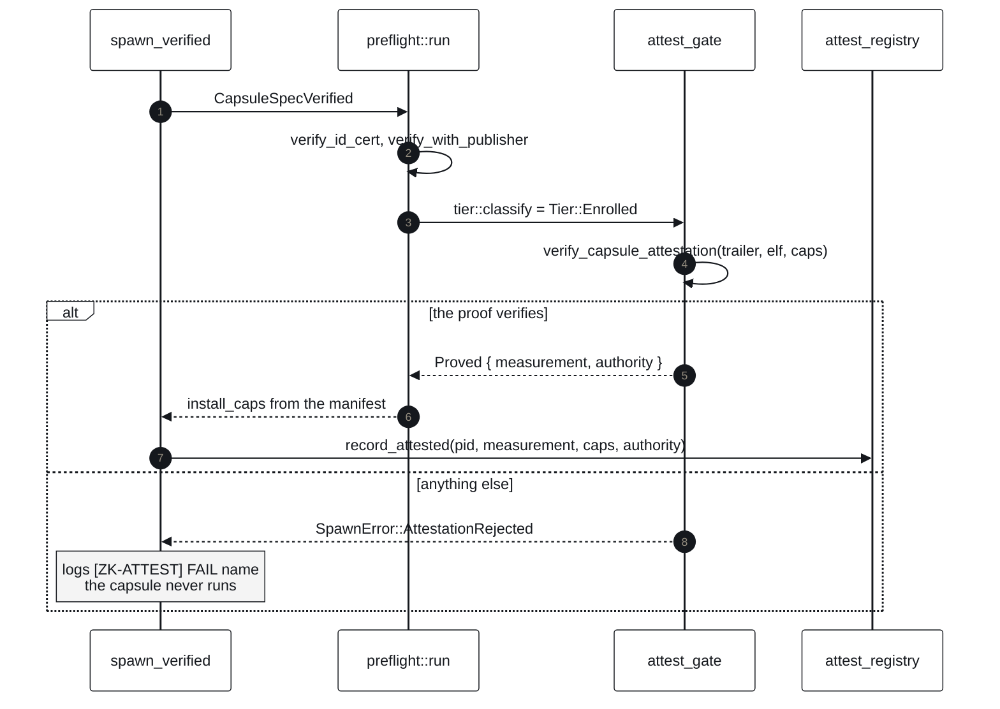
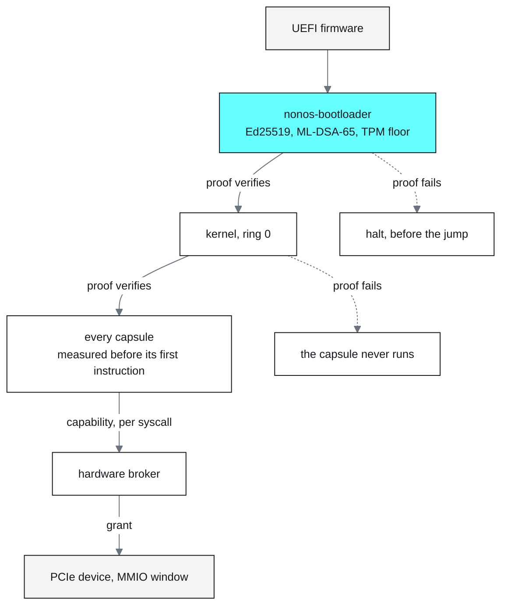
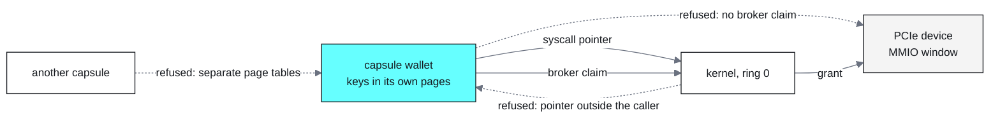
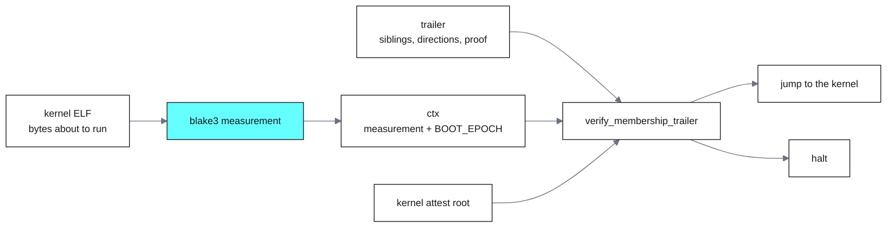
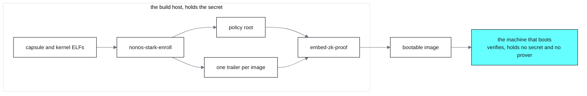

# NØNOS

An operating system that keeps nothing. It boots a measured image into RAM,
proves every program before that program runs, and wipes memory on the way down.

The kernel is 261,216 lines of Rust in ring 0, and 903 kilobytes of machine code
once linked. Above it, 411,483 lines run in ring 3 across 166 crates: the NVMe, AHCI
and xHCI drivers, e1000, virtio-net and the RTL8821CE Wi-Fi part, net_core with TCP,
UDP, DHCP and DNS, the Nym client with its SOCKS5 front, the compositor, window
manager, terminal, file manager, editor, image and video players, a browser with its
own JavaScript engine and TLS, a wallet holding BIP39 keys, and ripgrep from
crates.io, unmodified. Under all of it, 54 proof crates that exercise the shipped
code, 103 Kani harnesses, and a Lean development of 1,156 theorems with no sorry.

Most of the system cannot reach the kernel's memory, which is the point of
building it this way. Of the 903 kilobytes that do run privileged, more than a
third is `core`, `alloc`, `compiler_builtins` and two dependencies rather than
NONOS code, and that share keeps falling. Every driver is already out. The last
thing to leave was secp256k1, Ed25519 signing and the wallet's crypto, which moved
to a ring 3 capsule and left the verification side behind.

## The machine

*Ring 0 does what only ring 0 can: page tables, the scheduler, the syscall
boundary, the capability check, the attestation gate, and a broker that hands out
device windows. Everything a user would call the operating system runs in ring 3
and reaches the kernel one way, through a syscall the kernel checks a capability
for. A driver defect is a capsule defect.*

## Capsules

Everything that runs is a capsule, drivers included. A capsule is compiled ahead
of time, signed, and shipped inside the kernel image, so nothing is read off a
disk at spawn and no filesystem sits in the trust path. The kernel measures each
one before its first instruction and admits it only with a proof that this exact
measurement is enrolled under the policy root, bound to the capabilities that
capsule was granted. A capability is a bit granted at enrollment, and the kernel
checks it on every syscall, so a capsule that never declared the network has no
socket to reach for.

*Spawn, fail closed. The capabilities installed come from the verified manifest,
never from what the spawn site asked for, and the measurement recorded is the one
the gate checked, never one recomputed afterwards.*

Trust runs one direction. The bootloader verifies the kernel before the jump, the
kernel verifies each capsule before its first instruction, and no account and no
privileged path can wave code through.

*Each arrow names what enforces it: a signature and a TPM counter into the
bootloader, a proof into the kernel and into every capsule, a capability bit on
every syscall, and the MMU underneath all of it.*

## Privacy

The machine forgets because it has almost nothing to remember with. The kernel
keeps no mutable state on disk and its own filesystem lives in RAM. Every capsule
the desktop runs ships inside the kernel image, so the trust path never reads
storage. The kernel wipes memory on the way down, and that wipe sits on the only
reachable path to powering the machine off, so no shutdown can skip it. Lean
proves that property over every reachable state.

An image may carry a block store of extra capsules and media, built on the host.
Anything loaded from it arrives with its own certificate, manifest and proof and
passes the same gate as a capsule compiled in.

What leaves the machine is separated the same way. Traffic can go out through the
Nym mixnet client, which builds a Sphinx packet across three mix layers and an
exit gateway, with single-use reply blocks for the return path, and a SOCKS5 front
end so an ordinary capsule reaches it without knowing any of that. A capsule
without the network capability never gets a socket at all.

*Where a secret lives and who can reach it. The dotted arrows are not policy the
kernel chooses to apply: the first is the MMU, the second is every syscall pointer
walked before the kernel reads it, and the third is a device window no capsule can
map without a claim the broker records. The page-table user and write bits behind
the first arrow are proved in Verus and checked over the real descriptor code.*

## The proof

A signature says a key holder approved an image, and it puts that key holder in
the trust base for as long as the image exists. Admission asks something else: is
this one of the images the policy commits to. So the kernel and every capsule
carry a transparent STARK over Poseidon with a Fiat-Shamir transcript, verified
against a root the verifier already holds. Hash-based, no trusted setup, no
pairing, nothing a quantum adversary shortcuts. Prover and verifier are one crate
linked into the kernel and the bootloader, so what gets written is what gets read.

*The verifier measures the image in front of it and supplies the root itself. The
trailer carries the path and the proof and chooses neither, so a trailer lifted
from another image fails on the context it is bound to.*

Signatures still cover what signatures answer well. The kernel is dual-signed with
Ed25519 and ML-DSA-65 and measured into the TPM behind an anti-rollback floor:
who released this image, and is it older than what this machine already accepted.

*Enrolment is a host step, verification is a boot step, and in production they run
on different machines. The machine that gates holds no secret and no prover. The
build ends by re-verifying what it just wrote, and anyone holding the image can
run the same checks again.*

## Real hardware

Proven on x86_64 silicon, by device class rather than by one vendor's parts: NVMe
and AHCI storage, xHCI USB HID, PS/2 keyboard and touchpad, and the UEFI GOP
display. Each of those is written to the specification, so a machine that presents
the class is served by the same driver. Wi-Fi is the exception and is proven at
the part level, on the RTL8821CE, from scan through association and the WPA2
four-way handshake to a DHCP lease.

Proven under QEMU: virtio-gpu with 2D scanout, virtio-net, virtio-blk, e1000, and
the software TPM behind the measured boot.

Reaching discovery and stopping there: Intel iwlwifi, which wants a PNVM table the
tree does not ship before gen3 silicon will start its firmware; USB mass storage;
and HDA audio. VT-d bring-up runs where the hardware is presented and has not yet
been exercised on a real IOMMU.

## Build and run

You need Rust nightly with `rust-src`, QEMU, swtpm, mtools, sgdisk, xorriso
and an OVMF image. `make doctor` checks all of it and tells you what to
install.

    git clone --recursive https://github.com/NON-OS/nonos-micro-kernel.git
    cd nonos-micro-kernel
    make doctor
    make run

`make run` builds the system and boots it under QEMU with a software TPM.
On a fresh clone it runs under a development identity and says so on the
console; that image is for looking, not for shipping.

To build under your own keys, and to put it on hardware:

    make                   build the image and verify it against itself
    make qemu              boot it
    make usb DISK=/dev/sdX write a stick, after typing the path once more
    make test              static checks and the boot harnesses

Every step ends with a line to look for. The whole path, from keys to
enrollment to what the loader checks before it jumps, is in
[docs/build](docs/build).

## What is new here

Every system that boots securely today roots execution in a key. Secure boot,
verified boot, code signing: someone holds that key, and whoever holds it decides
what runs on your machine. NONOS roots execution in a hash. A capsule runs because
a proof shows its measurement sits in the set the policy committed to, the check
needs no secret, the machine makes it alone, and anyone holding the image can
repeat it. The proof is post-quantum by construction.

That check is the one that decides what ends up executing on a machine whose image
somebody else built, and it holds without trusting whoever built it. NONOS has no
root account, no unsigned path to execution, and no mutable state on disk. Every
device driver runs in ring 3 but one: the kernel drives virtio-rng itself, because
it needs entropy before the first capsule exists, and falls back to a software
source when the device is absent.

## Verification

The guarantees above are machine-checked rather than argued. Lean 4 carries
isolation and non-interference, the capability algebra and its delegation, the
spawn path and the capabilities a spawn installs, page-table permissions, the
user-copy boundary, the attestation binding, the anti-rollback floor and the
ZeroState wipe. Verus takes the properties that are about the real bit operations
rather than a model of them, Kani harnesses sit in the source, and the proof
crates pull the shipped kernel source in through `#[path]` and run it, rather
than a reimplementation that could agree with the proof and disagree with the
kernel.

NONOS does not claim functional correctness of the whole kernel. The proved
surface is the security-critical one: what may run, what it may reach, and what
survives a power cut. The [verification map](verification/MAP.md) ties each
property to the source it constrains, the [reference](docs/) goes deeper, and
[status](docs/architecture/status.md) carries what is landing next. Design work
happens at [discord.gg/nonos](https://discord.gg/nonos).

## License

AGPL-3.0-or-later. Redistributable device firmware is not part of the source and
carries its own terms.
