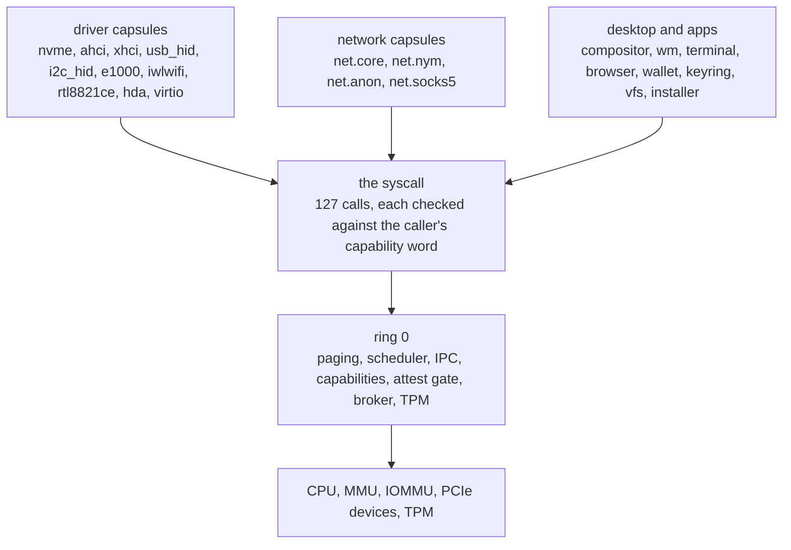
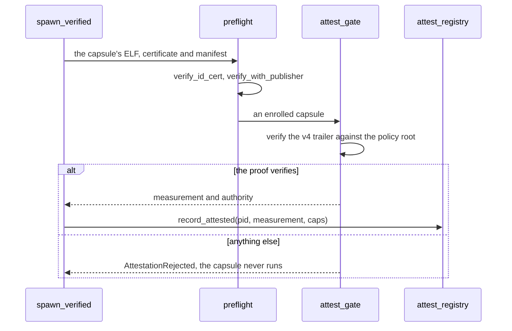
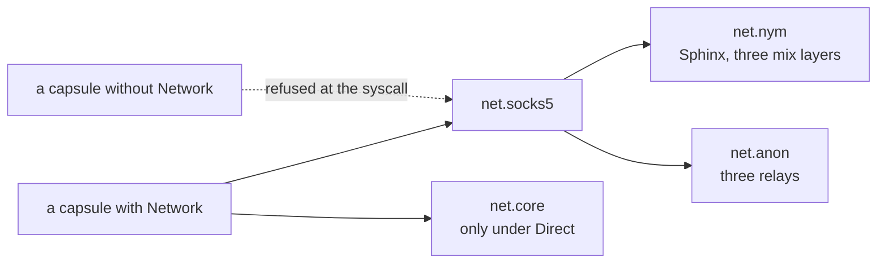
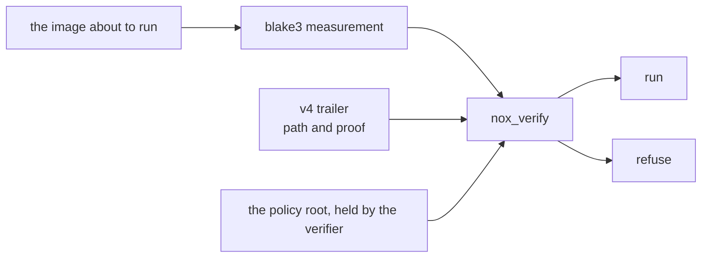

# NØNOS

An operating system you can use every day that keeps nothing. It boots a measured image into
RAM, runs every program as a signed capsule with only the capabilities it was enrolled for,
sends traffic through the network the person chose, and wipes memory on the way down.

0.9.2 is the release that makes NONOS a daily driver. The desktop, the browser, the terminal,
the wallet, a Linux userland, a private local model, first-boot setup and the installer are all
in one image, and every one of them runs above a microkernel that checks a capability on every
call. [CHANGELOG-0.9.2.md](CHANGELOG-0.9.2.md) lists every change with the proof behind it.

Every claim on this page is tied to code or to evidence in the tree. What 0.9.2 has shown on a
booted machine and what it has shown only on the host is set out under
[Where 0.9.2 stands](#where-092-stands).

## What you get

| | |
|---|---|
| Desktop | a compositor, a window manager and a desktop shell with a dock; windows size themselves from small laptop panels to 4K |
| Browser | its own HTML parser, CSS layout, a QuickJS engine and TLS with the Mozilla roots; pages load over Nym, Anyone or direct |
| Terminal | tabs, pipelines and jobs, built-in commands, `git` over HTTPS, and the bundled Linux tools |
| Linux programs | a Linux personality that traps and translates Linux system calls, with a built-in BusyBox and CPython 3.12, Lua, zstd and John the Ripper in the store |
| Wallet | BIP39 and HD keys held by the keyring capsule, sealed to the TPM, signing in ring 3 |
| Qwen, local | a private Qwen model installed from the store, fetched over the chosen network, checked against its published hashes and kept on the encrypted data volume |
| Apps | files, text editor, image viewer, audio and video players, settings, process manager, clock, calculator, the market and app store |
| Network | Nym mixnet by default, the Anyone onion network, or direct; chosen in setup and changed in Settings |
| Install | amnesic by default; first-boot setup and an installer that writes NONOS to a disk only when the person types the disk's word |
| Proofs screen | About shows every admitted capsule with its measurement and enroller, and how traffic is leaving right now |

The handbook page for each is in [the handbook](docs/handbook/README.md). The person at the
keyboard should read [Using NONOS 0.9.2](docs/release/0.9.2/user-guide.md).

## The kernel

The kernel is a capability microkernel in Rust: 282,997 lines under `src/`. It does what only
ring 0 can do: page tables and address spaces, the scheduler, IPC between capsules, the
syscall boundary with its capability check, the attestation gate at spawn, the TPM, and a
hardware broker that hands device windows to driver capsules. Everything a person would call
the operating system runs in ring 3: 235 crates under `userland/`, drivers included.

```mermaid
flowchart TB
 drv["driver capsules<br/>nvme, ahci, xhci, usb_hid, i2c_hid, e1000, iwlwifi, rtl8821ce, hda, virtio"] --> sc
 net["network capsules<br/>net.core, net.nym, net.anon, net.socks5"] --> sc
 app["desktop and apps<br/>compositor, wm, terminal, browser, wallet, keyring, vfs, installer"] --> sc
 sc["the syscall<br/>127 calls, each checked against the caller's capability word"]
 sc --> k["ring 0<br/>paging, scheduler, IPC, capabilities, attest gate, broker, TPM"]
 k --> hw["CPU, MMU, IOMMU, PCIe devices, TPM"]
```

A capability is one of 36 bits, defined once in [abi/caps.toml](abi/caps.toml). A capsule's
word is fixed when it is enrolled, the kernel installs it from the verified manifest at spawn,
and every syscall is checked against it. A capsule that was never enrolled for the network
holds no socket and cannot send to the network services' inboxes by pid. Driver capsules reach
their device only through a broker claim, with DMA confined by the IOMMU where a remapping unit
is in service.

[Architecture](docs/handbook/architecture.md) is the place to start reading the kernel. Then
[capabilities](docs/handbook/kernel/capabilities.md), [IPC](docs/handbook/kernel/ipc.md),
[memory](docs/handbook/kernel/memory.md), [the IOMMU](docs/handbook/kernel/iommu.md) and
[the syscall surface](docs/handbook/kernel/syscalls.md).

## Capsules

Everything that runs is a capsule. There are 96, each a directory with a `Capsule.mk` that names
its service and its capability word. A capsule is compiled ahead of time, signed with Ed25519
and ML-DSA-65, enrolled under the STARK policy root and shipped inside the kernel image or the
image's store. At spawn the kernel checks the certificate, the manifest and the proof, then
installs the capabilities from the manifest.

```mermaid
sequenceDiagram
 participant S as spawn_verified
 participant P as preflight
 participant G as attest_gate
 participant R as attest_registry
 S->>P: the capsule's ELF, certificate and manifest
 P->>P: verify_id_cert, verify_with_publisher
 P->>G: an enrolled capsule
 G->>G: verify the v4 trailer against the policy root
 alt the proof verifies
 G-->>S: measurement and authority
 S->>R: record_attested(pid, measurement, caps)
 else anything else
 G-->>S: AttestationRejected, the capsule never runs
 end
```

The capabilities installed come from the verified manifest, never from what the spawn site
asked for. Every capsule is listed with its service and decoded word in
[the capsule catalog](docs/handbook/apps/capsule-catalog.md). Writing one is in
[adding a capsule](docs/handbook/extending/capsule.md).

## Privacy

The machine forgets because it has almost nothing to remember with. The kernel's file tree
lives in RAM. Every boot is amnesic: nothing reaches a disk unless the person chose to install
in first-boot setup, and then only the installer and the system's own store may touch a disk's
raw sectors. At shutdown the kernel stops every device, then wipes live device buffers, every
process's memory, the kernel stacks, the filesystem caches and the keys. That wipe sits on the
one path that powers the machine off, and Lean proves no reachable state reaches off without it.

A program's traffic leaves by the network the person chose:

- **Nym mixnet**, the default. Each packet is a Sphinx packet across three mix layers to an exit
 gateway, with single-use reply blocks for the way back.
- **Anyone**, the onion network: three relays, each knowing only its neighbours.
- **Direct**, which the sites reached can see.

When the chosen network is down, the browser, the terminal, the wallet and the Linux guests
send nothing another way. Network cards transmit from a new locally administered address every
boot. The private model runs without the network, and its files come only through the
installer's checked fetch.

Some traffic does not follow the choice. The Nym and Anyone capsules fetch their directories
and build their paths from boot on every image that carries them, so a machine set to Direct
still shows Nym and Anyone traffic on its local network. Programs built on the toolchain's Rust
std connect direct. The TPM's counter keeps a count of boots. These and the other gaps are listed
on the privacy page.

```mermaid
flowchart LR
 app["a capsule with Network"] --> socks["net.socks5"]
 socks --> nym["net.nym<br/>Sphinx, three mix layers"]
 socks --> anon["net.anon<br/>three relays"]
 app --> direct["net.core<br/>only under Direct"]
 other["a capsule without Network"] -. "refused at the syscall".-> socks
```

The whole model, with what it does not cover, is in [privacy](docs/handbook/privacy.md),
[the amnesic design](docs/handbook/kernel/hardening.md), [storage](docs/handbook/storage.md) and
[the route model](docs/handbook/network/socks5-and-routes.md).

## The STARK gate

A signature says a key holder approved an image, and it keeps that key holder in the trust base
for as long as the image exists. Admission asks a narrower question: is this one of the images
the policy committed to. So the kernel and every capsule carry a transparent STARK proof over
Poseidon, with a Fiat-Shamir transcript, that its measurement is a member of the set under one
policy root. It is hash-based, with no trusted setup and no pairing.

```mermaid
flowchart LR
 img["the image about to run"] --> m["blake3 measurement"]
 m --> v["nox_verify"]
 tr["v4 trailer<br/>path and proof"] --> v
 root["the policy root, held by the verifier"] --> v
 v --> run["run"]
 v --> halt["refuse"]
```

The gates link only the verifier, `nox_verify`, from the STARKs repository at the commit `flake.lock` pins. The prover
runs on the enrolling host in `nonos-stark-enroll`, which builds the one policy root over every
capsule and checks each proof with the gates' own verifier before writing it. The machine that
boots holds no prover. The verifier measures the image in front of it and supplies the root
itself, so a trailer lifted from another image fails.

Signatures still answer what signatures answer well. The kernel is signed with Ed25519 and
ML-DSA-65 together and measured into the TPM behind an anti-rollback counter: who released this
image, and is it older than what this machine already accepted. The details are in
[the STARK layer](docs/handbook/trust/stark.md), [signing](docs/handbook/trust/signing.md),
[keys](docs/handbook/trust/keys.md) and [the TPM](docs/handbook/trust/tpm.md).

## Lean 4 and the proofs

The security-critical surface is machine-checked. Lean 4 carries isolation and
non-interference, the capability algebra and its delegation, the spawn path and the
capabilities a spawn installs, page-table permissions, the user-copy boundary, the attestation
binding, the anti-rollback floor and the ZeroState wipe: 1,511 theorems in
`verification/lean`, with no `sorry` in any Lean tree. An extraction pipeline turns kernel
functions into Lean so theorems speak about the shipped code, not a model of it. Verus takes
the properties that live in real bit operations. 106 Kani harnesses sit in the source. 90 proof
crates pull the shipped source in through `#[path]` and run it.

NONOS does not claim functional correctness of the whole kernel. The proved surface is what may
run, what it may reach, and what survives a power cut.
[The proof suites](docs/handbook/verification/proofs.md) says what each one guarantees and
which run in CI. [verification/MAP.md](verification/MAP.md) ties each property to the source it
constrains.

## Hardware

Drivers are written to the device class, so a machine that presents the class is served by the
same driver: NVMe and AHCI storage, xHCI with USB HID and mass storage, PS/2 and I2C-HID
keyboards and touchpads, HDA audio, the UEFI GOP display, e1000, RTL8139, RTL8169 and virtio
under QEMU. Wi-Fi joins WPA2 and WPA3 networks on the RTL8821CE and on Intel AX211. A driver
whose device is missing leaves at once, and one whose device fails gives up after a few seconds.

Each driver, what it does and what a boot must still confirm on it are in
[drivers](docs/handbook/drivers.md) and

## Build it

You need Nix with flakes turned on (https://nixos.org/download) and nothing else. On Linux and
on a Mac with Apple silicon:

 make # the kernel, every capsule, the Linux userland and the loader
 make check # every proof crate and every static check

On Windows, run the same two commands inside WSL2, or open the repository in its devcontainer
(`.devcontainer/`), which has Nix already.

The toolchain, every crate and every C source are pinned by hash, and the build runs offline in
Nix's sandbox. `make` ends with a receipt: every artifact by sha256, the toolchain and every
pinned input, the kernel's own bytes held to the profile's promises, and `REPRODUCED` when the
artifacts are byte for byte the ones in the committed `receipts/<profile>.json`. Those artifacts
are unsigned, and no build ever needs a key. Enrolling and signing take keys only the release
holder has:

 make seal # enroll, sign and pack: needs the keys
 make boot # boot the sealed image under QEMU, with a TPM
 make boot-install # beside a blank disk, to try the installer
 make usb DISK=/dev/sdX # write it to a stick, after typing the path again

A build is one of six profiles, set in `nonos.toml` or as `PROFILE=airgapped make`:

| profile | for | what it adds or takes away |
|---|---|---|
| standard | a person's own machine | every driver, the desktop, first-boot setup and the installer |
| hardened | a machine that may be seized | Secure Boot and a TPM required at boot; no capsule writes to a serial console |
| airgapped | keys that must never touch a network | hardened, with no network driver, stack or online program compiled in |
| qemu | trying NONOS in a virtual machine | the desktop, without the drivers only real hardware has |
| dev | working on NONOS | the loader's development policy; never sealed for release |
| core | kernel work | the microkernel and its base capsules, no desktop |

A release image is built `hardened`. [docs/build](docs/build/README.md) is the step by step
guide, from installing Nix on each platform to an installed disk.
[Build and verify](docs/handbook/build/build-and-verify.md) is the whole flow,
[tools/nix/README.md](tools/nix/README.md) the build in one page, and
[CONTRIBUTING.md](CONTRIBUTING.md) the way in.

## Where 0.9.2 stands

Every change in 0.9.2 was built for `x86_64-nonos-user`, with the kernel compile-checked, and
held by the host proof suites. The session that made the release did not boot it. The boot run
that shows each gate refusing and admitting, and each driver on real silicon, is the release's
last step, listed step by step in
 Until its
logs are committed, read "the kernel checks" on this page as "the kernel is built to check".
 records each row as its evidence lands, and
the known gaps are at the end of [the changelog](CHANGELOG-0.9.2.md#known-gaps).

## Documentation

| | |
|---|---|
| [The handbook](docs/handbook/README.md) | how NONOS works, one page per subsystem, every claim tied to a file and line |
| [Building NONOS](docs/build/README.md) | from a fresh machine to a sealed, booted and installed image, one page per step |
| [Using NONOS 0.9.2](docs/release/0.9.2/user-guide.md) | what changed for the person at the keyboard |
| [Building on 0.9.2](docs/release/0.9.2/developer-guide.md) | the rules for capsule and driver authors |
| [Capabilities in 0.9.2](docs/release/0.9.2/capabilities.md) | every bit and every capsule's mask |
| [CHANGELOG-0.9.2.md](CHANGELOG-0.9.2.md) | every change and the proof behind it |

Design work happens at [discord.gg/nonos](https://discord.gg/nonos).

## License

AGPL-3.0-or-later. Redistributable device firmware is not part of the source and carries its own
terms.
