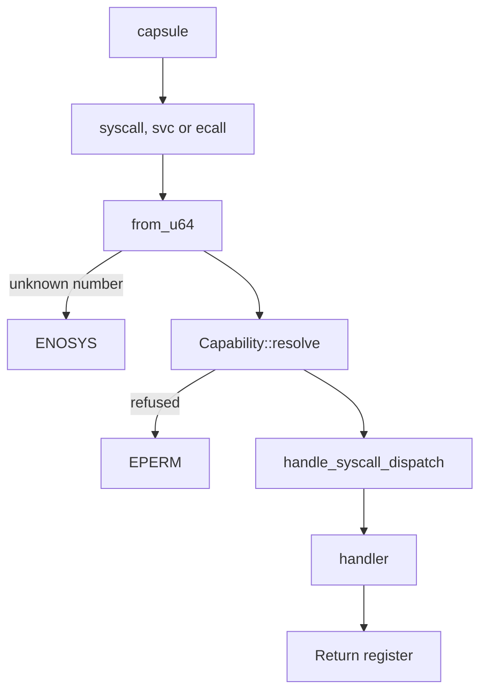

# The NONOS ABI

The ABI is the contract between a [capsule](../overview/glossary.md#capsule) and the NONOS kernel: how a call is made, which number names it, which [capability](../overview/glossary.md#capability) admits it, and what comes back.

## The ABI pages

- [Syscalls](syscalls.md): all 130 calls with number, name, capability and meaning, the capability check, and the graphics and input structures.
- [Errors](errors.md): the codes handlers return and every errno the kernel defines.
- [Capabilities](capabilities.md): the 36 capability bits, what each admits, and the groups `abi/caps.toml` publishes.
- [Broker](broker.md): the calls a driver makes to the device [broker](../overview/glossary.md#broker), the records they exchange, and the broker's constants.
- [IPC](ipc.md): the IPC calls, the message envelope, the limits, and the well-known service ports.

[Driver broker ABI](driver_broker_abi.md) in this directory is the broker call reference built from the dispatch arms: every broker call's registers, the output records, the device record, the class IDs and the errors. `nonos-ci/run-static-checks.sh` greps it for the broker call names (`abi_doc`, `nonos-ci/run-static-checks.sh:1850`), so it is kept in step with the handlers. [Broker](broker.md) is the fuller narrative of the same surface.

## What the ABI is made of

The code is the authority. Three things in the kernel decide every call:

- `REGISTRY` lists every number the kernel accepts, one table per family (`src/syscall/abi/registry/mod.rs:27-28`). There are 130 calls in 0.9.2, listed in [Syscalls](syscalls.md).
- `is_allowed` decides which capability admits which call (`src/syscall/contract/cap_table/mod.rs:28-34`). The 36 capability bits are listed in [Capabilities](capabilities.md).
- `SyscallResult::error` turns a refusal into a negative errno (`src/syscall/types/result.rs:35-37`). The codes are listed in [Errors](errors.md).

Three files in `abi/` publish the same contract for toolchains and other readers: `abi/syscalls.toml` (numbers, argument lists, errors, limits), `abi/caps.toml` (capability bits and groups) and `abi/wire.toml` (structure layouts). The kernel does not read them. Scripts under `scripts/` compare them with the code, as described in [How the tables are checked](#how-the-tables-are-checked).

On the user side, `raw_syscall` in `userland/nonos_abi` is the trap trampoline that `nonos_runtime`, `nonos_ipc` and the other `nonos_*` crates call through (`userland/nonos_abi/src/raw.rs:17-39`), and `userland/libc` wraps the calls under C names such as `mk_ipc_send` (`userland/libc/src/ipc/send.rs:20`).

## How a call travels



A capsule traps with `syscall`, `svc` or `ecall`, depending on the architecture. The kernel resolves the raw number with `from_u64`, which searches `REGISTRY` through `lookup_id` (`src/syscall/numbers/convert.rs:22-23`, `src/syscall/abi/mod.rs:31-40`). A number the registry does not hold is answered with `ENOSYS`, -38, except one from a [foreign process](../overview/glossary.md#foreign-process) on x86_64, which its supervisor answers (see [Calling convention](#calling-convention)). A known number goes to the contract `dispatch`, which runs `Capability::resolve` and answers `EPERM`, -1, when the caller's [capability token](../overview/glossary.md#capability-token) does not admit the call (`src/syscall/contract/dispatch.rs:31-37`). Otherwise `handle_syscall_dispatch` reaches the handler, and the handler's result goes back in the return register. The checks `Capability::resolve` makes are listed in [Syscalls](syscalls.md#the-capability-check).

## Calling convention

| Architecture | Trap | Number | Arguments, in order | Return |
|---|---|---|---|---|
| x86_64 | `syscall` | `rax` | `rdi`, `rsi`, `rdx`, `r10`, `r8`, `r9` | `rax` |
| aarch64 | `svc #0` | `x8` | `x0`, `x1`, `x2`, `x3`, `x4`, `x5` | `x0` |
| riscv64 | `ecall` | `a7` | `a0`, `a1`, `a2`, `a3`, `a4`, `a5` | `a0` |

Every call takes at most six arguments, each a 64-bit register. Most calls that take a narrower field read it with `u32_arg` or one of its siblings, and the dispatch then refuses a value that does not fit with `EINVAL` rather than cutting it down (`src/syscall/microkernel/narrow.rs:17-35`). Three calls do not: `sys_mmap` gets its protection and flags words cast to 32 bits (`src/syscall/microkernel/dispatch/process.rs:65`), `sys_exit` its exit code (`src/syscall/microkernel/dispatch/process.rs:69`), and `sys_futex_wait` its expected value (`src/syscall/microkernel/dispatch/process.rs:78`).

On x86_64 the entry stub's own header gives the convention: `rax` holds the number and `r10` the fourth argument, because the CPU overwrites `rcx` (`src/arch/x86_64/asm/syscall.S:1-4`). The `syscall` instruction clobbers `rcx` and `r11`, and the stub restores the caller's `rdi`, `rsi` and `rdx` before it returns (`src/arch/x86_64/asm/syscall.S:115-123`). `setup_fmask` masks IF, TF, DF and AC on entry (`src/arch/x86_64/syscall/msr.rs:108-111`). `syscall_handler` sends a number it does not know to `redirect`, which hands the call of a [foreign process](../overview/glossary.md#foreign-process) to its supervisor, and answers `ENOSYS` when there is no supervisor (`src/arch/x86_64/syscall/manager/entry.rs:38-53`).

Vector 0x80 is not a syscall path in 0.9.2, though `abi/wire.toml` names `int80` as `gateway_default` (`abi/wire.toml:13`). The gate for `VECTOR_SYSCALL` leads to `handle`, which only counts the interrupt with `increment_syscalls` (`src/interrupts/idt/table_irqs.rs:46-48`, `src/interrupts/handlers/irq/syscall.rs:19-21`).

On aarch64 an `svc` from EL0 arrives with exception class `EC_SVC64` (`src/arch/aarch64/exceptions/handlers/sync.rs:32-39`); `dispatch` reads the number from `x8` and writes the result to `x0` (`src/arch/aarch64/exceptions/handlers/svc.rs:22-31`). On riscv64 a `UserEcall` reaches `dispatch_ecall` (`src/arch/riscv64/interrupts/handlers/dispatch.rs:27`), which reads `a7`, writes `a0` and steps the program counter past the `ecall` (`src/arch/riscv64/interrupts/handlers/syscall.rs:22-38`). Neither architecture has a foreign redirect.

Only on x86_64 do both user-side paths trap. `raw_syscall` in `nonos_abi` returns -38 without trapping on any other architecture (`userland/nonos_abi/src/raw.rs:41-52`). The libc's `raw` traps with `svc #0` on aarch64 (`userland/libc/src/syscall/raw/aarch64.rs:33-58`), and its fallback `raw` returns -38 on riscv64 (`userland/libc/src/syscall/raw/fallback.rs:16-27`). No user code in this tree issues `ecall`, so on riscv64 the kernel side exists and nothing calls it.

## Return values

A call returns a signed 64-bit value. Zero or more is success, and its meaning depends on the call: a byte count, a pid, an address, a [claim epoch](../overview/glossary.md#claim-epoch), or 0. A negative value is a negated errno, as `SyscallResult::error` stores it (`src/syscall/types/result.rs:35-37`). `abi/syscalls.toml` publishes `errno_range` as -4095 to -1 (`abi/syscalls.toml:17-19`). Some calls answer with a flag rather than data: `sys_cap_check` returns 1 or 0 (`src/syscall/microkernel/capability/handlers.rs:68-74`), and `IRQ_WAIT_TIMED_OUT`, 1, is what `MkIrqWait` returns when it slept out its whole timeout (`src/syscall/microkernel/irq/timeout.rs:19-25`). See [Errors](errors.md) and [Broker](broker.md).

## Stability in 0.9.2

NONOS 0.9.2 makes no written stability promise for argument lists, record layouts or behaviour. What the code does enforce is narrower: `check_abi_stable.py` reads the three tables named in `TABLES` and fails when a published syscall number, errno or capability bit is renumbered or withdrawn, when two names share a value, or when an entry is published without being added to the baseline (`scripts/check_abi_stable.py:18-29`). Its baseline, `scripts/baselines/abi-published.txt`, holds 191 entries: 130 syscall numbers, 25 errnos and 36 capability bits. The `static-abi` entry of `staticChecks` runs it together with `check_syscall_abi.py`, `check_syscall_args.py`, `check_caps_abi.py` and other scripts, in order, and stops at the first that fails (`tools/nix/checks.nix:197-234`). In the flake check run on this commit, `static-abi` failed on `check_prebuilt.py`, which reports two unclassified binaries and is not an ABI check. `check_syscall_abi.py` and `check_abi_stable.py` ran before it and passed; `check_syscall_args.py` and `check_caps_abi.py` come after it and did not run there. All four pass when run by hand, as [below](#how-the-tables-are-checked).

The version fields are labels, not checks: `abi/syscalls.toml` sets `version` to 3 and `abi` to `nonos-sys-v1` (`abi/syscalls.toml:6-7`), and nothing in the kernel reads them.

The published files still disagree with the code in places. Where they differ, the code decides, and these pages follow it:

- The argument lists in `abi/syscalls.toml` are checked for their length only, and only where the `ARM` pattern of `check_syscall_args.py` finds the call's dispatch arm under `src/syscall/microkernel/dispatch/` (`scripts/check_syscall_args.py:17-40`): 105 calls at this commit, with the other 25 unchecked. Several lists are wrong. For `MICL`, the file puts an op code second, while `sys_ipc_call` takes no op code and ends with a timeout (`src/syscall/microkernel/ipc/call/sys_ipc_call.rs:48-55`). For `MPGT`, `sys_pio_grant` takes a BAR index and flags where the file lists a port range (`src/syscall/microkernel/dispatch/pio.rs:27-30`). For `MIRA` and `MIRP`, `sys_irq_ack` and `sys_irq_poll` take a grant id where the file lists a slot (`src/syscall/microkernel/irq/ack.rs:34`, `src/syscall/microkernel/irq/poll.rs:39`). For `GDIM`, `handle_display_dimensions` takes four arguments where the file lists two (`src/syscall/dispatch/router/graphics_backend.rs:47`). For `MPCW`, the file gives the value as a `u32`, and `u16_arg` refuses anything wider than 16 bits (`src/syscall/microkernel/dispatch/debug.rs:31-36`).
- The `[limits]` section of `abi/syscalls.toml` publishes `max_mmap_bytes` as 268435456, 256 MiB (`abi/syscalls.toml:48-52`). `sys_mmap` refuses only a length above `MAX_MMAP_SIZE`, 1 GiB (`src/syscall/microkernel/memory/consts.rs:19`). No script compares that section with the code.
- The `[token]` section of `abi/caps.toml` publishes `id_bytes` and `mac_bytes` of 32 (`abi/caps.toml:58-65`). `CapabilityToken` holds a `u64` `token_id` and a 64-byte `signature` (`src/capabilities/token/types/defs.rs:22-32`). [Capabilities](capabilities.md#limits) has the MAC as well.
- `abi/driver_broker_abi.md` describes an older device record and lists claim and map as reserved. [Broker](broker.md) has the current calls and layouts.

## How the tables are checked

The numbers, names, gates, layouts, constants and ports in the tables on these pages were generated from the source and compared with it by read-only scripts kept outside the tree. The Meaning cells are written by hand from the handlers and their comments.

The checks in the tree compare the files in `abi/` with the code. `check_syscall_abi.py` also compares the capability each `[desc.TAG]` block in `abi/syscalls.toml` publishes with the cap table. Run from the repository root, each passes at this commit:

```sh
python3 scripts/check_abi_stable.py
python3 scripts/check_syscall_abi.py
python3 scripts/check_syscall_args.py
python3 scripts/check_caps_abi.py
```

## See also

- [Kernel syscalls](../kernel/syscalls.md)
- [Kernel capabilities](../kernel/capabilities.md)
- [The libc](../userland/libc.md)
- [The Linux personality](../userland/linux-personality.md)
- [The broker API for drivers](../drivers/broker-api.md)
- [Writing an app](../userland/writing-an-app.md)
- [abi/syscalls.toml](../../abi/syscalls.toml)
