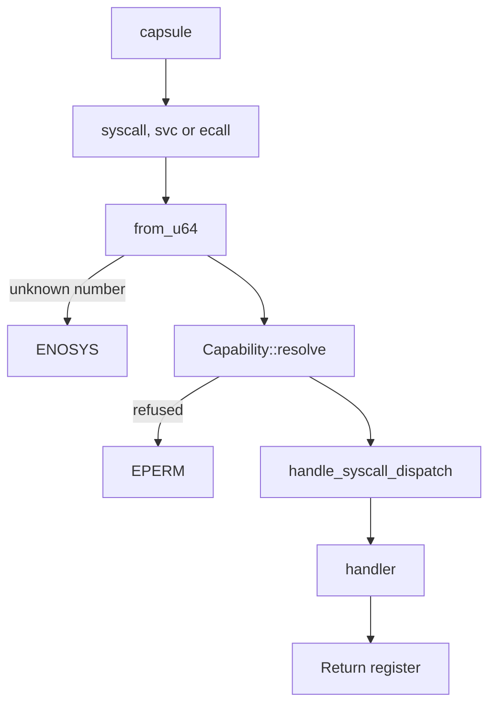

# The NONOS ABI

The ABI is the contract between a [capsule](../overview/glossary.md#capsule) and the NONOS kernel: how a call is made, which number names it, which [capability](../overview/glossary.md#capability) admits it, and what comes back.

## What the ABI is made of

The code is the authority. Three things in the kernel decide every call:

- `REGISTRY` lists every number the kernel accepts, one table per family (`src/syscall/abi/registry/mod.rs:27-28`). There are 130 calls in 0.9.2, listed in [Syscalls](syscalls.md).
- `is_allowed` decides which capability admits which call (`src/syscall/contract/cap_table/mod.rs:28-34`). The 36 capability bits are listed in [Capabilities](capabilities.md).
- `SyscallResult::error` turns a refusal into a negative errno (`src/syscall/types/result.rs:35-37`). The codes are listed in [Errors](errors.md).

Three files in `abi/` publish the same contract for toolchains and other readers: `abi/syscalls.toml` (numbers, argument lists, errors, limits), `abi/caps.toml` (capability bits and groups) and `abi/wire.toml` (structure layouts). The kernel does not read them. Scripts under `scripts/` compare them with the code, as described in [How the tables are checked](#how-the-tables-are-checked).

On the user side, `raw_syscall` in `userland/nonos_abi` is the trap trampoline that `nonos_runtime`, `nonos_ipc` and the other `nonos_*` crates call through (`userland/nonos_abi/src/raw.rs:17-39`), and `userland/libc` wraps the calls under C names such as `mk_ipc_send` (`userland/libc/src/ipc/send.rs:20`).

## How a call travels

A capsule traps with `syscall`, `svc` or `ecall`, depending on the architecture. The kernel resolves the raw number with `from_u64`, which searches `REGISTRY` through `lookup_id` (`src/syscall/numbers/convert.rs:22-23`, `src/syscall/abi/mod.rs:31-40`). A number the registry does not hold is answered with `ENOSYS`, -38. A known number goes to the contract `dispatch`, which runs `Capability::resolve` and answers `EPERM`, -1, when the caller's [capability token](../overview/glossary.md#capability-token) does not admit the call (`src/syscall/contract/dispatch.rs:31-37`). Otherwise `handle_syscall_dispatch` reaches the handler, and the handler's result goes back in the return register. The checks `Capability::resolve` makes are listed in [Syscalls](syscalls.md#the-capability-check).
