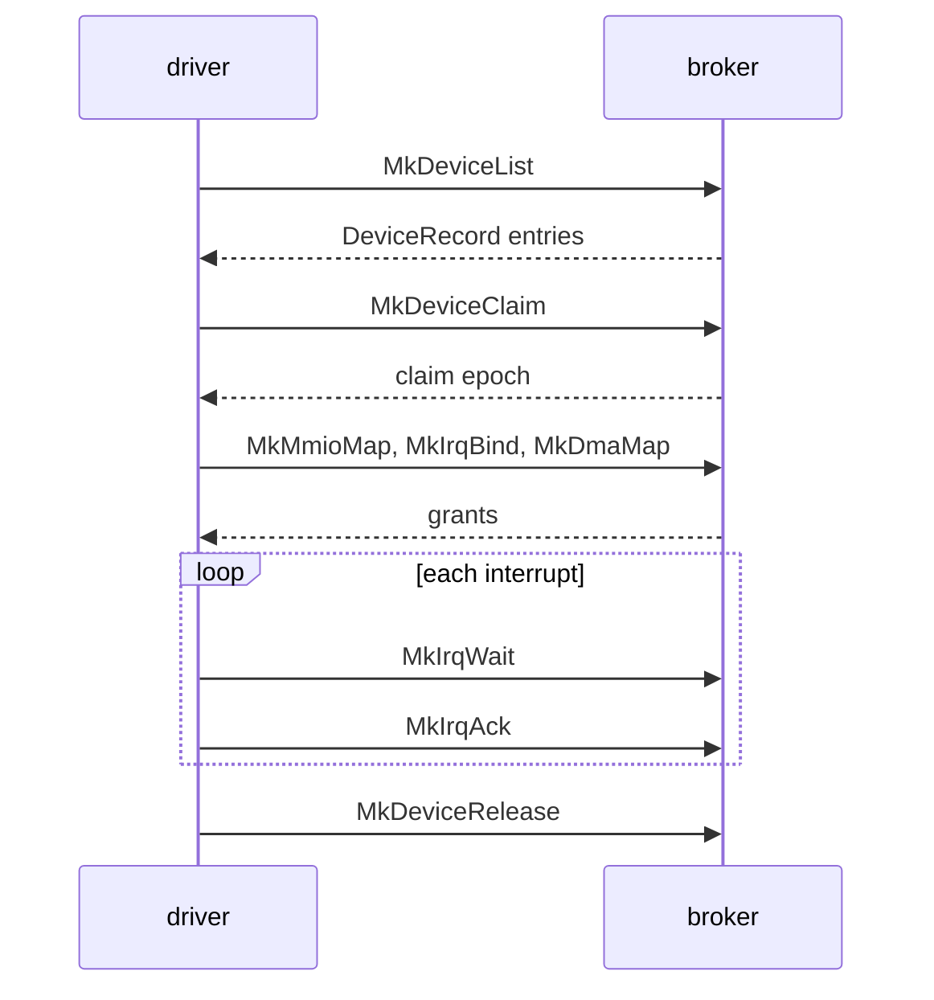

# Broker

The calls a driver [capsule](../overview/glossary.md#capsule) makes to the kernel's device [broker](../overview/glossary.md#broker), the records they exchange, and the broker's constants.

## How a driver uses the broker

A driver lists the broker's devices with `MkDeviceList` and reads one `DeviceRecord` per device. It claims one with `MkDeviceClaim`, which returns the [claim epoch](../overview/glossary.md#claim-epoch). The map, bind, grant and PCI calls pass the epoch back, and an old epoch is refused with `ESTALE`. With the claim it maps MMIO windows, binds interrupts, takes DMA buffers and port grants; each comes back as a grant id. It waits with `MkIrqWait`, acknowledges with `MkIrqAck`, and gives everything back with `MkDeviceRelease`. The libc wrappers in `userland/libc/src/broker/` carry the same names in snake case, such as `mk_device_list` (`userland/libc/src/broker/device.rs:24`).

## The calls

Arguments are in register order, first argument first. The Capability column is the [capability](../overview/glossary.md#capability) gate in the cap table; see [Capabilities](capabilities.md).

| Tag | Name | Arguments | Returns | Capability | libc |
|---|---|---|---|---|---|
| `MDLS` | `MkDeviceList` | `class`, `buf_ptr`, `count` | Records written; with `count` 0, how many devices match | Admin or DeviceEnum | `mk_device_list` |
| `MDCL` | `MkDeviceClaim` | `device_id` | The claim epoch | Admin or Driver | `mk_device_claim` |
| `MDRL` | `MkDeviceRelease` | `device_id` | 0 | Admin or Driver | `mk_device_release` |
| `MMMP` | `MkMmioMap` | `device_id`, `claim_epoch`, `bar_and_flags`, `offset`, `length`, `out_ptr` | 0, with a `MmioMapOut` written | Admin or Mmio | `mk_mmio_map` |
| `MMUM` | `MkMmioUnmap` | `grant_id` | 0 | Admin or Mmio | `mk_mmio_unmap` |
| `MIRB` | `MkIrqBind` | `device_id`, `claim_epoch`, `irq_source`, `flags`, `vector_count`, `out_ptr` | 0, with an `IrqBindOut` written | Admin or Irq | `mk_irq_bind` |
| `MIRU` | `MkIrqUnbind` | `grant_id` | 0 | Admin or Irq | `mk_irq_unbind` |
| `MIRA` | `MkIrqAck` | `grant_id` | 0 | Admin or Irq | `mk_irq_ack` |
| `MIRP` | `MkIrqPoll` | `grant_id`, `out_ptr` | 0, with an `IrqPollOut` written | Admin or Irq | `mk_irq_poll` |
| `MIRW` | `MkIrqWait` | `grant_id`, `last_seq`, `timeout_ms`, `out_ptr` | 0, or 1 when the timeout passed with the sequence unmoved; the sequence is written | Admin or Irq | `mk_irq_wait` |
| `MDMM` | `MkDmaMap` | `device_id`, `claim_epoch`, `length`, `flags`, `out_ptr` | 0, with a `DmaMapOut` written | Admin or Dma | `mk_dma_map` |
| `MDMU` | `MkDmaUnmap` | `grant_id` | 0 | Admin or Dma | `mk_dma_unmap` |
| `MPCR` | `MkPciConfigRead` | `device_id`, `claim_epoch`, `offset`, `width` | The register's value | Admin or Driver | `mk_pci_config_read` |
| `MPCW` | `MkPciConfigWrite` | `device_id`, `claim_epoch`, `offset`, `value` | 0 | Admin or Driver | `mk_pci_config_write` |
| `MPGT` | `MkPioGrant` | `device_id`, `claim_epoch`, `bar_index`, `flags`, `out_ptr` | 0, with a `PioGrantOut` written | Admin or Pio | `mk_pio_grant` |
| `MPRD` | `MkPioRead` | `grant_id`, `port_offset`, `w`, `out_value` | 0, with the value written as a `u32` | Admin or Pio | `mk_pio_read` |
| `MPWR` | `MkPioWrite` | `grant_id`, `port_offset`, `w`, `value` | 0 | Admin or Pio | `mk_pio_write` |
| `MPRL` | `MkPioRelease` | `grant_id` | 0 | Admin or Pio | `mk_pio_release` |

The rules behind the table:

- `MkDeviceList` with class 0 lists every device; `list_by_class` filters on any other value (`src/hardware/broker/table/list.rs:29-34`). With `count` 0, `sys_device_list` returns how many devices match and writes nothing (`src/syscall/microkernel/device.rs:40-45`).
- `claim` asks `attach` to move the device into the claiming capsule's IOMMU domain before it powers the device, and refuses the claim with `Unconfined` when an IOMMU unit in service will not take it (`src/hardware/broker/claim/claim.rs:33-40`). `sys_device_claim` returns that refusal as `EPERM` (`src/syscall/microkernel/device.rs:67-81`). When no IOMMU unit in service covers the device, `attach` lets the claim go ahead unconfined, and `unconfined_allowed` does the same when no unit is in service at all: the device can then reach all of memory, and the serial log says so for that claim (`src/hardware/broker/confine/attach.rs:30-47`, `src/hardware/broker/confine/posture.rs:32-37`).
- `sys_device_release` stops bus mastering first, then tears down every MMIO, IRQ, DMA and port grant on the device, then drops the claim (`src/syscall/microkernel/device.rs:84-102`). When a capsule exits, the exit path calls `release_all_for_pid` and its IRQ, DMA and port siblings, which release every claim and grant it still holds (`src/process/exit/teardown.rs:48-51`).
- `MkMmioMap` needs seven inputs and has six registers, so `mmio_map` takes the third as the BAR index in the high 32 bits and flags in the low 32 bits (`src/syscall/microkernel/dispatch/unpack.rs:19-40`). No flag is accepted yet: `FLAGS_KNOWN` is 0 (`src/hardware/broker/mmio/map.rs:47-52`).
- `MkIrqBind` takes `flags` 0 for INTx, `BIND_MSIX` or `BIND_MSI`, never two (`src/hardware/broker/irq/types.rs:17-29`). For INTx `vector_count` is 0, and for MSI-X `irq_source` is 0 and `vector_count` is 1 or more, with vector i on grant `grant_id + i` (`src/hardware/broker/irq/types.rs:31-49`). `validate_msix_request` also refuses more vectors than the broker's pool or the device's MSI-X table holds (`src/hardware/broker/irq/validate/msix.rs:46-64`). `validate_msi_request` takes exactly one vector, with `irq_source` 0 (`src/hardware/broker/irq/validate/msi.rs:26-46`). For INTx on x86_64, `validate_intx_request` wants the record's `irq_line` as `irq_source` (`src/hardware/broker/irq/validate/intx.rs:35-38`). On aarch64 and riscv64 only INTx exists: `bind` refuses any flag, and `irq_source` must equal the record's `irq_source`, on aarch64 a GIC SPI from 32 to 1019 (`src/hardware/broker/irq/aarch64/bind.rs:25-61`, `src/hardware/broker/irq/riscv64/bind.rs:33-67`). On x86_64 the broker's vectors are `BROKER_VEC_MIN` to `BROKER_VEC_MAX`, 64 of them (`src/arch/x86_64/interrupt/broker/vectors.rs:39-41`).
- `MkIrqWait` with `grant_id` 0 waits on every grant the caller holds. A timeout of 0 means `DEFAULT_WAIT_MS`, 100 ms (`src/syscall/microkernel/irq/wait.rs:17-30`). It can return early on any wake, so a driver calls it again with the `last_seq` it was given (`src/syscall/microkernel/irq/wait.rs:17-22`).
- `MkDmaMap` takes a length in bytes, a non-zero multiple of 4096, and `validate` refuses `DMA_MAP_HIGH` with `DMA_MAP_DMA32`, and `DMA_MAP_COHERENT` with `DMA_MAP_WC` (`src/hardware/broker/dma/map/validate.rs:31-45`). A map longer than its class's ceiling, below, is refused as `BadLengthForClass` (`src/hardware/broker/dma/map/validate.rs:53-57`). A `DMA_MAP_DMA32` map that would end above 4 GiB fails with `Above4G`, returned as `ERANGE` (`src/syscall/microkernel/dma.rs:109-111`).
- The PCI calls check a live claim and an allowlist of registers in the broker, and both `sys_pci_config_read` and `sys_pci_config_write` ask for `Driver` themselves, so `Admin` alone is refused (`src/syscall/microkernel/pci.rs:28-35`, `src/syscall/microkernel/pci.rs:43-50`). A write is one 16-bit register, and `u16_arg` refuses a wider value with `EINVAL` (`src/syscall/microkernel/dispatch/debug.rs:31-36`).
- Port I/O exists on x86_64 only. On aarch64 and riscv64 every port call returns `ENOSYS` (`src/syscall/microkernel/pio/mod.rs:17-49`). `from_arg` reads `w`, the access width, as 1, 2 or 4 bytes and refuses anything else (`src/syscall/microkernel/pio/width.rs:23-30`).

Most failures map the same way across the calls: no claim is `EPERM`, a stale epoch `ESTALE`, an unknown device `ENODEV`, a bad index, length or range `EINVAL`, an unknown flag `EOPNOTSUPP`, no memory or address space `ENOMEM`. `errno_for` in `src/syscall/microkernel/mmio/errno_map.rs` is one example, and it also maps a window that would expose the device's MSI-X table or pending-bit array to `EPERM` (`src/syscall/microkernel/mmio/errno_map.rs:22-36`). See [Errors](errors.md).
