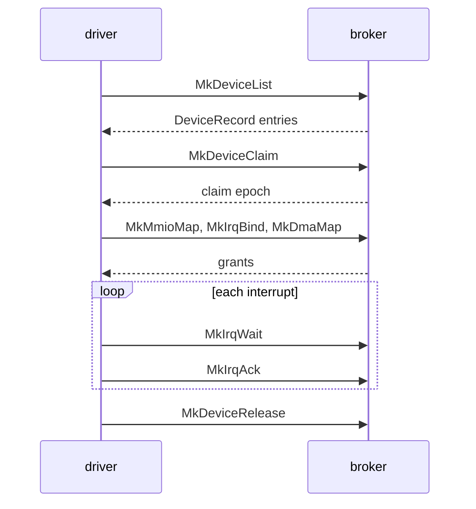

# Broker

The calls a driver [capsule](../overview/glossary.md#capsule) makes to the kernel's device [broker](../overview/glossary.md#broker), the records they exchange, and the broker's constants.

## How a driver uses the broker

A driver lists the broker's devices with `MkDeviceList` and reads one `DeviceRecord` per device. It claims one with `MkDeviceClaim`, which returns the [claim epoch](../overview/glossary.md#claim-epoch). The map, bind, grant and PCI calls pass the epoch back, and an old epoch is refused with `ESTALE`. With the claim it maps MMIO windows, binds interrupts, takes DMA buffers and port grants; each comes back as a grant id. It waits with `MkIrqWait`, acknowledges with `MkIrqAck`, and gives everything back with `MkDeviceRelease`. The libc wrappers in `userland/libc/src/broker/` carry the same names in snake case, such as `mk_device_list` (`userland/libc/src/broker/device.rs:24`).
