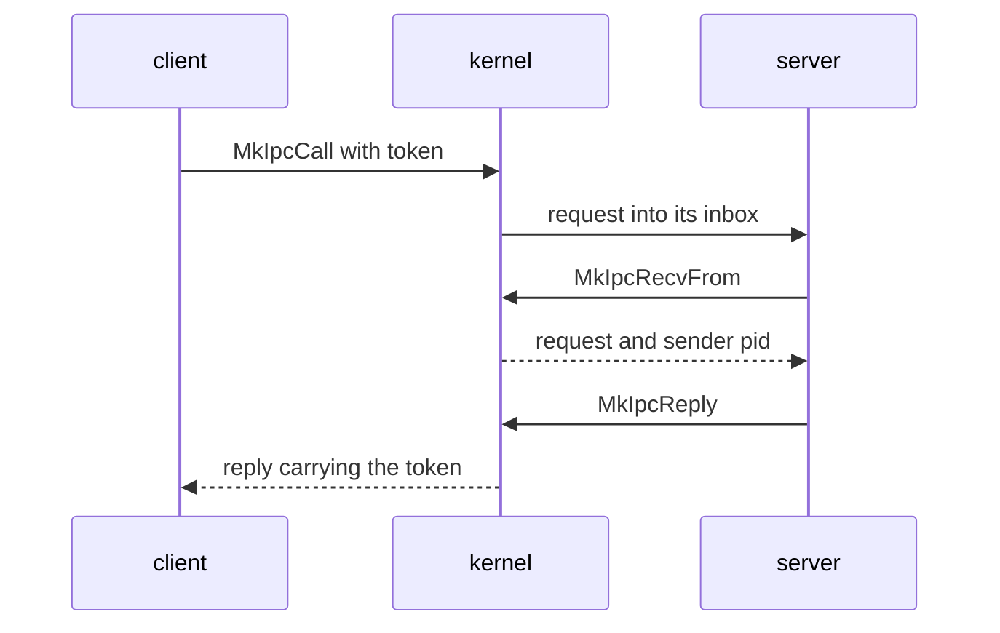

# IPC

How NONOS [capsules](../overview/glossary.md#capsule) send messages to each other through the kernel: the calls, the message envelope, the limits, who may send where, and the well-known service ports.

## The model

Every message goes into an [inbox](../overview/glossary.md#inbox), a named queue the kernel keeps. When the kernel starts a capsule it creates two inboxes for it, `proc.<pid>` for its messages and `stdin.<pid>` for what its parent feeds it, through `register` (`src/kernel_core/process_spawn/capsule_spawn/runner/install/own_inboxes.rs:29-39`). It also registers the capsule's two [endpoints](../overview/glossary.md#endpoint), a service name on a port and a reply inbox on a second port, with `register_endpoint` (`src/kernel_core/process_spawn/capsule_spawn/runner/install/install.rs:41-42`, `src/kernel_core/process_spawn/capsule_spawn/runner/install/install.rs:104-106`). A sender names the destination by its port number, or by pid with `MkIpcSendToPid`, and finds a service's port by name with `MkServiceLookup`. A receiver drains its own inbox.

A payload is opaque bytes. The kernel adds no header to it. Each service defines its own request format; `policy_proto`, for one, starts each message with a 12-byte `Header` of op, field, kind, status and payload length (`userland/policy_proto/src/hdr.rs:17-26`).

A client sends a request and waits with `MkIpcCall`. The kernel stamps the request with a token from `next_call_token`, never 0 (`src/syscall/microkernel/ipc/call/sys_ipc_call.rs:34-46`). The server takes it with `MkIpcRecvFrom`, which also gives the sender's pid, and answers with `MkIpcReply`. The kernel stamps the reply with the same token, and `recv_reply_correlated` hands the client only the message carrying it, dropping any other (`src/syscall/microkernel/ipc/recv.rs:58-73`). A server may also answer by sending to its own reply port: `redirect_reply` then hands the bytes to the caller whose request the server received last, stamped with that caller's token (`src/syscall/microkernel/ipc/send.rs:136-149`), and `pop` lets one request take one reply only (`src/syscall/microkernel/ipc/pending_reply/pop.rs:21-41`). Any other send cannot pass for a reply, because `sys_ipc_send` sends correlation 0 (`src/syscall/microkernel/ipc/send.rs:30-31`).
