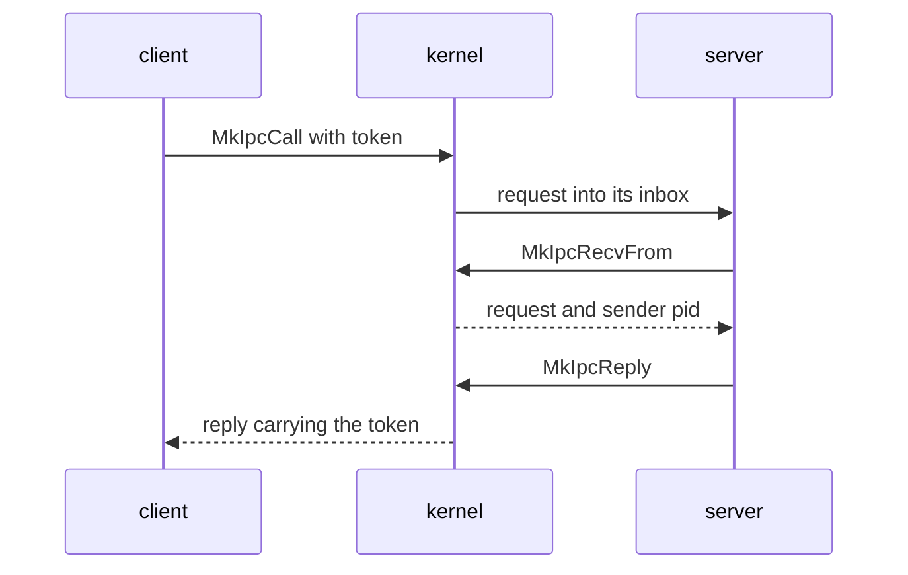

# IPC

How NONOS [capsules](../overview/glossary.md#capsule) send messages to each other through the kernel: the calls, the message envelope, the limits, who may send where, and the well-known service ports.

## The model

Every message goes into an [inbox](../overview/glossary.md#inbox), a named queue the kernel keeps. When the kernel starts a capsule it creates two inboxes for it, `proc.<pid>` for its messages and `stdin.<pid>` for what its parent feeds it, through `register` (`src/kernel_core/process_spawn/capsule_spawn/runner/install/own_inboxes.rs:29-39`). It also registers the capsule's two [endpoints](../overview/glossary.md#endpoint), a service name on a port and a reply inbox on a second port, with `register_endpoint` (`src/kernel_core/process_spawn/capsule_spawn/runner/install/install.rs:41-42`, `src/kernel_core/process_spawn/capsule_spawn/runner/install/install.rs:104-106`). A sender names the destination by its port number, or by pid with `MkIpcSendToPid`, and finds a service's port by name with `MkServiceLookup`. A receiver drains its own inbox.

A payload is opaque bytes. The kernel adds no header to it. Each service defines its own request format; `policy_proto`, for one, starts each message with a 12-byte `Header` of op, field, kind, status and payload length (`userland/policy_proto/src/hdr.rs:17-26`).

A client sends a request and waits with `MkIpcCall`. The kernel stamps the request with a token from `next_call_token`, never 0 (`src/syscall/microkernel/ipc/call/sys_ipc_call.rs:34-46`). The server takes it with `MkIpcRecvFrom`, which also gives the sender's pid, and answers with `MkIpcReply`. The kernel stamps the reply with the same token, and `recv_reply_correlated` hands the client only the message carrying it, dropping any other (`src/syscall/microkernel/ipc/recv.rs:58-73`). A server may also answer by sending to its own reply port: `redirect_reply` then hands the bytes to the caller whose request the server received last, stamped with that caller's token (`src/syscall/microkernel/ipc/send.rs:136-149`), and `pop` lets one request take one reply only (`src/syscall/microkernel/ipc/pending_reply/pop.rs:21-41`). Any other send cannot pass for a reply, because `sys_ipc_send` sends correlation 0 (`src/syscall/microkernel/ipc/send.rs:30-31`).

## The calls

Arguments are in register order. Every call needs the `IPC` [capability](../overview/glossary.md#capability); see [Capabilities](capabilities.md).

| Tag | Name | Arguments | Returns | Capability | libc |
|---|---|---|---|---|---|
| `MISD` | `MkIpcSend` | `endpoint`, `buf`, `len` | 0 | IPC | `mk_ipc_send` |
| `MIRC` | `MkIpcRecv` | `endpoint`, `buf`, `len`, `timeout_ms` | Bytes copied | IPC | `mk_ipc_recv` |
| `MICL` | `MkIpcCall` | `ep`, `req`, `req_len`, `resp`, `resp_len`, `timeout_ms` | Bytes of the reply copied | IPC | `mk_ipc_call` |
| `MIRF` | `MkIpcRecvFrom` | `endpoint`, `buf`, `len`, `timeout_ms`, `sender_pid_out` | Bytes copied; the sender's pid is written | IPC | `mk_ipc_recv_from` |
| `MIRY` | `MkIpcReply` | `dest_pid`, `buf`, `len` | 0 | IPC | `mk_ipc_reply` |
| `MISP` | `MkIpcSendToPid` | `dest_pid`, `buf`, `len` | 0 | IPC | `mk_ipc_send_to_pid` |
| `MSVL` | `MkServiceLookup` | `name_ptr`, `name_len`, `port_out`, `pid_out` | 0; the port and the registering pid are written | IPC | `mk_service_lookup` |
| `MSVR` | `MkServiceRegister` | `name_ptr`, `name_len`, `port` | 0 | IPC | `mk_service_register` |

- `resolve_for_recv` reads endpoint 0 as the caller's own `proc.<pid>` inbox. Any other endpoint must be one the caller owns: `resolve_for_recv` answers an unknown one with `ENOENT`, and one another process owns with `EACCES` (`src/syscall/microkernel/ipc/inbox_name.rs:25-40`).
- A receive copies at most `len` bytes and returns how many; the rest of a longer message is lost. A `timeout_ms` of 0 waits for ever, and a timeout that runs out is `ETIMEDOUT` (`src/syscall/microkernel/ipc/recv.rs:142-153`).
- `sys_ipc_call` treats a `timeout_ms` of 0 as 5000 ms (`src/syscall/microkernel/ipc/call/sys_ipc_call.rs:90`).
- `from_envelope` gives `MkIpcRecvFrom` the sender's pid, and 0 for a message the kernel sent itself (`src/syscall/microkernel/ipc/sender_pid.rs:17-23`).
- `sys_ipc_reply` takes the token from `pending_reply`, and drops a reply to a pid with no call outstanding on this server while still returning 0 (`src/syscall/microkernel/ipc/reply.rs:75-78`). A full inbox, `QueueFull`, is `EBUSY` (`src/syscall/microkernel/ipc/reply.rs:95-96`).

## The envelope

The kernel keeps each queued message as an `IpcMessage` (`src/ipc/nonos_channel/message.rs:25-32`). A receiver gets only `data`, and the sender's pid through `MkIpcRecvFrom`.

| Field | Type | Meaning |
|---|---|---|
| `from` | `String` | Sender, `proc.<pid>` for a capsule |
| `to` | `String` | Destination inbox name |
| `data` | `Vec<u8>` | The payload, at most `MAX_MESSAGE_SIZE` bytes |
| `timestamp_ms` | `u64` | Time the message was built |
| `correlation` | `u64` | Token pairing a reply with its call; 0 for a plain send |
| `checksum64` | `u64` | Checksum over the names, payload and time |

## Limits

These bound what one caller can make the kernel hold. A message over a byte budget is refused as a full queue, `EAGAIN` or `EBUSY` to the sender (`src/ipc/nonos_inbox/budget.rs:16-28`). `abi/syscalls.toml` publishes the same message size as `max_ipc_msg` (`abi/syscalls.toml:49`).

| Constant | Value | Meaning | File |
|---|---|---|---|
| `MAX_MESSAGE_SIZE` | 1048576 | Largest payload, 1 MiB | `src/ipc/nonos_channel/limits.rs` |
| `DEFAULT_INBOX_CAPACITY` | 1024 | Messages an inbox holds by default | `src/ipc/nonos_inbox/registry.rs` |
| `MIN_INBOX_CAPACITY` | 16 | Smallest inbox | `src/ipc/nonos_inbox/registry.rs` |
| `MAX_INBOX_CAPACITY` | 65536 | Largest inbox | `src/ipc/nonos_inbox/registry.rs` |
| `TOTAL_BYTES_MAX` | 100663296 | Bytes all inboxes together hold, 96 MiB | `src/ipc/nonos_inbox/budget.rs` |
| `INBOX_BYTES_MAX` | 16777216 | Bytes one inbox holds, 16 MiB | `src/ipc/nonos_inbox/budget.rs` |
| `SHARE_BYTES_MAX` | 8388608 | Bytes one sender may hold in one inbox, 8 MiB | `src/ipc/nonos_inbox/budget.rs` |
| `MESSAGE_OVERHEAD` | 128 | Bytes charged per message beyond its payload and names | `src/ipc/nonos_inbox/budget.rs` |
| `NAME_MAX` | 64 | Longest service name `MSVL` and `MSVR` take | `src/syscall/microkernel/ipc/lookup.rs` |
| `MAX_SERVICES` | 256 | Endpoints the registry holds | `src/services/registry.rs` |
| `STDIN_CAPACITY` | 64 | Messages a `stdin.<pid>` inbox holds | `src/kernel_core/process_spawn/capsule_spawn/runner/install/own_inboxes.rs` |

## Who may send where

A send passes three gates before it is queued.

- Capabilities. `caller_satisfies_endpoint` requires every bit the endpoint asks for, and refuses an unknown name or an endpoint that asks for nothing (`src/syscall/microkernel/ipc/send_caps.rs:22-47`). Every service endpoint asks for `IPC`; the ones in `NETWORK_SERVICES` ask for `Network` as well, through `required_caps` (`src/services/registry/policy.rs:26-44`). A send by pid with `MkIpcSendToPid` must pass the gate of every endpoint the target serves, since all of them are read from one inbox (`src/syscall/microkernel/ipc/send_caps.rs:65-76`).
- Held endpoints. Some drivers serve raw hardware, so `HELD` lets only the services that drive them send to them (`src/services/registry/held_table.rs:19-36`). The kernel's own sends are not checked against this list.
- Peer lists. A capsule on `PEERS` reaches only the endpoints named for it; in 0.9.2 that is `shield_prover`, which reaches `shield.core` alone (`src/services/registry/peers.rs:26-31`).

| Endpoint | Who may send |
|---|---|
| `driver.virtio_net0` | `net.core`, `net.l2` |
| `driver.e1000_0` | `net.core`, `net.l2` |
| `driver.rtl8169_0` | `net.core`, `net.l2` |
| `driver.rtl8139_0` | `net.core`, `net.l2` |
| `driver.iwlwifi0` | `net.core`, `app.settings`, `app.settings.1`, `app.settings.2`, `app.setup_wizard` |
| `driver.rtl8821ce0` | `net.core`, `app.settings`, `app.settings.1`, `app.settings.2`, `app.setup_wizard` |
| `driver.ps2_kbd0` | the kernel only |
| `driver.usb_hid0` | the kernel only |
| `driver.i2c_hid0` | the kernel only |
| `driver.usb_msc0` | the kernel only |
| `driver.virtio_rng` | the kernel only |
| `driver.xhci0` | `driver.usb_hid0`, `driver.usb_msc0` |
| `driver.i2c_pci0` | `driver.i2c_hid0` |
| `driver.virtio_gpu0` | `compositor` |
| `driver.hda0` | `audio.server` |

Three lists in the registry name services by role: the names reserved for core services, the names a capsule may claim at run time, and the services that need `Network`.

| List | Names |
|---|---|
| `RESERVED_NAMES` | `keyring`, `entropy_pool`, `crypto_pool`, `vfs_pool`, `market.index` |
| `RUNTIME_REGISTRABLE` | `net.tcp`, `net.udp`, `net.dhcp.client`, `net.dns`, `net.ip` |
| `NETWORK_SERVICES` | `net.core`, `net.l2`, `net.ip`, `net.udp`, `net.tcp`, `net.dns`, `net.dhcp.client`, `net.sockets`, `net.nym`, `net.anon`, `net.socks5` |

Registering a name at run time with `MkServiceRegister` is narrow on purpose. `allowed` refuses a name that starts with `proc.` or `endpoint.`, and `is_reserved_service` refuses the reserved names and the ports of the core services and their replies, 4098 to 4107 (`src/syscall/microkernel/ipc/register_allowed.rs:24-39`, `src/services/registry/reserved.rs:24-28`). A capsule may claim a name it does not already hold only when it has `RegisterService` or `Admin` and the name is in `RUNTIME_REGISTRABLE`.

## Well-known service ports

These are the service endpoints declared in `userland/*/Capsule.mk`, each with the capsule that serves it and its reply port. `capsule_ports` in `scripts/capsule_port_sources.py` reads the same lines (`scripts/capsule_port_sources.py:40-46`), and `scripts/check_capsule_ports.py` finds no port declared twice at this commit. The table lists declarations; it does not say which capsules a given image carries. Window instance endpoints and the ports of Linux guests are left out.

| Port | Service | Reply port | Capsule |
|---|---|---|---|
| 4096 | `ramfs` | 4097 | `capsule_ramfs` |
| 4098 | `keyring` | 4099 | `capsule_keyring` |
| 4100 | `entropy_pool` | 4101 | `capsule_entropy` |
| 4102 | `crypto_pool` | 4103 | `capsule_crypto` |
| 4104 | `vfs_pool` | 4105 | `capsule_vfs` |
| 4106 | `market.index` | 4107 | `capsule_market` |
| 4108 | `policy` | 4109 | `capsule_policy` |
| 4110 | `wallpaper_catalog` | 4111 | `capsule_wallpaper_catalog` |
| 4112 | `installer` | 4113 | `capsule_installer` |
| 4114 | `payment` | 4115 | `capsule_payment` |
| 4200 | `driver.virtio_rng` | 4201 | `capsule_driver_virtio_rng` |
| 4202 | `driver.virtio_blk0` | 4203 | `capsule_driver_virtio_blk` |
| 4204 | `driver.virtio_net0` | 4205 | `capsule_driver_virtio_net` |
| 4206 | `driver.xhci0` | 4207 | `capsule_driver_xhci` |
| 4208 | `driver.ps2_kbd0` | 4209 | `capsule_driver_ps2_input` |
| 4210 | `driver.e1000_0` | 4211 | `capsule_driver_e1000` |
| 4212 | `driver.rtl8139_0` | 4213 | `capsule_driver_rtl8139` |
| 4214 | `driver.rtl8169_0` | 4215 | `capsule_driver_rtl8169` |
| 4216 | `driver.ahci0` | 4217 | `capsule_driver_ahci` |
| 4218 | `driver.hda0` | 4219 | `capsule_driver_hda` |
| 4220 | `driver.nvme0` | 4221 | `capsule_driver_nvme` |
| 4222 | `driver.usb_hid0` | 4223 | `capsule_driver_usb_hid` |
| 4224 | `driver.usb_msc0` | 4225 | `capsule_driver_usb_msc` |
| 4226 | `driver.virtio_gpu0` | 4227 | `capsule_driver_virtio_gpu` |
| 4228 | `driver.iwlwifi0` | 4229 | `capsule_driver_iwlwifi` |
| 4230 | `driver.i2c_pci0` | 4231 | `capsule_driver_i2c_pci` |
| 4232 | `driver.i2c_hid0` | 4233 | `capsule_driver_i2c_hid` |
| 4234 | `driver.rtl8821ce0` | 4235 | `capsule_driver_rtl8821ce` |
| 4250 | `driver.cdc_ecm0` | 4251 | `capsule_driver_cdc_ecm` |
| 4252 | `driver.cdc_ncm0` | 4253 | `capsule_driver_cdc_ncm` |
| 4254 | `driver.rndis0` | 4255 | `capsule_driver_rndis` |
| 4256 | `driver.ax88179_0` | 4257 | `capsule_driver_ax88179` |
| 4258 | `driver.rtl8153_0` | 4259 | `capsule_driver_rtl8153` |
| 4270 | `driver.e1000e_0` | 4271 | `capsule_driver_e1000e` |
| 4272 | `driver.igc_0` | 4273 | `capsule_driver_igc` |
| 4290 | `driver.rtsx0` | 4291 | `capsule_driver_rtsx` |
| 4310 | `compositor` | 4311 | `compositor` |
| 4320 | `input_router` | 4321 | `capsule_input_router` |
| 4330 | `wm` | 4331 | `capsule_wm` |
| 4340 | `wallpaper` | 4341 | `capsule_wallpaper` |
| 4400 | `net.l2` | 4401 | `capsule_net_l2` |
| 4402 | `net.ip` | 4403 | `capsule_net_ip` |
| 4410 | `desktop_shell` | 4411 | `capsule_desktop_shell` |
| 4412 | `image_codec` | 4413 | `capsule_image_codec` |
| 4414 | `clipboard` | 4415 | `capsule_clipboard` |
| 4416 | `login` | 4417 | `capsule_login` |
| 4420 | `net.udp` | 4421 | `capsule_net_udp` |
| 4430 | `net.tcp` | 4431 | `capsule_net_tcp` |
| 4440 | `net.dhcp.client` | 4441 | `capsule_net_dhcp` |
| 4444 | `attest` | 4445 | `capsule_attest` |
| 4448 | `power` | 4449 | `capsule_power` |
| 4450 | `net.dns` | 4451 | `capsule_net_dns` |
| 4460 | `net.sockets` | 4461 | `capsule_net_sockets` |
| 4470 | `net.nym` | 4471 | `capsule_net_nym` |
| 4480 | `net.core` | 4481 | `capsule_net_core` |
| 4482 | `net.ntp.client` | 4483 | `capsule_net_ntp` |
| 4484 | `net.anon` | 4485 | `capsule_net_anon` |
| 4500 | `proof_io` | 4501 | `capsule_proof_io` |
| 4502 | `std_proof` | 4503 | `capsule_std_proof` |
| 4504 | `tokio_smoke` | 4505 | `capsule_tokio_smoke` |
| 4610 | `toolkit` | 4611 | `toolkit` |
| 4710 | `app.about` | 4711 | `capsule_about` |
| 4720 | `app.calculator` | 4721 | `capsule_calculator` |
| 4722 | `app.terminal` | 4723 | `capsule_terminal` |
| 4724 | `app.file_manager` | 4725 | `capsule_file_manager` |
| 4726 | `app.text_editor` | 4727 | `capsule_text_editor` |
| 4728 | `app.settings` | 4729 | `capsule_settings` |
| 4730 | `app.clock` | 4731 | `capsule_clock` |
| 4732 | `app.snake` | 4733 | `capsule_snake` |
| 4734 | `app.nonos_wallet` | 4735 | `capsule_wallet_nonos` |
| 4736 | `app.process_manager` | 4737 | `capsule_process_manager` |
| 4746 | `app.image_viewer` | 4747 | `capsule_image_viewer` |
| 4760 | `app.browser` | 4761 | `capsule_browser` |
| 4790 | `app.input_proof` | 4791 | `capsule_input_proof` |
| 4792 | `app.input_probe` | 4793 | `capsule_input_probe` |
| 4794 | `app.setup_wizard` | 4795 | `capsule_setup_wizard` |
| 4796 | `app.boot_splash` | 4797 | `capsule_boot_splash` |
| 4810 | `app.hello` | 4811 | `capsule_hello` |
| 4820 | `tool.ripgrep` | 4821 | `capsule_ripgrep` |
| 4822 | `tool.sd` | 4823 | `capsule_sd` |
| 4870 | `app.audio_player` | 4871 | `capsule_audio_player` |
| 4872 | `audio.server` | 4873 | `capsule_audio` |
| 4900 | `tool.grex` | 4901 | `capsule_grex` |
| 4902 | `tool.dotenv-linter` | 4903 | `capsule_dotenv-linter` |
| 4904 | `tool.pastel` | 4905 | `capsule_pastel` |
| 4906 | `tool.jsonxf` | 4907 | `capsule_jsonxf` |
| 4908 | `net.socks5` | 4909 | `capsule_socks5` |
| 4910 | `tool.tokei` | 4911 | `capsule_tokei` |
| 4912 | `tool.huniq` | 4913 | `capsule_huniq` |
| 4914 | `tool.csview` | 4915 | `capsule_csview` |
| 4916 | `app.gui_demo` | 4917 | `capsule_gui_demo` |
| 4918 | `app.egui_proof` | 4919 | `capsule_egui_proof` |
| 4920 | `app.game_2048` | 4921 | `capsule_game_2048` |
| 4922 | `app.mdview` | 4923 | `capsule_mdview` |
| 4924 | `app.qrgen` | 4925 | `capsule_qrgen` |
| 4926 | `app.video_player` | 4927 | `capsule_video_player` |
| 4932 | `app.install` | 4933 | `capsule_install` |
| 4934 | `tool.install` | 4935 | `tool_install` |
| 4936 | `app.linux` | 4937 | `capsule_linux` |
| 4940 | `app.store` | 4941 | `capsule_app_store` |
| 4950 | `app.prove` | 4951 | `capsule_prove` |
| 4954 | `test.attack` | 4955 | `capsule_attack` |
| 4956 | `app.nonos_install` | 4957 | `capsule_nonos_install` |
| 4960 | `tool.model-fetch` | 4961 | `capsule_model_fetch` |
| 4988 | `shield_vectors` | 4989 | `capsule_shield_vectors` |
| 5012 | `nonos.shield` | 5013 | `capsule_shield` |
| 5190 | `smp_stress` | 5191 | `capsule_smp_stress` |

## See also

- [The NONOS ABI](README.md)
- [IPC in the kernel](../kernel/ipc.md)
- [IPC services](../userland/ipc-services.md)
- [Capsule isolation](../security/capsule-isolation.md)
- [Broker](broker.md)
