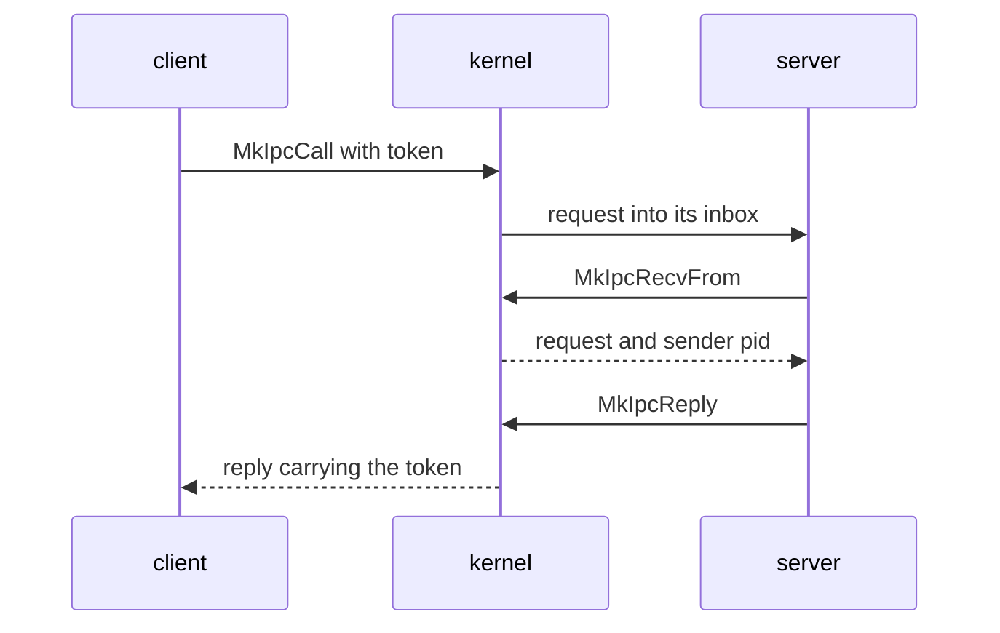

# IPC

How NONOS [capsules](../overview/glossary.md#capsule) send messages to each other through the kernel: the calls, the message envelope, the limits, who may send where, and the well-known service ports.

## The model

Every message goes into an [inbox](../overview/glossary.md#inbox), a named queue the kernel keeps. When the kernel starts a capsule it creates two inboxes for it, `proc.<pid>` for its messages and `stdin.<pid>` for what its parent feeds it, through `register` (`src/kernel_core/process_spawn/capsule_spawn/runner/install/own_inboxes.rs:29-39`). It also registers the capsule's two [endpoints](../overview/glossary.md#endpoint), a service name on a port and a reply inbox on a second port, with `register_endpoint` (`src/kernel_core/process_spawn/capsule_spawn/runner/install/install.rs:41-42`, `src/kernel_core/process_spawn/capsule_spawn/runner/install/install.rs:104-106`). A sender names the destination by its port number, or by pid with `MkIpcSendToPid`, and finds a service's port by name with `MkServiceLookup`. A receiver drains its own inbox.

A payload is opaque bytes. The kernel adds no header to it. Each service defines its own request format; `policy_proto`, for one, starts each message with a 12-byte `Header` of op, field, kind, status and payload length (`userland/policy_proto/src/hdr.rs:17-26`).

A client sends a request and waits with `MkIpcCall`. The kernel stamps the request with a token from `next_call_token`, never 0 (`src/syscall/microkernel/ipc/call/sys_ipc_call.rs:34-46`). The server takes it with `MkIpcRecvFrom`, which also gives the sender's pid, and answers with `MkIpcReply`. The kernel stamps the reply with the same token, and `recv_reply_correlated` hands the client only the message carrying it, dropping any other (`src/syscall/microkernel/ipc/recv.rs:58-73`). A server may also answer by sending to its own reply port: `redirect_reply` then hands the bytes to the caller whose request the server received last, stamped with that caller's token (`src/syscall/microkernel/ipc/send.rs:136-149`), and `pop` lets one request take one reply only (`src/syscall/microkernel/ipc/pending_reply/pop.rs:21-41`). Any other send cannot pass for a reply, because `sys_ipc_send` sends correlation 0 (`src/syscall/microkernel/ipc/send.rs:30-31`).

## The calls

Arguments are in register order. Every call needs the `IPC` [capability](../overview/glossary.md#capability); see [Capabilities](capabilities.md).

| Tag | Name | Arguments | Returns | Capability | libc |
|---|---|---|---|---|---|
| `MISD` | `MkIpcSend` | `endpoint`, `buf`, `len` | 0 | IPC | `mk_ipc_send` |
| `MIRC` | `MkIpcRecv` | `endpoint`, `buf`, `len`, `timeout_ms` | Bytes copied | IPC | `mk_ipc_recv` |
| `MICL` | `MkIpcCall` | `ep`, `req`, `req_len`, `resp`, `resp_len`, `timeout_ms` | Bytes of the reply copied | IPC | `mk_ipc_call` |
| `MIRF` | `MkIpcRecvFrom` | `endpoint`, `buf`, `len`, `timeout_ms`, `sender_pid_out` | Bytes copied; the sender's pid is written | IPC | `mk_ipc_recv_from` |
| `MIRY` | `MkIpcReply` | `dest_pid`, `buf`, `len` | 0 | IPC | `mk_ipc_reply` |
| `MISP` | `MkIpcSendToPid` | `dest_pid`, `buf`, `len` | 0 | IPC | `mk_ipc_send_to_pid` |
| `MSVL` | `MkServiceLookup` | `name_ptr`, `name_len`, `port_out`, `pid_out` | 0; the port and the registering pid are written | IPC | `mk_service_lookup` |
| `MSVR` | `MkServiceRegister` | `name_ptr`, `name_len`, `port` | 0 | IPC | `mk_service_register` |

- `resolve_for_recv` reads endpoint 0 as the caller's own `proc.<pid>` inbox. Any other endpoint must be one the caller owns: `resolve_for_recv` answers an unknown one with `ENOENT`, and one another process owns with `EACCES` (`src/syscall/microkernel/ipc/inbox_name.rs:25-40`).
- A receive copies at most `len` bytes and returns how many; the rest of a longer message is lost. A `timeout_ms` of 0 waits for ever, and a timeout that runs out is `ETIMEDOUT` (`src/syscall/microkernel/ipc/recv.rs:142-153`).
- `sys_ipc_call` treats a `timeout_ms` of 0 as 5000 ms (`src/syscall/microkernel/ipc/call/sys_ipc_call.rs:90`).
- `from_envelope` gives `MkIpcRecvFrom` the sender's pid, and 0 for a message the kernel sent itself (`src/syscall/microkernel/ipc/sender_pid.rs:17-23`).
- `sys_ipc_reply` takes the token from `pending_reply`, and drops a reply to a pid with no call outstanding on this server while still returning 0 (`src/syscall/microkernel/ipc/reply.rs:75-78`). A full inbox, `QueueFull`, is `EBUSY` (`src/syscall/microkernel/ipc/reply.rs:95-96`).

## The envelope

The kernel keeps each queued message as an `IpcMessage` (`src/ipc/nonos_channel/message.rs:25-32`). A receiver gets only `data`, and the sender's pid through `MkIpcRecvFrom`.

| Field | Type | Meaning |
|---|---|---|
| `from` | `String` | Sender, `proc.<pid>` for a capsule |
| `to` | `String` | Destination inbox name |
| `data` | `Vec<u8>` | The payload, at most `MAX_MESSAGE_SIZE` bytes |
| `timestamp_ms` | `u64` | Time the message was built |
| `correlation` | `u64` | Token pairing a reply with its call; 0 for a plain send |
| `checksum64` | `u64` | Checksum over the names, payload and time |

## Limits

These bound what one caller can make the kernel hold. A message over a byte budget is refused as a full queue, `EAGAIN` or `EBUSY` to the sender (`src/ipc/nonos_inbox/budget.rs:16-28`). `abi/syscalls.toml` publishes the same message size as `max_ipc_msg` (`abi/syscalls.toml:49`).

| Constant | Value | Meaning | File |
|---|---|---|---|
| `MAX_MESSAGE_SIZE` | 1048576 | Largest payload, 1 MiB | `src/ipc/nonos_channel/limits.rs` |
| `DEFAULT_INBOX_CAPACITY` | 1024 | Messages an inbox holds by default | `src/ipc/nonos_inbox/registry.rs` |
| `MIN_INBOX_CAPACITY` | 16 | Smallest inbox | `src/ipc/nonos_inbox/registry.rs` |
| `MAX_INBOX_CAPACITY` | 65536 | Largest inbox | `src/ipc/nonos_inbox/registry.rs` |
| `TOTAL_BYTES_MAX` | 100663296 | Bytes all inboxes together hold, 96 MiB | `src/ipc/nonos_inbox/budget.rs` |
| `INBOX_BYTES_MAX` | 16777216 | Bytes one inbox holds, 16 MiB | `src/ipc/nonos_inbox/budget.rs` |
| `SHARE_BYTES_MAX` | 8388608 | Bytes one sender may hold in one inbox, 8 MiB | `src/ipc/nonos_inbox/budget.rs` |
| `MESSAGE_OVERHEAD` | 128 | Bytes charged per message beyond its payload and names | `src/ipc/nonos_inbox/budget.rs` |
| `NAME_MAX` | 64 | Longest service name `MSVL` and `MSVR` take | `src/syscall/microkernel/ipc/lookup.rs` |
| `MAX_SERVICES` | 256 | Endpoints the registry holds | `src/services/registry.rs` |
| `STDIN_CAPACITY` | 64 | Messages a `stdin.<pid>` inbox holds | `src/kernel_core/process_spawn/capsule_spawn/runner/install/own_inboxes.rs` |
