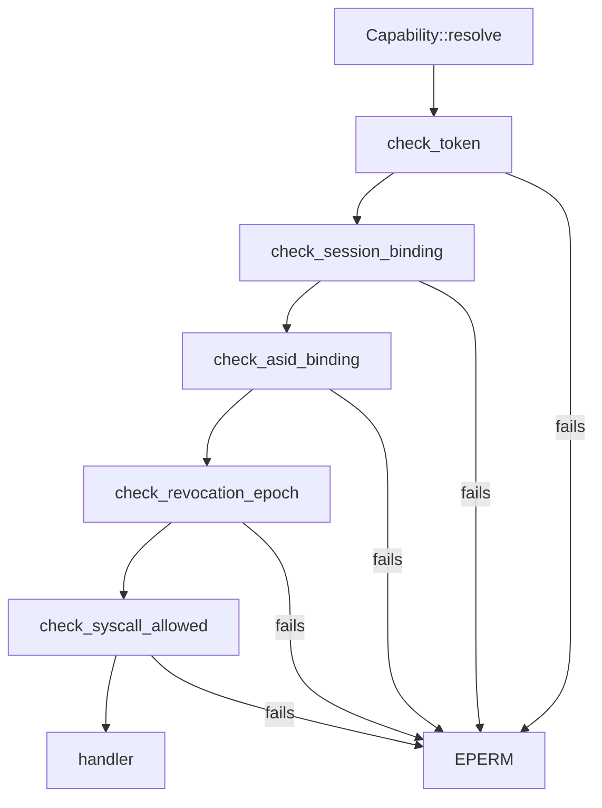

# Syscalls

Every native syscall NONOS 0.9.2 accepts, with its number, the [capability](../overview/glossary.md#capability) that admits it, and what it does.

## Numbers

A syscall number is a [syscall tag](../overview/glossary.md#syscall-tag): four ASCII letters packed little-endian into a `u64` by `tag4`, first letter in the lowest byte (`src/syscall/abi/tag.rs:17-22`). `MISD` is the bytes `M`, `I`, `S`, `D`, so its number is `0x4453494D`. Any number not in `REGISTRY` is answered with `ENOSYS`, -38, except from a [foreign process](../overview/glossary.md#foreign-process) on x86_64, whose supervisor answers it; see [The NONOS ABI](README.md#calling-convention).

`REGISTRY` holds one table per family, 130 calls in all (`src/syscall/abi/registry/mod.rs:27-28`):

| Family | Registry file | Calls |
|---|---|---|
| `mk` | `src/syscall/abi/registry/mk.rs` | 114 |
| `crypto` | `src/syscall/abi/registry/crypto.rs` | 12 |
| `admin` | `src/syscall/abi/registry/admin.rs` | 3 |
| `graphics` | `src/syscall/abi/registry/graphics.rs` | 1 |

The first letter of a tag names the family: `M` microkernel, `C` crypto, `A` admin, `G` graphics.

## The capability check

Before any handler runs, `Capability::resolve` takes the caller's [capability token](../overview/glossary.md#capability-token) and runs five checks in order (`src/syscall/contract/resolver/resolve.rs:31-43`). `check_token` verifies the token's signature, its expiry and that it is not revoked (`src/syscall/contract/resolver/check_token.rs:21-32`). `check_session_binding` compares the token's boot session nonce with the live one (`src/syscall/contract/resolver/check_session.rs:23-32`). `check_asid_binding` requires the token to name the caller's address space (`src/syscall/contract/resolver/check_asid.rs:22-30`). `check_revocation_epoch` refuses a token whose revocation epoch is below the process's current one, which every revoke raises (`src/syscall/contract/resolver/check_epoch.rs:22-30`). `check_syscall_allowed` asks the cap table (`src/syscall/contract/resolver/check_syscall.rs:23-31`). Any failure is `EPERM` with a `[CAP-DENY]` line in the log, and the handler never runs. The table is total: `is_allowed` refuses a number no family claims (`src/syscall/contract/cap_table/mod.rs:28-34`).

Read the Capability column this way:

- A single name means the token must grant that capability.
- "A or B" means either is enough. Most [broker](../overview/glossary.md#broker) calls accept `Admin` in place of their own capability, because predicates such as `can_driver` ask for either (`src/capabilities/token/types/authority_broker.rs:24-26`).
- "A and B" means both.
- "valid token" means `is_valid`: the token has not expired and grants at least one capability (`src/capabilities/token/types/query.rs:44-47`). The tokens `new_token` mints carry no expiry (`src/process/caps.rs:38-46`).
- "none" is `MTTQ` alone, whose arm is `true` (`src/syscall/contract/cap_table/mk.rs:220`). The five checks above still run.
- `MADC` needs AttestRead and is refused to a caller holding Network, because `can_attest_doc` excludes it (`src/syscall/caps/checks/system.rs:42-47`).

The Gate column is the predicate and the line in the cap table. Some handlers ask again. `sys_cap_grant` also needs every bit it grants (`src/syscall/microkernel/capability/handlers.rs:42-47`), and `sys_pci_config_read` and `sys_pci_config_write` ask for `Driver` themselves, so `Admin` alone is refused there (`src/syscall/microkernel/pci.rs:28-35`, `src/syscall/microkernel/pci.rs:43-50`).
