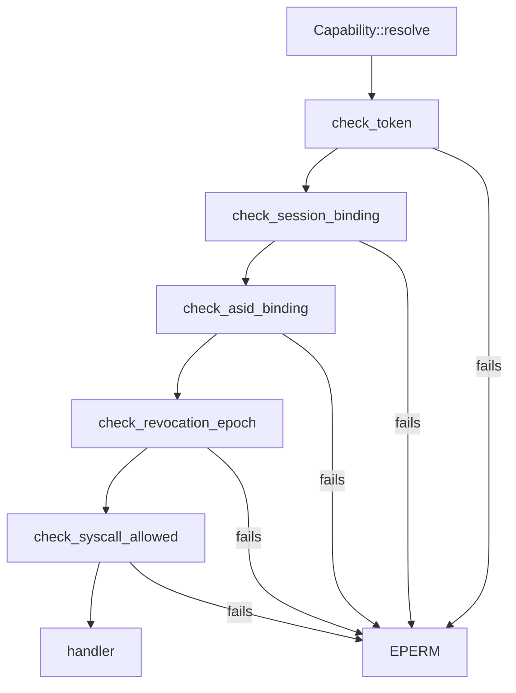

# Syscalls

Every native syscall NONOS 0.9.2 accepts, with its number, the [capability](../overview/glossary.md#capability) that admits it, and what it does.

## Numbers

A syscall number is a [syscall tag](../overview/glossary.md#syscall-tag): four ASCII letters packed little-endian into a `u64` by `tag4`, first letter in the lowest byte (`src/syscall/abi/tag.rs:17-22`). `MISD` is the bytes `M`, `I`, `S`, `D`, so its number is `0x4453494D`. Any number not in `REGISTRY` is answered with `ENOSYS`, -38, except from a [foreign process](../overview/glossary.md#foreign-process) on x86_64, whose supervisor answers it; see [The NONOS ABI](README.md#calling-convention).

`REGISTRY` holds one table per family, 130 calls in all (`src/syscall/abi/registry/mod.rs:27-28`):

| Family | Registry file | Calls |
|---|---|---|
| `mk` | `src/syscall/abi/registry/mk.rs` | 114 |
| `crypto` | `src/syscall/abi/registry/crypto.rs` | 12 |
| `admin` | `src/syscall/abi/registry/admin.rs` | 3 |
| `graphics` | `src/syscall/abi/registry/graphics.rs` | 1 |

The first letter of a tag names the family: `M` microkernel, `C` crypto, `A` admin, `G` graphics.

## The capability check

Before any handler runs, `Capability::resolve` takes the caller's [capability token](../overview/glossary.md#capability-token) and runs five checks in order (`src/syscall/contract/resolver/resolve.rs:31-43`). `check_token` verifies the token's signature, its expiry and that it is not revoked (`src/syscall/contract/resolver/check_token.rs:21-32`). `check_session_binding` compares the token's boot session nonce with the live one (`src/syscall/contract/resolver/check_session.rs:23-32`). `check_asid_binding` requires the token to name the caller's address space (`src/syscall/contract/resolver/check_asid.rs:22-30`). `check_revocation_epoch` refuses a token whose revocation epoch is below the process's current one, which every revoke raises (`src/syscall/contract/resolver/check_epoch.rs:22-30`). `check_syscall_allowed` asks the cap table (`src/syscall/contract/resolver/check_syscall.rs:23-31`). Any failure is `EPERM` with a `[CAP-DENY]` line in the log, and the handler never runs. The table is total: `is_allowed` refuses a number no family claims (`src/syscall/contract/cap_table/mod.rs:28-34`).

Read the Capability column this way:

- A single name means the token must grant that capability.
- "A or B" means either is enough. Most [broker](../overview/glossary.md#broker) calls accept `Admin` in place of their own capability, because predicates such as `can_driver` ask for either (`src/capabilities/token/types/authority_broker.rs:24-26`).
- "A and B" means both.
- "valid token" means `is_valid`: the token has not expired and grants at least one capability (`src/capabilities/token/types/query.rs:44-47`). The tokens `new_token` mints carry no expiry (`src/process/caps.rs:38-46`).
- "none" is `MTTQ` alone, whose arm is `true` (`src/syscall/contract/cap_table/mk.rs:220`). The five checks above still run.
- `MADC` needs AttestRead and is refused to a caller holding Network, because `can_attest_doc` excludes it (`src/syscall/caps/checks/system.rs:42-47`).

The Gate column is the predicate and the line in the cap table. Some handlers ask again. `sys_cap_grant` also needs every bit it grants (`src/syscall/microkernel/capability/handlers.rs:42-47`), and `sys_pci_config_read` and `sys_pci_config_write` ask for `Driver` themselves, so `Admin` alone is refused there (`src/syscall/microkernel/pci.rs:28-35`, `src/syscall/microkernel/pci.rs:43-50`).

## The calls

### IPC and services

A message goes to an [endpoint](../overview/glossary.md#endpoint), a port a service registered, and lands in the [inbox](../overview/glossary.md#inbox) of the process that serves it. See [IPC](ipc.md) for the arguments, the limits and the ports.

| Tag | Number | Name | Capability | Gate | Meaning |
|---|---|---|---|---|---|
| `MISD` | `0x4453494D` | `MkIpcSend` | IPC | `can_ipc` `src/syscall/contract/cap_table/mk.rs:116` | Send a message to the endpoint a port number names. |
| `MIRC` | `0x4352494D` | `MkIpcRecv` | IPC | `can_ipc` `src/syscall/contract/cap_table/mk.rs:116` | Receive from the caller's own inbox (endpoint 0) or an endpoint it owns; a timeout of 0 waits for ever. |
| `MICL` | `0x4C43494D` | `MkIpcCall` | IPC | `can_ipc` `src/syscall/contract/cap_table/mk.rs:116` | Send a request and wait for the reply that carries its correlation token. |
| `MIRF` | `0x4652494D` | `MkIpcRecvFrom` | IPC | `can_ipc` `src/syscall/contract/cap_table/mk.rs:116` | Receive as `MIRC` does, and also write the sender's pid. |
| `MIRY` | `0x5952494D` | `MkIpcReply` | IPC | `can_ipc` `src/syscall/contract/cap_table/mk.rs:116` | Answer a caller whose `MICL` this server took. |
| `MISP` | `0x5053494D` | `MkIpcSendToPid` | IPC | `can_ipc` `src/syscall/contract/cap_table/mk.rs:116` | Send straight to a process's own `proc.<pid>` inbox. |
| `MSVL` | `0x4C56534D` | `MkServiceLookup` | IPC | `can_ipc` `src/syscall/contract/cap_table/mk.rs:116` | Resolve a service name to its port and owning pid. |
| `MSVR` | `0x5256534D` | `MkServiceRegister` | IPC | `can_ipc` `src/syscall/contract/cap_table/mk.rs:116` | Register a service name on a port; few names may be claimed at run time. |

### Processes, memory and time

| Tag | Number | Name | Capability | Gate | Meaning |
|---|---|---|---|---|---|
| `MMAP` | `0x50414D4D` | `MkMmap` | Memory | `can_allocate_memory` `src/syscall/contract/cap_table/mk.rs:82` | Map up to 1 GiB of fresh zeroed pages, at a page-aligned address the caller names or one the kernel picks; returns the address. |
| `MUMP` | `0x504D554D` | `MkMunmap` | Memory | `can_deallocate_memory` `src/syscall/contract/cap_table/mk.rs:83` | Unmap pages the caller mapped. |
| `MCLD` | `0x444C434D` | `MkCapsuleLoad` | CoreExec and IPC and Memory | `grants_all` `src/syscall/contract/cap_table/mk.rs:85-88` | Verify a [capsule](../overview/glossary.md#capsule) from the ELF, certificate, manifest and trailer the caller passes, and start it; returns the pid. |
| `MCVF` | `0x4656434D` | `MkCapsuleVerify` | CoreExec and IPC and Memory | `grants_all` `src/syscall/contract/cap_table/mk.rs:90-93` | Run the same verification without starting anything, and write a summary. |
| `MEXT` | `0x5458454D` | `MkExit` | valid token | `is_valid` `src/syscall/contract/cap_table/mk.rs:35` | End the calling process with an exit code. |
| `MPAL` | `0x4C41504D` | `MkPidAlive` | valid token | `is_valid` `src/syscall/contract/cap_table/mk.rs:35` | 1 when a pid names a live process, else 0. |
| `MWAT` | `0x5441574D` | `MkWait` | IPC | `can_ipc` `src/syscall/contract/cap_table/mk.rs:106` | Wait, up to a timeout, for a child to exit, and return its exit code. |
| `MKIL` | `0x4C494B4D` | `MkKill` | IPC | `can_ipc` `src/syscall/contract/cap_table/mk.rs:107` | Send SIGINT, SIGTERM or SIGKILL to a child, a supervised guest, or, with ProcessControl or Admin, any process. |
| `MGPD` | `0x4450474D` | `MkGetPid` | CoreExec | `can_getpid` `src/syscall/contract/cap_table/mk.rs:95` | The caller's pid. |
| `MKAR` | `0x52414B4D` | `MkArgs` | CoreExec | `can_getpid` `src/syscall/contract/cap_table/mk.rs:96` | Copy the caller's arguments, NUL separated. |
| `MTSP` | `0x5053544D` | `MkThreadSpawn` | IPC | `can_ipc` `src/syscall/contract/cap_table/mk.rs:97` | Start a thread in the caller's address space; returns its id. |
| `MSTB` | `0x4254534D` | `MkSetTls` | valid token | `is_valid` `src/syscall/contract/cap_table/mk.rs:102` | Set the caller's thread pointer base. |
| `MYLD` | `0x444C594D` | `MkYield` | valid token | `is_valid` `src/syscall/contract/cap_table/mk.rs:35` | Give up the CPU. |
| `MFTW` | `0x5754464D` | `MkFutexWait` | valid token | `is_valid` `src/syscall/contract/cap_table/mk.rs:35` | Sleep while a 32-bit word holds an expected value. |
| `MFTK` | `0x4B54464D` | `MkFutexWake` | valid token | `is_valid` `src/syscall/contract/cap_table/mk.rs:35` | Wake waiters on a word. |
| `MSPI` | `0x4950534D` | `MkSpawnInstance` | Admin or SpawnWindow | `can_spawn_window` `src/syscall/contract/cap_table/mk.rs:206` | Ask for another window of an embedded, attested app. |
| `MTRN` | `0x4E52544D` | `MkToolRun` | IPC | `can_ipc` `src/syscall/contract/cap_table/mk.rs:213` | Run a baked, attested tool by name as the caller's child. |
| `MTMS` | `0x534D544D` | `MkTimeMillis` | valid token | `is_valid` `src/syscall/contract/cap_table/mk.rs:35` | Wall-clock milliseconds; a time correction can move it. |
| `MMON` | `0x4E4F4D4D` | `MkTimeMonotonic` | valid token | `is_valid` `src/syscall/contract/cap_table/mk.rs:35` | Milliseconds since boot; never moves backwards. |
| `MTRT` | `0x5452544D` | `MkTimeRtc` | valid token | `is_valid` `src/syscall/contract/cap_table/mk.rs:35` | Read the real-time clock as a date and time record. |
| `MTAD` | `0x4441544D` | `MkTimeAdjust` | TimeSet | `can_set_time` `src/syscall/contract/cap_table/mk.rs:80` | Correct the wall clock to a Unix time in milliseconds between 2025-01-01 and 2100-01-01 UTC. |
| `MBAT` | `0x5441424D` | `MkBatteryStatus` | valid token | `is_valid` `src/syscall/contract/cap_table/mk.rs:35` | Battery charge; in 0.9.2 always `ENODEV` or `EOPNOTSUPP`, since the kernel runs no AML. |

### Output, input and terminals

| Tag | Number | Name | Capability | Gate | Meaning |
|---|---|---|---|---|---|
| `MPST` | `0x5453504D` | `MkProcStat` | valid token | `is_valid` `src/syscall/contract/cap_table/mk.rs:35` | Read the process table; redacted unless the caller holds AttestRead or ProcessControl. |
| `MOUT` | `0x54554F4D` | `MkProcOutput` | IPC | `can_ipc` `src/syscall/contract/cap_table/mk.rs:103` | Drain one line a child wrote to its `proc.<pid>` inbox. |
| `MPIN` | `0x4E49504D` | `MkProcInput` | IPC | `can_ipc` `src/syscall/contract/cap_table/mk.rs:104` | Feed one message to a child's `stdin.<pid>` inbox. |
| `MSRD` | `0x4452534D` | `MkStdinRead` | IPC | `can_ipc` `src/syscall/contract/cap_table/mk.rs:105` | Read the caller's own stdin. |
| `MSOW` | `0x574F534D` | `MkStdoutWrite` | IPC | `can_ipc` `src/syscall/contract/cap_table/mk.rs:139` | Program stdout, to the caller's own `proc.<pid>` inbox. |
| `MPVW` | `0x5756504D` | `MkPrivateWrite` | IPC | `can_ipc` `src/syscall/contract/cap_table/mk.rs:139` | Output only the caller's launcher reads, never the serial line. |
| `MTTY` | `0x5954544D` | `MkTtySet` | IPC | `can_ipc` `src/syscall/contract/cap_table/mk.rs:219` | Say which of a child's streams reach a terminal, and its size. |
| `MTTQ` | `0x5154544D` | `MkTtyQuery` | none | `true` `src/syscall/contract/cap_table/mk.rs:220` | Ask whether stdin, stdout or stderr is on a terminal, and its size; else `ENOTTY`. |
| `MDBG` | `0x4742444D` | `MkDebug` | Debug | `can_debug` `src/syscall/contract/cap_table/mk.rs:138` | Write one diagnostic line of up to 256 bytes to the boot serial. |

### Storage and the data volume

| Tag | Number | Name | Capability | Gate | Meaning |
|---|---|---|---|---|---|
| `MSWR` | `0x5257534D` | `MkStoreWrite` | StoreWrite | `can_store_write` `src/syscall/contract/cap_table/mk.rs:140` | Write up to 8 KiB of whole 512-byte sectors of the package store, at block 256 and above and below the disk plan. |
| `MSRR` | `0x5252534D` | `MkStoreRead` | StoreWrite | `can_store_write` `src/syscall/contract/cap_table/mk.rs:140` | Read up to 32 KiB of whole sectors from the same window of the package store. |
| `MDIM` | `0x4D49444D` | `MkDataImport` | FileSystem and StoreWrite | `can_store_write` `src/syscall/contract/cap_table/mk.rs:141` | Import a file into the data volume, kept only if it matches its SHA-256. |
| `MDST` | `0x5453444D` | `MkDataStat` | FileSystem | `can_open_files` `src/syscall/contract/cap_table/mk.rs:143` | The size of a file on the data volume. |
| `MDRD` | `0x4452444D` | `MkDataRead` | FileSystem | `can_open_files` `src/syscall/contract/cap_table/mk.rs:143` | Read a range of a file on the data volume. |
| `MDPW` | `0x5750444D` | `MkDataPassphrase` | FileSystem and StoreWrite | `can_store_write` `src/syscall/contract/cap_table/mk.rs:142` | Key the data volume with a passphrase, or create it. |
| `MDFB` | `0x4246444D` | `MkDataFeedBegin` | StreamImport | `can_stream_import` `src/syscall/contract/cap_table/mk.rs:146` | Begin an import fed chunk by chunk, pinned to a digest. |
| `MDFD` | `0x4446444D` | `MkDataFeed` | StreamImport | `can_stream_import` `src/syscall/contract/cap_table/mk.rs:146` | Feed the next chunk of that import. |
| `MDRM` | `0x4D52444D` | `MkDataRemove` | StreamImport | `can_stream_import` `src/syscall/contract/cap_table/mk.rs:146` | Take an imported file off the data volume, with its record. |

### Attestation, signing roots and installs

| Tag | Number | Name | Capability | Gate | Meaning |
|---|---|---|---|---|---|
| `MAST` | `0x5453414D` | `MkAttestStatus` | valid token | `is_valid` `src/syscall/contract/cap_table/mk.rs:35` | The boot-chain attestation result the bootloader recorded. |
| `MADC` | `0x4344414D` | `MkAttestDoc` | AttestRead, without Network | `can_attest_doc` `src/syscall/contract/cap_table/mk.rs:46` | A TPM-signed attestation document over a challenge the caller chose. |
| `MAEN` | `0x4E45414D` | `MkAttestEntries` | AttestRead | `can_attest_read` `src/syscall/contract/cap_table/mk.rs:53` | The entries the signed registry root folds, to recompute it. |
| `MLOG` | `0x474F4C4D` | `MkLogTail` | AttestRead | `can_attest_read` `src/syscall/contract/cap_table/mk.rs:54` | The last of what the kernel wrote to its serial console, kept in memory. |
| `MAPY` | `0x5950414D` | `MkAttestPolicy` | valid token | `is_valid` `src/syscall/contract/cap_table/mk.rs:35` | The roots, depths and epochs the gates check against, as a versioned record. |
| `MBTA` | `0x4154424D` | `MkBootAttest` | valid token | `is_valid` `src/syscall/contract/cap_table/mk.rs:35` | The kernel's verdict on the bootloader that started it, as a versioned record. |
| `MDVS` | `0x5356444D` | `MkDeviceSecret` | DeviceSecret | `can_device_secret` `src/syscall/contract/cap_table/mk.rs:56` | This machine's TPM-derived device secret. |
| `MBSL` | `0x4C53424D` | `MkBootSlots` | DeviceSecret | `can_device_secret` `src/syscall/contract/cap_table/mk.rs:58` | The bootloader's and the kernel's slot of the device proof. |
| `MENR` | `0x524E454D` | `MkEnroll` | DeviceSecret | `can_device_secret` `src/syscall/contract/cap_table/mk.rs:60` | The TPM half of enrolment: endorsement key, certificate, attestation key, activation, signing. |
| `MISR` | `0x5253494D` | `MkInstallSource` | DeviceEnum | `can_install_source` `src/syscall/contract/cap_table/mk.rs:66` | A chunk of the image this machine booted, for the installer to write. |
| `MDRQ` | `0x5152444D` | `MkDevRootRequest` | EnrolDevRoot | `can_enrol_dev_root` `src/syscall/contract/cap_table/mk.rs:78` | Ask to enrol a signing root; prints a confirmation code and enrols nothing on its own. |
| `MDRC` | `0x4352444D` | `MkDevRootConfirm` | EnrolDevRoot | `can_enrol_dev_root` `src/syscall/contract/cap_table/mk.rs:78` | Complete a pending enrolment with the code the kernel displayed. |
| `MDRO` | `0x4F52444D` | `MkDevRootLocal` | EnrolDevRoot | `can_enrol_dev_root` `src/syscall/contract/cap_table/mk.rs:78` | Ask to enrol this machine's own build root. |
| `MLCG` | `0x47434C4D` | `MkLocalConsent` | EnrolDevRoot | `can_enrol_dev_root` `src/syscall/contract/cap_table/mk.rs:78` | Grant or withdraw consent to run what this machine installs. |
| `MLCR` | `0x52434C4D` | `MkLocalRestore` | EnrolDevRoot | `can_enrol_dev_root` `src/syscall/contract/cap_table/mk.rs:78` | Restore that consent at setup, from the token a grant returned. |
| `MLSG` | `0x47534C4D` | `MkLocalSign` | LocalSign | `can_local_sign` `src/syscall/contract/cap_table/mk.rs:173` | Mint a trailer for something this machine is installing. |
| `MLVF` | `0x46564C4D` | `MkLocalVerify` | ForeignExec | `can_foreign_exec` `src/syscall/contract/cap_table/mk.rs:176` | Ask whether an image is proved under a root this machine trusts. |
| `MAIN` | `0x4E49414D` | `MkAppInstall` | AppInstall | `can_app_install` `src/syscall/contract/cap_table/mk.rs:182` | Ask for a marketplace listing to be installed. |
| `MAPL` | `0x4C50414D` | `MkAppLaunch` | AppInstall | `can_app_install` `src/syscall/contract/cap_table/mk.rs:182` | Start the program an installed package provides. |
| `MAIS` | `0x5349414D` | `MkAppInstallStatus` | AppInstall | `can_app_install` `src/syscall/contract/cap_table/mk.rs:182` | Where an asked-for install stands. |
| `MAUN` | `0x4E55414D` | `MkAppUninstall` | AppInstall | `can_app_install` `src/syscall/contract/cap_table/mk.rs:182` | Ask for an installed Linux package to be removed. |

### Capabilities and administration

See [Capabilities](capabilities.md) for the bits.

| Tag | Number | Name | Capability | Gate | Meaning |
|---|---|---|---|---|---|
| `MCGT` | `0x5447434D` | `MkCapGrant` | Admin | `can_admin` `src/syscall/contract/cap_table/mk.rs:121` | Grant capability bits to a process; the caller must hold Admin and every bit it grants. |
| `MCRV` | `0x5652434D` | `MkCapRevoke` | Admin | `can_admin` `src/syscall/contract/cap_table/mk.rs:121` | Revoke capability bits from a process. |
| `MCCK` | `0x4B43434D` | `MkCapCheck` | valid token | `is_valid` `src/syscall/contract/cap_table/mk.rs:35` | 1 when a process holds every bit of a mask, else 0. |
| `ARBT` | `0x54425241` | `AdminReboot` | Admin | `can_admin` `src/syscall/contract/cap_table/admin.rs:24` | Reboot. |
| `ASDN` | `0x4E445341` | `AdminShutdown` | Admin | `can_admin` `src/syscall/contract/cap_table/admin.rs:24` | Shut down. |
| `APPS` | `0x53505041` | `AdminPolicyPush` | Admin | `can_admin` `src/syscall/contract/cap_table/admin.rs:24` | Push one policy field. |

### Device broker

These are the calls of the device broker. `MkDeviceClaim` returns a [claim epoch](../overview/glossary.md#claim-epoch) that the later calls on the device pass back. See [Broker](broker.md) for the arguments and the records.

| Tag | Number | Name | Capability | Gate | Meaning |
|---|---|---|---|---|---|
| `MDLS` | `0x534C444D` | `MkDeviceList` | Admin or DeviceEnum | `can_device_enum` `src/syscall/contract/cap_table/mk.rs:123` | List broker devices, all or one class. |
| `MDCL` | `0x4C43444D` | `MkDeviceClaim` | Admin or Driver | `can_driver` `src/syscall/contract/cap_table/mk.rs:124` | Claim a device; returns the claim epoch. |
| `MDRL` | `0x4C52444D` | `MkDeviceRelease` | Admin or Driver | `can_driver` `src/syscall/contract/cap_table/mk.rs:124` | Release a claimed device and every grant on it. |
| `MMMP` | `0x504D4D4D` | `MkMmioMap` | Admin or Mmio | `can_mmio` `src/syscall/contract/cap_table/mk.rs:125` | Map part of a claimed device's MMIO BAR. |
| `MMUM` | `0x4D554D4D` | `MkMmioUnmap` | Admin or Mmio | `can_mmio` `src/syscall/contract/cap_table/mk.rs:125` | Unmap an MMIO grant. |
| `MIRB` | `0x4252494D` | `MkIrqBind` | Admin or Irq | `can_irq` `src/syscall/contract/cap_table/mk.rs:129` | Bind a claimed device's interrupt: INTx, MSI or MSI-X. |
| `MIRU` | `0x5552494D` | `MkIrqUnbind` | Admin or Irq | `can_irq` `src/syscall/contract/cap_table/mk.rs:129` | Unbind an interrupt grant. |
| `MIRA` | `0x4152494D` | `MkIrqAck` | Admin or Irq | `can_irq` `src/syscall/contract/cap_table/mk.rs:129` | Acknowledge an interrupt on a grant. |
| `MIRP` | `0x5052494D` | `MkIrqPoll` | Admin or Irq | `can_irq` `src/syscall/contract/cap_table/mk.rs:129` | Read a grant's interrupt sequence without waiting. |
| `MIRW` | `0x5752494D` | `MkIrqWait` | Admin or Irq | `can_irq` `src/syscall/contract/cap_table/mk.rs:130` | Wait for an interrupt on one grant or on all of the caller's. |
| `MDMM` | `0x4D4D444D` | `MkDmaMap` | Admin or Dma | `can_dma` `src/syscall/contract/cap_table/mk.rs:131` | Get a DMA buffer for a claimed device. |
| `MDMU` | `0x554D444D` | `MkDmaUnmap` | Admin or Dma | `can_dma` `src/syscall/contract/cap_table/mk.rs:131` | Free a DMA grant. |
| `MPCR` | `0x5243504D` | `MkPciConfigRead` | Admin or Driver | `can_driver` `src/syscall/contract/cap_table/mk.rs:132` | Read an allowed PCI configuration register of a claimed device. |
| `MPCW` | `0x5743504D` | `MkPciConfigWrite` | Admin or Driver | `can_driver` `src/syscall/contract/cap_table/mk.rs:132` | Write an allowed 16-bit PCI configuration register. |
| `MPGT` | `0x5447504D` | `MkPioGrant` | Admin or Pio | `can_pio` `src/syscall/contract/cap_table/mk.rs:136` | Get a grant over a claimed device's port BAR; x86_64 only. |
| `MPRD` | `0x4452504D` | `MkPioRead` | Admin or Pio | `can_pio` `src/syscall/contract/cap_table/mk.rs:136` | Read 1, 2 or 4 bytes from a granted port. |
| `MPWR` | `0x5257504D` | `MkPioWrite` | Admin or Pio | `can_pio` `src/syscall/contract/cap_table/mk.rs:136` | Write 1, 2 or 4 bytes to a granted port. |
| `MPRL` | `0x4C52504D` | `MkPioRelease` | Admin or Pio | `can_pio` `src/syscall/contract/cap_table/mk.rs:136` | Drop a port grant. |

### Graphics and input

| Tag | Number | Name | Capability | Gate | Meaning |
|---|---|---|---|---|---|
| `MSRG` | `0x4752534D` | `MkSurfaceRegister` | GraphicsSurfaceCreate | `can_surface_create` `src/syscall/contract/cap_table/mk.rs:186` | Register the caller's own memory as a surface; returns its id. |
| `MSSH` | `0x4853534D` | `MkSurfaceShare` | GraphicsSurfaceCreate | `can_surface_create` `src/syscall/contract/cap_table/mk.rs:186` | Share a surface the caller owns; returns a handle. |
| `MSAT` | `0x5441534D` | `MkSurfaceAttach` | GraphicsSurfaceMap | `can_surface_map` `src/syscall/contract/cap_table/mk.rs:187` | Map a shared surface into the caller and write its descriptor. |
| `MSRL` | `0x4C52534D` | `MkSurfaceRelease` | GraphicsSurfaceCreate | `can_surface_create` `src/syscall/contract/cap_table/mk.rs:186` | Drop the caller's reference to a surface. |
| `MSPR` | `0x5250534D` | `MkSurfacePresent` | GraphicsPresent | `can_present` `src/syscall/contract/cap_table/mk.rs:188` | Present a surface, whole or one damage rectangle. |
| `MDVW` | `0x5756444D` | `MkDisplayVsyncWait` | GraphicsDisplayQuery | `can_display_query` `src/syscall/contract/cap_table/mk.rs:189` | Sleep to the next tick of the kernel's 60 Hz frame clock; not the display's own sync. |
| `MIEP` | `0x5045494D` | `MkInputEventPost` | Admin or Irq or InputSource | `can_input_source` `src/syscall/contract/cap_table/mk.rs:190` | Post one input event to the kernel's input ring. |
| `MIED` | `0x4445494D` | `MkInputEventDrain` | Admin or InputSource | `can_input_consumer` `src/syscall/contract/cap_table/mk.rs:199` | Drain input events from the ring. |
| `MIEW` | `0x5745494D` | `MkInputEventWait` | Admin or InputSource | `can_input_consumer` `src/syscall/contract/cap_table/mk.rs:200` | Wait for new input events. |
| `GDIM` | `0x4D494447` | `GraphicsDisplayDimensions` | GraphicsDisplayQuery | `Capability::GraphicsDisplayQuery` `src/syscall/contract/cap_table/graphics.rs:29` | The display's width and height, and its physical size when the firmware gives it. |

Both display calls know display 0 only. `wait_for_vsync` sleeps to the next multiple of a period taken from `TARGET_HZ`, 60 by default, and reads no hardware sync (`src/kernel_core/surface_registry/vsync.rs:19-58`). `handle_display_dimensions` refuses any other display with `EINVAL` (`src/syscall/dispatch/router/graphics_backend.rs:47-50`).

### Foreign processes

A supervising capsule that holds `ForeignExec`, such as the Linux personality, uses these to host programs the kernel has not verified. They exist on x86_64 only. On aarch64 and riscv64 the `foreign` module is built from `foreign_absent.rs` instead (`src/process/mod.rs:26-30`), and every call in it returns `ERRNO_NOSYS`, -38 (`src/process/foreign_absent.rs:26-33`).

| Tag | Number | Name | Capability | Gate | Meaning |
|---|---|---|---|---|---|
| `MFSP` | `0x5053464D` | `MkForeignSpawn` | ForeignExec | `can_foreign_exec` `src/syscall/contract/cap_table/mk.rs:167` | Create a process with no capabilities, supervised by the caller. |
| `MFST` | `0x5453464D` | `MkForeignStart` | ForeignExec | `can_foreign_exec` `src/syscall/contract/cap_table/mk.rs:167` | Give such a process an entry point and make it runnable. |
| `MFWT` | `0x5457464D` | `MkForeignWait` | ForeignExec | `can_foreign_exec` `src/syscall/contract/cap_table/mk.rs:167` | Wait for a guest to make a refused syscall; take its registers. |
| `MFRP` | `0x5052464D` | `MkForeignReply` | ForeignExec | `can_foreign_exec` `src/syscall/contract/cap_table/mk.rs:167` | Answer one parked guest with the value its `rax` receives. |
| `MFCX` | `0x5843464D` | `MkForeignContext` | ForeignExec | `can_foreign_exec` `src/syscall/contract/cap_table/mk.rs:167` | Copy a parked guest's registers out, in `struct sigcontext` order. |
| `MFSG` | `0x4753464D` | `MkForeignSignal` | ForeignExec | `can_foreign_exec` `src/syscall/contract/cap_table/mk.rs:167` | Answer a parked guest with a context: a signal handler, or its return. |
| `MFIN` | `0x4E49464D` | `MkForeignInterrupt` | ForeignExec | `can_foreign_exec` `src/syscall/contract/cap_table/mk.rs:167` | Stop a running guest thread at its next timer tick and hand it over parked. |
| `MPMP` | `0x504D504D` | `MkPeerMap` | ForeignExec | `can_foreign_exec` `src/syscall/contract/cap_table/mk.rs:167` | Back a span of a guest's address space with fresh frames. |
| `MPCP` | `0x5043504D` | `MkPeerCopy` | ForeignExec | `can_foreign_exec` `src/syscall/contract/cap_table/mk.rs:167` | Copy bytes between the caller and a guest it supervises. |
| `MPPT` | `0x5450504D` | `MkPeerProtect` | ForeignExec | `can_foreign_exec` `src/syscall/contract/cap_table/mk.rs:167` | Set the protection of pages a guest already has. |
| `MFTH` | `0x4854464D` | `MkForeignThread` | ForeignExec | `can_foreign_exec` `src/syscall/contract/cap_table/mk.rs:167` | Start a thread inside a guest, sharing its address space. |
| `MPTL` | `0x4C54504D` | `MkPeerTls` | ForeignExec | `can_foreign_exec` `src/syscall/contract/cap_table/mk.rs:167` | Set the thread pointer a guest thread wakes with. |
| `MFFK` | `0x4B46464D` | `MkForeignFork` | ForeignExec | `can_foreign_exec` `src/syscall/contract/cap_table/mk.rs:167` | Make a second process holding a guest's register state. |
| `MPUN` | `0x4E55504D` | `MkPeerUnmap` | ForeignExec | `can_foreign_exec` `src/syscall/contract/cap_table/mk.rs:167` | Take pages back from a guest. |
| `MFEX` | `0x5845464D` | `MkForeignExec` | ForeignExec | `can_foreign_exec` `src/syscall/contract/cap_table/mk.rs:167` | Replace the program a parked guest is running. |

### Crypto

`handle_crypto_random` serves `CRND` in the kernel, at most 4096 bytes a call, from the generator the entropy capsule seeds, and falls back to the hardware generator (`src/syscall/dispatch/crypto/random.rs:33-47`). `CKEC` and `CMKY` also run in the kernel. The hash, AEAD, X25519, HMAC and HKDF calls go to the crypto capsule, and `map_capsule_error` turns its failures into errnos (`src/syscall/dispatch/crypto/error.rs:26-43`).

| Tag | Number | Name | Capability | Gate | Meaning |
|---|---|---|---|---|---|
| `CRND` | `0x444E5243` | `CryptoRandom` | Crypto | `can_crypto` `src/syscall/contract/cap_table/crypto.rs:33` | Up to 4096 random bytes. |
| `CHSH` | `0x48534843` | `CryptoHash` | Crypto | `can_crypto` `src/syscall/contract/cap_table/crypto.rs:33` | Hash a buffer of up to 1 MiB with BLAKE3, SHA-256, SHA-512 or SHA3-256. |
| `CENC` | `0x434E4543` | `CryptoEncrypt` | Crypto | `can_crypto` `src/syscall/contract/cap_table/crypto.rs:33` | Encrypt with ChaCha20-Poly1305 or AES-256-GCM. |
| `CDEC` | `0x43454443` | `CryptoDecrypt` | Crypto | `can_crypto` `src/syscall/contract/cap_table/crypto.rs:33` | Decrypt with ChaCha20-Poly1305 or AES-256-GCM. |
| `CEAD` | `0x44414543` | `CryptoEncryptAad` | Crypto | `can_crypto` `src/syscall/contract/cap_table/crypto.rs:33` | AEAD encrypt with additional data, from a frame. |
| `CDAD` | `0x44414443` | `CryptoDecryptAad` | Crypto | `can_crypto` `src/syscall/contract/cap_table/crypto.rs:33` | AEAD decrypt with additional data, from a frame. |
| `CXPK` | `0x4B505843` | `CryptoX25519Public` | Crypto | `can_crypto` `src/syscall/contract/cap_table/crypto.rs:33` | The X25519 public key for a private key. |
| `CXSH` | `0x48535843` | `CryptoX25519Shared` | Crypto | `can_crypto` `src/syscall/contract/cap_table/crypto.rs:33` | An X25519 shared secret. |
| `CHMC` | `0x434D4843` | `CryptoHmacSha256` | Crypto | `can_crypto` `src/syscall/contract/cap_table/crypto.rs:33` | HMAC-SHA256. |
| `CHKF` | `0x464B4843` | `CryptoHkdfSha256` | Crypto | `can_crypto` `src/syscall/contract/cap_table/crypto.rs:33` | HKDF-SHA256. |
| `CKEC` | `0x43454B43` | `CryptoKeccak256` | Crypto | `can_crypto` `src/syscall/contract/cap_table/crypto.rs:33` | Keccak-256. |
| `CMKY` | `0x594B4D43` | `CryptoMachineKey` | Crypto | `can_crypto` `src/syscall/contract/cap_table/crypto.rs:33` | A 32-byte key bound to this TPM and boot state, named by a label. |

## Graphics and input structures

`MSRG` reads a `SurfaceDescriptor` from the caller, and `MSAT` writes one back (`src/syscall/dispatch/router/surface_handlers.rs:87-95`, `src/syscall/dispatch/router/surface_handlers.rs:155-166`). `do_register` refuses a `byte_len` of 0 or over `MAX_SURFACE_BYTES`, 64 MiB, and a `base_va` that is not page aligned (`src/syscall/dispatch/router/surface_handlers.rs:101-104`). `MIEP` reads one `InputEvent` (`src/syscall/dispatch/router/input_ops/do_post.rs:23-27`). Both layouts match `abi/wire.toml`.

### `SurfaceDescriptor`, 40 bytes

| Field | Offset | Type | Meaning |
|---|---|---|---|
| `width` | 0 | `u32` | Width in pixels |
| `height` | 4 | `u32` | Height in pixels |
| `stride` | 8 | `u32` | Row stride |
| `format` | 12 | `u32` | Pixel format; `FMT_ARGB8888`, 1, is the only one |
| `byte_len` | 16 | `u64` | Bytes of backing memory |
| `base_va` | 24 | `u64` | Page-aligned start of the caller's own writable memory |
| `flags` | 32 | `u64` | Flags word |

### `InputEvent`, 32 bytes

| Field | Offset | Type | Meaning |
|---|---|---|---|
| `kind` | 0 | `u16` | 0 key down, 1 key up, 2 relative pointer, 3 absolute pointer, 4 wheel, 5 button down, 6 button up, 7 touch |
| `flags` | 2 | `u16` | Flags word |
| `code` | 4 | `u32` | Key or button code |
| `x` | 8 | `i32` | Position |
| `y` | 12 | `i32` | Position |
| `delta_x` | 16 | `i32` | Motion or wheel delta |
| `delta_y` | 20 | `i32` | Motion or wheel delta |
| `timestamp_ns` | 24 | `u64` | Time of the event in nanoseconds |

`FMT_ARGB8888` is defined in `src/kernel_core/surface_registry/types.rs:22`, and the kinds are the `INPUT_KIND_KEY_DOWN` to `INPUT_KIND_TOUCH` constants of `nonos_abi` (`userland/nonos_abi/src/input.rs:20-27`).

## Limits

- Arguments are not listed here. `abi/syscalls.toml` lists them, and several lists are wrong; see [The NONOS ABI](README.md#stability-in-092). The broker and IPC arguments in [Broker](broker.md) and [IPC](ipc.md) are read from the handlers.
- When no microkernel group handles a number, `route_tail` returns -1, which reads as `EPERM` (`src/syscall/microkernel/dispatch/route.rs:52-68`). The router's own default, `util::errno` with 38, is `ENOSYS` (`src/syscall/dispatch/router/dispatch_fn.rs:58`). Neither is reached by a number in `REGISTRY` at this commit; `scripts/check_syscall_abi.py` checks that every published call reaches a handler.
- `AbiStatus::Unavailable` is declared and never used: every entry is routed (`src/syscall/abi/status.rs:17-21`).
- `handle_syscall` in `src/syscall/entry.rs` is a second entry point that no architecture calls (`src/syscall/entry.rs:25-35`).
