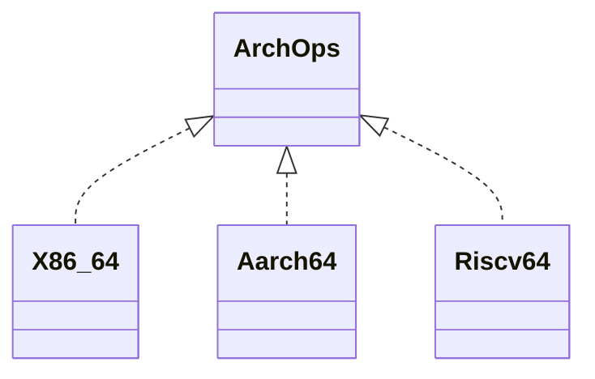

# Architectures

Which CPU architectures NONOS runs on, how complete each port is, and how a port plugs into the kernel.

## Support level

| Architecture | Support | In short |
|---|---|---|
| [x86_64](x86_64.md) | Supported | The release target: a UEFI loader, every build profile, the CI boot check, and one hardware report. |
| [aarch64](aarch64.md) | Preview | Builds only with `nonos-arch-preview`; CI builds it and boot-tests it under QEMU `virt`. No loader, no release image, no real hardware tested. |
| [riscv64](riscv64.md) | Not supported | A backend with no kernel target file and no make target; its entry calls a function that does not exist, so it does not build into a kernel. |

A kernel for any architecture other than x86_64 stops at `compile_error!` unless the `nonos-arch-preview` feature is on, so a release cannot ship another architecture by accident (`src/lib.rs:28-35`).

## What each port has

| | x86_64 | aarch64 | riscv64 |
|---|---|---|---|
| backend | `src/arch/x86_64/`, 937 files | `src/arch/aarch64/`, 292 files | `src/arch/riscv64/`, 218 files |
| kernel target file | `x86_64-nonos.json` | `aarch64-nonos.json` | none |
| linker script | `linker.ld` | `linker_aarch64.ld` | `linker_riscv64.ld` |
| capsule target file | `userland/x86_64-nonos-user.json` | `userland/aarch64-nonos-user.json` | `userland/riscv64-nonos-user.json` |
| loader | `nonos-bootloader`, a UEFI application | none | none |
| how it boots | UEFI firmware runs the loader | QEMU loads the kernel ELF | no boot path |
| CI | build, boot check, boot matrix | build and three boot cells | none |

The file counts include each backend's assembly. In lines, headers included, the three backends hold 52006, 12508 and 8423.

## How a port plugs in

Shared kernel code reaches the CPU in two ways.

The first is the `ArchOps` trait: eight primitives every backend implements, `halt`, `enable_interrupts`, `disable_interrupts`, `interrupts_enabled`, `current_cpu_id`, `read_time_counter`, `flush_tlb_one` and `switch_address_space` (`src/arch/abi.rs:36-86`). `Arch` is a type alias that names `X86_64`, `Aarch64` or `Riscv64` by target architecture (`src/arch/mod.rs:64-69`). A backend that cannot implement a primitive is meant to have no `ArchOps` impl at all, so the build fails instead of running a wrong answer (`src/arch/abi.rs:31-36`).

The second is a set of small modules in `src/arch` with one branch per architecture and a fallback for the rest. `time_counter_hz` answers 0 where the platform cannot say how fast its counter runs (`src/arch/time_counter.rs:39-52`), and `send_ipi` answers an error on an architecture with no interrupt controller backend (`src/arch/interrupt_controller/ipi.rs:28-38`). Each backend tree is compiled only for its own target (`riscv64`, `src/arch/mod.rs:42-49`) and its names are re-exported one level up (`riscv64`, `src/arch/mod.rs:72-77`).

The build picks the rest by architecture:

- `build.rs` chooses the linker script in `script_name` (`build.rs:335-339`).
- `user_target` picks the capsule target that matches the kernel and panics when `NONOS_USER_TARGET` names another architecture, because the kernel would load binaries its CPU cannot run (`build.rs:594-604`).
- The static checks count `cfg(target_arch` sites outside `src/arch` into `cfg_count` and fail when the count grows past its baseline (`nonos-ci/run-static-checks.sh:46-47`). At this commit it already has: 234 against 116, as [Code style](../contributing/code-style.md) says.
