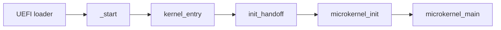

# x86_64

What the x86_64 port of NONOS is made of, what it needs from the CPU, and where each part lives.

## Status

x86_64 is the architecture NONOS ships. It is the only one that builds without `nonos-arch-preview`, which `compile_error!` enforces (`src/lib.rs:28-35`), the only one with a loader, and the only one the blocking CI boot check boots. [Review](../contributing/review.md) describes that check.

## On real hardware

One report covers real hardware: Wi-Fi on Realtek RTL8821CE (PCI `10ec:c821`, from `PCI_VENDOR_REALTEK` and `PCI_DEVICE_RTL8821CE` in `userland/capsule_driver_rtl8821ce/src/constants/mod.rs:24-26`) with scan, join, DHCP, DNS and browser traffic; the local Qwen model offline; the Linux programs sh, python3, sqlite3 and john; the installer writing to an internal NVMe disk and booting from it; the I2C-HID touchpad on Intel LPSS; the PS/2 keyboard with its layouts; Intel HD Audio; the power button and the volume keys. Works on an x86_64 laptop (Intel Gemini Lake, 8 GB), maintainer hardware report, 6 October 2026; the image commit was not recorded.

Everything else on this page is read from the code. The [hardware support matrix](../hardware/MATRIX.md) lists device classes and their state.

## Boot path

- The UEFI loader is built for one target, `x86_64-unknown-uefi`, named in its toolchain file's `targets` (`nonos-bootloader/rust-toolchain.toml:4`). [Boot chain and signatures](../security/boot-chain-and-signatures.md) covers what it checks.
- `_start` in `src/arch/x86_64/asm/start.S` is the image entry. It receives the loader's handoff pointer in `rdi` and calls `kernel_entry` (`src/arch/x86_64/asm/start.S:45`, `src/nonos_main.rs:46-52`).
- `kernel_entry` validates the handoff with `init_handoff`. When the pointer is null or the handoff is refused it calls `vga_fallback`, which writes a notice to VGA text memory and halts (`src/nonos_main.rs:70-89`).
- `boot_microkernel` turns the handoff into a `KernelHandoff` and runs `microkernel_init`, then `microkernel_main` (`src/nonos_main.rs:98-106`). From there the path is the shared kernel; [Boot handoff](../kernel/boot-handoff.md) follows it.

## Target and link

- `x86_64-nonos.json` keeps frame pointers, turns the red zone off, removes MMX, SSE and AVX from kernel code through its `features` string with soft float, and links with the static relocation model and the `kernel` code model (`x86_64-nonos.json:14-32`).
- C sources built into the kernel get the same rule from `c_target`: `-mno-red-zone`, `-mcmodel=kernel` and no MMX, SSE or AVX (`build.rs:573-580`).
- `linker.ld` places the image at `0xFFFFFFFF80000000` in three `PT_LOAD` segments: text read and execute, rodata read only, data read and write (`PHDRS`, `linker.ld:11-18`).
- It defines the `__kernel_text_start` and `__kernel_text_end` pairs that the kernel's W^X check reads, and its comment records how that check once vanished from the binary when the symbols were missing (`linker.ld:25-39`).
- `.nonos.manifest` and `.nonos.sig` hold the signed manifest and its signature, bounded by `__nonos_manifest_start` and `__nonos_signature_start` (`linker.ld:54-64`).

## What the CPU must have

- SSE, SSE2 and FXSR: `enable_sse` refuses a CPU without them (`src/arch/x86_64/boot/validation/sse_enable.rs:22-32`).
- Execute-never: `init_vm_and_protection` stops the boot when `init_mmu` finds no NX, because the direct map is built non-executable and would otherwise stay executable (`src/kernel_core/init/entry/init_vm_and_protection.rs:37-43`).
- Room for extended state: each thread has `AREA`, 4096 bytes, for its saved state. When XSAVE is on and the enabled components need more, `record_boot` cuts XCR0 back to x87, SSE and AVX, then to x87 and SSE, until CPUID leaf 0xD says the set fits (`src/arch/x86_64/cpu/xstate.rs:25-52`).

RDRAND and RDSEED are optional. `random_u64` answers `None` when the instruction is missing (`src/arch/cpu_random/read.rs:29-41`).

## Privilege and system calls

- The GDT selectors are fixed: `SEL_KERNEL_CODE` 0x08, `SEL_KERNEL_DATA` 0x10, `SEL_USER_DATA` 0x1B, `SEL_USER_CODE` 0x23 and `SEL_TSS` 0x28; the two user selectors are 0x18 and 0x20 with RPL 3 (`src/arch/x86_64/gdt/constants.rs:23-29`).
- The TSS has seven interrupt stack slots, from `IST_DOUBLE_FAULT` to `IST_RESERVED`, and every slot an IDT gate uses must be backed by a real stack (`src/arch/x86_64/gdt/constants.rs:35-46`).
- `program_this_cpu` writes STAR, points LSTAR at `syscall_entry_asm`, sets the flag mask and turns on EFER.SCE, then reads STAR back and fails when SYSCALL would load other kernel selectors or SYSRET anything but `SEL_USER_CODE` and `SEL_USER_DATA` (`src/arch/x86_64/syscall/manager/program.rs:24-42`).
- `setup_fmask` masks IF, TF, DF and AC on every system call entry (`src/arch/x86_64/syscall/msr.rs:108-111`).
- `current_cpu_id` answers from memory on a one-CPU boot, because CPUID is a VM exit under hardware virtualisation and the call sits on the syscall, tick and switch paths (`src/arch/x86_64/abi.rs:58-79`).

[System calls](../kernel/syscalls.md) and [Scheduler and SMP](../kernel/scheduler-and-smp.md) continue from here.
