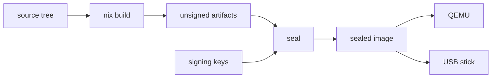

# Build NONOS

Follow these steps to go from a clean machine to a NONOS image booting under QEMU; the table at the end maps the other build pages.

## From clone to boot

Install Nix with flakes turned on ([toolchain.md](toolchain.md) says how), then get the source:

```
git clone https://github.com/NON-OS/nonos-unified
cd nonos-unified
```

Not tested in this release.

Check that the machine can build:

```
make doctor
```

The `doctor` target checks that Nix is installed, that flakes are on, and whether QEMU will have hardware virtualization, and ends with `This machine can build NONOS: make` (`Makefile:124-136`).

Build, make an image you can boot, and boot it:

```
make
make dev-image
make dev-boot
```

Not tested in this release.

- `make` runs the `build` target: `nix build` for the profile `nonos.toml` names, then the build receipt (`build`, `Makefile:53-56`).
- `make dev-image` builds the qemu profile's development twin and seals it with throwaway keys, in a copy of the checkout under `target/dev/tree` (`TREE`, `tools/nonos-dev-image:43`).
- `make dev-boot` boots that image under QEMU with a software TPM; `BOOT_DISK` and `QEMU_ARGS` pass more options (`Makefile:77-78`).

The first build fetches every pinned source. Every seal, a development one included, lays the `qwen3-0.6b` Qwen tier on the stick and downloads its pinned files unless they are already in `target/models/files` and match their pins (`STICK_TIER`, `tools/nonos_seal/media.py:36-42`). Both steps need a network the first time ([seal.md](seal.md)).

A [development image](../overview/glossary.md#development-image) is for testing. Its gates admit a [capsule](../overview/glossary.md#capsule) on its path alone, without the STARK proof, and its loader runs the development policy (`dev`, `tools/nix/config.nix:122-126`). The seal refuses it for a release (`release`, `tools/nonos_seal/__main__.py:119-120`). A release image needs the release keys, which the maintainers hold: see [seal.md](seal.md).

## Build, seal, boot



The work splits in two, and NONOS keeps the halves apart.

The build turns the source tree into unsigned artifacts with `nix build`: the kernel, every capsule, the Linux userland and the bootloader. It needs no key. The kernel's build script signs a legacy manifest section that nothing reads, so the flake hands it a published placeholder that is the same on every machine (`placeholder`, `tools/nix/image.nix:37-46`). The flake is designed so that two builds of one commit and one `nonos.toml` give the same bytes; [reproducible-builds.md](reproducible-builds.md) says how to check that, and what has not been checked.

The [seal](../overview/glossary.md#seal) adds what only signing keys can add. It enrolls every capsule, the kernel and the loader under STARK roots, signs the kernel, signs the loader for Secure Boot when the Secure Boot db key is present (`secure_boot`, `tools/nonos_seal/chain.py:97-105`), and writes a sealed image: a disk image for a USB stick and an ISO. You boot the sealed image under QEMU or write it to a USB stick. The seal draws fresh randomness for every proof and signs with keys the build never sees, so two seals of one commit are not identical (`BOUNDARY`, `tools/nix/manifest.py:25-29`).

| | the build | the seal |
|---|---|---|
| command | `make`, or `nix build` | `make seal`, or `nix run .#seal` |
| who runs it | anyone | the maintainers for a release; anyone, with throwaway keys, through `make dev-image` |
| needs a key | no | yes |
| output | `result/` | one folder per profile under `target/release/` |
| same bytes on two machines | yes, by design | no, by design |
