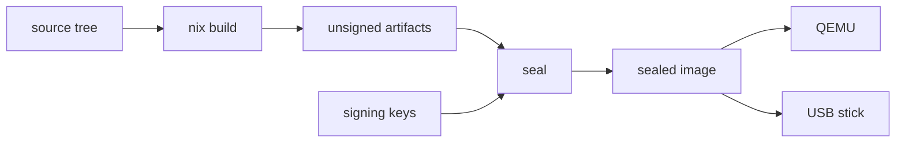

# Build NONOS

Follow these steps to go from a clean machine to a NONOS image booting under QEMU; the table at the end maps the other build pages.

## From clone to boot

Install Nix with flakes turned on ([toolchain.md](toolchain.md) says how), then get the source:

```
git clone https://github.com/NON-OS/microkernel
cd microkernel
```

Not tested in this release.

Check that the machine can build:

```
make doctor
```

The `doctor` target checks that Nix is installed and can read the flake, and whether QEMU will have hardware virtualization, then ends with `This machine can build NONOS: make` (`doctor`, `Makefile:124-136`). It turns flakes on for its own check only, so it can pass on a machine where `make` then fails: turn them on first, as [toolchain.md](toolchain.md#nix) says.

Build, make an image you can boot, and boot it:

```
make
make dev-image
make dev-boot
```

Not tested in this release.

- `make` runs the `build` target: `nix build` for the profile `nonos.toml` names, then the build receipt (`build`, `Makefile:53-56`). The receipt ends with a verdict, `REPRODUCED` when every artifact has the bytes of the receipt committed for that profile and `CHANGED` when other sources built it (`compare`, `tools/nonos-receipt:167-183`). It is written to `receipts/<profile>.json`, a committed file, so `git status` can show that file changed after a build.
- `make dev-image` builds the qemu profile's development twin and seals it with throwaway keys, in a copy of the checkout under `target/dev/tree` (`TREE`, `tools/nonos-dev-image:43`). It runs its own build there through the seal and never reads `result/`, so it does not need the `make` before it (`main`, `tools/nonos-dev-image:146-160`). It prints the image's path and `boot it: make dev-boot` when it is done.
- `make dev-boot` boots that image under QEMU with a software [TPM](../overview/glossary.md#tpm); `BOOT_DISK` and `QEMU_ARGS` pass more options (`Makefile:77-78`). It opens a QEMU window, GTK on Linux and Cocoa on macOS (`display`, `tools/nonos_qemu/machine.py:49-53`), and prints the serial console in the terminal you ran it from (`serial`, `tools/nonos_qemu/__main__.py:142`). The window shows the NONOS boot menu, which starts `Standard` after a 10 second countdown ([Boot modes](../install/boot-modes.md)); a first boot then runs setup ([First boot](../install/first-boot.md)).

The first build fetches every pinned source. Every [seal](../overview/glossary.md#seal), a development one included, lays the `qwen3-0.6b` Qwen tier on the stick and downloads its pinned files unless they are already in `target/models/files` and match their pins (`STICK_TIER`, `tools/nonos_seal/media.py:36-42`). Both steps need a network the first time ([seal.md](seal.md)).

A [development image](../overview/glossary.md#development-image) is for testing. Its gates admit a [capsule](../overview/glossary.md#capsule) on its path alone, without the [STARK proof](../overview/glossary.md#stark-proof), and its loader runs the development policy (`dev`, `tools/nix/config.nix:122-126`). The seal refuses it for a release (`release`, `tools/nonos_seal/__main__.py:119-120`). A release image needs the release keys, which the maintainers hold: see [seal.md](seal.md).

## Build, seal, boot



The work splits in two, and NONOS keeps the halves apart.

The build turns the source tree into unsigned artifacts with `nix build`: the kernel, every capsule, the Linux userland and the bootloader. It needs no key. The kernel's build script signs a legacy manifest section that nothing reads, so the flake hands it a published placeholder that is the same on every machine (`placeholder`, `tools/nix/image.nix:37-46`). The flake is designed so that two builds of one commit and one `nonos.toml` give the same bytes; [reproducible-builds.md](reproducible-builds.md) says how to check that, and what has not been checked.

The seal adds what only signing keys can add. It [enrolls](../overview/glossary.md#enrollment) every capsule, the kernel and the loader under STARK roots, signs the kernel, signs the loader for [Secure Boot](../overview/glossary.md#secure-boot) when the Secure Boot db key is present (`secure_boot`, `tools/nonos_seal/chain.py:97-105`), and writes a sealed image: a disk image for a USB stick and an ISO. You boot the sealed image under QEMU or write it to a USB stick. The seal draws fresh randomness for every proof and signs with keys the build never sees, so two seals of one commit are not identical (`BOUNDARY`, `tools/nix/manifest.py:25-29`).

| | the build | the seal |
|---|---|---|
| command | `make`, or `nix build` | `make seal`, or `nix run .#seal` |
| who runs it | anyone | the maintainers for a release; anyone, with throwaway keys, through `make dev-image` |
| needs a key | no | yes |
| output | `result/` | one folder per profile under `target/release/` |
| same bytes on two machines | yes, by design | no, by design |

## What `make` leaves in `result/`

The flake's `artifacts` function writes one tree per build (`tools/nix/artifacts.nix:1-15`):

| path in `result/` | what it is |
|---|---|
| `nonos-build.json` | the resolved configuration and the sha256 of every file below |
| `kernel/nonos-kernel` | the kernel ELF, unsigned |
| `bootloader/nonos_boot.efi` | the UEFI loader, before enrollment and Secure Boot signing |
| `capsules/` | one folder per capsule with its ELF, and `catalogue.json` |
| `linux/` | the Linux userland and its data files |
| `nonos.cdx.json` | the bill of materials ([sbom.md](sbom.md)) |

The kernel embeds the certificate, manifest and STARK trailer of every capsule it ships, read from the [trust set](../overview/glossary.md#trust-set) committed under `nonos-data/trust`. When the tree lacks them for a capsule, the flake writes `kernel/README` naming the capsules instead of building the kernel (`kernelNote`, `tools/nix/artifacts.nix:24-26`). The loader compiles in the kernel's public keys; without them the flake writes `bootloader/README` (`loaderNote`, `tools/nix/artifacts.nix:21-22`).

Nothing in `result/` is an image. It holds no [ESP](../overview/glossary.md#esp), no signature and no trailer of the kernel or the loader. Of the flake's steps, only the seal writes an image; the older make build in `mk/` writes its own, signed with local development keys ([make-targets.md](make-targets.md)).

## Another profile

`nonos.toml` picks the [build profile](../overview/glossary.md#build-profile), and `standard` is the default (`profile`, `nonos.toml:17`). Name another one for a single build without editing the file:

```
make PROFILE=hardened
nix build .#hardened
```

Not tested in this release.

Both build the `hardened` profile with the rest of `nonos.toml` unchanged (`ATTR`, `Makefile:43`). [profiles.md](profiles.md) lists the six profiles and what each takes out.

## The build pages

| page | what it answers |
|---|---|
| [toolchain.md](toolchain.md) | the pinned Rust nightly, the target files, Nix and the host |
| [nix-flake.md](nix-flake.md) | the flake's inputs, packages, apps, dev shell and checks |
| [make-targets.md](make-targets.md) | every `make` target, and the options a QEMU boot takes |
| [profiles.md](profiles.md) | the six build profiles, the keys of `nonos.toml`, and how profiles differ from boot modes |
| [seal.md](seal.md) | what the seal reads, signs and writes, and what to do without the release keys |
| [reproducible-builds.md](reproducible-builds.md) | what is pinned, how to compare two builds, and what is not reproducible yet |
| [sbom.md](sbom.md) | the CycloneDX bill of materials and the other supply chain records |
| [ci.md](ci.md) | the GitHub workflows, what runs on a pull request, and the state of the checks at this commit |
| [host-tools.md](host-tools.md) | every program under `tools/`: what it does, what runs it, and how to call it by hand |

## See also

- [Get an image](../install/get-an-image.md)
- [Write a USB stick](../install/usb-stick.md)
- [Tests and proofs](../contributing/tests-and-proofs.md)
- [Architecture in one diagram](../overview/architecture.md)
- [flake.nix](../../flake.nix) and [nonos.toml](../../nonos.toml)
