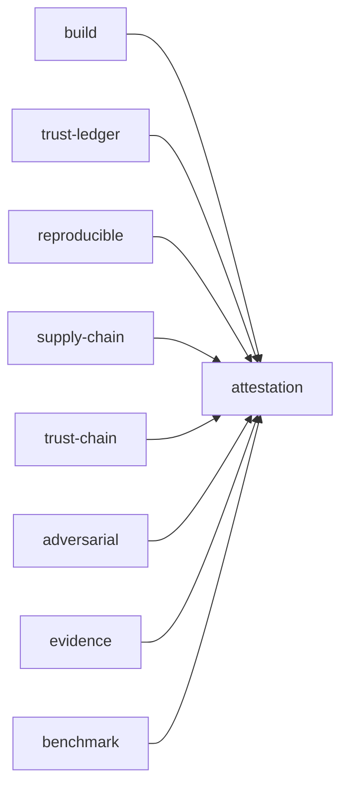

# CI

See what GitHub runs for a pull request, a push, a schedule and a tag, what `make check` covers on your machine, what `[skip ci]` does, and how the checks stood at this commit.

## On a pull request

Four workflows start on a pull request: `ci`, `verify`, `ci-boot-smoke` and `lean` (`pull_request`, `.github/workflows/ci.yml:7-10`). A newer push to the same pull request cancels the older run; a run on `main` always finishes (`concurrency`, `.github/workflows/ci.yml:19-23`).

### ci

`ci.yml` composes reusable workflows, and its `attestation` job fuses their reports and fails when a blocking one failed (`attestation`, `.github/workflows/ci.yml:86-91`):

| job | what it does |
|---|---|
| `build` | `nix build .#default` on Linux x86_64, Linux aarch64 and macOS; `make build` and `make check` inside WSL2 on Windows; `nix build` inside the devcontainer; and the `nonos-verify build` checks (`platforms`, `.github/workflows/ci-build.yml:39-49`) |
| `build-aarch64`, `boot-aarch64` | the aarch64 kernel through `make nonos-mk-arm`, checked as a loadable ELF, then booted under QEMU with each serial log held to its expected lines (`.github/workflows/ci-build-aarch64.yml`) |
| `trust-ledger` | `sha256sum -c MANIFEST.sha256` over the committed [trust set](../overview/glossary.md#trust-set) (`run`, `.github/workflows/ci.yml:41-50`) |
| `reproducible` | the three-machine comparison of [reproducible-builds.md](reproducible-builds.md) (`reproducible`, `.github/workflows/ci.yml:55-59`) |
| `production-build` | the build a release tag runs, against the committed trust set; skipped for Dependabot (`production`, `.github/workflows/ci.yml:64-69`) |
| `supply-chain` | the bill of materials and the policy checks of [sbom.md](sbom.md) |
| `trust-chain` | `nonos-verify trust-chain`: every embedded [capsule](../overview/glossary.md#capsule)'s certificate and manifest checked against the trust anchor policy, through `nonos_capsule_sign`, as the kernel checks it at spawn (`nonos_capsule_sign`, `.github/workflows/ci-trust-chain.yml:3-6`) |
| `adversarial` | `nonos-verify adversarial`: a valid signed capsule tampered with in many ways, each of which must be refused (`adversarial`, `.github/workflows/ci-adversarial.yml:3-7`) |
| `evidence`, `benchmark` | the evidence and benchmark reports |

### verify

`verify.yml` runs `nix flake check -L --keep-going` on Linux and on macOS, one `matrix` entry each, so every [proof crate](../overview/glossary.md#proof-crate) and static check of [nix-flake.md](nix-flake.md) runs on both (`.github/workflows/verify.yml:39-60`). Beside it run the checkers that pin their own toolchains:

| job | what it checks |
|---|---|
| `kani` | Kani 0.67.0 over `userland/fs_proofs` (`kani`, `.github/workflows/verify.yml:62-72`) |
| `verus` | the capability theorems in `verification/verus` (`verus`, `.github/workflows/verify.yml:74-92`) |
| `proof-crates-kani` | Kani over fifteen proof crates, the trailer parser and the loader's rollback floor (`crate`, `.github/workflows/verify.yml:94-122`) |
| `lean` | the Lean specification theorems (`lean`, `.github/workflows/verify.yml:124-149`) |
| `extraction` | the Charon and Aeneas extraction, checked for drift, and its refinement theorems (`extraction`, `.github/workflows/verify.yml:151-194`) |

### ci-boot-smoke

The boot test of every pull request; its header calls it the blocking boot check. It makes scratch keys that exist only on the runner, [seals](../overview/glossary.md#seal) the qemu profile, and boots it headless with a software TPM and no network (`Seal`, `.github/workflows/ci-boot-smoke.yml:82-96`). The boot passes when the serial console shows `Handoff OK`, `Capsules spawned`, the [package store](../overview/glossary.md#package-store) being served, and `[BOOT-ATTEST] bootloader measured and enrolled`. A second boot plugs the same image into the xHCI controller as a USB stick and expects the first three lines again, then the USB mass storage driver binding and the NONOS disk found on it (`expect`, `.github/workflows/ci-boot-smoke.yml:100-106`). With KVM the deadline is 300 seconds; on a runner without KVM the boot runs under TCG with 900 seconds (`BOOT_TIMEOUT`, `.github/workflows/ci-boot-smoke.yml:74-81`).

### lean

`lean.yml` builds the Lean 4 specification in `verification/lean` and fails when a profiled theorem depends on `sorryAx` (`sorryAx`, `.github/workflows/lean.yml:49-60`).
