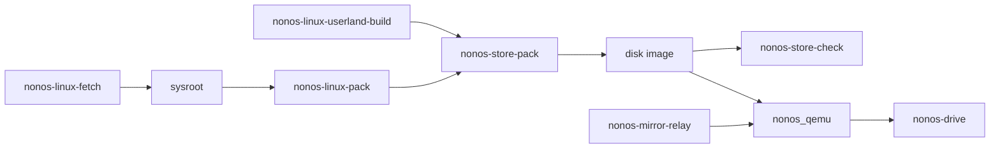

# Host tools

Look up what each program under `tools/` does, what runs it and how to call it yourself: all of them run on the build machine, never on NONOS.

## How to run them

Run every tool from the root of the checkout. The Python tools run as `python3 tools/<name>`, the shell tools as `tools/<name>`. Tools that need the pinned toolchain run inside the flake's shell, which `make shell` opens with `nix develop` (`shell`, `Makefile:104-105`).

The tables below say what runs each tool:

- a make target, such as `make check`. The `nonos-mk-*` targets live in `mk/` and enter `nix develop` on their own when you are outside it (`NONOS_IN_FLAKE`, `Makefile:144-150`);
- a flake app (`nix run .#<app>`) or a flake check (`nix flake check`, or `make check`);
- a GitHub workflow under `.github/workflows`;
- the [seal](../overview/glossary.md#seal), which calls several of them in turn;
- you, by hand, when nothing in the tree calls it.

`tools/` holds 65 entries. Some are a launcher and the package it starts, such as `tools/nonos-qemu` and `tools/nonos_qemu`; those share a row. `tools/nix` holds the flake's own files, described in [The Nix flake](nix-flake.md).

Where the text says an example was run, it was run on this tree at this commit. Every other example was not tested in this release.

## How the store and boot tools fit together



A Linux program reaches a disk image in one of two ways. The build compiles the image's own programs with `nonos-linux-userland-build`, and each one is signed and [enrolled](../overview/glossary.md#enrollment) like a [capsule](../overview/glossary.md#capsule), with the three files that prove it beside it in the store (`linux_userland_files`, `userland/linux_userland/Userland.mk:104-131`). For any other program, `nonos-linux-fetch` unpacks Alpine packages into a sysroot and `nonos-linux-pack` works out which files the program needs; nothing on that path signs it. Both end in `nonos-store-pack`, which writes the [package store](../overview/glossary.md#package-store) into the disk image. `nonos-store-check` reads that store back the way the system will. `tools/nonos_qemu` boots the image, `nonos-drive` operates it, and `nonos-mirror-relay` serves package mirrors to it.

## Boot and drive

| tool | what it does | run by | example |
|---|---|---|---|
| `tools/nonos_qemu`, started by `tools/nonos-qemu` | boots a sealed image under QEMU on a q35 machine with UEFI firmware; `devices` adds a virtio display and RNG, a USB controller, Intel HD Audio, a network card unless `--net off`, a [TPM](../overview/glossary.md#tpm) on a CRB interface with `--tpm`, and a QMP control socket (`tools/nonos_qemu/machine.py:91-103`) | `make boot`, `make dev-boot` and `nix run .#qemu` (`qemu`, `tools/nix/apps.nix:43-53`) | `nix run .#qemu -- --tpm --headless --timeout 600` |
| `tools/nonos-dev-image` | builds a [build profile](../overview/glossary.md#build-profile)'s [development image](../overview/glossary.md#development-image), the `qemu` profile's unless `--profile` names another, in a copy of the checkout under `target/dev/tree`, and seals it with throwaway keys made in that copy (`TREE`, `tools/nonos-dev-image:18-45`) | `make dev-image` (`DEV_ATTR`, `Makefile:73-75`) | `make dev-image PROFILE=hardened` |
| `tools/nonos-drive` | boots an image headless with a software TPM, then works it like a person from a list of steps over QEMU's control socket, taking screenshots (`QMP`, `tools/nonos-drive:18-51`) | by hand | `python3 tools/nonos-drive --image IMG --out target/drive shot:start` |
| `tools/nonos-mirror-relay` | serves five package mirrors to a booted guest over plain HTTP on loopback, fetching each path over HTTPS and caching it (`HOSTS`, `tools/nonos-mirror-relay:17-43`) | by hand | `python3 tools/nonos-mirror-relay --cache target/mirror-cache` |

[Make targets](make-targets.md) lists every option of a QEMU boot.

### Drive a booted image

`nonos-drive` starts `nix run .#qemu` with your image, `--tpm`, `--headless` and the [serial console](../overview/glossary.md#serial-console) written to `serial.log` in the output folder. It waits up to 600 seconds for QEMU's control socket, runs the steps in order, and stops the machine at the end (`main`, `tools/nonos-drive:95-128`). Each step is a word and an argument (`run`, `tools/nonos-drive:67-92`):

| step | what it does |
|---|---|
| `until:TEXT` or `until:TEXT:SECS` | waits for `TEXT` on the serial console, 600 seconds unless `SECS` says otherwise |
| `wait:SECS` | sleeps |
| `shot:NAME` | saves a screenshot as `NAME.png` in the output folder |
| `key:A+B` | presses keys together, by QEMU key name: `ret`, `tab`, `esc`, `ctrl`, `alt`, `shift`, `f1`, a letter |
| `type:TEXT` | types the text |
| `move:DX,DY` | moves the mouse by `DX`, `DY` |
| `click` or `click:right` | presses and releases a mouse button |

`--steps FILE` reads more steps from a file, one per line, and skips blank lines and lines that start with `#` (`steps`, `tools/nonos-drive:104-106`). A wait that does not see its text stops the run, and the tool exits 1. Init writes `Capsules spawned` once it has started the [capsules](../overview/glossary.md#capsule) (`boot_log`, `src/userspace/init/entry.rs:42`), so this boots the development image, waits for that line and takes a screenshot:

```
python3 tools/nonos-drive --image target/dev/tree/target/release/qemu-dev/nonos.img \
  --out target/drive 'until:Capsules spawned:900' wait:20 shot:desktop
```

Not tested in this release.

### Serve package mirrors to a guest

`nonos-mirror-relay` listens on `127.0.0.1`, port 8080 unless `--port` names another (`main`, `tools/nonos-mirror-relay:85-95`). It answers a GET only when the Host line names `dl-cdn.alpinelinux.org`, `geo.mirror.pkgbuild.com`, `www.blackarch.org`, `deb.debian.org` or `kali.download`; any other Host line, and any path that holds `..` or does not start with `/`, gets 403 (`do_GET`, `tools/nonos-mirror-relay:54-57`). It fetches the path over HTTPS through the proxy `HTTPS_PROXY` names, or directly when none is set, and keeps each file it fetched in the `--cache` folder under the SHA-256 of host and path (`fetcher`, `tools/nonos-mirror-relay:46-67`). The relay checks no signature: the guest does.

This was run on this tree, with `$CACHE` set to an empty folder:

```
python3 tools/nonos-mirror-relay --port 18080 --cache "$CACHE" &
curl -s -o /dev/null -w '%{http_code}\n' --noproxy '*' -H 'Host: example.com' http://127.0.0.1:18080/index.html
```

It printed `403`, and the relay logged `refused example.com/index.html`.

A QEMU guest on user networking reaches the host's loopback at `10.0.2.2` (`HOSTS`, `tools/nonos-mirror-relay:17-37`). A guest uses the relay only when its [Linux personality](../overview/glossary.md#linux-personality) was compiled with `NONOS_ALPINE_MIRROR` set to an address and a port, here `10.0.2.2` and port 8080; the installer then asks with `dl-cdn.alpinelinux.org` as the Host line, and Alpine's own signatures still authenticate the bytes (`mirror`, `userland/capsule_linux/src/linux/install/mirror.rs:17-46`). The installer dials a mirror at a private address such as `10.0.2.2` directly, and sends every other download over the [Anyone network](../overview/glossary.md#anyone-network) (`is_local`, `userland/capsule_linux/src/linux/install/http.rs:48-56`). The Debian and pacman installers have no default mirror: they fetch nothing unless the build sets `NONOS_DEB_MIRROR` with `NONOS_DEB_HOST`, `NONOS_DEB_ROOT` and `NONOS_DEB_SUITE` (`source`, `userland/capsule_linux/src/linux/install/deb/source.rs:37-43`), or `NONOS_PACMAN_MIRROR` with `NONOS_PACMAN_HOST` and `NONOS_PACMAN_PATH` (`source`, `userland/capsule_linux/src/linux/install/pacman/source.rs:36-42`). No make file or flake recipe in this tree sets any of them.

## Store and packages

| tool | what it does | run by | example |
|---|---|---|---|
| `tools/nonos-store-pack` | writes the store into an existing image in place: a `NONOSTR1` header, 128-byte table entries and 512-byte aligned payloads, each with a 128-bit FNV-1a digest (`MAGIC`, `tools/nonos-store-pack:5-14`); it refuses a store over 512 entries, 96 MiB loaded or 20 MiB streamed, which the system would refuse whole (`MAX_ENTRIES`, `tools/nonos-store-pack:58-86`) | the seal (`STORE_LBA`, `tools/nonos_seal/media.py:96-105`) and the make build, for the QEMU disk (`NONOS_STORE_ENTRIES`, `mk/40-run.mk:84-89`) and the stick (`USB_IMG`, `mk/20-build.mk:1351-1360`) | `python3 tools/nonos-store-pack --image disk.img --lba 256 --entry /Documents/a.txt=a.txt` |
| `tools/nonos-store-check` | reads the store of an image or a stick by the [file store](../overview/glossary.md#file-store)'s own rules, entry by entry, says what it would stage and what it would refuse, and exits 0 only for a store it stages whole (`STORE_BASE_LBA`, `tools/nonos-store-check:17-42`) | by hand | `python3 tools/nonos-store-check target/release/standard/nonos.img` |
| `tools/nonos-pack` | a Rust program that packs a capsule's [manifest](../overview/glossary.md#manifest), ELF, [NONOS ID certificate](../overview/glossary.md#nonos-id-certificate) and [attestation trailer](../overview/glossary.md#attestation-trailer) into one `.nonos` file with the magic `NOS1`, signed with Ed25519 and ML-DSA-65 [publisher](../overview/glossary.md#publisher) seeds (`MAGIC`, `tools/nonos-pack/src/container/types.rs:65`); `unpack` writes the four parts to a folder without checking them, and `verify` checks both signatures against the publisher keys in the package's own certificate, not that certificate against the trust anchor (`verify`, `tools/nonos-pack/src/sign/verify.rs:23-44`) | built by the make build (`NONOS_PACK_BIN`, `mk/20-build.mk:376-379`) and by the flake as `host-nonos-pack`; `tools/nonos-app pack` calls it | `nonos-pack verify --in app.nonos` |
| `tools/nonos-linux-pack` | reads a program's ELF for its interpreter and its `DT_NEEDED` libraries, resolves each inside a sysroot, and prints the entries for `nonos-store-pack`, or hands them to it with `--image`; a library it cannot find fails the run (`tools/nonos-linux-pack:17-42`) | by hand, and by `nonos-linux-fetch` to learn what is missing (`missing`, `tools/nonos-linux-fetch:112-125`) | `python3 tools/nonos-linux-pack --sysroot target/alpine --program usr/bin/jq` |
| `tools/nonos-linux-fetch` | reads Alpine's package index, installs into the sysroot each package that provides a missing library, and repeats until the closure is whole (`MIRROR`, `tools/nonos-linux-fetch:17-41`) | by hand | `python3 tools/nonos-linux-fetch --sysroot target/alpine --package jq --program usr/bin/jq` |

### Check a store the way the system reads it

`nonos-store-check` applies the rules the file store applies at boot: the header magic and version, at most 512 entries, every extent between the end of the table and sector 245,760, a name the file store accepts, the two budgets in table order, and the digest of every loaded entry that carries one (`STORE_END_LBA`, `tools/nonos-store-check:17-49`). Any refusal is what the file store reports as store status 9. Two tests hold both store tools' limits to the disk map's (`the_store_packer_writes_the_container_the_map_describes`, `userland/nonos_disk_map/tests/host_tools_agree.rs:28-40`, and `the_store_checker_reads_by_the_maps_limits`, `userland/nonos_disk_map/tests/host_tools_agree.rs:46-55`). No flake check, workflow or make target runs them, and they were not run on this tree.

This was run on this tree. It packs one file into a scratch image, checks it, flips one payload byte with `nonos-flip-byte`, and checks again:

```
d=$(mktemp -d)
truncate -s 1M "$d/store.img"
printf 'hello\n' > "$d/hello.txt"
python3 tools/nonos-store-pack --image "$d/store.img" --lba 256 --entry /Documents/hello.txt="$d/hello.txt"
python3 tools/nonos-store-check "$d/store.img"
python3 tools/nonos-flip-byte "$d/store.img" "$d/bad.img" --at 197120
python3 tools/nonos-store-check "$d/bad.img"
```

The first check marks the entry `ok`, ends with `loaded 6 of 100663296 bytes, streamed 0 of 20971520; 0 refused` and exits 0. The second marks the same entry `REFUSED` with `(its digest does not match its bytes)`, ends with `vfs would report store status 9` and exits 1.

### Pack a Linux program from Alpine

`nonos-linux-fetch` reads the `main` and `community` indexes of an Alpine release (`BRANCHES`, `tools/nonos-linux-fetch:40-41`), `v3.20` for `x86_64` unless `--release` and `--arch` say otherwise. It gives up after 16 rounds unless `--rounds` says otherwise, and sooner when no package provides a missing library (`main`, `tools/nonos-linux-fetch:164-220`). It takes the index as fetched over TLS and does not check the index's own signature (`index`, `tools/nonos-linux-fetch:53-60`). Each package must chain to its index entry or the run stops: the SHA-1 of the control section must match the index checksum, and the SHA-256 of the data section must match the hash the control section names (`verify`, `tools/nonos-linux-fetch:94-109`). `install` then unpacks the package into the sysroot, leaving out the members whose names start with a dot, and runs nothing it unpacks (`install`, `tools/nonos-linux-fetch:148-160`). `safe` strips the leading dots and slashes from each member's name, drops a member whose name still holds `..`, and points an absolute link target back inside the sysroot (`safe`, `tools/nonos-linux-fetch:128-146`). Downloads go to `.apk-cache` in the current folder unless `--cache` names another. When the closure is whole, `nonos-linux-pack` turns it into store entries:

```
python3 tools/nonos-linux-fetch --sysroot target/alpine --package jq --program usr/bin/jq
python3 tools/nonos-linux-pack --sysroot target/alpine --program usr/bin/jq
```

Not tested in this release.

Neither tool signs anything. `nonos-linux-pack` accepts `--sign` and `--publisher`, and its help says each program then gets a certificate, a manifest and a trailer, but its `main` reads neither option (`main`, `tools/nonos-linux-pack:166-237`). The Linux personality runs a program from the store only when its proof verifies (`prove`, `userland/capsule_linux/src/linux/start_guest.rs:57-60`), and maps a file executable only when it is proved (`proven`, `userland/capsule_linux/src/linux/call/mem/map_file.rs:35-38`). A program packed only this way carries no proof, so the personality refuses it when it starts.

### Build the image's Linux programs

| tool | what it does | run by | example |
|---|---|---|---|
| `tools/nonos-linux-userland-build`, with one recipe per program in `tools/linux-userland` | builds one program from its upstream source, held to the sha256 `tools/nix/sources.txt` pins (`fetch`, `tools/nonos-linux-userland-build:48-65`), as a static x86-64 Linux binary, stripped: C programs against musl with the pinned zig, non-PIE (`CFLAGS`, `tools/nonos-linux-userland-build:67-72`), Rust programs such as `rg` with cargo, linked by that zig (`crate_build`, `tools/linux-userland/lib/crate.sh:11-49`), and `gojq` with Go, cgo off (`CGO_ENABLED`, `tools/linux-userland/gojq.sh:56`); `NONOS_SRC_CACHE` keeps the downloads (`tools/nonos-linux-userland-build:25-35`) | the flake, one package per program (`programs`, `tools/nix/default.nix:99`), and the make build (`LINUX_USERLAND_TOOLS`, `userland/linux_userland/Userland.mk:11-19`) | `nix build .#linux-sqlite3` |
| `tools/nonos-busybox-build` | builds the Linux personality's BusyBox 1.36.1 from its pinned sha256 with the committed config, static against musl (`VERSION`, `tools/nonos-busybox-build:37-51`) | the flake package `busybox`, and the `busybox-source` check, which compares it with the committed `busybox.elf` (`busybox`, `tools/nix/checks.nix:289-290`); that check failed at this commit | `nix build .#busybox` |
| `tools/nonos-zig` | prints the path of the pinned zig 0.16.0 from `NONOS_ZIG`, and refuses outside the flake (`tools/nonos-zig:15-27`) | `nonos-linux-userland-build` (`zig`, `tools/nonos-linux-userland-build:34`) | `nix develop --command tools/nonos-zig` |
| `tools/nonos-cmake` | prints the path of the pinned cmake 4.4.3 from `NONOS_CMAKE`, which configures llama.cpp, and refuses outside the flake (`tools/nonos-cmake:15-26`) | the `qwenchat` recipe (`cmake`, `tools/linux-userland/qwenchat.sh:20`) | `nix develop --command tools/nonos-cmake` |
| `tools/nonos-python-stdlib-zip` | writes CPython's standard library as `python312.zip`, sources with unchecked hash-based bytecode, without the tests, Tk, IDLE and pip, with fixed dates and paths (`main`, `tools/nonos-python-stdlib-zip:14-67`) | the `python` recipe (`nonos-python-stdlib-zip`, `tools/linux-userland/python.sh:168`) | `python3 tools/nonos-python-stdlib-zip SRC BUILD_ROOT REPO_ROOT OUT` |

Run outside the flake on this tree, `tools/nonos-zig` printed `nonos-zig: the pinned zig comes from the flake; run this inside nix develop` and exited 1. [Linux programs](../using/linux-programs.md) says what the built programs do on a running system.

## Market

| tool | what it does | run by | example |
|---|---|---|---|
| `tools/nonos-market-index` | runs `nonos-market-catalogue`, then `nonos-market-sign-releases`, then the `marketplace-index` CLI to sign and verify the index the market capsule embeds; with no operator seed it writes an empty file (`seed`, `tools/nonos-market-index:51-73`) | the make build (`MARKET_INDEX_BIN`, `mk/21-market.mk:13-23`) and phase 1 of the seal (`INDEX`, `tools/nonos_seal/market.py:83-94`) | `make seal` |
| `tools/nonos-market-catalogue`, with `tools/nonos_market_catalogue` | builds the index JSON from three sources: capsules the tree signed, Linux packages it fetched and hashed itself, and `community` submissions; it signs nothing (`tools/nonos-market-catalogue:17-36`) | `nonos-market-index` (`run`, `tools/nonos-market-index:68-69`) | `python3 tools/nonos-market-catalogue --out cat.json --no-nonos --operator-pubkey HEX --linux-list userland/capsule_market/linux-packages.txt --serial 1` |
| `tools/nonos-market-sign-releases` | signs, one CLI call each, every release whose `publisher_pubkey` is the operator's and that has no signature yet, leaves third party releases alone, and exits 1 unless every release ends up signed (`tools/nonos-market-sign-releases:45-80`) | `nonos-market-index` (`run`, `tools/nonos-market-index:70-71`) | `python3 tools/nonos-market-sign-releases --cli CLI --index cat.json --key-file SEED --operator-pubkey HEX` |

Without the operator key, the seal signs no new market index or model catalogue, and the capsules embed the signed files committed under `nonos-data/market` and `nonos-data/models`, or nothing when none is committed (`signedInputs`, `tools/nix/capsules.nix:79-87`). The seal accepts that only for an image with the development loader or path-only [attestation](../overview/glossary.md#attestation), and refuses to seal any other (`required`, `tools/nonos_seal/__main__.py:132-135`). [Marketplace](../using/marketplace.md) shows what a person sees.

## Keys and trust

These tools make, use or name signing keys, and none was run on this tree. [Signing and publisher keys](../userland/signing-and-publisher-keys.md) and [The seal](seal.md) describe the chain they serve.

| tool | what it does | run by | example |
|---|---|---|---|
| `tools/nonos-seal`, with `tools/nonos_seal` | the seal, which turns the build's unsigned artifacts into a signed image (`nonos_seal`, `tools/nonos-seal:18-19`) | `make seal` and `nix run .#seal` (`seal`, `Makefile:63-64`) | `nix run .#seal` |
| `tools/nonos-enroll`, with `tools/nonos_enroll` | checks a capsule set from a reproducible builder, then signs and enrolls exactly those bytes, in five steps (`artifact`, `tools/nonos_enroll/__main__.py:17-25`) | by hand, on the artifact the `build-for-enrollment` workflow publishes when started by hand (`workflow_dispatch`, `.github/workflows/build-for-enrollment.yml:1-12`) | `python3 tools/nonos-enroll --from DIR` |
| `tools/nonos-key-ceremony`, with `tools/nonos_keys` | makes every key the build uses, with `plan`, `check`, `make`, `manifest`, `backup` and `restore`; it never overwrites a key and never prints a private half (`tools/nonos-key-ceremony:17-29`) | by hand | `python3 tools/nonos-key-ceremony plan` |
| `tools/nonos-capsule-key-prefixes` | prints the publisher key prefix, the `CAPSULE_BIN_NAME`, of every capsule the make files include (`tools/nonos-capsule-key-prefixes:17-19`) | the key ceremony (`capsule_prefixes`, `tools/nonos_keys/catalog.py:31-36`) | `python3 tools/nonos-capsule-key-prefixes` |
| `tools/nonos-policy-approve`, with `tools/nonos_policy` | computes a release kernel's [PCR](../overview/glossary.md#pcr) 9 and writes the approval the TPM asks for before it releases the [device secret](../overview/glossary.md#device-secret); `boot-root` writes the [boot-root record](../overview/glossary.md#boot-root-record); it never creates a key (`approve`, `tools/nonos-policy-approve:17-31`) | the seal (`records`, `tools/nonos_seal/chain.py:77-93`) and the make build (`BOOTLOADER_ATTEST_ROOT_BIN`, `mk/20-build.mk:1329-1333`) | `python3 tools/nonos-policy-approve show --transcript T --root R --pub P` |

## Coverage and evidence

| tool | what it does | run by | example |
|---|---|---|---|
| `tools/nonos-receipt` | prints the build's receipt, every artifact by sha256, the toolchain and every pinned input, against the receipt committed for the profile (`compare`, `tools/nonos-receipt:167-183`), and writes the new receipt over it. A build whose commit and inputs match but whose bytes differ is `NOT REPRODUCED`: its receipt goes beside the committed one, never over it, and the tool exits 1 (`main`, `tools/nonos-receipt:243-263`). It also fails when the kernel embeds a capsule whose feature the profile takes out, or lacks an installer capsule the profile asks for (`enforcement`, `tools/nonos-receipt:103-128`) | `make` after the build (`receipt`, `Makefile:53-56`) | `nix run .#receipt` |
| `tools/nonos-check-report` | builds every flake check in one `nix build`, prints passed or failed for each with the test count of each [proof crate](../overview/glossary.md#proof-crate), the end of each failed log and the bill of materials, writes the same record as JSON, and exits non-zero when a check failed (`main`, `tools/nonos-check-report:58-119`); its help names `--keep-going-jobs`, but the option is `--jobs` (`--jobs`, `tools/nonos-check-report:60`) | `make check` (`check`, `Makefile:58-61`) | `nix run .#check-report -- --jobs 4` |
| `tools/nonos-proof-coverage` | counts the ring 0 lines a theorem over extracted code constrains; with `--baseline` it fails below the floor of 163 in `scripts/baselines/proof-coverage.txt` (`budget`, `tools/nonos-proof-coverage:17-42`) | `make nonos-mk-tcb` (`TCB_BUDGET`, `mk/40-run.mk:359-364`) and `nonos-verify build` (`proof`, `nonos-verify/src/build.rs:60-66`) | `python3 tools/nonos-proof-coverage --by-file` |
| `tools/nonos-linux-coverage` | counts the Linux syscalls the personality serves against the x86_64 table, fails below the floor its [baseline](../overview/glossary.md#baseline) file holds, and with `--serial` weighs them by what guests called (`served`, `tools/nonos-linux-coverage:17-33`) | the `static-abi` flake check (`staticChecks`, `tools/nix/checks.nix:211-232`) | `python3 tools/nonos-linux-coverage --list` |
| `tools/nonos-wayland-coverage` | counts the Wayland globals the shim's `REGISTRY` advertises against the ones clients want, listed in `WANTED` (`tools/nonos-wayland-coverage:17-31`) | the `static-abi` flake check (`staticChecks`, `tools/nix/checks.nix:211-232`) | `python3 tools/nonos-wayland-coverage --serial target/qemu/serial.log` |
| `tools/nonos-verify-matrix`, with `tools/nonos_matrix` | runs the `proof-crates`, `static-checks` or `crates` rows on a checkout, and writes one log per row and a summary naming the commit into an evidence folder named by `--label` (`ROWS`, `tools/nonos_matrix/rows.py:65`) | by hand | `python3 tools/nonos-verify-matrix --label main proof-crates static-checks` |
| `tools/extraction` | `regen.py` regenerates every extraction crate listed in `verification/extraction/crates.json` and fails on any drift in the generated Lean (`run`, `tools/extraction/regen.py:17-40`); `sweep.py`, `mirror_crate.py` and `closure_crate.py` make new crates | `regen.py` in `.github/workflows/verify.yml`; the others by hand | `python3 tools/extraction/regen.py --repo-root .` |
| `tools/arm_kernel_report.py` | reads the built aarch64 kernel ELF itself, with no binutils, and reports what it holds (`KERNEL`, `tools/arm_kernel_report.py:17-43`) | by hand | `python3 tools/arm_kernel_report.py --fast` |
| `tools/nonos_console.py` | prints counts read from the tree and the kernel ELF, section by section; its `attack` section tampers with copies of the built artifacts and fails when one is not refused (`tools/nonos_console.py:17-29`) | by hand | `python3 tools/nonos_console.py tcb` |
| `tools/nonos_system_map.py` | prints the authority each capsule holds, read from its `Capsule.mk` and its signed artifacts (`TRUST`, `tools/nonos_system_map.py:17-37`) | by hand | `python3 tools/nonos_system_map.py --tsv` |

The proof coverage count and `nonos-tcb` read the dep-info of a kernel build. Run on this tree without one, both print `no kernel dep-info; build the kernel first` and exit 2.

Both coverage tools were run on this tree with their baselines:

```
python3 tools/nonos-linux-coverage --baseline scripts/baselines/linux-syscalls.txt
python3 tools/nonos-wayland-coverage --baseline scripts/baselines/wayland-globals.txt
```

They printed `[syscalls] 220 of 373 served (59.0%)` against a floor of 107, and `[wayland] 5 of 24 wanted globals advertised` against a floor of 5, and both exited 0. Run with `--list`, the first also names the 153 unserved calls by number, from `29 shmget` on. Inside the flake they run in `static-abi`, which failed at this commit at `scripts/check_prebuilt.py`, a step that runs before them (`scripts`, `tools/nix/checks.nix:221-232`).

## Test vectors

Each generator writes vectors that are committed beside the code they test. They need the reference programs, and two of them make throwaway GnuPG keys; none was run on this tree.

| tool | what it writes | read by | example |
|---|---|---|---|
| `tools/nonos-deb-vectors` | a small Debian archive of three packages, compressed with xz, zstd and gzip, with a `Packages` index and a `Release` signed by a throwaway GnuPG key (`PKGS`, `tools/nonos-deb-vectors:17-42`) | the `capsule_linux_proofs` proof crate, from `userland/capsule_linux_proofs/vectors/deb` (`ARCHIVE`, `userland/capsule_linux_proofs/src/tests/deb_chain_tests.rs:27`) | `python3 tools/nonos-deb-vectors userland/capsule_linux_proofs/vectors/deb` |
| `tools/nonos-openpgp-vectors` | public keys, detached signatures and fingerprints from throwaway GnuPG keys, so the verifier is checked against GnuPG's output (`KEYS`, `tools/nonos-openpgp-vectors:17-38`) | the tests of `userland/openpgp`, from `userland/openpgp/tests/vectors` | `python3 tools/nonos-openpgp-vectors userland/openpgp/tests/vectors` |
| `tools/nonos-xz-vectors` | the zstd generator's inputs compressed by the reference `xz`, one file per entry of `VECTORS` (`tools/nonos-xz-vectors:17-35`) | the tests of `userland/xz`, from `userland/xz/tests/vectors` | `python3 tools/nonos-xz-vectors userland/xz/tests/vectors` |
| `tools/nonos-zstd-vectors` | deterministic inputs compressed by the reference `zstd` (`VECTORS`, `tools/nonos-zstd-vectors:17-85`); the Rust tests rebuild the inputs with their own copy of the generator in `userland/zstd/tests/support`, so the decoder is never checked against its own output | the tests of `userland/zstd`, from `userland/zstd/tests/vectors` | `python3 tools/nonos-zstd-vectors userland/zstd/tests/vectors` |

The flake checks do not run the `openpgp`, `xz` or `zstd` tests: those crates are not proof crates (`proofDirs`, `tools/nix/checks.nix:20-30`). The `capsule_linux_proofs` check passed its 369 tests at this commit.

## Assets and pins

| tool | what it does | run by | example |
|---|---|---|---|
| `tools/nonos-wallpaper-pack` | `pack` writes the wallpaper collection, the files `nonos-data/wallpapers/catalog.txt` names end to end; `pins` rewrites the offset, length and SHA-256 the wallpaper catalog holds each one to; `check` fails when those pins are stale (`PINS`, `tools/nonos-wallpaper-pack:4-26`) | the make build (`NONOS_WALLPAPER_COLLECTION`, `mk/40-run.mk:75-78`), the seal (`pack`, `tools/nonos_seal/media.py:89-91`), and the `wallpaper-pins` flake check (`driftChecks`, `tools/nix/checks.nix:250-273`) | `python3 tools/nonos-wallpaper-pack check` |
| `tools/nonos-icon-store` | draws the Marketplace icon as an 8-bit coverage mask from strokes on a 20-unit grid, sampled to 192 square, to match `about.svg` (`tools/nonos-icon-store:17-28`) | by hand | `python3 tools/nonos-icon-store --out userland/assets/icons/store.a8` |
| `tools/nonos-etna-banners`, with `tools/etna_png.py` | scales the wallet's section header art from an Etna-iOS checkout to a 560 pixel width by default, with `shrink`, and writes the index the wallet reads (`tools/nonos-etna-banners:17-42`) | by hand | `python3 tools/nonos-etna-banners ETNA OUT` |
| `tools/nonos-qwen-tier.py`, with `tools/nonos_qwen_tier` | puts a Qwen tier on a disk, with `list`, `fetch`, `plan`, `catalogue`, `mirror` and `show`; tiers and digests come from the Linux personality's pinned tables (`tools/nonos_qwen_tier/__init__.py:16-29`) | the seal, which lays the `qwen3-0.6b` tier on the stick (`STICK_TIER`, `tools/nonos_seal/media.py:41`, and `tools/nonos_seal/media.py:110-119`), and the make build (`MODEL_CATALOGUE_BIN`, `mk/22-models.mk:22-25`) | `python3 tools/nonos-qwen-tier.py list` |
| `tools/nonos-data-plan.py`, with `tools/nonos_data_plan` | writes the [disk plan](../overview/glossary.md#disk-plan) sector at `PLAN_LBA`, sector 245,760 (`tools/nonos_data_plan/image.py:24`), and copies at most 30 files to import past the [data volume](../overview/glossary.md#data-volume) (`MAX_IMPORTS`, `tools/nonos_data_plan/__main__.py:26`) | the seal (`STICK_TIER`, `tools/nonos_seal/media.py:110-121`) and `nonos-qwen-tier.py plan` | `python3 tools/nonos-data-plan.py IMAGE --volume-sectors N --import FILE` |
| `tools/nonos-nix-pin` | hashes the tree of each git commit a `Cargo.lock` names that has no hash yet, the way the flake will, into `tools/nix/git-sources.json`, and `--all` hashes them all again; `--check` only fails on a commit with no entry (`tools/nonos-nix-pin:18-32`) | the `git-pins` flake check (`driftChecks`, `tools/nix/checks.nix:250-271`) | `python3 tools/nonos-nix-pin --check` |
| `tools/nonos-starks-sync` | writes the STARKs commit that `flake.lock` pins into every `Cargo.lock`; `--check` fails on any manifest or lock that disagrees (`tools/nonos-starks-sync:18-32`) | the `starks-pin` flake check (`driftChecks`, `tools/nix/checks.nix:250-276`) and `.github/workflows/starks-bump.yml` | `python3 tools/nonos-starks-sync --check` |

These were run on this tree and passed: `nonos-wallpaper-pack check` and `nonos-nix-pin --check` printed nothing and exited 0, `nonos-starks-sync --check` reported that every manifest follows STARKs main and every lock names commit `a41bb8bb0`, and `nonos-qwen-tier.py list` printed 17 tiers, the smallest `small` at 0.49 GB and the largest, `max` and `coder-32b`, at 19.85 GB. [Local model](../using/local-ai.md) says how a person picks a tier. `nonos-nix-pin` without `--check` and `nonos-starks-sync` without `--check` fetch over the network and rewrite pinned files.

## Apps and kernel configuration

| tool | what it does | run by | example |
|---|---|---|---|
| `tools/nonos-app` | installs a crates.io program as a signed, attested tool capsule, with `add`, `regen`, `list` and `pack`; `add` also makes the tool's publisher keys (`tools/nonos-app:6-15`) | by hand | `tools/nonos-app list` |
| `tools/nonos-config` | asks which capsule and driver features to build on the base `BASE_FEATURES` names, and writes `.nonos-config`; `--seed`, `--add`, `--remove` and `--components` run it without prompts (`tools/nonos-config:18-40`) | `make nonos-mk-menuconfig`; `make nonos-mk-from-config` builds from the file (`FROM_CONFIG_DEPS`, `mk/20-build.mk:970-979`) | `make nonos-mk-menuconfig` |

`tools/nonos-app list` was run on this tree and printed the 7 tools in `userland/apps.list` with their service and reply ports, from `grex` on 4900 and 4901 to `csview` on 4914 and 4915. [Userland](../userland/README.md) describes the tool capsules.

## Benchmarks

The benchmark code lives outside `tools/`, in the `nonos_bench_core` crate under `nonos-bench`, which the kernel and the Terminal's `bench` command share (`nonos_bench_core`, `nonos-bench/Cargo.toml:4-14`). It reports a run as percentiles and a maximum in cycles, never a mean, with the counter's own cost subtracted (`Summary`, `nonos-bench/src/summary.rs:17-39`). Its proof crate, `userland/bench_core_proofs`, passed its 12 tests at this commit.

| what | what it does | run by |
|---|---|---|
| the kernel feature `nonos-bench-micro` | compiles the in-kernel `suite` (`suite`, `src/sys/bench/mod.rs:21-22`), which runs once at boot; at this commit it times five hashes over a 4096-byte block, 64 times each, BLAKE3, SHA-256, SHA-512, SHA3-256 and Keccak-256 (`run`, `src/sys/bench/suite/hashes.rs:29-75`), and prints each as a `[BENCH]` line on the serial console (`report`, `src/sys/bench/measure/report.rs:27-31`) | `make nonos-mk-bench-micro` (`nonos_kernel_build`, `mk/20-build.mk:918-919`) and `make nonos-mk-arm-bench` |
| `make nonos-mk-bench` | runs `nonos-ci/bench_suite.py`, which times the build and a QEMU boot and writes the results to `NONOS_BENCH_OUT` (`NONOS_BENCH_OUT`, `mk/50-ci.mk:45-53`) | `.github/workflows/ci-benchmark.yml` (`NONOS_BENCH_OUT`, `.github/workflows/ci-benchmark.yml:104-123`), which `ci.yml` and the manual `benchmark.yml` call |

No benchmark was run on this tree, and the tree holds no benchmark run: `benchmarks/runs` carries only its README.

## Security checks

These tools check a claim the design makes. Each gets one line here; [Checking the security claims yourself](../security/checking-the-claims.md) gives the command for each, what a pass and a failure print, and whether CI runs it, and [Tests and proofs](../contributing/tests-and-proofs.md) explains the checks they belong to.

| tool | what it checks | run by |
|---|---|---|
| `tools/nonos-tcb` | counts the non-comment Rust lines under `src/` in the files the kernel build read, through `kernel_files`, and fails above the budget of 132,664 lines in `nonos-ci/baselines/tcb-x86_64-capsules.txt` (`tools/nonos-tcb:17-38`) | `make nonos-mk-tcb` (`TCB_BUDGET`, `mk/40-run.mk:359-363`) and `nonos-verify build` (`tcb`, `nonos-verify/src/build.rs:44-55`) |
| `tools/nonos-cap-audit` | fails on a [capability](../overview/glossary.md#capability) nothing consults and on a syscall that is routed but not gated or not named; run on this tree it exits 1, because it now finds `IO` consulted while `IO` is still on its `UNENFORCED` list (`tools/nonos-cap-audit:121-134`) | by hand |
| `tools/nonos-assumptions` | fails when the security rests on something `verification/ASSUMPTIONS.md` does not name, or when a row of a found kind matches nothing; on this tree it printed `120 found, 10 stated, 0 unlisted, 0 stale` (`unlisted`, `tools/nonos-assumptions:55-63`) | the `static-abi` flake check and `make nonos-mk-check-assumptions` |
| `tools/nonos-mutant` | `--check` confirms every substitution in `verification/mutants.json` still applies exactly once; `--apply NAME` rewrites a worktree to that one mutant for a build and a boot, and `--verdict NAME LOG` says whether the boot's log shows the line its hostile guest prints (`MUTANTS`, `tools/nonos-mutant:17-31`); on this tree `--check` printed `7 of 7 apply` | the `static-abi` flake check |
| `tools/nonos-amnesic-check` | with `--record`, writes the rows of an image's `NONOSTR1` store table before a boot; with `--against`, names every row the boot added or changed and exits 1, which an [amnesic boot](../overview/glossary.md#amnesic-boot) must never cause (`main`, `tools/nonos-amnesic-check:51-71`). It reads only that table, nothing else on the disk, and stops on a store of more than 64 entries (`MAX`, `tools/nonos-amnesic-check:29-40`), while `tools/nix/store.json` lists 195 entries in its `linux` group alone | by hand |
| `tools/nonos-pcap-egress` | lists every IPv4 destination and DNS name in a QEMU network capture and marks each destination outside `--allow` as `UNEXPECTED`, exiting 1 (`tools/nonos-pcap-egress:66-70`) | by hand, on the capture the make QEMU targets write (`QEMU_NET_CAPTURE`, `mk/10-qemu.mk:36-39`) |
| `tools/nonos-flip-byte` | copies a file with one byte flipped and its length kept, for a negative test (`main`, `tools/nonos-flip-byte:17-29`) | the tampered Linux guests (`LINUX_GUEST_TAMPERED`, `userland/linux_guests/GuestFiles.mk:25-27`) |
| `tools/ratchets` | modules the counting tools share, such as `budget`, which lets a number move one way only (`held`, `tools/ratchets/budget.py:16-21`), and three checks of their own: `disclosure.py` in `static-abi`, `proven_functions.py` in `static-evidence`, `stated_axioms.py` in `.github/workflows/verify.yml` | the flake checks and `verify.yml` |

## Boot tests with no scripts

Seventeen `nonos-mk-boot-*` targets, from `nonos-mk-boot-ramfs` to `nonos-mk-boot-terminal`, and `nonos-mk-pack-install-test` run shell scripts under `tests/boot`, such as `ramfs_round_trip` and `terminal_round_trip` (`mk/40-run.mk:257-320`). This tree has no `tests/` folder, so none of these targets can run at this commit. The other boot targets, `nonos-mk-boot-matrix` and `nonos-mk-boot-evidence` among them, do not use `tests/boot`.

## See also

- [Build NONOS](README.md)
- [Make targets](make-targets.md)
- [The Nix flake](nix-flake.md)
- [The seal](seal.md)
- [CI](ci.md)
- [Reproducible builds](reproducible-builds.md)
- [Tests and proofs](../contributing/tests-and-proofs.md)
- [Checking the security claims yourself](../security/checking-the-claims.md)
- [Signing and publisher keys](../userland/signing-and-publisher-keys.md)
- [The Linux personality](../userland/linux-personality.md)
- [Storage drivers](../drivers/storage/README.md)
