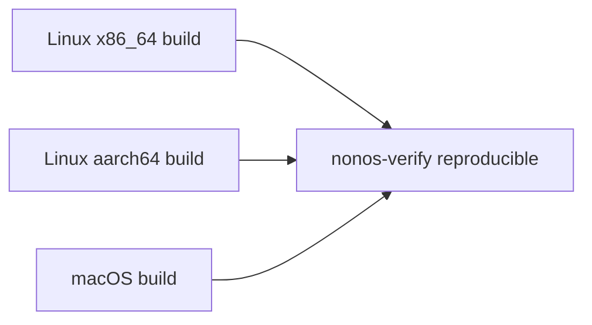

# Reproducible builds

Check a NONOS build yourself: what is pinned, where the reproducible boundary runs, how to compare two builds, and what is not reproducible yet.

## The boundary

The artifacts in `result/` are built to be reproducible: the same commit and the same `nonos.toml` should give the same bytes on any machine. Enrollment and signing are not, because the [seal](../overview/glossary.md#seal) draws fresh randomness for every STARK proof and signs with keys the build never sees (`BOUNDARY`, `tools/nix/manifest.py:25-29`). The boundary is the tree the flake's `artifacts` function writes: the kernel ELF, every [capsule](../overview/glossary.md#capsule) ELF, the Linux userland, the loader EFI binary and the bill of materials (`artifacts`, `tools/nix/artifacts.nix:1-15`).

The sealed image still traces back to the source. The seal's last check rebuilds the kernel and the loader from the tree with `nix build` and stops unless they are the bytes it sealed (`reproduced`, `tools/nonos_seal/verify.py:70-86`).

## What is pinned

| what | pinned by |
|---|---|
| nixpkgs, rust-overlay and STARKs | commit and NAR hash in [flake.lock](../../flake.lock) |
| Rust | the nightly in [rust-toolchain.toml](../../rust-toolchain.toml), read by the flake through rust-overlay |
| every crate | the sha256 in the crate's own `Cargo.lock`; each crate is a fixed output derivation keyed by it (`vendor.nix`, `tools/nix/vendor.nix:1-14`) |
| git dependencies | STARKs by the flake input, and every other one by tree hash in [git-sources.json](../../tools/nix/git-sources.json) |
| C sources and the Zig, CMake and llama.cpp releases | name, URL and hash in [sources.txt](../../tools/nix/sources.txt), 47 entries: a sha256 for each tarball, a commit and Nix tree hash for llama.cpp |
| CMake, Go and clang from nixpkgs | a version asserted when the flake evaluates (`assert`, `tools/nix/pins.nix:71-74`) |
| the standard library's lock for `-Zbuild-std` | a committed copy, held to the toolchain's by the `rust-src-lock` check (`rustSrcLock`, `tools/nix/checks.nix:293-298`) |
| the committed BusyBox binary | held to a BusyBox built from source by the `busybox-source` check (`busybox`, `tools/nix/checks.nix:287-292`) |
| GitHub Actions | each action by commit hash, such as `actions/checkout@3d3c42e5aac5ba805825da76410c181273ba90b1` |
| the devcontainer | the Debian base image by digest, and Nix 2.34.6 by the sha256 of its installer (`NIX_INSTALLER_SHA256`, `.devcontainer/Dockerfile:6-27`) |

Every `Cargo.lock` that uses STARKs must name the commit `flake.lock` pins, or the `starks-pin` check fails (`starks`, `tools/nix/checks.nix:274-276`).

## How the build keeps the host out

- Each cargo build runs in Nix's sandbox, offline and `--frozen`, against a vendor directory that holds exactly its lock's crates (`setup`, `tools/nix/vendor.nix:194-208`).
- A rustc wrapper rewrites every build path it would write into a binary to `/cargo`, `/rust` or `/nonos`, so the bytes do not depend on where the build ran (`rustcWrapper`, `tools/nix/vendor.nix:185-192`).
- Every artifact carries the commit's time, never the clock's: `SOURCE_DATE_EPOCH` is the flake's `lastModified` (`epoch`, `tools/nix/image.nix:34-35`).
- The kernel's build script asks git for the commit; in the sandbox a small shim answers with the commit the flake was evaluated at (`gitShim`, `tools/nix/image.nix:23-32`).
- Nix's fixup phase is turned off, so nothing strips or patches a NONOS binary after it is built (`dontFixup`, `tools/nix/rustbuild.nix:1-4`).
- Every C file built into the kernel or a capsule goes through the one pinned clang, and the Linux userland through the pinned Zig, so no host compiler reaches an artifact (`llvm`, `tools/nix/pins.nix:20-27`).
- The FAT volume serial and every timestamp on the [ESP](../overview/glossary.md#esp), the USB image and the ISO are fixed values (`IMAGE_DATE`, `tools/nonos_seal/media.py:45-47`).

## Compare two builds

### Against the committed receipt

`make build` ends with the build receipt: every artifact by sha256, the toolchain, and every pinned input by hash. The receipt is then held to the one committed for the same profile, with one of three verdicts (`compare`, `tools/nonos-receipt:167-183`):

| verdict | meaning |
|---|---|
| `REPRODUCED` | every artifact is byte for byte the committed one |
| `CHANGED` | artifacts differ, and so does the commit or an input; commit the new receipt once the change is meant |
| `NOT REPRODUCED` | the same commit and inputs gave different bytes |

Any other verdict writes the new receipt over the committed one in your checkout. A `NOT REPRODUCED` build never replaces the receipt it failed: it is written beside it as `<profile>.rejected.json`, and `make` exits with an error (`rejected`, `tools/nonos-receipt:256-263`). The header says `(uncommitted changes)` when the tree is dirty; only a receipt written from a clean tree is one to commit (`artifacts`, `tools/nonos-receipt:29-31`).

### Between two machines

Build the same commit on both machines, from a clean checkout, then compare the `artifacts` sections of the two manifests:

```
nix build .#default
nix develop --command jq -S .artifacts result/nonos-build.json > artifacts-this-machine.json
diff artifacts-this-machine.json artifacts-other-machine.json
```

Not tested in this release.

Compare `artifacts`, not the whole file. The `config` section also names each toolchain by its Nix store path, and those paths differ from one host system to another (`toolchain_paths`, `tools/nix/artifacts.nix:36-44`). The kernel embeds the short commit, and Nix gives a tree with uncommitted changes another one, so a dirty checkout does not match a clean one (`rev`, `tools/nix/image.nix:23-26`).

### What CI compares



The `ci-reproducible` workflow builds the default package on Linux x86_64, Linux aarch64 and macOS, with no binary cache, so no machine can take another's output (`matrix`, `.github/workflows/ci-reproducible.yml:36-55`). It hands the three `nonos-build.json` files to `nonos-verify reproducible`, which fails unless every manifest names the same files with the same hashes and the same `config` (`compare`, `nonos-verify/src/reproducible/manifests.rs:26-51`). `ci.yml` runs it on every pull request and on pushes to `main` and `develop`, and the nightly and release workflows run it too.

### A published release

A release carries `SHA256SUMS` and `BLAKE3SUMS` over its assets, `nonos-build.json` and the bill of materials (`assets`, `.github/workflows/ci-release-artifacts.yml:60-64`), and a signed build provenance statement for every asset, which `gh attestation verify` checks with no key from NONOS (`uses`, `.github/workflows/release.yml:106-112`):

```
gh attestation verify nonos.cdx.json --repo NON-OS/nonos-unified
```

Not tested in this release.

## What is not reproducible yet

- The sealed image, by design: its signatures, [trailers](../overview/glossary.md#trailer) and roots differ from one seal to the next.
- A commit that adds a capsule before its seal is committed: the kernel embeds every shipped capsule's certificate, manifest and trailer, so `result/` holds `kernel/README` instead of a kernel (`kernelNote`, `tools/nix/artifacts.nix:24-26`). The loader likewise needs the kernel's public keys committed (`loaderNote`, `tools/nix/artifacts.nix:21-22`).
- The cross-system comparison in CI as written: `nonos-verify reproducible` also requires the `config` sections to match (`same_config`, `nonos-verify/src/reproducible/manifests.rs:42-43`), and they carry each host's own toolchain store paths, so builds on two host systems are not expected to pass it. No run of it is checked in this release.
- On the check run recorded for this commit, the `inputs` check failed for three crates and one proof check did not evaluate. [ci.md](ci.md) lists the state of every check and what the two results have in common.
- The `busybox-source` check did not run on that check run, because the machine could not download the pinned Zig compiler. The committed BusyBox binary is not compared with a build from source in this release.
- The older make build in `mk/` is outside these guarantees. It takes its time from git (`SOURCE_DATE_EPOCH`, `mk/00-config.mk:20`) and signs with local keys; its one reproducibility check builds the loader twice on one machine and compares the bytes (`nonos-mk-verify-reproducible-boot`, `mk/20-build.mk:159-172`).
- A comparison of this commit's artifacts built on two machines is not tested in this release.
