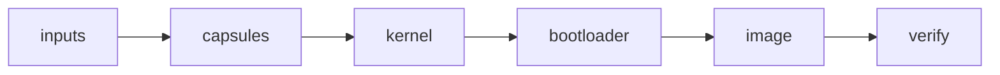

# The seal

See what turns the build's unsigned artifacts into a bootable image, what it signs and writes, and how to get an image you can boot without the release keys.

## What the seal is

The [seal](../overview/glossary.md#seal) is the one step between the reproducible build and a bootable image. It adds what only the keys can add, and it compiles nothing itself: every artifact it seals comes from a `nix build` of the tree, and the build never holds a key (`seal`, `Makefile:11-14`).

```
make seal
make seal PROFILE=hardened SEAL_ARGS=--release
nix run .#seal -- --profile hardened --release
```

Not tested in this release.

`make seal` runs `nix run .#seal`, which runs `tools/nonos-seal` with the flake's tools on `PATH` (`seal`, `tools/nix/apps.nix:40`). Run any other way, it stops and says to run it as `nix run .#seal` from the checkout (`preflight`, `tools/nonos_seal/__main__.py:42-44`).

| option | effect |
|---|---|
| `--profile P` | seals profile `P` instead of the one `nonos.toml` names |
| `--release` | a release: refuses a dirty tree and a development loader, and, for a profile whose loader policy is `production`, a missing Secure Boot db key |
| `--out DIR` | where the sealed image goes, `target/release` by default |
| `--mirror URL` | the NONOS model repository the model catalogue names |

The options are defined in `main` (`tools/nonos_seal/__main__.py:100-107`).

## Who runs it

The maintainers run the release seal on their own machine, where the release keys are. The kernel's private signing keys are not committed; the seal copies only their public halves into the tree for the loader to compile in (`kernelKeys`, `tools/nix/image.nix:127-134`). The `release` bundle CI publishes is unsigned, and the workflow that builds it holds no key (`release`, `.github/workflows/ci-release-artifacts.yml:3-5`); the `release` workflow then signs build provenance over the release assets (`attest-build-provenance`, `.github/workflows/release.yml:110-113`). Other CI lanes, in production trust mode, read an Ed25519 seed from the `SIGNING_KEY_BASE64` repository secret and stop without it (`SIGNING_KEY_BASE64`, `nonos-ci/setup-signing-key.sh:22-29`). What that secret holds is a repository setting, not visible in the tree.

With `--release`, the seal refuses a tree that differs from the commit outside `nonos-data/trust/`, `nonos-data/market/` and `nonos-data/models/`, where it writes its own output (`preflight`, `tools/nonos_seal/__main__.py:45-49`), and refuses any profile with the development loader (`release`, `tools/nonos_seal/__main__.py:119-120`).

## The six phases



The seal runs six phases in the order the trust chain needs them (`say`, `tools/nonos_seal/__main__.py:132-167`):

1. inputs: the market index and the model catalogue, which the market capsule and the model fetcher embed, signed with the market operator key (`INDEX`, `tools/nonos_seal/market.py:17-31`). Without that key the seal stops here for every image except one with the development loader, because the image would ship an empty Marketplace and no Qwen tier to fetch (`required`, `tools/nonos_seal/market.py:71-81`, `tools/nonos_seal/__main__.py:134-135`).
2. capsules: each [capsule](../overview/glossary.md#capsule)'s NONOS-ID certificate and signed manifest, then one STARK enrollment of the whole set under the policy root. When git shows no capsule source changed since the commit the set was enrolled at, the seal checks the enrollment already in the tree against what was built and keeps it (`current_capsules`, `tools/nonos_seal/__main__.py:76-97`).
3. kernel: the kernel, built by the flake against that [trust set](../overview/glossary.md#trust-set), enrolled under its own root.
4. bootloader: the loader, built against the kernel's root and public keys, enrolled under its own root.
5. image: the kernel signed with its [trailer](../overview/glossary.md#trailer) embedded, the boot records, Secure Boot signing of the loader when the db key is present, then the ESP, the package store, the USB image and the ISO. Without the device policy key there is no `kernel.approval`, and the TPM keeps the device secret sealed (`records`, `tools/nonos_seal/chain.py:77-94`).
6. verify: every check the boot will make, run against what was written, then a fresh build of the tree compared with what was sealed.

The phase names, from `inputs` to `verify`, come from the seal's own description (`tools/nonos_seal/__init__.py:22-33`). Each phase writes only public files into `nonos-data/` and stages them, then asks the flake to build the next artifact from the tree as it now stands (`tools/nonos_seal/__init__.py`).

## What it signs

The build receipt lists what a seal signs (`signs`, `tools/nonos-receipt:156-161`):

| what | signed with |
|---|---|
| every capsule's certificate and manifest | Ed25519 and ML-DSA-65, with the publisher keys |
| the kernel, at the [rollback index](../overview/glossary.md#rollback-index) | Ed25519 and ML-DSA-65 |
| `boot_root.approval` and `kernel.approval` | the device policy key |
| `BOOTX64.EFI` | the Secure Boot db key, when the seal has one |

On top of the signatures, the capsules, the kernel and the loader each carry a STARK membership trailer. A [development image](../overview/glossary.md#development-image) carries only the Merkle path in each trailer, with no STARK proof, which only its own gates accept (`path_only`, `tools/nonos_seal/__main__.py:123-130`). [Boot chain and signatures](../security/boot-chain-and-signatures.md) and [STARK attestation](../security/stark-attestation.md) describe how the boot checks them.
