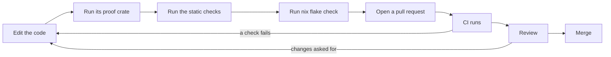

# Contributing to NONOS

How to set up a checkout of NONOS, make a change, check it and send it for review.

## Set up

NONOS builds through its Nix flake, so Nix with flakes turned on is the one tool you install. The flake exports `packages`, `checks`, `apps`, `devShells` and a `formatter` for three host `systems`: `x86_64-linux`, `aarch64-linux` and `aarch64-darwin` (`flake.nix:38-49`). The development shell carries the pinned Rust toolchain and the tools the checks and boots use. Its header names WSL2 as a host it works on. On macOS it leaves out the two tools in `linuxOnly`, `sbsigntool` for [Secure Boot](../overview/glossary.md#secure-boot) signing and `tpm2-tools` (`tools/nix/shell.nix:1-8`).

If you would rather not install Nix on the host, `.devcontainer/` describes a container that installs Nix 2.34.6 and writes a `nix.conf` with flakes and the build sandbox turned on (`.devcontainer/Dockerfile:25-30`). The container runs `privileged`, because Nix's sandbox needs namespaces a default container does not grant (`.devcontainer/devcontainer.json:5`).

```
nix develop
make check
```

Not tested in this release.

`make check` builds every flake check for your machine and prints what each one proved; [Tests and proofs](tests-and-proofs.md) lists the checks and says which fail at this commit. `make help` prints the short forms of the other build commands, and [the build guide](../build/README.md) covers them one by one.

## Before you start

- Read the [Code of Conduct](../../CODE_OF_CONDUCT.md). It asks you to argue about the code and bring evidence, and it says where to report conduct problems.
- Report a security problem privately, never in a public issue. [SECURITY.md](../../SECURITY.md) and [Reporting a vulnerability](../security/reporting-a-vulnerability.md) say how.
- NONOS is licensed under the GNU Affero General Public License, version 3 or any later version. Most source files carry the notice in their header, and a new file should too; [Code style](code-style.md#file-header) shows the header and says where it is missing.
- Code for an architecture other than x86_64 is a preview or not supported; read [Architectures](../architectures/README.md) before you work on one.

## Make a change



1. Edit the code, following [Code style](code-style.md).
2. Run its proof crate: the [proof crate](../overview/glossary.md#proof-crate) that compiles the source you changed and tests it on the host.
3. Run the static checks that read the whole tree. Most compare against a [baseline](../overview/glossary.md#baseline) that may only shrink.
4. Run `nix flake check`, or `make check`, before you push.
5. Open a pull request against `main`.
6. CI runs the workflows that [Review](review.md) lists.
7. Review follows. Reviewers ask for evidence: a serial log, a failing proof, a diff.
8. Merge. A maintainer merges the pull request.

For step 2, `tools/nix/inputs.json` lists the paths each crate reads, so this prints the proof crates that read a given file:

```
python3 -c "import json,sys; f=sys.argv[1]; d=json.load(open('tools/nix/inputs.json')); print(' '.join(k for k,v in d.items() if k.endswith('_proofs') and any(f==p or f.startswith(p+'/') for p in v['include'])))" src/ipc/nonos_inbox/budget.rs
```

For that file it prints `userland/kernel_proofs`; an empty line means no proof crate reads the file. [Tests and proofs](tests-and-proofs.md#proof-crates) gives the command that runs one crate, and [Static checks](tests-and-proofs.md#static-checks) the commands for step 3.

## Where code goes

| Change | Where it goes |
|---|---|
| a kernel mechanism | `src/` |
| a driver | `userland/capsule_driver_<name>/`, with its proof crate in `userland/<name>_proofs/` |
| a service or a program | `userland/capsule_<name>/` |
| a host test of shipping code | `userland/<name>_proofs/` |
| a theorem | `verification/lean/`, or `verification/extraction/` for extracted code |
| an ABI number or [capability](../overview/glossary.md#capability) bit | `abi/` |

The kernel does not host drivers. `src/drivers/` may hold only `pci`, `security` and `virtio_rng`, and the static checks fail on anything else (`unexpected_drivers`, `nonos-ci/run-static-checks.sh:179-190`). `src/services/` may hold only `caps`, `lifecycle` and `registry` (`unexpected_services`, `nonos-ci/run-static-checks.sh:363-371`). Every other service runs as a [capsule](../overview/glossary.md#capsule) in ring 3.

Every `userland/capsule_*` directory needs a non-empty `README.md` that states its contract; for one without it, `fail_with` marks the static checks failed (`nonos-ci/run-static-checks.sh:352-360`). The `README.md` of a [driver capsule](../overview/glossary.md#driver-capsule) must also carry sixteen named sections, an ASCII diagram in a `text` block, its `CAPSULE_REQUIRED_CAPS` mask and at least one of the broker calls it makes (`nonos-ci/run-static-checks.sh:198-244`). All 27 driver capsules meet that rule at this commit. [Writing a driver](../drivers/writing-a-driver.md) walks through one.

Every driver capsule needs a proof crate named after it, apart from the two names that `ALIASES` maps to another crate (`scripts/check_driver_proofs.py:31-47`). At this commit `check_driver_proofs.py` reports 27 of 27 drivers with a proof crate.

## Pages in this section

- [Code style](code-style.md): formatting, the file header, comments, file size, and the panic, lint and dependency rules.
- [Tests and proofs](tests-and-proofs.md): proof crates, static checks, Kani, Lean, fuzzing, how to run each, and the state of the checks at this commit.
- [Review](review.md): what CI runs on a pull request, who is asked to review it, and what reviewers look for.
- [Commits](commits.md): the subject line, the body, and what a commit leaves out.

## See also

- [Build](../build/README.md)
- [The Nix flake](../build/nix-flake.md)
- [Make targets](../build/make-targets.md)
- [CI](../build/ci.md)
- [Architectures](../architectures/README.md)
- [The capsule model](../userland/README.md)
- [CONTRIBUTING.md](../../CONTRIBUTING.md)
