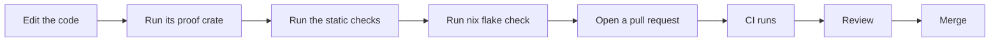

# Contributing to NONOS

How to set up a checkout of NONOS, make a change, check it and send it for review.

## Set up

NONOS builds through its Nix flake, so Nix with flakes turned on is the one tool you install. The flake exports `packages`, `checks`, `apps`, `devShells` and a `formatter` for three host `systems`: `x86_64-linux`, `aarch64-linux` and `aarch64-darwin` (`flake.nix:38-49`). The development shell carries the pinned Rust toolchain and the tools the checks and boots use. Its header names WSL2 as a host it works on. On macOS it leaves out the two tools in `linuxOnly`, `sbsigntool` for Secure Boot signing and `tpm2-tools` (`tools/nix/shell.nix:1-8`).

If you would rather not install Nix on the host, `.devcontainer/` describes a container that installs Nix 2.34.6 and writes a `nix.conf` with flakes and the build sandbox turned on (`.devcontainer/Dockerfile:25-30`). The container runs `privileged`, because Nix's sandbox needs namespaces a default container does not grant (`.devcontainer/devcontainer.json:5`).

```
nix develop
make check
```

Not tested in this release.

`make check` builds every flake check for your machine and prints what each one proved; [Tests and proofs](tests-and-proofs.md) lists the checks and says which fail at this commit. `make help` prints the short forms of the other build commands, and [the build guide](../build/README.md) covers them one by one.

## Make a change



1. Edit the code, following [Code style](code-style.md).
2. Run its proof crate: the [proof crate](../overview/glossary.md#proof-crate) that compiles the source you changed and tests it on the host.
3. Run the static checks that read the whole tree. Most compare against a [baseline](../overview/glossary.md#baseline) that may only shrink.
4. Run nix flake check, or `make check`, before you push.
5. Open a pull request against `main`.
6. CI runs the workflows that [Review](review.md) lists.
7. Review follows. Reviewers ask for evidence: a serial log, a failing proof, a diff.
8. Merge. A maintainer merges the pull request.
