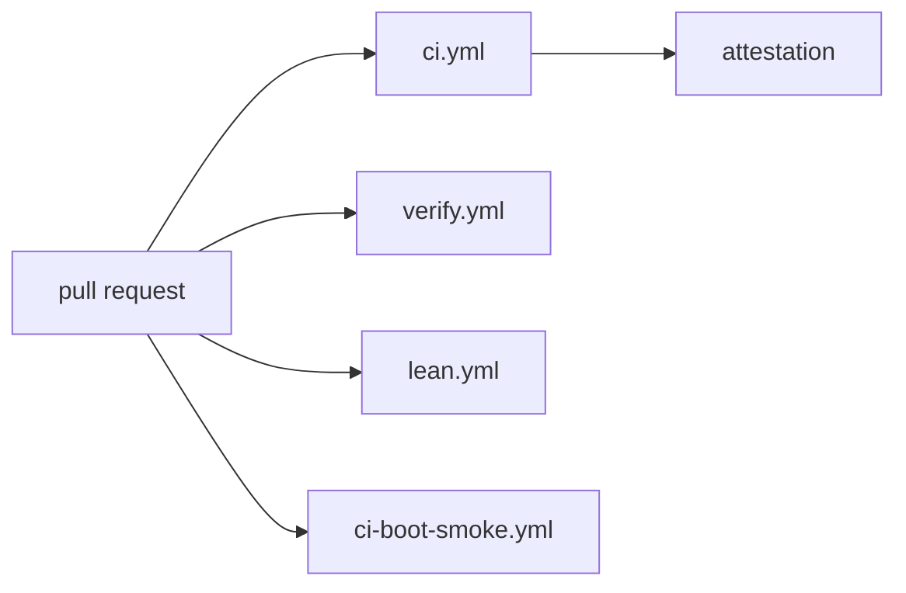

# Review

What CI runs on a NONOS pull request, who is asked to review it, and what reviewers look for.

## What CI runs on a pull request

Four workflows start on a pull request: `ci.yml`, `verify.yml`, `lean.yml` and `ci-boot-smoke.yml`.

- `ci.yml` runs the x86_64 build, the aarch64 build and boot, the trust ledger check, the reproducible double build, the production build, the supply-chain, trust-chain and adversarial modules, the evidence and the benchmark. Its `attestation` job reads their reports and fails the run when `build`, `supply-chain`, `trust-chain`, `adversarial`, `evidence` or `reproducible` failed (`.github/workflows/ci.yml:86-91`).
- `verify.yml` runs `nix flake check` once per entry of its `matrix`, on Linux x86_64 and on macOS aarch64 (`.github/workflows/verify.yml:39-60`), then the Kani, Verus, Lean and extraction jobs. [Tests and proofs](tests-and-proofs.md) describes each.
- `lean.yml` builds the Lean specification and fails when the axiom profile shows `sorryAx` (`.github/workflows/lean.yml:49-60`).
- `ci-boot-smoke.yml` is the blocking boot check. It builds the `qemu` [profile](../overview/glossary.md#profile) and [seals](../overview/glossary.md#seal) it with scratch keys made for the run (`.github/workflows/ci-boot-smoke.yml:82-89`). It then boots the image twice, headless with a software TPM. The first boot's `serial` log must show `Handoff OK`, `Capsules spawned`, `[VFS] serving, store status` and `[BOOT-ATTEST] bootloader measured and enrolled`; the second boots the same image as a USB stick on the xHCI controller and must bind it through USB mass storage (`--expect`, `.github/workflows/ci-boot-smoke.yml:90-106`). Its `BOOT_TIMEOUT` is 300 seconds with KVM and 900 seconds under TCG (`.github/workflows/ci-boot-smoke.yml:74-80`).

Other workflows run on a schedule and gate nothing. `ci-boot-matrix.yml` boots every cell of the QEMU matrix on its nightly `cron`, and its header says the SMP cells are known to fail (`.github/workflows/ci-boot-matrix.yml:3-14`). [CI](../build/ci.md) lists every workflow.

## Who reviews

`.github/CODEOWNERS` routes review of every path to the maintainer account, and lists the trusted path again on its own: `src/crypto/`, `src/kernel_core/`, `src/syscall/`, `nonos-bootloader/`, `nonos-sign/` and `nonos-verify/`.

Two kinds of pull request come from automation:

- Dependabot opens updates for the Cargo crates of the root manifest and for GitHub Actions, weekly by its `schedule`, with at most five open pull requests for each (`.github/dependabot.yml:1-13`).
- `starks-bump.yml` looks at STARKs main every day on its `cron`, at 05:17 UTC, and when main has moved it moves the flake input, writes the new commit into every `Cargo.lock`, runs `nix flake check` and opens a pull request with the result (`.github/workflows/starks-bump.yml:3-14`). It never merges: a maintainer reads the STARKs change and merges it or not. A pull request opened with the workflow's token starts no other workflow, so `ci.yml` runs on it only when a maintainer pushes to it or reruns it.

## What reviewers look for

The project expects the following of every pull request. None of it is enforced by a check.

- One concern per pull request.
- A description that says what changed and why, what you ran with its results (the proof crate and its test count, clippy, the static checks), and what you did not verify, such as a boot or real hardware. [Commits](commits.md) shows the same habit in commit bodies.
- Evidence rather than assertion. The [Code of Conduct](../../CODE_OF_CONDUCT.md) names the kinds that count: a serial log, a failing proof, a diff.
- For a driver change, the PCI or USB id of the device and the serial log of the boot you tested it on.
- A number that grows, said out loud. The ring 0 size may not pass its `tcb` budget, and a pull request that raises the budget has to say why (`nonos-verify/src/build.rs:44-46`). A counting baseline that grows names the new value in `baseline_file`, in the same pull request (`nonos-ci/check-baseline.sh:39-42`).
- The closest reading for the trusted path: kernel core, crypto, the syscall layer, the bootloader, and the signing and verification tools.

## Issues

The hardware bug form asks for the machine or the QEMU command line, the architecture (x86_64, aarch64 or riscv64), the make target and commit, the serial log, what you expected and what happened, and the PCI or USB id of the device involved, in its fields from `machine` to `device` (`.github/ISSUE_TEMPLATE/hardware-bug.yml:10-52`). [Reporting a machine](../hardware/report.md) explains what to collect.

Anything exploitable goes through a private security advisory, never a public issue, as the form's `contact_links` say (`.github/ISSUE_TEMPLATE/config.yml:2-5`). [Reporting a vulnerability](../security/reporting-a-vulnerability.md) covers it.
