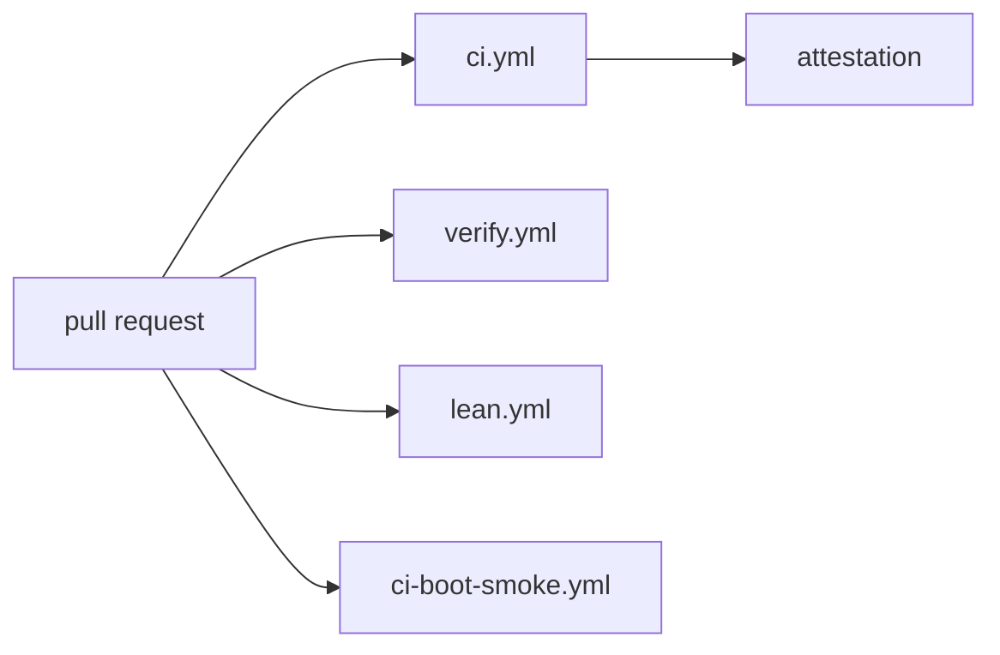

# Review

What CI runs on a NONOS pull request, who is asked to review it, and what reviewers look for.

## What CI runs on a pull request

Four workflows start on a pull request: `ci.yml`, `verify.yml`, `lean.yml` and `ci-boot-smoke.yml`.

- `ci.yml` runs the x86_64 build, the aarch64 build and boot, the trust ledger check, the reproducible double build, the production build, the supply-chain, trust-chain and adversarial modules, the evidence and the benchmark. Its `attestation` job reads their reports and fails the run when `build`, `supply-chain`, `trust-chain`, `adversarial`, `evidence` or `reproducible` failed (`.github/workflows/ci.yml:86-91`).
- `verify.yml` runs `nix flake check` once per entry of its `matrix`, on Linux x86_64 and on macOS aarch64 (`.github/workflows/verify.yml:39-60`), then the Kani, Verus, Lean and extraction jobs. [Tests and proofs](tests-and-proofs.md) describes each.
- `lean.yml` builds the Lean specification and fails when the axiom profile shows `sorryAx` (`.github/workflows/lean.yml:49-60`).
- `ci-boot-smoke.yml` is the blocking boot check. It builds the `qemu` [profile](../overview/glossary.md#profile) and [seals](../overview/glossary.md#seal) it with scratch keys made for the run (`.github/workflows/ci-boot-smoke.yml:82-89`). It then boots the image twice, headless with a software TPM. The first boot's `serial` log must show `Handoff OK`, `Capsules spawned`, `[VFS] serving, store status` and `[BOOT-ATTEST] bootloader measured and enrolled`; the second boots the same image as a USB stick on the xHCI controller and must bind it through USB mass storage (`--expect`, `.github/workflows/ci-boot-smoke.yml:90-106`). Its `BOOT_TIMEOUT` is 300 seconds with KVM and 900 seconds under TCG (`.github/workflows/ci-boot-smoke.yml:74-80`).

Other workflows run on a schedule and gate nothing. `ci-boot-matrix.yml` boots every cell of the QEMU matrix on its nightly `cron`, and its header says the SMP cells are known to fail (`.github/workflows/ci-boot-matrix.yml:3-14`). [CI](../build/ci.md) lists every workflow.
