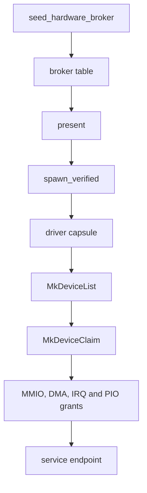

# Drivers

How NONOS finds a device, starts a driver for it and keeps that driver confined, with every driver capsule in the tree.

## The model

Every device driver in NONOS is a [driver capsule](../overview/glossary.md#driver-capsule): a signed, unprivileged program under `userland/capsule_driver_<name>`, started by the kernel like any other [capsule](../overview/glossary.md#capsule). A driver never maps physical memory and never runs `in` or `out` itself. It asks the [hardware broker](../overview/glossary.md#hardware-broker) in `src/hardware/broker` for each window it needs, and the broker records every [grant](../overview/glossary.md#grant) so it can take it back.

A driver's life has five steps. It lists the devices the broker knows, claims one, takes MMIO, DMA, IRQ and PIO grants for its registers, buffers, interrupts and ports, serves the device to its clients over IPC on a named service [endpoint](../overview/glossary.md#endpoint), and releases everything when it stops or exits.

The kernel fills the broker table at boot, the spawn plan asks `present` whether the machine has the device, `spawn_verified` starts the capsule, and the capsule makes the broker calls in [broker-api.md](broker-api.md), from `MkDeviceList` and `MkDeviceClaim` onward. The [worked example](writing-a-driver.md) walks through one real driver end to end.
