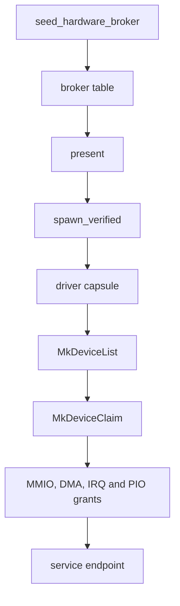

# Drivers

How NONOS finds a device, starts a driver for it and keeps that driver confined, with every driver capsule in the tree.

## The model

Every device driver in NONOS is a [driver capsule](../overview/glossary.md#driver-capsule): a signed, unprivileged program under `userland/capsule_driver_<name>`, started by the kernel like any other [capsule](../overview/glossary.md#capsule). A driver never maps physical memory and never runs `in` or `out` itself. It asks the [hardware broker](../overview/glossary.md#hardware-broker) in `src/hardware/broker` for each window it needs, and the broker records every [grant](../overview/glossary.md#grant) so it can take it back.

A driver's life has five steps. It lists the devices the broker knows, claims one, takes MMIO, DMA, IRQ and PIO grants for its registers, buffers, interrupts and ports, serves the device to its clients over IPC on a named service [endpoint](../overview/glossary.md#endpoint), and releases everything when it stops or exits.

The kernel fills the broker table at boot, the spawn plan asks `present` whether the machine has the device, `spawn_verified` starts the capsule, and the capsule makes the broker calls in [broker-api.md](broker-api.md), from `MkDeviceList` and `MkDeviceClaim` onward. The [worked example](writing-a-driver.md) walks through one real driver end to end.

## How a device is found

`seed_hardware_broker` scans PCI, hands the functions to `init_from_pci`, adds the PS/2 records with `register_legacy_platform_devices`, and on x86_64 registers the I2C controllers, I2C-HID touchpads and GPIO controllers that only ACPI describes (`src/kernel_core/init/platform/hardware_broker.rs:19-38`). A PCI function's `device_id` is its index in the scan (`src/hardware/broker/table/init.rs:28-43`). `register_platform_device` gives a platform record the next id above the largest one, or `0x1_0000_0000` when the table is empty (`src/hardware/broker/table/init.rs:45-51`).

The i8042 keyboard controller cannot be enumerated, so `register_legacy` always writes a keyboard record on ports 0x60 to 0x64 with IRQ 1 and a mouse record on IRQ 12 (`src/hardware/broker/platform.rs:40-74`). The PS/2 driver claims the record, asks with `controller_answers` whether an i8042 is behind it, and leaves when none is (`userland/capsule_driver_ps2_input/src/setup/probe.rs:22-42`).

A record that comes from ACPI or from `register_legacy` has no PCI address. The broker does not move such a device into an [IOMMU domain](../overview/glossary.md#iommu-domain), and `attach` lets its claim through as it is (`src/hardware/broker/confine/attach.rs:30-33`).

Each entry is a 176-byte `DeviceRecord` (`src/hardware/broker/device/record.rs:21-61`). [broker-api.md](broker-api.md) lists its fields.

## The hardware inventory

`src/hardware/inventory` sorts every broker record into a `HardwareFamily` (`src/hardware/inventory/family.rs:18-54`) through `classify_device` (`src/hardware/inventory/classify.rs:54-61`). Three questions are answered from it:

- `present` says whether any listed device belongs to a family (`src/hardware/inventory/present.rs:26-28`). The spawn plan asks it before starting a driver.
- `family_driver` names the driver binary for a family (`src/hardware/inventory/driver.rs:19-45`). `DisplayBga` has none on purpose: the Bochs capsule re-modes the adapter and would destroy the firmware scanout.
- `support_state` rates each family from `EnumerateOnly` to `DataPath` (`src/hardware/inventory/support.rs:20-33`), and `missing_path` names what a family still lacks (`src/hardware/inventory/missing.rs:19-34`).

## How a driver starts

`spawn_drivers` runs the driver spawns in this order: the virtio drivers, the bus drivers (Wi-Fi, the I2C controller, I2C-HID), PS/2 input, the wired NICs, USB, storage and HD Audio, then the audio server (`src/userspace/init/spawn_plan/orchestrator.rs:33-41`).

Some spawns are gated on hardware. `present` in the spawn plan refuses a driver whose device family the boot scan did not find and logs `no controller present, not spawned` (`src/userspace/init/spawn_plan/device_present.rs:29-35`). The gated drivers are virtio-blk, virtio-net, iwlwifi, RTL8821CE, NVMe, AHCI and USB mass storage; `spawn_ahci` also starts for an Intel eMMC host, and `spawn_usb_msc` needs only an xHCI controller (`src/userspace/init/spawn_plan/drivers_storage.rs:27-41`, `src/userspace/init/spawn_plan/drivers_usb.rs:57-70`). The others always start and leave on their own when the device is missing. Every spawn passes through `capsule`, which skips a program the person turned off in first-boot setup (`src/userspace/init/spawn_plan/boot.rs:20-32`), but `capsule_off` names only apps, so no driver is skipped that way (`src/userspace/init/app_choice/names.rs:24-36`).

The [boot mode](../install/boot-modes.md) can refuse a driver at spawn. On an Air-Gapped, Safe Mode or Recovery boot, `refused` turns away the six drivers in `NETWORK_DRIVERS`: e1000, RTL8139, RTL8169, virtio-net, iwlwifi and RTL8821CE. Safe Mode also refuses `driver.hda0` and `audio.server` through `NOT_SAFE` (`src/kernel_core/process_spawn/capsule_spawn/runner/profile_refuse.rs:21-40`). The boot profile's `network` and `minimal` say which modes those are (`src/boot/handoff/api/profile.rs:44-52`). `check` logs each refusal as `[PROFILE] <mode>: not started: <name>` (`src/kernel_core/process_spawn/capsule_spawn/runner/profile_gate.rs:31-44`).

The kernel side of a driver is a small [kernel mirror](../overview/glossary.md#kernel-mirror) under `src/hardware/<name>_capsule`, or under `src/userspace/capsule_driver_<name>` for I2C-HID, USB HID and USB mass storage. It embeds the capsule ELF, `DRIVER_VIRTIO_RNG_ELF` in the virtio-rng mirror, with its certificate, manifest and attestation trailer when the Cargo feature is on, and empty slices when it is off (`src/hardware/virtio_rng_capsule/embed.rs:23-52`). Its spawn function fills a `CapsuleSpecVerified` and calls `spawn_verified` (`src/hardware/virtio_rng_capsule/spawn.rs:37-63`).

Thirteen of the 27 driver capsules start through `start_driver` in `nonos_libc`, which returns `EXIT_ABSENT` (2) at once when discovery found nothing, and the capsule exits with that code. Otherwise `bring_up` tries the device up to `BRINGUP_ATTEMPTS` (7) times, sleeping from `BRINGUP_FIRST_DELAY_MS` (100 ms) and doubling up to `BRINGUP_MAX_DELAY_MS` (3200 ms), and the capsule exits with `EXIT_GAVE_UP` (6) after the last failure (`userland/libc/src/bringup/policy.rs:31-41`, `userland/libc/src/bringup/run.rs:29-62`).
