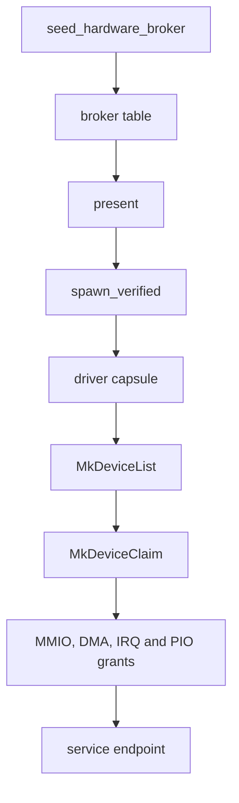

# Drivers

Which page covers each kind of device, how NONOS finds a device and starts and confines its driver, and every driver capsule in the tree.

## Pages in this section

To check one machine's devices, look them up in the [support matrix](../hardware/MATRIX.md) first. These pages explain the drivers behind each row.

| Page | What it covers |
|---|---|
| [Broker API](broker-api.md) | every call a driver makes to the kernel, and what the kernel checks |
| [Writing a driver](writing-a-driver.md) | the virtio-rng driver built step by step, from manifest to proof crate |
| [Platform](platform.md) | processor cores, VT-d and AMD-Vi, the TPM, the power button and volume keys, GPIO |
| [Display](display.md) | the firmware framebuffer, virtio-gpu, and the GPUs NONOS cannot drive |
| [Audio: Intel HD Audio](audio.md) | the HD Audio driver, the audio server, and the machines that cannot play |
| [Input drivers](input/README.md) | how a key press or a touch reaches an app, and keyboard layouts |
| [PS/2 keyboard and mouse](input/ps2.md) | the i8042 keyboard, mouse and aux-port touchpad |
| [I2C-HID touchpads](input/i2c-hid.md) | touchpads on Intel LPSS and AMD I2C controllers, and their gestures |
| [USB and the xHCI host controller](usb/README.md) | the xHCI driver and the USB class drivers above it |
| [USB keyboards and mice](usb/hid.md) | `driver.usb_hid0` and the devices it binds |
| [USB hubs](usb/hubs.md) | why a device behind a hub is not reached yet |
| [Storage drivers](storage/README.md) | every disk driver, and how one disk becomes the NONOS disk |
| [NVMe](storage/nvme.md) | `driver.nvme0` and its limits |
| [AHCI SATA and Intel RST](storage/ahci-and-rst.md) | `driver.ahci0`, and Intel controllers in RAID mode |
| [Intel VMD](storage/vmd.md) | NVMe drives the firmware hides behind a VMD |
| [SD cards and eMMC](storage/sd-and-emmc.md) | soldered eMMC, and the SD card readers NONOS does not drive |
| [USB mass storage](storage/usb-mass-storage.md) | USB sticks and disks through `driver.usb_msc0` |
| [Wi-Fi drivers](wifi/README.md) | the two Wi-Fi drivers, and a scan and a join from Settings to the radio |
| [Realtek RTL8821CE](wifi/rtl8821ce.md) | the Wi-Fi driver with a real-hardware report |
| [Intel Wi-Fi (iwlwifi)](wifi/iwlwifi.md) | which Intel cards boot, which are refused, and why |
| [Wi-Fi chips with no driver](wifi/not-supported.md) | how to tell whether your chip has a driver, and what to use instead |
| [Ethernet drivers](ethernet/README.md) | every wired driver, and the receive fault in 0.9.2 |
| [Intel Ethernet](ethernet/intel.md) | e1000 in the image, e1000e and igc not built |
| [Realtek Ethernet](ethernet/realtek.md) | the RTL8139 and RTL8169 family drivers |
| [USB networking](ethernet/usb-net.md) | the five USB network drivers, none of them in the image |

## The model

A device driver in NONOS is a [driver capsule](../overview/glossary.md#driver-capsule): a signed, unprivileged program under `userland/capsule_driver_<name>`, started by the kernel like any other [capsule](../overview/glossary.md#capsule). The few platform pieces that stay in the kernel are listed under [Drivers inside the kernel](#drivers-inside-the-kernel). A driver capsule never maps physical memory and never runs `in` or `out` itself. It asks the [hardware broker](../overview/glossary.md#hardware-broker) in `src/hardware/broker` for each window it needs, and the broker records every [grant](../overview/glossary.md#grant) so it can take it back.

A driver's life has five steps. It lists the devices the broker knows, claims one, takes MMIO, DMA, IRQ and PIO grants for its registers, buffers, interrupts and ports, serves the device to its clients over IPC on a named service [endpoint](../overview/glossary.md#endpoint), and releases everything when it stops or exits.

The kernel fills the broker table at boot, the spawn plan asks `present` whether the machine has the device, `spawn_verified` starts the capsule, and the capsule makes the calls in [Broker API](broker-api.md), from `MkDeviceList` and `MkDeviceClaim` onward. [Writing a driver](writing-a-driver.md) walks through one real driver end to end.

## How a device is found

`seed_hardware_broker` scans PCI, hands the functions to `init_from_pci`, adds the PS/2 records with `register_legacy_platform_devices`, and on x86_64 registers the I2C controllers, I2C-HID touchpads and GPIO controllers that only ACPI describes (`src/kernel_core/init/platform/hardware_broker.rs:19-38`). A PCI function's `device_id` is its index in the scan (`src/hardware/broker/table/init.rs:28-43`). `register_platform_device` gives a platform record the next id above the largest one, or `0x1_0000_0000` when the table is empty (`src/hardware/broker/table/init.rs:45-51`).

The i8042 keyboard controller cannot be enumerated, so `register_legacy` always writes a keyboard record on ports 0x60 to 0x64 with IRQ 1 and a mouse record on IRQ 12 (`src/hardware/broker/platform.rs:40-74`). The PS/2 driver claims the record, asks with `controller_answers` whether an i8042 is behind it, and leaves when none is (`userland/capsule_driver_ps2_input/src/setup/probe.rs:22-42`).

A record that comes from ACPI or from `register_legacy` has no PCI address. The broker does not move such a device into an [IOMMU domain](../overview/glossary.md#iommu-domain), and `attach` lets its claim through as it is (`src/hardware/broker/confine/attach.rs:30-33`).

Each entry is a 176-byte `DeviceRecord` (`src/hardware/broker/device/record.rs:21-61`). [Broker API](broker-api.md#the-device-record) lists its fields.

## The hardware inventory

`src/hardware/inventory` sorts every broker record into a `HardwareFamily` (`src/hardware/inventory/family.rs:18-54`) through `classify_device` (`src/hardware/inventory/classify.rs:54-61`). Three questions are answered from it:

- `present` says whether any listed device belongs to a family (`src/hardware/inventory/present.rs:26-28`). The spawn plan asks it before starting a driver.
- `family_driver` names the driver binary for a family (`src/hardware/inventory/driver.rs:19-45`). `DisplayBga` has none on purpose: the Bochs capsule re-modes the adapter and would destroy the firmware scanout.
- `support_state` rates each family from `EnumerateOnly` to `DataPath` (`src/hardware/inventory/support.rs:20-33`), and `missing_path` names what a family still lacks (`src/hardware/inventory/missing.rs:19-34`).

## How a driver starts

`spawn_drivers` runs the driver spawns in this order: the virtio drivers, the bus drivers (Wi-Fi, the I2C controller, I2C-HID), PS/2 input, the wired NICs, USB, storage and HD Audio, then the audio server (`src/userspace/init/spawn_plan/orchestrator.rs:33-41`).

Some spawns are gated on hardware. `present` in the spawn plan refuses a driver whose device family the boot scan did not find and logs `no controller present, not spawned` (`src/userspace/init/spawn_plan/device_present.rs:29-35`). The gated drivers are virtio-blk, virtio-net, iwlwifi, RTL8821CE, NVMe, AHCI and USB mass storage; `spawn_ahci` also starts for an Intel eMMC host, and `spawn_usb_msc` needs only an xHCI controller (`src/userspace/init/spawn_plan/drivers_storage.rs:27-41`, `src/userspace/init/spawn_plan/drivers_usb.rs:57-70`). The others always start and leave on their own when the device is missing. Every spawn passes through `capsule`, which skips a program the person turned off in first-boot setup (`src/userspace/init/spawn_plan/boot.rs:20-32`), but `capsule_off` names only apps, so no driver is skipped that way (`src/userspace/init/app_choice/names.rs:24-36`).

The [boot mode](../install/boot-modes.md), which the kernel reads as the [boot profile](../overview/glossary.md#boot-profile), can refuse a driver at spawn. On an Air-Gapped, Safe Mode or Recovery boot, `refused` turns away the six drivers in `NETWORK_DRIVERS`: e1000, RTL8139, RTL8169, virtio-net, iwlwifi and RTL8821CE. Safe Mode also refuses `driver.hda0` and `audio.server` through `NOT_SAFE` (`src/kernel_core/process_spawn/capsule_spawn/runner/profile_refuse.rs:21-40`). The boot profile's `network` and `minimal` say which modes those are (`src/boot/handoff/api/profile.rs:44-52`). `check` logs each refusal as `[PROFILE] <mode>: not started: <name>` (`src/kernel_core/process_spawn/capsule_spawn/runner/profile_gate.rs:31-44`).

The kernel side of a driver is a small [kernel mirror](../overview/glossary.md#kernel-mirror) under `src/hardware/<name>_capsule`, or under `src/userspace/capsule_driver_<name>` for I2C-HID, USB HID and USB mass storage. It embeds the capsule ELF, `DRIVER_VIRTIO_RNG_ELF` in the virtio-rng mirror, with its certificate, [manifest](../overview/glossary.md#manifest) and [attestation trailer](../overview/glossary.md#attestation-trailer) when the Cargo feature is on, and empty slices when it is off (`src/hardware/virtio_rng_capsule/embed.rs:23-52`). Its spawn function fills a `CapsuleSpecVerified` and calls `spawn_verified` (`src/hardware/virtio_rng_capsule/spawn.rs:37-63`).

Thirteen of the 27 driver capsules start through `start_driver` in `nonos_libc`, which returns `EXIT_ABSENT` (2) at once when discovery found nothing, and the capsule exits with that code. Otherwise `bring_up` tries the device up to `BRINGUP_ATTEMPTS` (7) times, sleeping from `BRINGUP_FIRST_DELAY_MS` (100 ms) and doubling up to `BRINGUP_MAX_DELAY_MS` (3200 ms), and the capsule exits with `EXIT_GAVE_UP` (6) after the last failure (`userland/libc/src/bringup/policy.rs:31-41`, `userland/libc/src/bringup/run.rs:29-62`).

## Who may talk to a driver

A driver serves its device raw, so the kernel makes most driver endpoints [held endpoints](../overview/glossary.md#held-endpoint), open only to the services that drive them. `HELD` lists them (`src/services/registry/held_table.rs:20-36`):

| Endpoint | Who may send |
|---|---|
| `driver.virtio_net0`, `driver.e1000_0`, `driver.rtl8169_0`, `driver.rtl8139_0` | `net.core`, `net.l2` |
| `driver.iwlwifi0`, `driver.rtl8821ce0` | `net.core`, `app.settings` and its two later windows, `app.setup_wizard` |
| `driver.ps2_kbd0`, `driver.usb_hid0`, `driver.i2c_hid0`, `driver.usb_msc0`, `driver.virtio_rng` | no capsule; only the kernel's own sends |
| `driver.xhci0` | `driver.usb_hid0`, `driver.usb_msc0` |
| `driver.i2c_pci0` | `driver.i2c_hid0` |
| `driver.virtio_gpu0` | `compositor` |
| `driver.hda0` | `audio.server` |

The three PCI storage drivers are not in the table. They check each sender themselves with `mk_cap_check` for `StoreWrite` (`userland/capsule_driver_nvme/src/server/medium.rs:26-29`, `userland/capsule_driver_virtio_blk/src/server/acl.rs:33-39`). The host test `every_driver_the_kernel_spawns_is_classified` fails when a spawned `driver.` endpoint is neither in `HELD` nor one of the three its `GATED_IN_DRIVER` list names (`userland/kernel_proofs/src/ipc_held_tests/classified.rs:26-57`).

## Which drivers an image carries

Eighteen driver capsules have a Cargo feature (`Cargo.toml:150-168`) and a `Capsule.mk` that the build includes (`mk/20-build.mk:528-547`). The feature profiles decide which of them a kernel embeds:

- `microkernel-desktop-offline` (`Cargo.toml:538`) carries virtio-rng, virtio-blk, NVMe, AHCI, virtio-gpu, PS/2, xHCI, USB HID, USB mass storage and HD Audio.
- `microkernel-desktop-base` (`Cargo.toml:591`) adds virtio-net.
- `microkernel-full-gui` (`Cargo.toml:632`) adds e1000, RTL8139, RTL8169, iwlwifi, RTL8821CE, the I2C controller and I2C-HID.

The `profiles` table picks the set for each image (`tools/nix/config.nix:69-117`). The Standard and Hardened images build `microkernel-full-gui`. The Air-Gapped image builds it too and drops every feature in `networkFeatures`, which holds all six network drivers (`tools/nix/config.nix:50-58`). The qemu and dev images build `microkernel-desktop-gui`, without the seven drivers `microkernel-full-gui` adds. The core image builds `microkernel-capsules`, which carries no driver capsule. [Profiles](../build/profiles.md) covers each image.

## Every driver capsule

Nine of the 27 directories are in the tree with their proofs but are not built into any image: they have no Cargo feature and no kernel spawn, and their `Capsule.mk`, where there is one, is not included by `mk/20-build.mk`.

| Capsule | Device class | Service | Built in | What it does |
|---|---|---|---|---|
| `capsule_driver_ahci` | SATA AHCI, Intel RST, Intel eMMC host | `driver.ahci0` | desktop-offline | SATA disks behind an AHCI controller or Intel RST in RAID mode, and Intel eMMC hosts, which have no capsule of their own yet |
| `capsule_driver_ax88179` | USB Ethernet | `driver.ax88179_0` | no | ASIX AX88179 and AX88178A Gigabit adapters on `driver.xhci0` |
| `capsule_driver_bga` | Display | none | no | Bochs Graphics Adapter mode set; parked, see [Display](display.md#bochs-bga) |
| `capsule_driver_cdc_ecm` | USB Ethernet | `driver.cdc_ecm0` | no | USB CDC Ethernet Control Model functions |
| `capsule_driver_cdc_ncm` | USB Ethernet | `driver.cdc_ncm0` | no | USB CDC Network Control Model functions |
| `capsule_driver_e1000` | Ethernet | `driver.e1000_0` | full-gui | Intel 8254x, polled |
| `capsule_driver_e1000e` | Ethernet | `driver.e1000e_0` | no | Intel 82574, 82583 and the I217, I218 and I219 PHYs |
| `capsule_driver_hda` | Audio | `driver.hda0` | desktop-offline | HD Audio controllers of any vendor, one output stream for `audio.server`, see [Audio](audio.md) |
| `capsule_driver_i2c_hid` | Input | `driver.i2c_hid0` | full-gui | HID over I2C touchpads, through `driver.i2c_pci0`, see [I2C-HID touchpads](input/i2c-hid.md) |
| `capsule_driver_i2c_pci` | I2C bus | `driver.i2c_pci0` | full-gui | DesignWare I2C controllers, Intel LPSS on PCI and the Intel and AMD ones ACPI declares, and the touchpad's GPIO line |
| `capsule_driver_igc` | Ethernet | `driver.igc_0` | no | Intel I225 and I226 2.5 GbE |
| `capsule_driver_iwlwifi` | Wi-Fi | `driver.iwlwifi0` | full-gui | Intel Wi-Fi cards, see [Intel Wi-Fi](wifi/iwlwifi.md) |
| `capsule_driver_nvme` | Storage | `driver.nvme0` | desktop-offline | NVMe, the admin queue and one I/O queue pair |
| `capsule_driver_ps2_input` | Input | `driver.ps2_kbd0` | desktop-offline | i8042 keyboard and mouse, with keyboard layouts, see [PS/2 keyboard and mouse](input/ps2.md) |
| `capsule_driver_rndis` | USB Ethernet | `driver.rndis0` | no | USB RNDIS functions, as phones use for tethering |
| `capsule_driver_rtl8139` | Ethernet | `driver.rtl8139_0` | full-gui | Realtek RTL8139 Fast Ethernet over port I/O |
| `capsule_driver_rtl8153` | USB Ethernet | `driver.rtl8153_0` | no | Realtek RTL8153 and RTL8153B USB 3.0 Gigabit |
| `capsule_driver_rtl8169` | Ethernet | `driver.rtl8169_0` | full-gui | Realtek RTL8169, RTL8168, RTL8111, RTL810x and RTL8125, polled |
| `capsule_driver_rtl8821ce` | Wi-Fi | `driver.rtl8821ce0` | full-gui | Realtek RTL8821CE, see [Realtek RTL8821CE](wifi/rtl8821ce.md) |
| `capsule_driver_rtsx` | SD card reader | `driver.rtsx0` | no | Realtek RTS5227 and RTS522A PCIe card readers |
| `capsule_driver_usb_hid` | Input | `driver.usb_hid0` | desktop-offline | USB boot keyboards and mice, other HID interfaces as a tablet, and hubs, whose devices it does not reach yet |
| `capsule_driver_usb_msc` | Storage | `driver.usb_msc0` | desktop-offline | USB mass storage, bulk-only SCSI, through `driver.xhci0` |
| `capsule_driver_virtio_blk` | Storage | `driver.virtio_blk0` | desktop-offline | virtio block devices |
| `capsule_driver_virtio_gpu` | Display | `driver.virtio_gpu0` | desktop-offline | virtio GPU 2D scanout, see [Display](display.md#virtio-gpu) |
| `capsule_driver_virtio_net` | Ethernet | `driver.virtio_net0` | desktop-base | virtio network devices |
| `capsule_driver_virtio_rng` | Entropy | `driver.virtio_rng` | desktop-offline | virtio entropy device; the worked example in [Writing a driver](writing-a-driver.md) |
| `capsule_driver_xhci` | USB host | `driver.xhci0` | desktop-offline | USB 3 xHCI host controller for the USB class drivers |

"desktop-offline" and the others name the `microkernel-` feature profile that first carries the driver; each later profile keeps it.

## Drivers inside the kernel

Three driver modules stay in the kernel: PCI enumeration, the validators in `security` such as `validate_dma_buffer`, and a small virtio-rng entropy driver, `init_virtio_rng` (`src/drivers/mod.rs:25-35`). `init_entropy` brings that driver up at boot and falls back to the software RNG without it (`src/kernel_core/init/platform/entropy.rs:19-25`). It drives the same PCI function that `capsule_driver_virtio_rng` later claims through the broker, and in this release nothing in the kernel calls the capsule's client. The static checks fail if anything else appears under `src/drivers/`, through the `unexpected_drivers` test (`nonos-ci/run-static-checks.sh:179-190`).

The other hardware code the [support matrix](../hardware/MATRIX.md) marks as kernel lives outside `src/drivers/`: the processor bring-up, the IOMMU, the TPM transport and the ACPI power button, which [Platform](platform.md) covers, and the firmware framebuffer, which [Display](display.md) covers. The Intel VMD bring-up is part of the PCI code in `src/drivers/pci` ([Intel VMD](storage/vmd.md)).

## What is not supported

- No native Intel, AMD or NVIDIA display driver. `classify_display` sorts display functions by vendor (`src/hardware/inventory/classify_display.rs:19-28`), and those three families are enumerate-only. For them `missing_path` says `native modeset and scanout driver` (`src/hardware/inventory/missing.rs:19-27`). The desktop draws through the firmware framebuffer instead.
- No EHCI, OHCI or UHCI USB host driver and no SPI controller driver: for `UsbEhci` the inventory lists an `EHCI host controller driver` as missing, and the same for the other three (`src/hardware/inventory/missing.rs:28-31`).
- An Intel VMD function, `StorageVmd`, is listed and never spawned for (`src/hardware/inventory/family.rs:23-25`). The kernel's PCI layer brings up the drives behind it instead, untested on a machine with a VMD; [Intel VMD](storage/vmd.md) has the details.
- The nine capsules marked "no" above run on no machine in this release.
- No wired network on real hardware. Read from the code, `net.core` drops every frame received through the e1000, RTL8139 and RTL8169 drivers, so DHCP gets no lease through them; only virtio-net receives (`userland/capsule_net_core/src/device/rx_batch.rs:65-67`, `batch_frames`). [Ethernet drivers](ethernet/README.md#the-receive-fault) has the cause.

## See also

- [Support matrix](../hardware/MATRIX.md)
- [Reporting a machine](../hardware/report.md)
- [The hardware broker](../kernel/hardware-broker.md)
- [IOMMU](../kernel/iommu.md)
- [Broker ABI](../abi/broker.md)
- [Profiles](../build/profiles.md)
- [Boot modes](../install/boot-modes.md)
