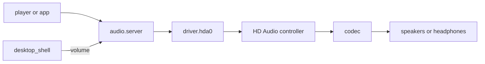

# Audio: Intel HD Audio

What plays sound in NONOS 0.9.2: the HD Audio driver, the audio server above it, the volume keys, and the machines it cannot play on, with the reason.

## What plays

- One output stream, 48 kHz, 16-bit, stereo (`PLAYBACK`, `userland/capsule_driver_hda/src/controller/codec/format.rs:59-62`).
- Through the analog speaker, headphone and line-out pins the codec's pin configuration names, speakers first, up to six that have a path to a converter (`plan`, `userland/capsule_driver_hda/src/controller/codec/plan.rs:80-126`; `MAX_OUTPUTS`, `userland/capsule_driver_hda/src/controller/codec/plan.rs:32`).
- The headphone jack is read twice a second. With headphones in, the speakers are switched off; when they come out, the speakers come back (`POLL_MS`, `userland/capsule_driver_hda/src/server/runner/jack_poll.rs:29`).
- One master volume from 0 to 100 with a mute switch, which the volume keys step.

Nothing plays at boot. The ring starts silent and the codec's outputs stay muted until a player opens a stream (`RING_BYTES`, `userland/capsule_driver_hda/src/setup/sequence.rs:136-144`).

## The path of a sound

A player or app never talks to the driver. It opens a stream on `audio.server`, the audio server [capsule](../overview/glossary.md#capsule) `capsule_audio`, which mixes every stream in 1024-frame periods, about 21 ms each, and offers the driver up to three periods a pass, holding one back while the driver's queue is full (`PERIOD_FRAMES`, `userland/capsule_audio/src/server/pump.rs:25-27`). It takes four streams at once, at most two from one client (`MAX_STREAMS`, `userland/capsule_audio/src/server/streams.rs:19-21`).

Only `audio.server` may send to `driver.hda0` (`HELD`, `src/services/registry/held_table.rs:20-35`). The driver takes PCM in pieces of at most 4096 bytes (`MAX_PCM_CHUNK`, `userland/capsule_driver_hda/src/protocol/limits.rs:18`) into a 64 KiB queue (`QUEUE_BYTES`, `userland/capsule_driver_hda/src/audio/queue.rs:20`), and copies it into a ring of four 8 KiB periods that the controller plays by DMA (`PERIOD_BYTES`, `userland/capsule_driver_hda/src/controller/bdl.rs:17-19`).

## Controllers

The driver takes a PCI function of class 0x04 with subclass 0x03, from any vendor, and Intel's subclass 0x01, which Intel controllers from Skylake on report while their audio DSP is enabled (`hda_controller`, `userland/capsule_driver_hda/src/controller/intel.rs:65-67`). It needs a memory BAR0 of at least 4 KiB (`HDA_BAR_MIN_SIZE`, `userland/capsule_driver_hda/src/constants/pci.rs:19`) and never takes an Intel SST engine (`is_candidate`, `userland/capsule_driver_hda/src/discover/candidate.rs:28-38`).

- Chipset controllers are tried before graphics ones, up to four in all (`MAX_CONTROLLERS`, `userland/capsule_driver_hda/src/discover/machine.rs:21`).
- A controller from ATI or AMD graphics (1002), NVIDIA (10de) or an Intel discrete card (8086:490d, 4f90, 4f91, 4f92, e2f7) carries HDMI only (`graphics_audio`, `userland/capsule_driver_hda/src/controller/intel.rs:70-74`).
- On the Intel Skylake-family ids in `SKL_FAMILY`, a link left on the 6 MHz clock after reset is moved to a faster one, as Linux does (`init_link_clock`, `userland/capsule_driver_hda/src/controller/intel.rs:139-161`), and Apollo Lake (8086:5a98) alone gets its DMA latency lowered (`reduce_dma_latency`, `userland/capsule_driver_hda/src/controller/intel.rs:89-97`).
- Intel controllers report the playback position in a DMA position buffer; every other vendor is read by LPIB (`position_buffer`, `userland/capsule_driver_hda/src/controller/intel.rs:84-86`).
- The interrupt is MSI-X if the broker grants it, else MSI, else the legacy line when firmware routed one, else the driver runs polled (`bind`, `userland/capsule_driver_hda/src/setup/irq.rs:28-47`).
- The PCI configuration writes Linux makes on Intel and AMD are tried; one the broker refuses is logged as `[HDA] pci ... not written` and passed over (`prepare`, `userland/capsule_driver_hda/src/setup/pci.rs:63-74`).

## Codecs

Every codec that answers is walked: its widgets, pin configurations, connection lists and amplifiers. A codec with speakers is preferred to one with only jacks, and a codec whose walk fails is skipped (`choose`, `userland/capsule_driver_hda/src/setup/choose.rs:41-73`). The walk is generic, so a codec from any vendor plays when it has an analog output with a path to a converter.

Realtek codecs get the coefficient writes Linux applies to every codec of a type before EAPD can power the amplifier (`eapd_coef`, `userland/capsule_driver_hda/src/controller/codec/realtek.rs:61-104`). The ones numbered from 215 to 300 are the ALC215, 222, 225, 230, 233, 234, 235, 236, 245, 255, 256, 257, 262, 267, 268, 269 (three of its variants), 272, 273, 274, 275, 280, 282 to 290, 292 to 295, 298, 299 and 300. The same function also lists older and newer parts. The ALC230, 235, 236, 255, 256 and 257, and the codec 19e5:8326, also get Linux's `alc256_init` for the headphone amplifier (`uses_alc256_init`, `userland/capsule_driver_hda/src/controller/codec/realtek.rs:108-113`).

The headphone pin is sensed with GET_PIN_SENSE. With headphones in, a speaker pin is disabled and the headphone and line-out pins stay on (`pin_ctl`, `userland/capsule_driver_hda/src/controller/codec/jack.rs:39-45`).

## Volume and the volume keys

1. A laptop whose Fn volume keys reach the PS/2 driver as E0 20, E0 2E and E0 30 gets them posted as Mute, Volume Down and Volume Up (`KEYCODE_MUTE`, `userland/capsule_driver_ps2_input/src/keymap/set1_e0.rs:28-30`). Mute acts once per press. A USB keyboard's Mute, Volume Up and Volume Down usages, 0x7F, 0x80 and 0x81, post the same codes (`KEYCODE_VOLUME_UP`, `userland/capsule_driver_usb_hid/src/hid/usage_keycode/map.rs:61-63`).
2. The input router sends these keys to `desktop_shell` whatever window has focus (`is_shell_key`, `userland/capsule_input_router/src/route/shell_keys.rs:32-34`).
3. The shell steps the level by 5 out of 100. Up and Down stop at the ends and also unmute; Mute flips the mute switch (`after_key`, `userland/capsule_desktop_shell/src/state/volume.rs:55-67`).
4. The shell sends `OP_SET_VOLUME` with the level and the mute switch (`userland/audio_proto/src/volume.rs:36-38`).
5. The audio server applies a gain of the level squared, so 50 is about 12 dB down and 0 is silence (`gain`, `userland/capsule_audio/src/volume.rs:37-45`).

The shell shows a notice: "Volume 45%", "Muted", or "No sound output" with the reason (`notice`, `userland/capsule_desktop_shell/src/state/volume.rs:99-116`).

## Machines that cannot play

A machine whose audio the driver cannot play on is not an error. The driver gives every claim back and stays only to say why (`run_status`, `userland/capsule_driver_hda/src/server/runner/status.rs:40-65`). A machine with no audio hardware at all is different: there the driver exits with status 2 and `driver.hda0` is not served (`start`, `userland/capsule_driver_hda/src/start.rs:39-68`). For codes 1 to 6 below the audio server refuses a new stream with `E_NODEV`; for code 7 it still opens one (`OP_STREAM_OPEN`, `userland/capsule_audio/src/server/dispatch.rs:51-59`). Settings and the player show the sentence for the code (`MESSAGES`, `userland/audio_proto/src/output.rs:49-58`):

| Code | Case | What the person reads |
|---|---|---|
| 0 | plays | Sound plays through this computer's speakers and headphone jack |
| 1 | no `driver.hda0` service for the server to send to | No sound hardware was found on this computer |
| 2 | Intel DSP machine | This laptop's audio needs Intel's DSP firmware (SOF), which NONOS does not support |
| 3 | controller with no codec | The sound controller answered, but no sound chip (codec) is connected to it |
| 4 | HDMI or DisplayPort codecs only | Only HDMI or DisplayPort audio was found; NONOS plays through speakers, headphones and line out only |
| 5 | codec with no output the driver can route | The sound chip has no speaker, headphone or line output NONOS can drive |
| 6 | AMD audio coprocessor | This computer's audio runs through AMD's audio coprocessor (ACP), which NONOS does not support |
| 7 | driver not answering | The sound driver is not answering |

## Intel SST and SOF are not supported

On some Intel laptops the speakers and microphones hang off Intel's audio DSP over I2S or SoundWire instead of an HD Audio codec. Linux runs those machines with Sound Open Firmware: firmware loaded into the DSP, a topology for the board, and a driver for the codec on that bus. NONOS 0.9.2 has none of these. The HD Audio driver plays only through a codec on the HD Audio link, and there is no DSP driver in the tree.

What the driver does on such a machine:

- An Intel SST engine, the Haswell and Broadwell ULT audio DSP (8086:9c36, 9cb6) or the Atom LPE engine (8086:0f28, 22a8, 119a), is never run as an HD Audio controller, since its registers are the DSP's and not HD Audio's (`intel_sst`, `userland/capsule_driver_hda/src/controller/sst.rs:33-37`). Its presence is logged as `[HDA] intel sst dsp 8086:<id> found, needs SOF` and sets the verdict to code 2 (`start`, `userland/capsule_driver_hda/src/start.rs:39-48`).
- An Intel controller that can route audio through a DSP (`dsp_capable`, `userland/capsule_driver_hda/src/controller/intel.rs:58-60`) and whose link has no codec, or only the display's HDMI codec, is judged to need SOF, code 2 (`judge`, `userland/capsule_driver_hda/src/controller/verdict.rs:53-64`).
- An AMD audio coprocessor, vendor 1022 with class 0x04 and subclass 0x80, is the same case for AMD and gives code 6 (`amd_acp`, `userland/capsule_driver_hda/src/controller/intel.rs:77-79`).

A DSP-capable Intel controller that does have an analog codec plays through it as plain HD Audio.

## Not supported

- Recording. The driver opens no input stream, so no microphone is read (`output_descriptor`, `userland/capsule_driver_hda/src/setup/sequence.rs:214-225`).
- HDMI and DisplayPort audio.
- More than one output stream at the controller; the audio server mixes before the driver.
- Any rate or format other than 48 kHz, 16-bit stereo at the controller.
- Intel SOF and AMD ACP, as above.

## Authority and privacy

- `driver.hda0` holds IPC, Memory, Driver, DeviceEnum, Mmio, Irq and Dma, and Debug only in a build with `capsule-serial-debug` (`CAPSULE_OPTIONAL_CAPS`, `userland/capsule_driver_hda/Capsule.mk:18-21`).
- `audio.server` holds IPC and Memory only, with the same optional Debug (`CAPSULE_REQUIRED_CAPS`, `userland/capsule_audio/Capsule.mk:16-19`). It owns no hardware.
- No sample and no stream state is stored. PCM lives in the queue and the DMA ring only while it plays.

## Log lines

With Debug granted the driver writes `[HDA]` lines and the server `[AUDIO]` lines. The Standard image grants it; the Hardened and Air-Gapped images drop the feature, so their capsules write nothing to the console (`debugFeatures`, `tools/nix/config.nix:84-92`). In the NONOS Terminal, `log hda audio` shows them. The useful ones: `[HDA] controller` with the PCI id, `[HDA] codecs mask=`, `[HDA] path` for each output pin, `[HDA] ready: outputs muted, no stream until a player opens one`, `[HDA] headphones in, speakers off`, and `[HDA] no playable output:` with the reason. [Reporting a machine](../hardware/report.md) says what to send.
