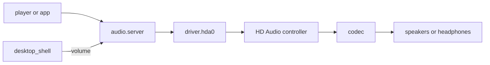

# Audio: Intel HD Audio

What plays sound in NONOS 0.9.2: the HD Audio driver, the audio server above it, the volume keys, and the machines it cannot play on, with the reason.

## What plays

- One output stream, 48 kHz, 16-bit, stereo (`PLAYBACK`, `userland/capsule_driver_hda/src/controller/codec/format.rs:59-62`).
- Through the analog speaker, headphone and line-out pins the codec's pin configuration names, speakers first, up to six that have a path to a converter (`plan`, `userland/capsule_driver_hda/src/controller/codec/plan.rs:80-126`; `MAX_OUTPUTS`, `userland/capsule_driver_hda/src/controller/codec/plan.rs:32`).
- The headphone jack is read twice a second. With headphones in, the speakers are switched off; when they come out, the speakers come back (`POLL_MS`, `userland/capsule_driver_hda/src/server/runner/jack_poll.rs:29`).
- One master volume from 0 to 100 with a mute switch, which the volume keys step.

Nothing plays at boot. The ring starts silent and the codec's outputs stay muted until a player opens a stream (`RING_BYTES`, `userland/capsule_driver_hda/src/setup/sequence.rs:136-144`).

## The path of a sound

A player or app never talks to the driver. It opens a stream on `audio.server`, the audio server [capsule](../overview/glossary.md#capsule) `capsule_audio`, which mixes every stream in 1024-frame periods, about 21 ms each, and offers the driver up to three periods a pass, holding one back while the driver's queue is full (`PERIOD_FRAMES`, `userland/capsule_audio/src/server/pump.rs:25-27`). It takes four streams at once, at most two from one client (`MAX_STREAMS`, `userland/capsule_audio/src/server/streams.rs:19-21`).

Only `audio.server` may send to `driver.hda0` (`HELD`, `src/services/registry/held_table.rs:20-35`). The driver takes PCM in pieces of at most 4096 bytes (`MAX_PCM_CHUNK`, `userland/capsule_driver_hda/src/protocol/limits.rs:18`) into a 64 KiB queue (`QUEUE_BYTES`, `userland/capsule_driver_hda/src/audio/queue.rs:20`), and copies it into a ring of four 8 KiB periods that the controller plays by DMA (`PERIOD_BYTES`, `userland/capsule_driver_hda/src/controller/bdl.rs:17-19`).

## Controllers

The driver takes a PCI function of class 0x04 with subclass 0x03, from any vendor, and Intel's subclass 0x01, which Intel controllers from Skylake on report while their audio DSP is enabled (`hda_controller`, `userland/capsule_driver_hda/src/controller/intel.rs:65-67`). It needs a memory BAR0 of at least 4 KiB (`HDA_BAR_MIN_SIZE`, `userland/capsule_driver_hda/src/constants/pci.rs:19`) and never takes an Intel SST engine (`is_candidate`, `userland/capsule_driver_hda/src/discover/candidate.rs:28-38`).

- Chipset controllers are tried before graphics ones, up to four in all (`MAX_CONTROLLERS`, `userland/capsule_driver_hda/src/discover/machine.rs:21`).
- A controller from ATI or AMD graphics (1002), NVIDIA (10de) or an Intel discrete card (8086:490d, 4f90, 4f91, 4f92, e2f7) carries HDMI only (`graphics_audio`, `userland/capsule_driver_hda/src/controller/intel.rs:70-74`).
- On the Intel Skylake-family ids in `SKL_FAMILY`, a link left on the 6 MHz clock after reset is moved to a faster one, as Linux does (`init_link_clock`, `userland/capsule_driver_hda/src/controller/intel.rs:139-161`), and Apollo Lake (8086:5a98) alone gets its DMA latency lowered (`reduce_dma_latency`, `userland/capsule_driver_hda/src/controller/intel.rs:89-97`).
- Intel controllers report the playback position in a DMA position buffer; every other vendor is read by LPIB (`position_buffer`, `userland/capsule_driver_hda/src/controller/intel.rs:84-86`).
- The interrupt is MSI-X if the broker grants it, else MSI, else the legacy line when firmware routed one, else the driver runs polled (`bind`, `userland/capsule_driver_hda/src/setup/irq.rs:28-47`).
- The PCI configuration writes Linux makes on Intel and AMD are tried; one the broker refuses is logged as `[HDA] pci ... not written` and passed over (`prepare`, `userland/capsule_driver_hda/src/setup/pci.rs:63-74`).

## Codecs

Every codec that answers is walked: its widgets, pin configurations, connection lists and amplifiers. A codec with speakers is preferred to one with only jacks, and a codec whose walk fails is skipped (`choose`, `userland/capsule_driver_hda/src/setup/choose.rs:41-73`). The walk is generic, so a codec from any vendor plays when it has an analog output with a path to a converter.

Realtek codecs get the coefficient writes Linux applies to every codec of a type before EAPD can power the amplifier (`eapd_coef`, `userland/capsule_driver_hda/src/controller/codec/realtek.rs:61-104`). The ones numbered from 215 to 300 are the ALC215, 222, 225, 230, 233, 234, 235, 236, 245, 255, 256, 257, 262, 267, 268, 269 (three of its variants), 272, 273, 274, 275, 280, 282 to 290, 292 to 295, 298, 299 and 300. The same function also lists older and newer parts. The ALC230, 235, 236, 255, 256 and 257, and the codec 19e5:8326, also get Linux's `alc256_init` for the headphone amplifier (`uses_alc256_init`, `userland/capsule_driver_hda/src/controller/codec/realtek.rs:108-113`).

The headphone pin is sensed with GET_PIN_SENSE. With headphones in, a speaker pin is disabled and the headphone and line-out pins stay on (`pin_ctl`, `userland/capsule_driver_hda/src/controller/codec/jack.rs:39-45`).
