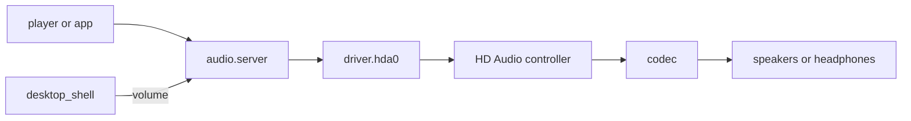

# Audio: Intel HD Audio

What plays sound in NONOS 0.9.2: the HD Audio driver, the audio server above it, the volume keys, and the machines it cannot play on, with the reason.

## What plays

- One output stream, 48 kHz, 16-bit, stereo (`PLAYBACK`, `userland/capsule_driver_hda/src/controller/codec/format.rs:59-62`).
- Through the analog speaker, headphone and line-out pins the codec's pin configuration names, speakers first, up to six that have a path to a converter (`plan`, `userland/capsule_driver_hda/src/controller/codec/plan.rs:80-126`; `MAX_OUTPUTS`, `userland/capsule_driver_hda/src/controller/codec/plan.rs:32`).
- The headphone jack is read twice a second. With headphones in, the speakers are switched off; when they come out, the speakers come back (`POLL_MS`, `userland/capsule_driver_hda/src/server/runner/jack_poll.rs:29`).
- One master volume from 0 to 100 with a mute switch, which the volume keys step.

Nothing plays at boot. The ring starts silent and the codec's outputs stay muted until a player opens a stream (`RING_BYTES`, `userland/capsule_driver_hda/src/setup/sequence.rs:136-144`).

## The path of a sound

A player or app never talks to the driver. It opens a stream on `audio.server`, the audio server [capsule](../overview/glossary.md#capsule) `capsule_audio`, which mixes every stream in 1024-frame periods, about 21 ms each, and offers the driver up to three periods a pass, holding one back while the driver's queue is full (`PERIOD_FRAMES`, `userland/capsule_audio/src/server/pump.rs:25-27`). It takes four streams at once, at most two from one client (`MAX_STREAMS`, `userland/capsule_audio/src/server/streams.rs:19-21`).

Only `audio.server` may send to `driver.hda0` (`HELD`, `src/services/registry/held_table.rs:20-35`). The driver takes PCM in pieces of at most 4096 bytes (`MAX_PCM_CHUNK`, `userland/capsule_driver_hda/src/protocol/limits.rs:18`) into a 64 KiB queue (`QUEUE_BYTES`, `userland/capsule_driver_hda/src/audio/queue.rs:20`), and copies it into a ring of four 8 KiB periods that the controller plays by DMA (`PERIOD_BYTES`, `userland/capsule_driver_hda/src/controller/bdl.rs:17-19`).
