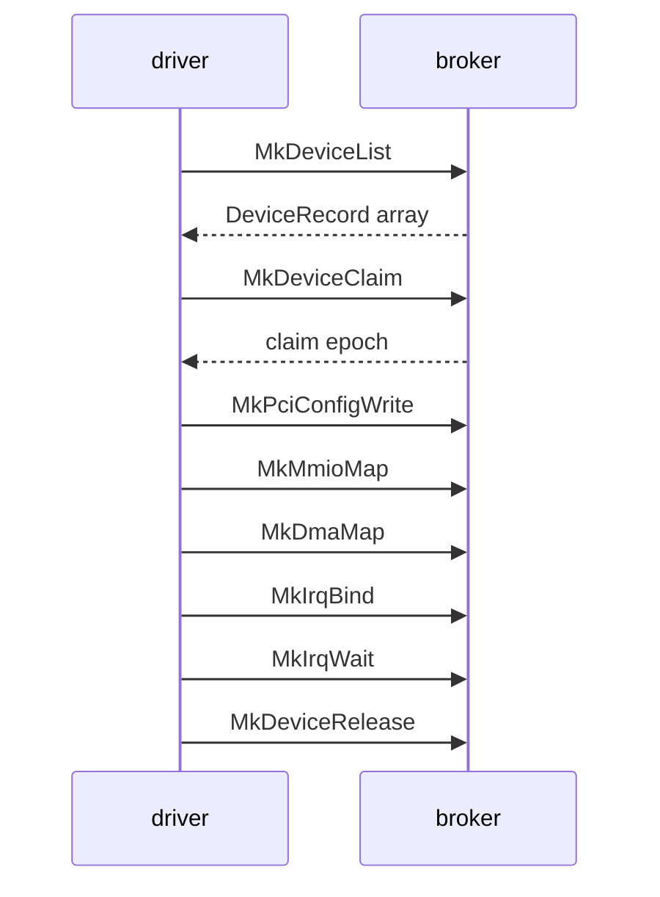

# Broker API

The calls a [driver capsule](../overview/glossary.md#driver-capsule) makes to find a device, claim it, map its registers, get DMA memory, take its interrupts and let it go, with what the kernel checks at each step.

## Where the calls live

A driver calls the [hardware broker](../overview/glossary.md#hardware-broker) through `nonos_libc`, the crate in `userland/libc` that every driver depends on (`userland/capsule_driver_virtio_rng/Cargo.toml:22`). The wrappers are in `userland/libc/src/broker/`, re-exported as `mk_device_list`, `mk_mmio_map` and the rest (`userland/libc/src/broker/mod.rs:29-51`). Each makes one system call whose number is four ASCII letters read as a little-endian integer by `tag4`, such as `N_MK_DEVICE_LIST` for `MDLS` (`userland/libc/src/syscall/numbers/broker.rs:18-33`, `src/syscall/abi/tag.rs:20-22`).

`nonos_abi`, the bottom of the native runtime, carries no broker numbers (`userland/nonos_abi/README.md`). The crates in `userland/sdk` are for applications and `userland/platform` is a host-side packaging tool, so a driver uses neither. `nonos_devmodel` runs only on the host, where it gives a proof crate a register window in memory (`userland/nonos_devmodel/README.md`); [writing-a-driver.md](writing-a-driver.md) shows it in use.

On the kernel side every call first passes the contract table, which checks the capability before any handler runs, for example `can_driver` for `MkDeviceClaim` (`src/syscall/contract/cap_table/mk.rs:123-136`). A handler in `src/syscall/microkernel/` then turns the arguments into a request to `src/hardware/broker`. The register-level tables of numbers, arguments and return values are in [../abi/broker.md](../abi/broker.md).

A typical driver makes the calls in the order above: list, claim, turn on the PCI command bits it needs, map registers, take DMA memory, bind an interrupt, wait on it while serving, and release.

## Capabilities

Each call needs one bit of the driver's [capability word](../overview/glossary.md#capability-word), from `DeviceEnum` to `Pio` (`src/capabilities/types/defs.rs:39-50`). The contract table maps each call to its bit, starting with `MkDeviceList` (`src/syscall/contract/cap_table/mk.rs:123-136`):

| Bit | Name | Calls it admits |
|---|---|---|
| 15 | `DeviceEnum` | `MkDeviceList` |
| 16 | `Driver` | `MkDeviceClaim`, `MkDeviceRelease`, `MkPciConfigRead`, `MkPciConfigWrite` |
| 17 | `Mmio` | `MkMmioMap`, `MkMmioUnmap` |
| 18 | `Irq` | `MkIrqBind`, `MkIrqUnbind`, `MkIrqAck`, `MkIrqPoll`, `MkIrqWait` |
| 19 | `Dma` | `MkDmaMap`, `MkDmaUnmap` |
| 20 | `Pio` | `MkPioGrant`, `MkPioRead`, `MkPioWrite`, `MkPioRelease` |

Every one of these checks also passes for a holder of `Admin`, as `can_driver` and its siblings show (`src/capabilities/token/types/authority_broker.rs:24-55`). A driver also holds `IPC` (bit 3) to serve and `Memory` (bit 4) to allocate (`src/capabilities/types/defs.rs:26-27`). Holding `Irq` lets a capsule post input events too, because `can_input_source` accepts it (`src/capabilities/token/types/authority_broker.rs:59-63`).
