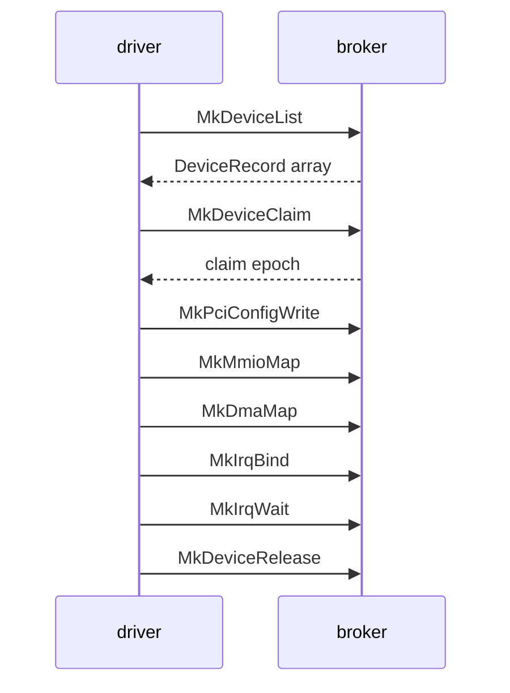

# Broker API

The calls a [driver capsule](../overview/glossary.md#driver-capsule) makes to find a device, claim it, map its registers, get DMA memory, take its interrupts and let it go, with what the kernel checks at each step.

## Where the calls live

A driver calls the [hardware broker](../overview/glossary.md#hardware-broker) through `nonos_libc`, the crate in `userland/libc` that every driver depends on (`userland/capsule_driver_virtio_rng/Cargo.toml:22`). The wrappers are in `userland/libc/src/broker/`, re-exported as `mk_device_list`, `mk_mmio_map` and the rest (`userland/libc/src/broker/mod.rs:29-51`). Each makes one system call whose number is four ASCII letters read as a little-endian integer by `tag4`, such as `N_MK_DEVICE_LIST` for `MDLS` (`userland/libc/src/syscall/numbers/broker.rs:18-33`, `src/syscall/abi/tag.rs:20-22`).

`nonos_abi`, the bottom of the native runtime, carries no broker numbers (`userland/nonos_abi/README.md`). The crates in `userland/sdk` are for applications and `userland/platform` is a host-side packaging tool, so a driver uses neither. `nonos_devmodel` runs only on the host, where it gives a proof crate a register window in memory (`userland/nonos_devmodel/README.md`); [writing-a-driver.md](writing-a-driver.md) shows it in use.

On the kernel side every call first passes the contract table, which checks the capability before any handler runs, for example `can_driver` for `MkDeviceClaim` (`src/syscall/contract/cap_table/mk.rs:123-136`). A handler in `src/syscall/microkernel/` then turns the arguments into a request to `src/hardware/broker`. The register-level tables of numbers, arguments and return values are in [../abi/broker.md](../abi/broker.md).

A typical driver makes the calls in the order above: list, claim, turn on the PCI command bits it needs, map registers, take DMA memory, bind an interrupt, wait on it while serving, and release.

## Capabilities

Each call needs one bit of the driver's [capability word](../overview/glossary.md#capability-word), from `DeviceEnum` to `Pio` (`src/capabilities/types/defs.rs:39-50`). The contract table maps each call to its bit, starting with `MkDeviceList` (`src/syscall/contract/cap_table/mk.rs:123-136`):

| Bit | Name | Calls it admits |
|---|---|---|
| 15 | `DeviceEnum` | `MkDeviceList` |
| 16 | `Driver` | `MkDeviceClaim`, `MkDeviceRelease`, `MkPciConfigRead`, `MkPciConfigWrite` |
| 17 | `Mmio` | `MkMmioMap`, `MkMmioUnmap` |
| 18 | `Irq` | `MkIrqBind`, `MkIrqUnbind`, `MkIrqAck`, `MkIrqPoll`, `MkIrqWait` |
| 19 | `Dma` | `MkDmaMap`, `MkDmaUnmap` |
| 20 | `Pio` | `MkPioGrant`, `MkPioRead`, `MkPioWrite`, `MkPioRelease` |

Every one of these checks also passes for a holder of `Admin`, as `can_driver` and its siblings show (`src/capabilities/token/types/authority_broker.rs:24-55`). A driver also holds `IPC` (bit 3) to serve and `Memory` (bit 4) to allocate (`src/capabilities/types/defs.rs:26-27`). Holding `Irq` lets a capsule post input events too, because `can_input_source` accepts it (`src/capabilities/token/types/authority_broker.rs:59-63`).

## The device record

`MkDeviceList` copies out `DeviceRecord` entries of 176 bytes, a size `DeviceRecord` asserts at compile time (`src/hardware/broker/device/record.rs:21-61`):

| Field | Type | Meaning |
|---|---|---|
| `device_id` | u64 | broker id, used by every later call |
| `bus_kind` | u8 | 1 PCI, 2 ACPI, 3 virtual |
| `pci_class`, `pci_subclass`, `pci_progif` | u8 | the raw PCI class code |
| `class` | u32 | the broker class id below |
| `vendor`, `device` | u16 | PCI ids, or PNP-style ids for a platform record |
| `flags` | u32 | `DEVICE_FLAG_CLAIMED`, `DEVICE_FLAG_DISABLED` |
| `bar_count` | u8 | one past the last present BAR |
| `irq_line`, `irq_pin` | u8 | legacy line (0xFF for none) and pin |
| `irq_source` | u32 | the line to pass to `MkIrqBind` for INTx |
| `bars` | 6 `Bar` | 24 bytes each: base, size, aux, kind, flags |

A `Bar` has kind 1 for memory and 2 for port I/O, and `aux` carries the DesignWare source clock of an ACPI I2C controller, zero otherwise (`src/hardware/broker/device/bar.rs:17-49`). `DEVICE_FLAG_CLAIMED` and `DEVICE_FLAG_DISABLED` are defined but nothing sets them, so the list never shows a device as claimed (`src/hardware/broker/device/flags.rs:19-20`).

`classify_pci` turns the PCI class into the broker class (`src/hardware/broker/class.rs:57-84`):

| Class id | Name | Source |
|---|---|---|
| 0x0001 | RNG | no PCI rule |
| 0x0010 | BLOCK | PCI class 0x01, and an SD host controller (0x08, 0x05) |
| 0x0020 | NETWORK | class 0x02 |
| 0x0030 | DISPLAY | class 0x03 |
| 0x0040 | INPUT | class 0x09, and the PS/2 records |
| 0x0041 | I2C_HID | ACPI-declared touchpads |
| 0x0050 | AUDIO | class 0x04, subclass 0x01 or 0x03 |
| 0x0060 | SERIAL | class 0x07 subclass 0x00, and ACPI I2C controllers |
| 0x0070 | USB_HOST | class 0x0C subclass 0x03 |
| 0x0071 | USB_HOST_XHCI | the same with prog-if 0x30 |
| 0x0080 | GPIO_CTRL | ACPI GPIO controllers |
| 0xFFFF | OTHER | everything else |

## List and claim

`mk_device_list(class, buf, count)` asks for one class, or every record with class 0, through `list_by_class` (`src/hardware/broker/table/list.rs:29-34`). `sys_device_list` returns the number of records when `count` is 0 and copies at most `count` records otherwise (`src/syscall/microkernel/device.rs:40-65`). Most drivers in the tree pass a buffer of 128 records, as virtio-rng's `MAX_DEVICES` does; the device list holds ACPI and fabricated records as well as PCI functions (`userland/capsule_driver_virtio_rng/src/discover/find.rs:22-24`).

`mk_device_claim(device_id)` returns the [claim epoch](../overview/glossary.md#claim-epoch) or a negative errno, and `sys_device_claim` answers -19 for an unknown device, -16 when another process holds it and -1 when the device cannot be confined (`src/syscall/microkernel/device.rs:67-82`). The broker's `claim` does four things in order (`src/hardware/broker/claim/claim.rs:23-45`):

1. It refuses a device someone already holds and records the caller with a fresh epoch.
2. It attaches a PCI device to the caller's own [IOMMU domain](../overview/glossary.md#iommu-domain) through `attach`, which gives a record with no PCI address, such as the PS/2 or an ACPI I2C record, no domain (`src/hardware/broker/confine/attach.rs:30-101`).
3. It brings a PCI function to power state D0 with `power_on_device`, because firmware may leave an LPSS function in D3 with its registers dead (`src/hardware/broker/power.rs:20-30`).
4. It clears Enable No Snoop in the PCIe Device Control register with `snoop_every_request`, so every DMA request snoops the CPU caches, and logs whether the bit stayed off (`src/hardware/broker/claim/no_snoop.rs:33-52`).

When no remapping unit is in service, the device cannot be confined. `unconfined_allowed` lets the claim through only for the four errors that mean no unit is in service, and `attach` logs `unconfined: no remapping unit in service, reaches all memory` (`src/hardware/broker/confine/posture.rs:32-49`). That is the case on a machine without VT-d, and on an AMD-Vi machine with the default build (see [platform.md](platform.md)). Any other attach failure refuses the claim.

Every later call on the device carries the epoch, and calls on a grant name the grant id. A call with an old epoch fails with -116, `ERRNO_STALE` (`src/syscall/microkernel/errnos.rs:54`).

## Configuration space

`mk_pci_config_read(device_id, epoch, offset, width)` returns the value read. The broker's `read` accepts widths 1, 2 and 4, aligned, inside the first `CONFIG_LIMIT` (256) bytes (`src/hardware/broker/pci/read.rs:22-48`).

`mk_pci_config_write(device_id, epoch, offset, value)` writes 16 bits, and very few of them. `validate` accepts the Command register, the MSI-X Message Control register and a short list of vendor bits, and refuses every other offset (`src/hardware/broker/pci/allowlist.rs:37-60`):

- In Command, `COMMAND_WRITABLE` is Bus Master, Memory Space and Interrupt Disable (`src/hardware/broker/pci/command.rs:33`). `validate_command` ORs a value made only of those bits into the register, and otherwise requires the new value to match the register outside them (`src/hardware/broker/pci/command.rs:35-41`).
- In MSI-X Message Control, `MSIX_CONTROL_WRITABLE` is Enable and Function Mask (`src/hardware/broker/pci/allowlist.rs:35`).
- `writable` adds a few vendor bits: on Intel HD Audio, TCSEL at 0x44, the clock-gating bit at 0x48 and the no-snoop bit at 0x78; on AMD and ATI HD Audio, the snoop bits at 0x42; on any network function, the PCIe completion timeout bits (`src/hardware/broker/pci/quirk_bits.rs:49-61`).

The constants a driver passes are `MK_PCI_CFG_COMMAND` (0x04), `MK_PCI_CMD_MEMORY_SPACE` (bit 1), `MK_PCI_CMD_BUS_MASTER` (bit 2), `MK_PCI_CMD_INTX_DISABLE` (bit 10), `MK_PCI_MSIX_CTRL_FUNCTION_MASK` (bit 14) and `MK_PCI_MSIX_CTRL_ENABLE` (bit 15) (`userland/libc/src/broker/pci.rs:27-36`).

## Registers

The call is `mk_mmio_map(device_id, epoch, bar_index, flags, offset, length, out)`, and `mk_mmio_map` packs the BAR index into the top half of one argument (`userland/libc/src/broker/mmio.rs:24-36`). `flags` must be 0, since `FLAGS_KNOWN` is empty (`src/hardware/broker/mmio/map.rs:47-53`). `map_for_caller` then checks the claim and epoch, that the BAR is a memory BAR within `bar_count`, and that the request fits the BAR. It maps the pages into the capsule as user, read-write, uncached and no-execute, and `map_for_caller` records the [grant](../overview/glossary.md#grant) last (`src/hardware/broker/mmio/map.rs:49-112`). The offset and length need not be page aligned: the returned `user_va` already carries the offset into its first page (`src/hardware/broker/mmio/map.rs:30-35`).

No mapping ever covers an MSI-X table or pending-bit array, of any device. The mapping is cut short at the page below the first `protected` page, and a request that starts in one is refused with -1, `WouldExposeMsixTable` (`src/hardware/broker/mmio/window.rs:32-37`, `src/syscall/microkernel/mmio/errno_map.rs:33`). `mk_mmio_unmap(grant_id)` gives a grant back.

Grants land in two windows of every capsule's address space: `USER_MMIO_BASE` to `USER_MMIO_END` for registers and `USER_DMA_BASE` to `USER_DMA_END` for DMA buffers (`src/hardware/broker/windows.rs:31-34`). `MkMunmap` and a fixed-address `MkMmap` refuse any range that `touches_device_window`, so a generic unmap cannot hand a frame the device still reaches back to the allocator (`src/syscall/microkernel/memory/munmap.rs:43`, `src/syscall/microkernel/memory/mmap.rs:35`).

Port I/O exists only on x86_64; other targets build `pio_absent` and the calls fail with ENOSYS (`src/hardware/broker/mod.rs:39-45`). `mk_pio_grant(device_id, epoch, bar_index, flags, out)` grants a whole port BAR, and `grant_for_caller` refuses a BAR that is not a port BAR, has size zero or runs past port 0xFFFF (`src/hardware/broker/pio/map.rs:32-78`). `mk_pio_read` and `mk_pio_write` name the grant, an offset and a width of 1, 2 or 4 bytes, `PioWidth` (`src/hardware/broker/pio/types.rs:39-53`); the kernel runs the `in` or `out`.

## DMA memory

`mk_dma_map(device_id, epoch, length, flags, out)` returns a buffer the device may read and write; `mk_dma_map` is the wrapper (`userland/libc/src/broker/dma.rs:40-49`). The flags are `MK_DMA_MAP_HIGH` (bit 0), `MK_DMA_MAP_DMA32` (bit 1, frames below 4 GiB or fail), `MK_DMA_MAP_COHERENT` (bit 2, mapped uncached, for rings both sides write) and `MK_DMA_MAP_WC` (bit 3, write-combining where the PAT has the entry) (`userland/libc/src/broker/dma.rs:22-38`). `validate` refuses HIGH with DMA32, COHERENT with WC, and a length that is zero or not a multiple of 4096 (`src/hardware/broker/dma/map/validate.rs:32-45`).

One grant may not exceed the page ceiling of the device's class, from `dma_page_limit_for_class` (`src/hardware/broker/dma/limits.rs:27-47`):

| Class | Pages per grant |
|---|---|
| RNG, INPUT, SERIAL | 1 |
| AUDIO | 16 |
| NETWORK | 64 |
| USB_HOST, USB_HOST_XHCI | 256 |
| BLOCK | 1024 |
| DISPLAY | 8192 |
| any other class | 16 |

`map_for_caller` validates, allocates and zeroes the frames, maps them into the caller, maps them into the device's domain and records the grant, undoing each step on failure (`src/hardware/broker/dma/map/transaction.rs:26-66`). The 32-byte `DmaMapOut` returns `user_va`, `device_addr`, `length` and `grant_id` (`src/syscall/microkernel/dma.rs:43-52`). With a domain, `device_addr` is an IOVA placed from `IOVA_BASE` (1 MiB) up, below 4 GiB, stepping over the interrupt window from 0xFEE0_0000 to 0xFEF0_0000 (`src/hardware/broker/confine/iova_space.rs:31-37`). Without one, it is the physical address. A DMA32 map whose address would end above 4 GiB fails with -34, `ERRNO_RANGE` (`src/syscall/microkernel/dma.rs:109-111`).

`mk_dma_unmap(grant_id)` gives a buffer back. `teardown` unmaps it from the driver, then takes it out of the device's domain before the frames go anywhere. If the domain will not let go, the frames are quarantined and never reused; otherwise `scrub` zeroes them before they are freed (`src/hardware/broker/dma/teardown.rs:26-46`). For a write-back buffer on x86_64, `mk_dma_sync_for_device` and `mk_dma_sync_for_cpu` flush the cache lines without a system call (`userland/libc/src/broker/dma_sync.rs:27-48`).
