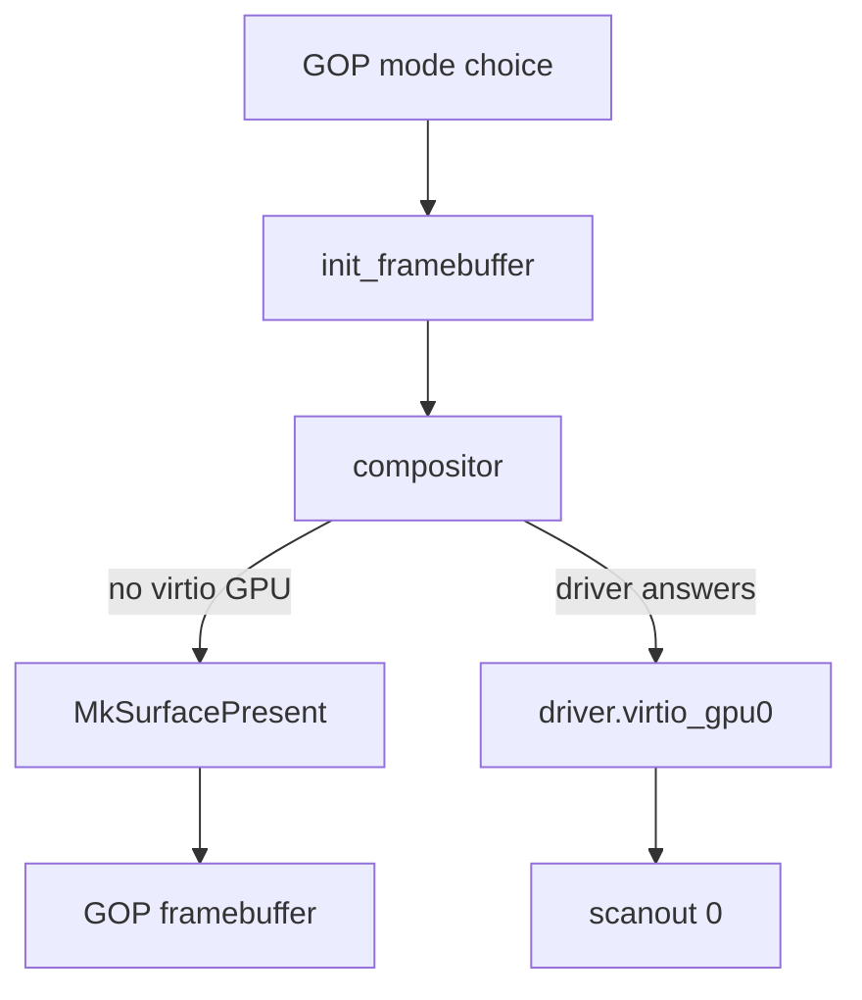

# Display

How NONOS puts the desktop on a screen: through the UEFI GOP framebuffer on any machine, through virtio-gpu in a virtual machine, and what it cannot drive.

## Three paths

| Path | Code | Used when |
|---|---|---|
| UEFI GOP framebuffer | the bootloader, `src/kernel_core/init/framebuffer`, the compositor | on every UEFI machine, whenever no virtio GPU driver answers |
| virtio-gpu | `capsule_driver_virtio_gpu`, served as `driver.virtio_gpu0` | a virtio GPU in a virtual machine |
| Bochs BGA | `capsule_driver_bga` | never: the capsule is parked and in no image |

There is no native driver for an Intel, AMD or NVIDIA GPU. On real hardware the desktop is drawn through the framebuffer the firmware set up before boot.

The loader makes the GOP mode choice, `init_framebuffer` maps it in the kernel, and the compositor either presents its frames through `MkSurfacePresent` to that framebuffer or hands them to `driver.virtio_gpu0`, which shows them on scanout 0.

## The GOP framebuffer

### The mode the loader picks

The bootloader tries the GOP on the handle that carries the firmware console first, as Linux's EFI stub does, so that on a machine with a GOP on each of two GPUs it takes the one the firmware console uses; `console_order` keeps the firmware's order otherwise (`nonos-bootloader/src/display/gop/order.rs:16-31`).

It takes a mode only if it has a linear 32-bit framebuffer: PixelRedGreenBlueReserved8BitPerColor, PixelBlueGreenRedReserved8BitPerColor, or a PixelBitMask with exactly one of those two layouts, as `linear_bgr` and `bitmask_bgr` decide (`nonos-bootloader/src/display/gop/mode.rs:20-33`, `nonos-bootloader/src/display/gop/pick.rs:75-92`). A PixelBltOnly GOP, 16 or 24 bits a pixel, 10-bit channels, or a FrameBufferSize too small for the mode, which `fb_covers_mode` checks, leave no framebuffer (`nonos-bootloader/src/display/gop/mode.rs:35-40`). `init_framebuffer` then has nothing to map, and `log_refused` writes `[FB] not mapped: the loader handed over no framebuffer; the desktop has no display` (`src/kernel_core/init/framebuffer/init.rs:25-29`, `src/kernel_core/init/framebuffer/report.rs:21-26`).

`choose` picks the mode in this order (`nonos-bootloader/src/display/gop/pick.rs:156-211`):

1. A mode pinned by a development build.
2. The panel's native timing, from the first detailed timing in its EDID, which `parse_edid` reads with the header and checksum checks Linux applies (`nonos-bootloader/src/display/gop/pick.rs:99-146`).
3. The mode the firmware left set, when it has at least `KEEP_MIN_HEIGHT` (720) lines.
4. Otherwise the largest offered mode with more pixels than the current one, no wider or taller than the native mode when the EDID names it, and never more pixels than `FALLBACK_MAX_PIXELS`, 3840 times 2400. When no offered mode qualifies, the current mode stays.

Any width or height above `MAX_DIM` (8192) is refused (`nonos-bootloader/src/display/gop/pick.rs:61-73`). The loader logs one line from `report_gop_mode`, `[GOP] WxH <source> pitch=Npx fmt=BGRX or RGBX fb=0x... panel=WxHmm`, or `[GOP] no linear framebuffer:` with the reason (`nonos-bootloader/src/display/gop/report.rs:26-63`).

### The kernel's mapping

`init_framebuffer` takes the framebuffer from the boot handoff (`src/kernel_core/init/framebuffer/init.rs:25-57`). `frame` maps the pitch times the height and never the firmware's FrameBufferSize, which some firmware reports as the whole GPU aperture. It refuses, with a `Refusal` it logs, a zero width, height, pitch or address, a pitch shorter than a row of 4-byte pixels, an overflow, or a FrameBufferSize smaller than the frame (`src/kernel_core/init/framebuffer/frame.rs:21-75`).

Before the mapping and before any AP starts, `program_boot` makes page attribute table entry 1 write-combining on the boot CPU, `mirror_on_ap` writes the same table on each AP, and on a CPU with no PAT the frame is mapped uncached (`src/arch/x86_64/pat/program.rs:31-61`). The new table comes from `with_wc`, which changes entry 1 and keeps every other entry (`src/arch/x86_64/pat/value.rs:31-40`). The kernel logs `[FB] mapped WxH pitch=N BGRX write-combining scale=S`, with `RGBX` or `uncached` where those apply, or `[FB] not mapped:` with the reason, through `log_mapped` and `log_refused` (`src/kernel_core/init/framebuffer/report.rs:21-41`).

`hidpi_scale` doubles the scale on a panel of 192 DPI or more each way whose half is still at least 1280 by 720; without a physical size from the EDID, it doubles from 2560 by 1440 up (`src/kernel_core/init/framebuffer/hidpi.rs:23-79`). The compositor keeps the same rule in `scale_for_panel` (`userland/compositor/src/setup/canvas_scale.rs:65`), and `setup_layout_proofs` holds the two to the same answer (`userland/compositor/src/setup/canvas_scale.rs:17-21`); it passes 56 tests at this commit.

### The compositor on GOP

When no virtio GPU driver announces itself, `run_gop_once` gives the compositor a surface backed by its own memory and presents through `MkSurfacePresent`; the kernel copies each frame into the firmware framebuffer (`userland/compositor/src/setup/prime_gop.rs:17-22`, `userland/compositor/src/setup/prime_gop.rs:36-88`). The present path refuses a rectangle outside the screen, through `blit` (`src/syscall/dispatch/router/graphics_present/blit.rs:22-67`).

A screen smaller than 1024 by 720, such as an 800 by 600 firmware mode or a 1024 by 600 panel, gets a canvas of its own shape that covers 1024 by 720 and is shrunk onto the screen, from `floor_canvas` (`userland/compositor/src/setup/canvas_floor.rs:16-43`). The picture is soft but every screen fits.

If the virtio GPU driver answers after the compositor fell back to GOP, `upgrade_to_virtio` moves the display over and repaints the whole scene there (`userland/compositor/src/setup/upgrade.rs:17-52`).
