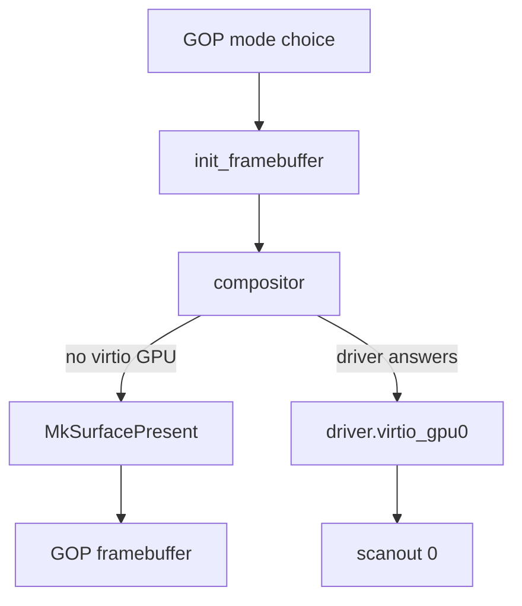

# Display

How NONOS puts the desktop on a screen: through the UEFI GOP framebuffer on any machine, through virtio-gpu in a virtual machine, and what it cannot drive.

## Three paths

| Path | Code | Used when |
|---|---|---|
| UEFI GOP framebuffer | the bootloader, `src/kernel_core/init/framebuffer`, the compositor | on every UEFI machine, whenever no virtio GPU driver answers |
| virtio-gpu | `capsule_driver_virtio_gpu`, served as `driver.virtio_gpu0` | a virtio GPU in a virtual machine |
| Bochs BGA | `capsule_driver_bga` | never: the capsule is parked and in no image |

There is no native driver for an Intel, AMD or NVIDIA GPU. On real hardware the desktop is drawn through the framebuffer the firmware set up before boot.

The loader makes the GOP mode choice, `init_framebuffer` maps it in the kernel, and the compositor either presents its frames through `MkSurfacePresent` to that framebuffer or hands them to `driver.virtio_gpu0`, which shows them on scanout 0.
