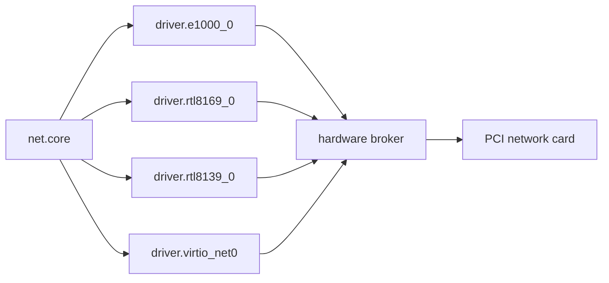

# Ethernet drivers

NONOS carries wired traffic through one driver [capsule](../../overview/glossary.md#capsule) per card family; this page lists every Ethernet driver in the tree, says which ones are in the image, shows how a frame reaches `net.core`, and describes the receive fault the three PCI drivers carry in 0.9.2.

## Drivers at a glance

The states are the [support matrix](../../hardware/MATRIX.md#how-to-read-it)'s:

- Works: the image carries the whole path for the card.
- Partial: part of the path is there; the row says what is missing.
- Not supported: no driver in the image.

| Family | PCI or USB ids | Capsule | In the image | State | Page |
|---|---|---|---|---|---|
| Intel 8254x (e1000) | 28 ids, vendor 8086 | `driver.e1000_0` | yes | Partial: [receive fault](#the-receive-fault), no QEMU run target | [intel.md](intel.md) |
| Intel 82574, 82583, I217, I218, I219 (e1000e) | 64 ids, vendor 8086 | `driver.e1000e_0` | no | Not supported: capsule not built into any image | [intel.md](intel.md) |
| Intel I225, I226 (igc) | 16 ids, vendor 8086 | `driver.igc_0` | no | Not supported: capsule not built into any image | [intel.md](intel.md) |
| Realtek RTL8139 | 10ec:8139 | `driver.rtl8139_0` | yes | Partial: [receive fault](#the-receive-fault), no QEMU run target | [realtek.md](realtek.md) |
| Realtek RTL8169, RTL8168, RTL8111, RTL810x, RTL8125 | 10 ids, vendor 10ec | `driver.rtl8169_0` | yes | Partial: [receive fault](#the-receive-fault), flake check fails on a lint | [realtek.md](realtek.md) |
| Realtek RTL8126A, RTL8127A | 10ec:8126, 10ec:8127 | none | no | Not supported: left out of the id table | [realtek.md](realtek.md) |
| virtio network device | 1af4:1000, 1af4:1041 | `driver.virtio_net0` | yes | Works: the QEMU run targets attach it | this page |
| USB CDC-ECM, CDC-NCM, RNDIS, ASIX AX88179, Realtek RTL8153 | USB class or USB ids | five capsules | no | Not supported: not built, and the USB host driver lacks the transfer they need | [usb-net.md](usb-net.md) |

No Ethernet driver has a hardware report in 0.9.2. Read from the code, the only wired driver that delivers received frames to `net.core` in this release is virtio-net, in a virtual machine; [the receive fault](#the-receive-fault) stops the other three in the image. For a machine that needs a network now, read [what to use instead](../wifi/not-supported.md#what-to-use-instead).

## How a frame travels



Each driver is a capsule that moves raw Ethernet frames and nothing more; ARP, IP, DHCP, DNS and TCP live in `net.core` above it. The driver reaches its PCI network card only through [grants](../../overview/glossary.md#grant) from the [hardware broker](../../overview/glossary.md#hardware-broker): a device claim, a register mapping or port range, and DMA buffers.

Every wired driver answers the same link protocol: a 20-byte header tagged `NNET` (0x4E4E4554), and the operations link status (2), MAC address (3), transmit (4) and receive (5) (`userland/capsule_net_core/src/protocol/ops.rs:17-25`, `MAGIC_NNET`, `OP_RX_PACKET`). Operation 6 is where they part. `net.core` and the virtio driver use it for a receive batch (`userland/capsule_net_core/src/protocol/ops.rs:26-27`, `OP_RX_BATCH`); e1000, RTL8139 and RTL8169 use it for a register snapshot (`userland/capsule_driver_e1000/src/protocol/ops.rs:23-28`, `OP_STATS`).

The kernel holds the four wired endpoints in the image to `net.core` and `net.l2`; no other capsule may send to them (`src/services/registry/held_table.rs:20-24`, `HELD`; `src/services/registry/held_table.rs:41-44`, `WIRED_STACK`). See [held endpoint](../../overview/glossary.md#held-endpoint).

`net.core` binds the first candidate whose link answers up. Wi-Fi comes first, then `driver.virtio_net0`, `driver.e1000_0`, `driver.rtl8169_0` and `driver.rtl8139_0`, then the USB drivers (`userland/capsule_net_core/src/setup/candidates.rs:25-38`, `WIRED_NICS`). The e1000e and igc capsules are not on that list.

## The receive fault

Read from the code on this commit, `net.core` takes no received frame from the e1000, RTL8139 or RTL8169 driver. No run on this commit shows it either way.

1. On its first poll of a newly bound card, `net.core` sends operation 6 with no body. A status 0 reply marks the driver as one that serves receive batches (`userland/capsule_net_core/src/device/rx_probe.rs:32-38`, `serves`; `userland/capsule_net_core/src/device/batch_call.rs:54`, `OP_RX_BATCH`).
2. The three drivers answer operation 6 with status 0 and twelve register words (`userland/capsule_driver_e1000/src/server/handlers/stats.rs:25-33`, `write_status`). The RTL8139 and RTL8169 handlers do the same.
3. From then on `net.core` asks that card only for batches. It reads each snapshot as a batch, finds that the frame count does not match the body, and drops it with the line `[NET-CORE] rx batch unreadable, dropped` (`userland/capsule_net_core/src/device/rx_batch.rs:63-68`, `batch_frames`; `userland/capsule_net_core/src/device/batch_frames.rs:26-35`, `batch_frames`).

Transmit uses operation 4 and is not touched, but with no frame received, DHCP gets no lease through these drivers. The virtio driver serves real batches (`userland/capsule_driver_virtio_net/src/protocol/ops.rs:25`, `OP_RX_BATCH`). The Wi-Fi drivers do not answer operation 6 with status 0, so `net.core` falls back to operation 5 for them.

## Behaviour every PCI driver shares

- The kernel starts `driver_e1000`, `driver_rtl8139` and `driver_rtl8169` on every boot of an image that carries them (`src/userspace/init/spawn_plan/drivers_nic.rs:17-21`, `spawn`). A driver whose chip is absent exits at once with `EXIT_ABSENT` (2) and claims nothing (`userland/libc/src/bringup/policy.rs:37-41`, `EXIT_ABSENT`).
- A chip that is present but fails bring-up is tried 7 times, with a sleep starting at 100 ms and doubling up to 3.2 s, then the driver exits with `EXIT_GAVE_UP` (6) (`userland/libc/src/bringup/policy.rs:30-41`, `BRINGUP_ATTEMPTS`, `EXIT_GAVE_UP`).
- No PCI Ethernet driver binds an interrupt: they all poll, and none of their masks holds Irq (`userland/capsule_driver_e1000/src/setup/sequence.rs:24-27`, `IMS`).
- Each draws a new locally administered station address every boot instead of the address burned into the card, and fails closed without randomness (`userland/capsule_driver_e1000/src/init/station_address.rs:22-31`, `draw`).
- When the bound link goes down and comes back, `net.core` asks DHCP for the lease again (`userland/capsule_net_core/src/iface/relink.rs:40-47`, `Change::Returned`).

The USB drivers differ on the address: they take the adapter's own and hold no Crypto capability to draw one; see [USB networking](usb-net.md).

## virtio-net in a virtual machine

The virtio driver takes vendor 0x1AF4 with the transitional device 0x1000 or the modern device 0x1041 (`userland/capsule_driver_virtio_net/src/constants/pci.rs:22-24`, `VIRTIO_NET_MODERN`). A transitional device with its legacy I/O BAR is driven over port I/O; a modern-only one over the virtio 1.0 structures in a memory BAR (`userland/capsule_driver_virtio_net/src/transport/probe.rs:25-31`, `probe`). Its mask is 0x1B8038, which holds both Mmio and Pio, with Debug optional (`userland/capsule_driver_virtio_net/Capsule.mk:24-27`, `CAPSULE_REQUIRED_CAPS`). It draws its station address like the others and never takes the device's (`userland/capsule_driver_virtio_net/src/setup/station.rs:23-27`, `draw`).

The kernel starts it only when the boot PCI scan found a virtio network device (`src/userspace/init/spawn_plan/drivers_virtio_display.rs:35-41`, `spawn_net`). The QEMU run targets attach `virtio-net-pci` with user-mode networking, `nat` unless `QEMU_NET_MODE` says `off` or `hostfwd` (`mk/10-qemu.mk:124-136`, `QEMU_NET`). `nonos-mk-run` builds the full image and boots it that way (`mk/40-run.mk:107-118`, `QEMU_NET`):

```sh
make nonos-mk-run QEMU_NET_MODE=nat
```

Not tested in this release.

The flake check `proofs-virtio_net_proofs` passed with 20 tests on this commit.

## Which image carries which driver

- The desktop base, which every desktop image builds on, carries virtio-net (`mk/20-build.mk:1095-1098`, `DESKTOP_BASE_SLUGS`).
- The full image that `make` builds adds e1000, RTL8139 and RTL8169, with the two Wi-Fi drivers (`Cargo.toml:627-638`, `microkernel-full-gui`).
- The air-gapped [build profile](../../overview/glossary.md#build-profile) drops every network driver and the whole stack (`tools/nix/config.nix:86-93`, `networkFeatures`).
- `nonos-mk-ethernet-prod` builds the desktop with the three wired drivers (`mk/20-build.mk:1145-1155`, `ETHERNET_DRIVER_ARTIFACTS`). No QEMU run target attaches an e1000 or RTL8139 device, so this release has no QEMU run for them.
- The build includes the capsule makefiles of virtio-net, e1000, RTL8139 and RTL8169 and of no other Ethernet driver (`mk/20-build.mk:532-542`, `capsule_driver_e1000`). The e1000e, igc and USB capsules are therefore in no image.

## Tests on this commit

Each [proof crate](../../overview/glossary.md#proof-crate) compiles its driver's own source with `#[path]` and runs it on the host against models. The flake runs `cargo test --release` with overflow checks on, then clippy with warnings denied (`tools/nix/checks.nix:85-94`, `testArgs`, `clippy`). None of these tests covers the exchange between `net.core` and a driver, which is where [the receive fault](#the-receive-fault) sits.

| Check | Result |
|---|---|
| `proofs-e1000_proofs` | passed, 20 tests |
| `proofs-e1000e_proofs` | passed, 48 tests |
| `proofs-igc_proofs` | passed, 58 tests |
| `proofs-rtl8139_proofs` | passed, 15 tests |
| `proofs-rtl8169_proofs` | failed: the tests pass, then a clippy lint stops the check; see [realtek.md](realtek.md#tests) |
| `proofs-virtio_net_proofs` | passed, 20 tests |
| `proofs-usbnet_proofs` | passed, 17 tests |
| `proofs-cdc_ecm_proofs` | passed, 7 tests |
| `proofs-cdc_ncm_proofs` | passed, 33 tests |
| `proofs-rndis_proofs` | passed, 22 tests |
| `proofs-ax88179_proofs` | passed, 25 tests |
| `proofs-rtl8153_proofs` | passed, 27 tests |
| `proofs-net_core_proofs` | passed, 31 tests |

## See also

- [Intel Ethernet](intel.md)
- [Realtek Ethernet](realtek.md)
- [USB networking](usb-net.md)
- [Wi-Fi drivers](../wifi/README.md)
- [The driver model](../README.md)
- [The broker API](../broker-api.md)
- [Hardware support matrix](../../hardware/MATRIX.md)
- [Wi-Fi and networking for users](../../using/wifi-and-networking.md)
