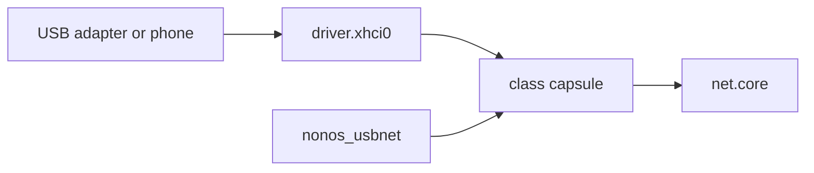

# USB networking

The tree holds five USB network driver [capsules](../../overview/glossary.md#capsule) (CDC-ECM, CDC-NCM, RNDIS, ASIX AX88179 and Realtek RTL8153) on one shared core, `nonos_usbnet`; none of them runs in 0.9.2, and this page says what each would bind and why it does not run.

## State in this release

USB Ethernet adapters and USB tethering from a phone do not work in NONOS 0.9.2. Three facts in the code stop them, and any one would be enough:

1. No image builds them. The Ethernet makefiles the build includes are those of virtio-net, e1000, RTL8139 and RTL8169 (`mk/20-build.mk:532-542`, `capsule_driver_e1000`), and the kernel has no spawn entry for any USB network capsule.
2. The USB host driver does not serve the transfer they rely on. `nonos_usbnet` reads with a polled bulk IN, operation 0x0014 (`userland/nonos_usbnet/src/xhci/wire.rs:38-40`, `OP_BULK_IN_POLL`). The xHCI driver's operations stop at 0x0013 (`userland/capsule_driver_xhci/src/protocol/ops.rs:17-30`, `OP_RESET_BULK`) and it answers any other with `E_INVAL` (`userland/capsule_driver_xhci/src/server/dispatch.rs:41-45`, `reply_with_status`).
3. The kernel holds `driver.xhci0` to the USB keyboard and mouse driver and the USB storage driver alone (`src/services/registry/held_table.rs:32`, `driver.usb_hid0`), so a network capsule could not send to it.

A fourth would follow once those are fixed: the shared core answers operation 6 with its counters and status 0 (`userland/nonos_usbnet/src/nnet/answer.rs:43-46`, `OP_STATS`), so `net.core` would read it as a receive batch, as it does for the PCI drivers; see [the receive fault](README.md#the-receive-fault).

`net.core` already lists the five services as candidates after the PCI cards (`userland/capsule_net_core/src/setup/candidates.rs:25-38`, `WIRED_NICS`). For a machine with no supported Ethernet port, see [Wi-Fi chips with no driver](../wifi/not-supported.md#what-to-use-instead) for what does work.

## How the pieces fit



Each class capsule holds only its binding and its framing. The shared core `nonos_usbnet` holds the client side of `driver.xhci0`, the descriptor walk, the search for a device on the root ports and the NNET frame service that `net.core` speaks (`userland/nonos_usbnet/src/lib.rs:17-21`, `run`). No USB network capsule touches the controller: it holds no Driver, DeviceEnum, Mmio, Irq, Dma or Pio [capability](../../overview/glossary.md#capability-word).

## What each capsule would bind

| Capsule | Service and port | Binds |
|---|---|---|
| `capsule_driver_cdc_ecm` | `driver.cdc_ecm0`, 4250 | a communications interface of subclass 0x06 with a Union and an Ethernet Networking descriptor |
| `capsule_driver_cdc_ncm` | `driver.cdc_ncm0`, 4252 | a communications interface of subclass 0x0D, protocol 0, with the NCM descriptor |
| `capsule_driver_rndis` | `driver.rndis0`, 4254 | three RNDIS control classes, listed below |
| `capsule_driver_ax88179` | `driver.ax88179_0`, 4256 | 13 USB vendor:product pairs |
| `capsule_driver_rtl8153` | `driver.rtl8153_0`, 4258 | 19 USB vendor:product pairs |

- CDC-ECM: `find_ecm` takes the first communications interface of subclass 0x06 that has a Union descriptor, an Ethernet Networking descriptor and a data interface with a bulk pair (`userland/capsule_driver_cdc_ecm/src/ecm/function.rs:26-57`, `find_ecm`). It leaves 0bda:8153 and 17ef:721e to the RTL8153 capsule, as Linux does (`userland/capsule_driver_cdc_ecm/src/ecm/vendor.rs:22`, `LEFT_TO_RTL8153`). One Ethernet frame goes in each bulk transfer, with one padding byte when its length is a multiple of 64 or of the packet size (`userland/capsule_driver_cdc_ecm/src/ecm/frame.rs:22-36`, `padded_len`).
- CDC-NCM: `find_ncm` needs subclass 0x0D, protocol 0, and both the Ethernet Networking and the NCM functional descriptors (`userland/capsule_driver_cdc_ncm/src/ncm/function.rs:26-64`, `find_ncm`).
- RNDIS: the control interface must be CDC ACM with the vendor protocol (0x02, 0x02, 0xFF), the wireless controller class phones use for tethering (0xE0, 0x01, 0x03), or the miscellaneous RNDIS class (0xEF, 0x04, 0x01) (`userland/capsule_driver_rndis/src/rndis/function.rs:27-31`, `CONTROL_CLASSES`). A communications function that declares modem capabilities is a modem and is skipped (`userland/capsule_driver_rndis/src/rndis/function.rs:57-64`, `acm_capable`).
- ASIX AX88179: the ids Linux's ax88179_178a driver binds, with 0b95:1790 for the AX88179 and 0b95:178a for the AX88178A; the other 11 pairs are adapters built on these chips (`userland/capsule_driver_ax88179/src/ax/products.rs:17-35`, `PRODUCTS`).
- Realtek RTL8153: 0bda:8153 for the RTL8153 and RTL8153B, and 18 pairs for adapters and docks built on them. For those, the chip's version register decides, and an adapter built on another chip is refused by name (`userland/capsule_driver_rtl8153/src/r8153/ids.rs:17-51`, `RTL8153_FAMILY`). The RTL8152, the RTL8156 family and two ids whose chip Linux does not name are left out.

## Addresses and capabilities

Unlike the PCI drivers, these capsules use the adapter's own station address. They hold no Crypto capability to draw one. The AX88179 capsule reads AX_NODE_ID and stops the bind when it holds no usable address (`userland/capsule_driver_ax88179/src/ax/station.rs:27-37`, `NO_STATION`), and the RTL8153 capsule reads PLA_BACKUP (`userland/capsule_driver_rtl8153/src/r8153/up/mac.rs:32-41`, `station_address`).

All five ask for the capability mask 0x200018. The comment above it in each `Capsule.mk` reads it as IPC, Memory and Debug (`userland/capsule_driver_cdc_ecm/Capsule.mk:15-18`, `CAPSULE_REQUIRED_CAPS`). In the capability table, 0x200000 is `InputSource`, bit 21, and `Debug` is 0x100, bit 8 (`src/capabilities/types/defs.rs:51`, `InputSource`; `src/capabilities/types/defs.rs:32`, `Debug`). The mask therefore grants IPC, Memory and InputSource and no Debug. The kernel admits `MkDebug` only with Debug (`src/syscall/contract/cap_table/mk.rs:138`, `can_debug`), so the `[usbnet ...]` lines these capsules write would be dropped. The comment and the mask disagree in this release.

## Tests on this commit

Each capsule has a [proof crate](../../overview/glossary.md#proof-crate) that runs its binding and framing on the host against scripted devices, some of them built from QEMU's `usb-net` descriptors. No QEMU run and no hardware boot exists for any of them.

| Check | Result |
|---|---|
| `proofs-usbnet_proofs` | passed, 17 tests |
| `proofs-cdc_ecm_proofs` | passed, 7 tests |
| `proofs-cdc_ncm_proofs` | passed, 33 tests |
| `proofs-rndis_proofs` | passed, 22 tests |
| `proofs-ax88179_proofs` | passed, 25 tests |
| `proofs-rtl8153_proofs` | passed, 27 tests |

```sh
cd userland/cdc_ncm_proofs && cargo test --release --config profile.release.overflow-checks=true
```

Not tested in this release.

## See also

- [Ethernet drivers](README.md)
- [Realtek Ethernet](realtek.md)
- [USB host controller](../usb/README.md)
- [Wi-Fi chips with no driver](../wifi/not-supported.md)
- [Hardware support matrix](../../hardware/MATRIX.md)
