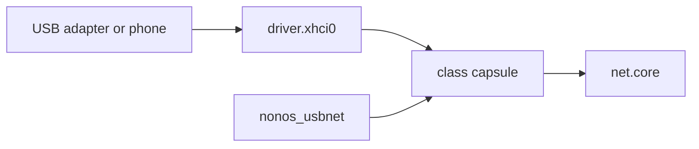

# USB networking

The tree holds five USB network driver [capsules](../../overview/glossary.md#capsule) (CDC-ECM, CDC-NCM, RNDIS, ASIX AX88179 and Realtek RTL8153) on one shared core, `nonos_usbnet`; none of them runs in 0.9.2, and this page says what each would bind and why it does not run.

## State in this release

USB Ethernet adapters and USB tethering from a phone do not work in NONOS 0.9.2. Three facts in the code stop them, and any one would be enough:

1. No image builds them. The Ethernet makefiles the build includes are those of virtio-net, e1000, RTL8139 and RTL8169 (`mk/20-build.mk:532-542`, `capsule_driver_e1000`), and the kernel has no spawn entry for any USB network capsule.
2. The USB host driver does not serve the transfer they rely on. `nonos_usbnet` reads with a polled bulk IN, operation 0x0014 (`userland/nonos_usbnet/src/xhci/wire.rs:38-40`, `OP_BULK_IN_POLL`). The xHCI driver's operations stop at 0x0013 (`userland/capsule_driver_xhci/src/protocol/ops.rs:17-30`, `OP_RESET_BULK`) and it answers any other with `E_INVAL` (`userland/capsule_driver_xhci/src/server/dispatch.rs:41-45`, `reply_with_status`).
3. The kernel holds `driver.xhci0` to the USB keyboard and mouse driver and the USB storage driver alone (`src/services/registry/held_table.rs:32`, `driver.usb_hid0`), so a network capsule could not send to it.

A fourth would follow once those are fixed: the shared core answers operation 6 with its counters and status 0 (`userland/nonos_usbnet/src/nnet/answer.rs:43-46`, `OP_STATS`), so `net.core` would read it as a receive batch, as it does for the PCI drivers; see [the receive fault](README.md#the-receive-fault).

`net.core` already lists the five services as candidates after the PCI cards (`userland/capsule_net_core/src/setup/candidates.rs:25-38`, `WIRED_NICS`). For a machine with no supported Ethernet port, see [Wi-Fi chips with no driver](../wifi/not-supported.md#what-to-use-instead) for what does work.

## How the pieces fit

Each class capsule holds only its binding and its framing. The shared core `nonos_usbnet` holds the client side of `driver.xhci0`, the descriptor walk, the search for a device on the root ports and the NNET frame service that `net.core` speaks (`userland/nonos_usbnet/src/lib.rs:17-21`, `run`). No USB network capsule touches the controller: it holds no Driver, DeviceEnum, Mmio, Irq, Dma or Pio [capability](../../overview/glossary.md#capability-word).
