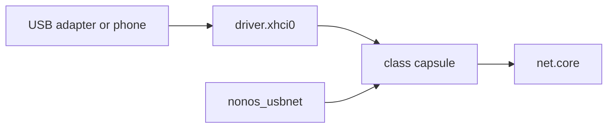

# USB networking

The tree holds five USB network driver [capsules](../../overview/glossary.md#capsule) (CDC-ECM, CDC-NCM, RNDIS, ASIX AX88179 and Realtek RTL8153) on one shared core, `nonos_usbnet`; none of them runs in 0.9.2. This page says what kept them out of 0.9.2 and where they stand now; [what each binds](usb-net-binding.md) has its own page.

## State

USB Ethernet adapters and USB tethering from a phone do not work in NONOS 0.9.2. Four facts in that release's code stopped them, and each is now addressed on this tree:

2. The USB host driver did not serve their polled bulk IN, operation 0x0014 (`userland/nonos_usbnet/src/xhci/wire.rs:38-40`, `OP_BULK_IN_POLL`): its operations stopped at 0x0013 and it answered any other with `E_INVAL`. It now keeps one IN transfer armed per slot on its own page and answers each look at once (`userland/capsule_driver_xhci/src/controller/transfer/bulk/poll.rs`, `poll_bulk_in`).
3. The kernel held `driver.xhci0` to the USB keyboard, storage and audio drivers alone; the five are now on its list (`src/services/registry/held_table.rs:55-64`, `XHCI_CLIENTS`), and each is held to `net.core` and `net.l2` through the card table (`src/services/registry/nics.rs:40-55`, `NICS`).
4. The shared core answered operation 6, which `net.core` asks first as its receive batch, with its counters and status 0, so `net.core` would have taken the counters for frames ([the receive fault](README.md#the-receive-fault)). The counters are now at operation 0x0100 and 6 is answered with `E_INVAL` (`userland/nonos_usbnet/src/nnet/wire.rs:36-40`, `OP_STATS`), so `net.core` reads these drivers one frame at a time with operation 5.

`net.core` tries the five after the PCI cards, in the kernel's card table order (`userland/capsule_net_core/src/setup/candidates.rs:42-46`, `candidate`). For a machine with no supported Ethernet port, see [Wi-Fi chips with no driver](../wifi/not-supported.md#what-to-use-instead) for what does work.

## How the pieces fit


```mermaid
flowchart LR
  Dev["USB adapter or phone"] --> Xhci["driver.xhci0"]
  Xhci --> Class["class capsule"]
  Usbnet["nonos_usbnet"] --> Class
  Class --> Core["net.core"]
```

Each class capsule holds only its binding and its framing. The shared core `nonos_usbnet` holds the client side of `driver.xhci0`, the descriptor walk, the search for a device on the root ports and the NNET frame service that `net.core` speaks (`userland/nonos_usbnet/src/lib.rs:17-21`, `run`). No USB network capsule touches the controller: it holds no Driver, DeviceEnum, Mmio, Irq, Dma or Pio [capability](../../overview/glossary.md#capability-word). What each capsule binds is on [its own page](usb-net-binding.md).

## Addresses and capabilities

Like the PCI drivers, these capsules never use the adapter's own station address. Each draws one from `CryptoRandom` once a run, before the first bind, and hands the same one to every device it binds, so a device bound again after a loss keeps the address `net.core` took at the first bind; without entropy no device is bound (`userland/nonos_usbnet/src/station.rs:59-66`, `draw`; `userland/nonos_usbnet/src/scan/scanner.rs:38-44`, `Scanner::new`). The AX88179 capsule writes it to AX_NODE_ID and the RTL8153 capsule to PLA_IDR, so each chip's unicast filter matches it; neither reads the factory address there or in PLA_BACKUP (`userland/capsule_driver_ax88179/src/ax/station.rs:28-32`, `station`; `userland/capsule_driver_rtl8153/src/r8153/up/mac.rs:31-37`, `station_address`). CDC-NCM gives it with SET_NET_ADDRESS when the device offers that, RNDIS sets OID_802_3_CURRENT_ADDRESS, and a device that cannot take it has its packet filter opened.

All five ask for the capability mask 0x38: IPC, Memory and Crypto, the bit `CryptoRandom` is gated on, with Debug (0x100) optional (`userland/capsule_driver_cdc_ecm/Capsule.mk:15-28`, `CAPSULE_REQUIRED_CAPS`, `CAPSULE_OPTIONAL_CAPS`; `src/capabilities/types/defs.rs:28`, `Crypto`). The kernel admits `MkDebug` only with Debug (`src/syscall/contract/cap_table/mk.rs:139`, `can_debug`), so the `[usbnet ...]` lines reach the log only in a build that compiles `capsule-serial-debug`. Their loop drops the messages it sent itself by its own pid, which it reads back with `MkServiceLookup` under its service name rather than `MkGetPid`, so no CoreExec is needed (`userland/nonos_usbnet/src/run/me.rs:26-34`, `own_pid`). In 0.9.2 they asked for 0x200018, which grants InputSource and no Debug.

## Tests on this commit

Each capsule has a [proof crate](../../overview/glossary.md#proof-crate) that runs its binding and framing on the host against scripted devices, some of them built from QEMU's `usb-net` descriptors. No QEMU run and no hardware boot exists for any of them. The counts below are host `cargo test` runs on this commit; the flake checks have not been run on it.

| Crate | Result |
|---|---|
| `usbnet_proofs` | 41 tests pass |
| `cdc_ecm_proofs` | 13 tests pass |
| `cdc_ncm_proofs` | 36 tests pass |
| `rndis_proofs` | 22 tests pass |
| `ax88179_proofs` | 27 tests pass |
| `rtl8153_proofs` | 31 tests pass |

```sh
cd userland/cdc_ncm_proofs && cargo test --release --config profile.release.overflow-checks=true
```

Not tested in this release.

## See also

- [What each USB capsule binds](usb-net-binding.md)
- [Ethernet drivers](README.md)
- [Realtek Ethernet](realtek.md)
- [USB host controller](../usb/README.md)
- [Wi-Fi chips with no driver](../wifi/not-supported.md)
- [Hardware support matrix](../../hardware/MATRIX.md)
