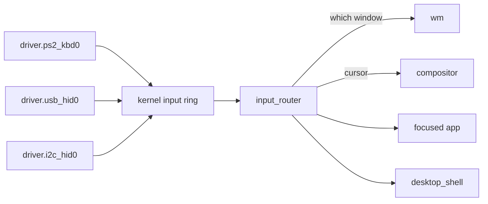

# Input drivers

How a key press, a mouse movement or a touch on the touchpad reaches an application in NONOS 0.9.2, and which driver handles which device.

## Which driver handles what

| Device | Driver | Service | Page |
|---|---|---|---|
| Keyboard, mouse or touchpad on the i8042 (PS/2) controller | `capsule_driver_ps2_input` | `driver.ps2_kbd0` | [PS/2 keyboard and mouse](ps2.md) |
| HID-over-I2C touchpad on an Intel LPSS or AMD I2C controller | `capsule_driver_i2c_hid` over `capsule_driver_i2c_pci` | `driver.i2c_hid0`, `driver.i2c_pci0` | [I2C-HID touchpads](i2c-hid.md) |
| USB keyboard, mouse or tablet behind an xHCI controller | `capsule_driver_usb_hid` | `driver.usb_hid0` | [USB HID](../usb/hid.md) |

Each driver is its own [capsule](../../overview/glossary.md#capsule) in ring 3, and none of them decides which window gets the input. Only the PS/2 driver holds grants from the [hardware broker](../../overview/glossary.md#hardware-broker) itself. The USB HID driver holds IPC, Memory and InputSource alone and asks `driver.xhci0` for its transfers (`CAPSULE_REQUIRED_CAPS`, `userland/capsule_driver_usb_hid/Capsule.mk:15`); the touchpad driver does the same through `driver.i2c_pci0`.

## The path of one event

A driver decodes what its device sends and posts each key, motion, wheel or button event to the kernel input ring with `MkInputEventPost` (`src/syscall/contract/cap_table/mk.rs:190`). The kernel admits that call from a capsule holding the `InputSource`, `Irq` or `Admin` [capability](../../overview/glossary.md#capability) (`can_input_source`, `src/capabilities/token/types/authority_broker.rs:59-63`). Draining the ring, or sleeping until it has events, needs `InputSource` or `Admin`; `Irq` alone is not enough (`can_input_consumer`, `src/capabilities/token/types/authority_broker.rs:71-73`).

The ring holds 1024 events (`INPUT_RING_CAP`, `src/kernel_core/surface_registry/types.rs:18`). When it is full, `push` drops the new event and counts it rather than wait (`src/kernel_core/surface_registry/input_ring/post.rs:50-58`).

`input_router` drains the ring. It takes up to 32 events a pass (`MAX_BATCH`, `userland/capsule_input_router/src/sources/kernel_ring.rs:25`) and parks for at most 8 ms when the ring is empty (`INPUT_WAIT_MS`, `userland/capsule_input_router/src/server/runner.rs:33`).

For a pointer event the router moves the cursor, sends the compositor the new position, and asks the window manager `wm` which window is under the pointer. A key press goes to the focused app, the window `wm` names as having focus. Its release goes to the window that got the press, so a focus change while a key is held cannot strand it (`route_keyboard`, `userland/capsule_input_router/src/route/keyboard.rs:25-56`).

A process receives an event only when it has subscribed to that kind of event, and the router keeps at most 64 subscriptions (`MAX_SUBSCRIBERS`, `userland/capsule_input_router/src/state/subscriptions/types.rs:21`). Five services may grab chosen kinds of event, so that those events go to them alone: the boot splash, the setup wizard, the input probe, `desktop_shell` and the installer. Any other sender is refused (`GRABBERS`, `userland/capsule_input_router/src/server/handlers/grab_request.rs:28-29`).

Two groups of keys never reach the focused window:

- Ctrl+Alt+Esc goes to `desktop_shell`, which brings Process Manager forward to end a window that misbehaves (`is_reserved_chord`, `userland/capsule_input_router/src/route/chord.rs:34-36`).
- Mute, Volume Down, Volume Up and Power go to `desktop_shell` whatever has focus (`is_shell_key`, `userland/capsule_input_router/src/route/shell_keys.rs:32-34`). [Audio](../audio.md) says what the volume keys do. The Power key, from a keyboard or from the ACPI power button, only shows the notice `Power off is not available from the desktop`: the desktop has no way to power off in 0.9.2 (`POWER_OFF_UNAVAILABLE`, `userland/capsule_desktop_shell/src/state/system_key.rs:42-47`).
