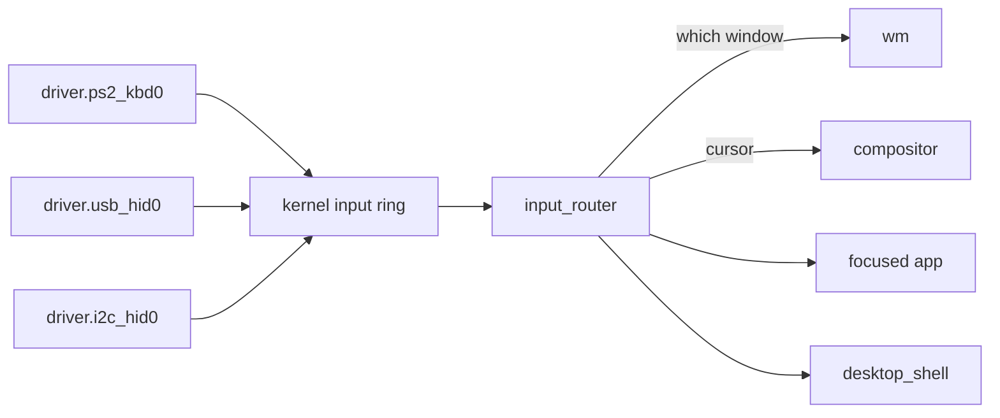

# Input drivers

How a key press, a mouse movement or a touch on the touchpad reaches an application in NONOS 0.9.2, and which driver handles which device.

## Which driver handles what

| Device | Driver | Service | Page |
|---|---|---|---|
| Keyboard, mouse or touchpad on the i8042 (PS/2) controller | `capsule_driver_ps2_input` | `driver.ps2_kbd0` | [PS/2 keyboard and mouse](ps2.md) |
| HID-over-I2C touchpad on an Intel LPSS or AMD I2C controller | `capsule_driver_i2c_hid` over `capsule_driver_i2c_pci` | `driver.i2c_hid0`, `driver.i2c_pci0` | [I2C-HID touchpads](i2c-hid.md) |
| USB keyboard, mouse or tablet behind an xHCI controller | `capsule_driver_usb_hid` | `driver.usb_hid0` | [USB HID](../usb/hid.md) |

Each driver is its own [capsule](../../overview/glossary.md#capsule) in ring 3, and none of them decides which window gets the input. Only the PS/2 driver holds grants from the [hardware broker](../../overview/glossary.md#hardware-broker) itself. The USB HID driver holds IPC, Memory and InputSource alone and asks `driver.xhci0` for its transfers (`CAPSULE_REQUIRED_CAPS`, `userland/capsule_driver_usb_hid/Capsule.mk:15`); the touchpad driver does the same through `driver.i2c_pci0`.

## The path of one event

A driver decodes what its device sends and posts each key, motion, wheel or button event to the kernel input ring with `MkInputEventPost` (`src/syscall/contract/cap_table/mk.rs:190`). The kernel admits that call from a capsule holding the `InputSource`, `Irq` or `Admin` [capability](../../overview/glossary.md#capability) (`can_input_source`, `src/capabilities/token/types/authority_broker.rs:59-63`). Draining the ring, or sleeping until it has events, needs `InputSource` or `Admin`; `Irq` alone is not enough (`can_input_consumer`, `src/capabilities/token/types/authority_broker.rs:71-73`).

The ring holds 1024 events (`INPUT_RING_CAP`, `src/kernel_core/surface_registry/types.rs:18`). When it is full, `push` drops the new event and counts it rather than wait (`src/kernel_core/surface_registry/input_ring/post.rs:50-58`).

`input_router` drains the ring. It takes up to 32 events a pass (`MAX_BATCH`, `userland/capsule_input_router/src/sources/kernel_ring.rs:25`) and parks for at most 8 ms when the ring is empty (`INPUT_WAIT_MS`, `userland/capsule_input_router/src/server/runner.rs:33`).

For a pointer event the router moves the cursor, sends the compositor the new position, and asks the window manager `wm` which window is under the pointer. A key press goes to the focused app, the window `wm` names as having focus. Its release goes to the window that got the press, so a focus change while a key is held cannot strand it (`route_keyboard`, `userland/capsule_input_router/src/route/keyboard.rs:25-56`).

A process receives an event only when it has subscribed to that kind of event, and the router keeps at most 64 subscriptions (`MAX_SUBSCRIBERS`, `userland/capsule_input_router/src/state/subscriptions/types.rs:21`). Five services may grab chosen kinds of event, so that those events go to them alone: the boot splash, the setup wizard, the input probe, `desktop_shell` and the installer. Any other sender is refused (`GRABBERS`, `userland/capsule_input_router/src/server/handlers/grab_request.rs:28-29`).

Two groups of keys never reach the focused window:

- Ctrl+Alt+Esc goes to `desktop_shell`, which brings Process Manager forward to end a window that misbehaves (`is_reserved_chord`, `userland/capsule_input_router/src/route/chord.rs:34-36`).
- Mute, Volume Down, Volume Up and Power go to `desktop_shell` whatever has focus (`is_shell_key`, `userland/capsule_input_router/src/route/shell_keys.rs:32-34`). [Audio](../audio.md) says what the volume keys do. The Power key, from a keyboard or from the ACPI power button, only shows the notice `Power off is not available from the desktop`: the desktop has no way to power off in 0.9.2 (`POWER_OFF_UNAVAILABLE`, `userland/capsule_desktop_shell/src/state/system_key.rs:42-47`).

## Keyboard layouts

The keyboard drivers turn a key into its final character themselves, because nothing downstream applies Shift or a layout. The PS/2 driver keeps the active layout in `LAYOUT_INDEX` (`userland/capsule_driver_ps2_input/src/keymap/active.rs:28`), and the USB HID driver has the same `cycle` (`userland/capsule_driver_usb_hid/src/hid/active.rs:43`).

Both use the tables in `nonos_keymap`: US, UK, German, French AZERTY, Spanish and Italian (`Layout`, `userland/nonos_keymap/src/layout.rs:21-28`). Setup offers exactly these six (`POLICY_LAYOUTS`, `userland/nonos_keymap/src/policy.rs:28`). A layout index with no table maps to nothing, and the driver keeps the layout it has (`from_policy`, `userland/nonos_keymap/src/policy.rs:32-42`).

The drivers read the layout from the [policy store](../../overview/glossary.md#policy-store) at most once a second (`POLICY`, `userland/capsule_driver_ps2_input/src/keymap/active.rs:31`). Ctrl+Alt+Space moves to the next layout in the order above, and the driver consumes that chord, so no application sees it (`cycle`, `userland/capsule_driver_ps2_input/src/poll/absorb.rs:66-79`). [Keyboard layouts](../../using/keyboard-layouts.md) is the guide for people at the keyboard.

## Privacy

No input driver writes a key to disk or to a log. The one exception for pointer data is the touchpad driver: when it holds the Debug capability it writes the first 16 bytes of each of its first six raw reports to the console, so a decode can be checked against the wire (`frame_dumps`, `userland/capsule_driver_i2c_hid/src/input/poll/read_frame.rs:55-58`). `input_router` is granted IPC, Memory and InputSource and nothing else, so it cannot write to the serial console (`CAPSULE_REQUIRED_CAPS`, `userland/capsule_input_router/Capsule.mk:16`).

The kernel holds `driver.ps2_kbd0`, `driver.usb_hid0` and `driver.i2c_hid0` to an empty sender list, so no capsule can ask a keyboard driver for keys (`KERNEL_ONLY`, `src/services/registry/held_table.rs:27-29`).

Two limits follow from the capability rules above. A capsule holding `Irq` may post input events whatever its device, and the manifests of the AHCI, HD Audio, I2C controller, Intel Wi-Fi, NVMe, virtio-blk and xHCI drivers all ask for it. The three input drivers hold `InputSource` as well as `input_router`, so the kernel would let them drain the ring; in the shipped code only `input_router` calls the drain (`can_input_consumer`, `src/capabilities/token/types/authority_broker.rs:64-73`).

## What is not there

- Each key gives one character: `resolve` returns one code per key, so there are no dead keys, no compose sequences and no input method editor (`userland/nonos_keymap/src/resolve.rs:35`).
- NumLock is not tracked. A keypad key always posts its own code, so the keypad always types digits (`character`, `userland/capsule_driver_ps2_input/src/keymap/keypad.rs:43-48`).
- I2C touchscreens are left out of the device table the kernel builds from the ACPI tables (`register_acpi_i2c`, `src/hardware/broker/acpi_i2c/register.rs:36-51`).
- A touchpad on the PS/2 aux port works as a plain PS/2 mouse, without its vendor's own protocol. See [PS/2 keyboard and mouse](ps2.md).
- An I2C touchpad in touchpad mode gives no right click. See [I2C-HID touchpads](i2c-hid.md).
- A USB keyboard's Mute and volume keys are read from the keyboard usage page only (`KEYCODE_MUTE`, `userland/capsule_driver_usb_hid/src/hid/usage_keycode/map.rs:58-63`). Media keys sent on a consumer control interface are not read, since the USB HID driver binds the boot keyboard interface alone.

## How this is checked

The [proof crates](../../overview/glossary.md#proof-crate) compile the shipping driver source on the host and run it against models of the hardware. Their flake checks pass at commit bff12b97:

| Proof crate | What it holds | Tests |
|---|---|---|
| `input_proofs` | PS/2 packets, touchpad decode, gestures, layout tables, the router's routing | 96 |
| `ps2_input_proofs` | i8042 presence, bring-up sequence, keyboard and mouse setup | 38 |
| `i2c_hid_proofs` | touchpad bind, wake, report descriptor, input mode | 51 |
| `i2c_pci_proofs` | LPSS reset, clocks, id tables, doorbell | 35 |
| `i2c_transfer_proofs` | the DesignWare transfer engine against a modelled bus | 26 |
| `pinctrl_proofs` | GPIO pad register layouts | 13 |
| `setup_layout_proofs` | the screen layouts of setup and the installer, and, in 4 of its tests, that setup writes the chosen keyboard layout when the step is confirmed | 56 |

The check for `input_proofs` runs its tests without clippy, which the flake allows for that crate (`lintNone`, `tools/nix/checks.nix:54`).

The QEMU run target gives the guest its keyboard and mouse through the q35 machine's i8042, and attaches xHCI on its own (`QEMU_USB`, `mk/10-qemu.mk:99-102`).

For the PS/2 keyboard with its layouts, the I2C-HID touchpad on Intel LPSS, the power button and the volume keys there is one real-hardware report. Works on an x86_64 laptop (Intel Gemini Lake, 8 GB), maintainer hardware report, 6 October 2026; the image commit was not recorded.
