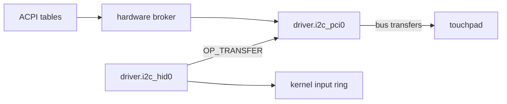

# I2C-HID touchpads

How NONOS drives a laptop touchpad that speaks HID over I2C: which I2C controllers it finds, how it binds the pad, and which gestures it turns into pointer events.

## Two capsules

- `capsule_driver_i2c_pci` serves `driver.i2c_pci0`. It owns the I2C host controller: it claims it through the [hardware broker](../../overview/glossary.md#hardware-broker), maps its registers and runs bounded bus transfers. It parses no HID report.
- `capsule_driver_i2c_hid` serves `driver.i2c_hid0`. It holds no hardware grant at all. It asks `driver.i2c_pci0` for transfers with `OP_TRANSFER`, decodes the touchpad's reports and posts pointer, wheel and button events to the kernel input ring.

Only `driver.i2c_hid0` may send to `driver.i2c_pci0`, because a transfer reaches any device on the bus (`HELD`, `src/services/registry/held_table.rs:20-33`). The ACPI tables, read by the kernel, tell both where the touchpad is.

## Controllers

An Intel LPSS I2C function on PCI is matched by its device id (`device_info`, `userland/capsule_driver_i2c_pci/src/constants/device_info.rs:29-61`). Vendor 8086 in every row:

| Family | Device ids | Input clock |
|---|---|---|
| Broxton, Broxton-P, Apollo Lake, Gemini Lake | even ids in 0AAC to 0ABA, 1AAC to 1ABA, 5AAC to 5ABA, 31AC to 31BA | 133 MHz |
| Sunrise Point-LP and -H, Kaby Lake-H, Comet Lake-V | 9D60 to 9D65, A160 to A162, A2E0 to A2E3, A3E0 to A3E3 | 120 MHz |
| Cannon Point-LP, Cannon Lake-H, Comet Lake, Comet Lake-H, Jasper Lake | 9DE8 to 9DEB, 9DC5, 9DC6, A368 to A36B, 02E8 to 02EB, 02C5, 02C6, 06E8 to 06EB, 4DE8 to 4DEB, 4DC5, 4DC6 | 216 MHz |
| Ice Lake-LP, Tiger Lake-LP and -H, Alder Lake-P, -N and -S, Raptor Lake-S, Meteor Lake-P | 34E8 to 34EB, 34C5, 34C6, A0E8 to A0EB, A0C5, A0C6, A0D8, A0D9, 43E8 to 43EB, 43AD, 43AE, 43D8, 51E8 to 51EB, 51C5, 51C6, 51D8, 51D9, 54E8 to 54EB, 54C5, 54C6, 7ACC to 7ACF, 7AFC, 7AFD, 7A4C to 7A4F, 7A7C, 7A7D, 7E78 to 7E7B, 7E50, 7E51 | 133 MHz |

An Intel function whose id is not listed is still taken when its PCI class is the one LPSS uses (0x0c or 0x11, subclass 0x80). It is then run at an assumed 216 MHz clock, which can only make the bus slower than programmed, and bring-up refuses it unless its LPSS capabilities register says I2C (`classify`, `userland/capsule_driver_i2c_pci/src/discover/classify.rs:38-53`).

Controllers that firmware declares in ACPI rather than on PCI are matched by `_HID`: INT33C2, INT33C3, INT3432, INT3433, INT3442 to INT3447, 80860F41, 808622C1, and the AMD controllers AMDI0010, AMDI0510 and AMD0010 (`hid_is_i2c_controller`, `src/arch/x86_64/acpi/aml/controller/hid_match.rs:21-38`). The kernel gives AMD0010 a 133 MHz clock, other AMD ids 150 MHz and the Intel ones 100 MHz (`source_clock_hz`, `src/hardware/broker/acpi_i2c/clock.rs:23-31`).

The driver tries at most 8 controllers in one bring-up (`MAX_CONTROLLERS`, `userland/capsule_driver_i2c_pci/src/discover/defs.rs:28`).

## Finding the touchpad

The kernel walks the ACPI tables for HID-over-I2C devices: a `_HID` or `_CID` of PNP0C50 or ACPI0C50, or a `_HID` that starts with a touchpad vendor's prefix (`parse_hid_devices`, `src/arch/x86_64/acpi/devices/i2c/parse.rs:35`). It registers touchpads first and leaves touchscreens out (`register_acpi_i2c`, `src/hardware/broker/acpi_i2c/register.rs:36-51`). Known touchpad and touchscreen ids are listed in `TOUCHPAD_HIDS` and `TOUCHSCREEN_HIDS` (`src/arch/x86_64/acpi/devices/i2c/hids.rs:19-62`).

For each touchpad the kernel writes one line to the boot console with its id, bus, address, speed and interrupt, and a warning when the pad uses 10-bit addressing, which NONOS does not support (`report`, `src/hardware/broker/acpi_i2c/report.rs:32-74`).

`driver.i2c_pci0` then picks the controller (`run`, `userland/capsule_driver_i2c_pci/src/setup/sequence/run.rs:35-104`):

1. Controllers that a declared touchpad names are tried first.
2. The first controller whose bus returns an HID descriptor from a declared address is kept.
3. When the firmware declares no HID-over-I2C device at all, the driver looks on each controller for a descriptor at 0x15, 0x2C, 0x10, 0x20, 0x24, 0x38, 0x4B and 0x4C (`BLIND_ADDRS`, `userland/capsule_driver_i2c_pci/src/setup/sequence/run.rs:29`).
4. Failing that, a controller where a declared device only acknowledged, then the controller the firmware named, then the first that comes up.

The bus runs in fast mode unless a device on it declared a lower speed (`standard_mode`, `userland/capsule_driver_i2c_pci/src/setup/sequence/run.rs:139-144`).

`driver.i2c_hid0` asks for the address the firmware gave, and probes it (`reprobe`, `userland/capsule_driver_i2c_hid/src/setup.rs:21-29`). When there is none, or no descriptor answers there, it scans 0x10, 0x15, 0x2C, 0x38, 0x4B, 0x4C, 0x20 and 0x24 at descriptor registers 0x0001 and 0x0020 (`CANDIDATE_ADDRS`, `userland/capsule_driver_i2c_hid/src/hid/probe/scan.rs:20-23`). Until a pad answers it probes again every 250 turns of its loop (`REPROBE_EVERY`, `userland/capsule_driver_i2c_hid/src/server/runner/run.rs:31`). After 20 probes with no answer it writes one console line, when it holds Debug, saying that no touchpad answers on the bus (`UNANSWERED_PROBES`, `userland/capsule_driver_i2c_hid/src/setup.rs:61-68`).

## Waking the pad

Once the 30-byte HID descriptor reads, the driver (`reprobe`, `userland/capsule_driver_i2c_hid/src/setup.rs:21-64`):

1. Sends SET_POWER ON, once more 1 ms later if the pad does not acknowledge it, then waits 60 ms (`POWER_ON_MS`, `userland/capsule_driver_i2c_hid/src/hid/power/settle.rs:22-25`). Then it sends RESET and reads the input register every 5 ms for up to one second for the empty report a reset device sends, holding an early answer to at least 100 ms (`RESET_TIMEOUT_MS`, `userland/capsule_driver_i2c_hid/src/hid/power/await_reset.rs:29-31`).
2. Reads the report descriptor, at most 1024 bytes, three times 20 ms apart if it has to (`REPORT_DESC_ATTEMPTS`, `userland/capsule_driver_i2c_hid/src/setup.rs:112`).
3. Sets the Precision Touchpad input mode to 3 and the surface and button switches on, writing a feature report only when a bit differs (`INPUT_MODE_TOUCHPAD`, `userland/capsule_driver_i2c_hid/src/hid/input_mode/configure.rs:28-54`).

## Reading reports

The transfer engine polls the controller, and the touchpad's own interrupt line is routed to neither capsule. A touchpad holds that line active while a report waits, so `driver.i2c_pci0` reads the level of that GPIO pad and answers `OP_GPIO_DOORBELL` with it (`handle`, `userland/capsule_driver_i2c_pci/src/server/handlers/doorbell.rs:37-52`). It finds the pad's register:

- on Broxton, Apollo Lake and Gemini Lake, from the community the firmware names, at the pin's index (`is_bxt_family`, `userland/capsule_driver_i2c_pci/src/constants/device_info.rs:71-74`);
- on Intel chipsets from Sunrise Point to Meteor Lake and on AMD, through the tables in `nonos_pinctrl` (`locate`, `userland/nonos_pinctrl/src/locate.rs:32`).

`driver.i2c_hid0` trusts the doorbell once it has rung. It then reads only when the line is active, and falls back to timed reads after 2500 quiet turns, or for good when the controller has no doorbell to offer (`DOORBELL_TRUST_CYCLES`, `userland/capsule_driver_i2c_hid/src/server/runner/run.rs:35-37`). Its loop waits 2 ms for a request each turn (`RECV_TIMEOUT_MS`, `userland/capsule_driver_i2c_hid/src/server/runner/run.rs:26`).

A pad in touchpad mode sends absolute contacts, which go through the gesture decoder. A pad that only sends a mouse report is decoded as a relative mouse with up to five buttons (`publish`, `userland/capsule_driver_i2c_hid/src/input/publish.rs:25-49`).
