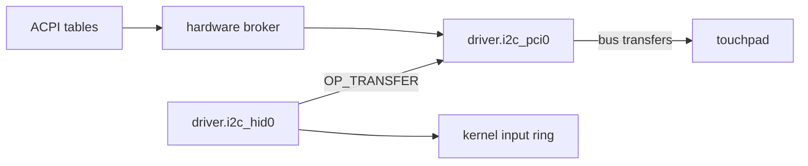

# I2C-HID touchpads

How NONOS drives a laptop touchpad that speaks HID over I2C: which I2C controllers it finds, how it binds the pad, and which gestures it turns into pointer events.

## Two capsules

- `capsule_driver_i2c_pci` serves `driver.i2c_pci0`. It owns the I2C host controller: it claims it through the [hardware broker](../../overview/glossary.md#hardware-broker), maps its registers and runs bounded bus transfers. It parses no HID report.
- `capsule_driver_i2c_hid` serves `driver.i2c_hid0`. It holds no hardware grant at all. It asks `driver.i2c_pci0` for transfers with `OP_TRANSFER`, decodes the touchpad's reports and posts pointer, wheel and button events to the kernel input ring.

Only `driver.i2c_hid0` may send to `driver.i2c_pci0`, because a transfer reaches any device on the bus (`HELD`, `src/services/registry/held_table.rs:20-33`). The ACPI tables, read by the kernel, tell both where the touchpad is.
