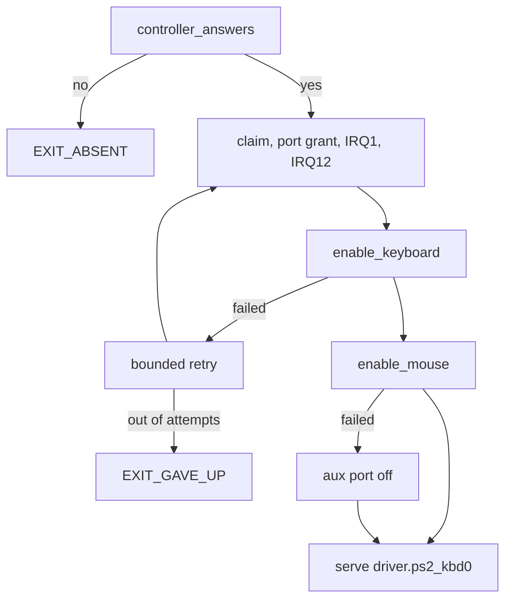

# PS/2 keyboard and mouse

`capsule_driver_ps2_input` drives the i8042 controller: a laptop's built-in keyboard when it sits behind an i8042 (often one an embedded controller emulates), a PS/2 mouse, and a touchpad wired to the i8042's aux port.

## What works

- The keys of scan code set 1 in the driver's tables. A keyboard powers up in set 2, so the driver turns on the controller's translation bit when it writes the configuration byte (`keyboard_config`, `userland/capsule_driver_ps2_input/src/init/enable_keyboard/config.rs:31-33`).
- The E0-prefixed keys: arrows, Home, End, Page Up, Page Down, Insert, Delete, keypad Enter and Divide, right Ctrl, right Alt and both Windows keys (`keycode_for`, `userland/capsule_driver_ps2_input/src/keymap/set1_e0.rs:21-50`).
- F1 to F12, the numeric keypad, and the extra key left of Z on ISO keyboards (`KEY_ISO`, `userland/capsule_driver_ps2_input/src/keymap/set1/function.rs:51`).
- The Fn volume keys of a laptop that sends E0 20, E0 2E and E0 30 for Mute, Volume Down and Volume Up (`KEYCODE_MUTE`, `userland/capsule_driver_ps2_input/src/keymap/set1_e0.rs:28-30`), and a keyboard power key on E0 5E (`KEYCODE_POWER`, `userland/capsule_driver_ps2_input/src/keymap/set1_e0.rs:46`).
- Both Shift keys, both Ctrl keys, left Alt, both Windows keys as Meta, and right Alt as AltGr, never as Alt; the US layout maps nothing to AltGr (`modifier_bit`, `userland/capsule_driver_ps2_input/src/keymap/modifiers.rs:32-43`). Caps Lock is a toggle.
- A PS/2 mouse with left, right and middle buttons, and its scroll wheel when it answers the IntelliMouse knock (`detect_wheel`, `userland/capsule_driver_ps2_input/src/init/enable_mouse/detect_wheel.rs:29-39`).
- A touchpad on the aux port, as a plain relative mouse.

## How the driver finds the controller

The i8042 cannot be enumerated, so the [hardware broker](../../overview/glossary.md#hardware-broker) publishes two records for it on every machine: the keyboard record with PNP vendor 0x0001, device 0x0303, ports 0x60 to 0x64 and IRQ 1, and the aux record with device 0x0304 and IRQ 12 (`register_legacy`, `src/hardware/broker/platform.rs:40-74`). The driver looks for both by these ids (`PNP_DEVICE_PS2_KBD`, `userland/capsule_driver_ps2_input/src/constants/pnp.rs:16-19`).

A record on every machine proves nothing. Before it starts, the driver claims the keyboard record, takes the port grant, empties the output buffer and gives the claim back, whatever it found (`controller_answers`, `userland/capsule_driver_ps2_input/src/setup/probe.rs:31-42`). On a machine whose keyboard and pointer are USB or I2C the ports float, the buffer never empties, and the driver exits with status 2, `EXIT_ABSENT`, holding nothing (`_start`, `userland/capsule_driver_ps2_input/src/main.rs:46-57`).

## Bring-up

`run` performs one attempt in this order (`userland/capsule_driver_ps2_input/src/setup/sequence.rs:30-75`):

1. Claim the keyboard record and take the grant for the i8042 ports. Bind IRQ1. If IRQ1 cannot be bound, the driver takes the port grant again and goes on without the line.
2. Claim the aux record and bind IRQ12 (`setup_aux`, `userland/capsule_driver_ps2_input/src/setup/setup_aux.rs:31`).
3. Empty the output buffer, then bring the keyboard up: hold its port off, read the configuration byte, set the IRQ1 and translation bits, enable the port and send Enable Scanning (0xF4). Only a keyboard that does not acknowledge that is reset with 0xFF, then asked again. A keyboard that answers neither is tolerated, so one plugged in later still works (`enable_keyboard`, `userland/capsule_driver_ps2_input/src/init/enable_keyboard/enable.rs:28-38`).
4. If IRQ12 was bound, bring the mouse up: enable the aux port, set the IRQ12 bit, set defaults, try the wheel knock (sample rates 200, 100, 80, then read the id, 3 means a wheel), enable reporting (`enable_mouse`, `userland/capsule_driver_ps2_input/src/init/enable_mouse/enable.rs:30-47`). Without the aux line the mouse step is skipped.
5. If the mouse step fails, turn the aux port back off and restore the keyboard, so a port with nothing behind it does not stream bytes for ever. The keyboard keeps working (`disable_aux`, `userland/capsule_driver_ps2_input/src/setup/sequence.rs:56-64`).
6. Open both lines and serve `driver.ps2_kbd0`.

If a claim, the port grant or the keyboard step fails, the attempt fails. After a keyboard failure the driver gives back both claims, with the port grant and both lines, and tries again; that is the bounded retry in the diagram (`release`, `userland/capsule_driver_ps2_input/src/setup/sequence.rs:44-50`). It tries 7 times, sleeping 100 ms after the first failure and doubling up to 3200 ms, about six seconds asleep in all (`BRINGUP_ATTEMPTS`, `userland/libc/src/bringup/policy.rs:31-35`). Then it exits with status 6, `EXIT_GAVE_UP` (`userland/libc/src/bringup/policy.rs:41`).

## Keys

Each byte from the keyboard goes through `absorb`: E0 and E1 prefixes become flags, and bit 7 marks a release (`userland/capsule_driver_ps2_input/src/poll/absorb.rs:22-43`). The byte is then translated to a key, resolved through the active layout with Shift, Caps Lock and AltGr, and posted to the kernel input ring (`publish`, `userland/capsule_driver_ps2_input/src/keymap/post.rs:23-46`).

- A release carries the code its press went down with. Shift+A released after Shift is still an A release, so the router can pair it with its press (`HeldKeys`, `userland/nonos_keymap/src/held.rs:31-34`).
- A held key repeats as more presses. Mute and Power act once per press and their repeats are dropped (`acts_once`, `userland/capsule_driver_ps2_input/src/keymap/once.rs:27-29`).
- Ctrl+Alt+Space switches to the next keyboard layout and is not passed on (`cycle`, `userland/capsule_driver_ps2_input/src/poll/absorb.rs:66-79`). [Keyboard layouts](../../using/keyboard-layouts.md) lists the six layouts.
- The driver also keeps the last 256 raw scan codes in a ring of its own. When it is full, the oldest is overwritten and counted as dropped (`RING_CAPACITY`, `userland/capsule_driver_ps2_input/src/constants/ports.rs:43`; `push`, `userland/capsule_driver_ps2_input/src/ring/push.rs:20-29`).

## Mouse and touchpad

A packet is 3 bytes, or 4 once the wheel knock succeeded. The first byte must have bit 3 set; a first byte without it is counted as a sync error and dropped, so the parser waits for the start of the next packet (`absorb`, `userland/capsule_driver_ps2_input/src/mouse/parser.rs:34-48`). The check is weak: a stray byte with bit 3 set still passes it. An axis the mouse marks as overflowed is held to 255 in its direction rather than applied as read (`axis`, `userland/capsule_driver_ps2_input/src/mouse/axis.rs:23-33`).

A PS/2 mouse counts upward motion as positive. The driver negates Y, so that on the input ring positive Y points down the screen (`parse`, `userland/capsule_driver_ps2_input/src/mouse/packet.rs:26-62`). It also negates the wheel step, so a notch away from you counts as +1, as it does for USB and I2C mice (`publish`, `userland/capsule_driver_ps2_input/src/mouse/post.rs:24-37`).

When the mouse bring-up failed, bytes from the aux port are still read to keep the output buffer clear, and then thrown away (`aux_enabled`, `userland/capsule_driver_ps2_input/src/poll/drain.rs:52-60`).

A touchpad on the aux port gets no special treatment. The driver speaks no vendor touchpad protocol, so it sees what the touchpad sends in plain PS/2 mouse mode: relative motion and its buttons.

## Authority and privacy

The [capsule](../../overview/glossary.md#capsule) manifest asks for the [capabilities](../../overview/glossary.md#capability) IPC, Memory, DeviceEnum, Driver, Irq, Pio and InputSource and nothing else: no MMIO, no DMA and no Debug (`CAPSULE_REQUIRED_CAPS`, `userland/capsule_driver_ps2_input/Capsule.mk:18`). The kernel installs the set the signed manifest names, and its spawn site asks for nothing beyond it (`requested_caps`, `src/hardware/ps2_kbd_capsule/spawn.rs:51-57`).

Without Debug the driver's own `[driver_ps2]` lines are refused by the kernel and never reach the console. When the driver ends with a status other than 0, the kernel prints an `[EXIT]` line with its service name and status, and for status 2 or 6 the reason in words (`words`, `src/process/exit/end_rule.rs:38-44`).

No capsule may send to `driver.ps2_kbd0`: the kernel holds it to an empty list (`KERNEL_ONLY`, `src/services/registry/held_table.rs:27`). Scan codes stay in the driver's bounded ring and key events in the kernel input ring until the router delivers them. The driver writes nothing to disk.
