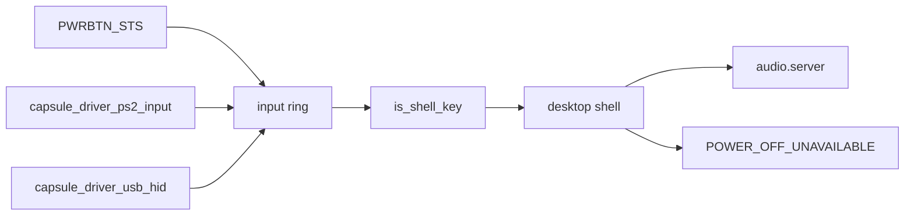

# Platform

What NONOS does with the processor cores, the IOMMU, the TPM, the ACPI buttons and the GPIO controllers under every driver, and what it does not do in this release.

## Processor cores

NONOS 0.9.2 targets x86_64 processors from Intel and AMD; AMD machines are not tested in this release, and the other targets are in [Architectures](../architectures/README.md). The image build adds the `nonos-smp` feature when `smp` is true, which is the default, and no build profile takes it out, so every image runs on every core the firmware enables (`nonos.toml:19-20`, `tools/nix/config.nix:127-150`). With it, `start_secondary_cpus` starts the [application processors](../overview/glossary.md#application-processor) at boot and logs `[SMP-PROOF] cpu_count=` with the number running (`src/kernel_core/init/start_secondary.rs:17-48`).

`start_aps` walks every secondary in `get_ap_list`, the list the platform reported, and stops at `MAX_CPUS` (256) (`src/smp/init/ap_start.rs:22-62`, `src/smp/topology/detection/state.rs:43-47`, `src/smp/constants.rs:17`). It logs how many answered and how many `cpus_online` reports, which can differ when an AP comes up late (`src/smp/init/ap_start.rs:65-83`). The same bring-up path serves Intel and AMD; a few other parts of the kernel read the vendor, for example `vendor_from_leaf0` for TSC calibration (`src/arch/x86_64/time/tsc/calibration/math.rs:28-39`).

Two details keep the cores in step:

- Where CPUID reports the MSR, each AP sets its `IA32_TSC_ADJUST` to the boot CPU's value in `align`, so every core reads the same uptime (`src/smp/ap/tsc_adjust.rs:17-24`, `src/smp/ap/tsc_adjust.rs:55-72`).
- On Intel hybrid parts each core reads its kind from CPUID leaf 0x1A, and `wake_pass` offers a woken task to an idle performance core before an efficiency core (`src/smp/topology/core_kind.rs:17-70`).

The scheduler side is in [Scheduler and SMP](../kernel/scheduler-and-smp.md).

## VT-d and AMD-Vi

The [IOMMU](../overview/glossary.md#iommu) is what confines a driver's DMA to the buffers the [hardware broker](../overview/glossary.md#hardware-broker) gave it. Every image is built with `nonos-arch-iommu` and `nonos-iommu-enforce` as part of the core feature set, so the kernel programs the Intel VT-d remapping units the ACPI DMAR table describes and turns translation on (`Cargo.toml:240-249`, `Cargo.toml:867-877`). Two parts are off in every build profile in `tools/nix/config.nix`:

- Interrupt remapping, the `nonos-iommu-intremap` feature (`Cargo.toml:879-884`).
- The AMD-Vi backend, the `nonos-iommu-amdvi` feature (`Cargo.toml:886-891`).

The vendor is read from the ACPI tables, never from CPUID: `IommuVendor` is AMD-Vi when an IVRS table is present and DMAR describes no unit (`src/memory/iommu/vendor.rs:19-31`). In every build profile, such a machine gets every domain call refused by `route` with `AmdViNotDriven` (`src/memory/iommu/backend_x86_64/route.rs:38-48`, `src/memory/iommu/backend_x86_64/refuse.rs:22-31`). `translates` then answers no for every device, so the broker lets each claim through without a domain (`src/memory/iommu/backend_x86_64/dispatch_device.rs:39-46`, `translates`). On such a machine, and on any machine without VT-d, a claimed device can reach all of memory. The broker says so in the log on each claim ([Broker API](broker-api.md#list-and-claim)).

With VT-d in service, `attach` gives each [driver capsule](../overview/glossary.md#driver-capsule) an [IOMMU domain](../overview/glossary.md#iommu-domain) of its own and moves each claimed device into it. A device that no unit in service covers stays on physical addresses, as `translates` decides (`src/hardware/broker/confine/attach.rs:30-48`), and each DMA grant made for it is counted with `note_unconfined` until it is given back (`src/hardware/broker/dma/map/record.rs:45-51`). The boot log carries one posture line from `posture_line`, `[IOMMU] <vendor> present, enforcing=<0 or 1>, unconfined grants=<n>`, and device DMA is confined only when `enforcing=1` and the count is zero, as `report_posture` explains (`src/memory/iommu/posture.rs:17-38`, `src/memory/iommu/posture.rs:69-79`). Faults are polled from the timer tick with `poll_faults` (`src/interrupts/timer/clock.rs:54-55`).

[IOMMU](../kernel/iommu.md) covers the tables, the queues and the fault reports.

## TPM 2.0

The kernel has a runtime [TPM](../overview/glossary.md#tpm) 2.0 driver in `src/security/tpm`, for quotes against a fresh nonce, attestation keys, enrolment, the machine key and the device secret. The bootloader has a separate one for measuring the boot chain, as the module comment says above `transact` (`src/security/tpm/mod.rs:17-37`).

`detect` decides which register file is behind the window at `TPM_MMIO_BASE`, 0xFED40000, from two sources (`src/security/tpm/transport/detect.rs:29-79`, `src/security/tpm/mmio/map.rs:25`):

- The ACPI TPM2 table's start method: 6 is `START_FIFO` (TIS), 7 and 8 are CRB (`src/security/tpm/transport/acpi.rs:22-28`). A table whose length or checksum is wrong is ignored by `table` (`src/security/tpm/transport/acpi.rs:56-74`).
- The part's own interface id register.

When the two disagree the TPM is refused, because the two register files overlap. A CRB control area outside the window, as an AMD firmware TPM has, is taken from the table. Start method 2, `START_ACPI`, is refused: its doorbell is an ACPI `_DSM` call and the kernel has no AML interpreter (`src/security/tpm/transport/detect.rs:35-61`). The driver uses locality 0, and `announce` logs one `[TPM] interface` line (`src/security/tpm/transport/detect.rs:81-92`).

Two host proof crates cover part of this driver. The key crate takes the kernel's FIFO (TIS) protocol in by `#[path]` and drives it against a modelled register file (`userland/tpm_key_proofs/src/security/tpm/fifo/mod.rs:17-19`). Both `tpm_key_proofs` and `tpm_enroll_proofs` run live tests against a software TPM, and the flake fails when a live test is skipped, through `needsTpm` (`tools/nix/checks.nix:32-34`). At this commit they pass with 42 and 37 tests. The CRB path and `detect` have no host test. What the TPM measures and seals is in [Measured boot and the TPM](../security/measured-boot-and-tpm.md).

## ACPI power button, lid and volume keys

The kernel scans ACPI AML for device declarations and constant packages and never executes it, so nothing that needs an AML method works: no battery level, no lid events, no control-method button. `sys_battery_status` returns -19 when no battery is declared and -95 otherwise, never a percentage (`src/syscall/microkernel/battery.rs:17-44`). `PowerDevices` records whether a lid is declared, through `is_lid` for PNP0C0D, and nothing acts on it (`src/arch/x86_64/acpi/aml/power_devices.rs:17-37`, `src/arch/x86_64/acpi/aml/power_devices.rs:63-65`). No driver changes the panel backlight.

### The power button

`classify` reads the FADT. A fixed-feature button, with the `FADT_PWR_BUTTON` flag clear, latches `PWRBTN_STS`, which the kernel names `PM1_STS_PWRBTN` (bit 8), in the PM1 status register, and the kernel can read it without AML (`src/arch/x86_64/acpi/hw/power_button.rs:17-36`). `init` arms polling only when the firmware has handed ACPI to the OS (SCI_EN set) and clears a press left from before boot (`src/arch/x86_64/acpi/power_button.rs:62-91`). `poll` runs every tenth tick of the boot CPU's clock (`src/interrupts/timer/clock.rs:43-48`), which ticks at 100 Hz as `MS_PER_TICK` assumes, so every 100 ms (`src/arch/x86_64/acpi/power_button.rs:47-48`). A press counts once per `DEBOUNCE_MS` (1000 ms) and becomes a `KEYCODE_POWER` (0x1304) press and release in the input ring (`src/arch/x86_64/acpi/hw/power_button.rs:39-41`, `src/arch/x86_64/acpi/power_button.rs:42-46`).

A `ControlMethod` button (PNP0C0C), a hardware-reduced platform or a status register outside port I/O gets one log line and stays with the firmware (`src/arch/x86_64/acpi/power_button.rs:87-89`). Those lines point to a Shut Down menu, which the desktop does not have in this release.

The desktop shell answers the Power key with `POWER_OFF_UNAVAILABLE`, the notice `Power off is not available from the desktop`, because `capsule_power` is built but not spawned and the desktop cannot shut the machine down in this release (`userland/capsule_desktop_shell/src/state/system_key.rs:42-47`, `userland/capsule_desktop_shell/src/server/handlers/system_keys.rs:39`).

### The volume keys

The volume keys are not ACPI events. The keyboard drivers post them, and a keyboard's own power key, as key codes: the PS/2 driver maps the extended scancodes 0x20, 0x2E and 0x30 to `KEYCODE_MUTE`, `KEYCODE_VOLUME_DOWN` and `KEYCODE_VOLUME_UP`, and 0x5E to `KEYCODE_POWER` (`userland/capsule_driver_ps2_input/src/keymap/set1_e0.rs:28-46`), and the USB HID driver maps the keyboard page's usage 0x66 to Power (`userland/capsule_driver_usb_hid/src/hid/usage_keycode/map.rs:57`, `KEYCODE_POWER`). The input router sends all four keys to the desktop shell whatever has focus, through `is_shell_key` (`userland/capsule_input_router/src/route/shell_keys.rs:17-34`). [Audio](audio.md#volume-and-the-volume-keys) follows a volume key from the press to the speaker.

The power button and the volume keys: Works on an x86_64 laptop (Intel Gemini Lake, 8 GB), maintainer hardware report, 6 October 2026; the image commit was not recorded.

## GPIO and pinctrl

An I2C-HID touchpad holds its interrupt line asserted while a report waits, so reading the line's level tells the touchpad driver when to read, without routing the interrupt, as the `doorbell` module explains (`userland/capsule_driver_i2c_pci/src/setup/gpio/mod.rs:17-38`). The I2C controller driver reads GPIO levels and writes no GPIO register; the same module comment says so.

The kernel registers each GPIO controller ACPI declares with `register_acpi_gpio`, as a `GPIO_CTRL` record with one BAR per community window (`src/hardware/broker/acpi_gpio/register.rs:28-49`, `src/hardware/broker/class.rs:39-42`). When no fixed window can be read from `_CRS`, as on Sunrise Point and later where firmware patches the windows in at run time, `register_acpi_gpio` computes them with `community_window` from SBREG_BAR and each community's port id (`src/hardware/broker/acpi_gpio/register.rs:33-44`, `src/arch/x86_64/acpi/aml/gpio_enumerate/sideband.rs:51-55`). `sbreg_bar` reads it from the P2SB bridge at 00:1f.1, unhiding the bridge and hiding it again as Linux does, before any capsule can reach configuration space (`src/hardware/broker/acpi_gpio/p2sb.rs:17-66`).

The controllers with a known layout:

| Controllers | ACPI ids | Source |
|---|---|---|
| Intel Broxton, Apollo Lake, Gemini Lake | INT3452, INT3453, one device per community | `userland/capsule_driver_i2c_pci/src/setup/gpio/mod.rs` |
| Intel Sunrise Point-LP and -H, Cannon Point-LP, Cannon Lake-H, Ice Lake-LP and -N, Jasper Lake, Tiger Lake-LP and -H, Alder Lake-N and -S, Meteor Lake-P | from INT344B to INTC1083 | `userland/nonos_pinctrl/src/tables/index.rs` |
| AMD FCH GPIO bank | AMD0030, AMDI0030, AMDI0031, AMDI0033 | `userland/nonos_pinctrl/src/controller.rs` |

`LAYOUTS` binds each Intel `_HID` to its pad layout (`userland/nonos_pinctrl/src/tables/index.rs:31-48`), and `AMD_IDS` lists the AMD bank (`userland/nonos_pinctrl/src/controller.rs:30-31`). Cannon Lake-H, Ice Lake-N, Tiger Lake-H and Meteor Lake-P are mapped only where the firmware writes static windows, as `STATIC_ONLY` lists (`src/arch/x86_64/acpi/aml/gpio_enumerate/hid_match.rs:19-25`). `nonos_pinctrl` itself touches no register: it turns a firmware pin number into the place its level is read, as Linux's `intel_gpio_to_pin` does (`userland/nonos_pinctrl/src/lib.rs:17-24`).

`driver.i2c_pci0` answers the touchpad driver's doorbell request in `handle` with two words, whether a line is mapped and whether it is asserted now (`userland/capsule_driver_i2c_pci/src/server/handlers/doorbell.rs:17-52`). Without a mapped layout, I2C-HID reads the pad on a timer. At this commit `pinctrl_proofs` passes 13 tests over the layouts and register arithmetic, `acpi_aml_proofs` 82 and `i2c_pci_proofs` 35. [I2C-HID touchpads](input/i2c-hid.md) covers the touchpad.

## What is not supported

- An AML interpreter, and with it battery level, lid events, a control-method power button, thermal zones and backlight control through ACPI.
- Shutting down from the desktop.
- Confined DMA on AMD-Vi machines, and interrupt remapping. No build profile turns on either feature.
- Routing a GPIO interrupt; only levels are read.

## See also

- [Drivers](README.md)
- [Broker API](broker-api.md)
- [Input drivers](input/README.md)
- [Audio](audio.md)
- [IOMMU](../kernel/iommu.md)
- [Scheduler and SMP](../kernel/scheduler-and-smp.md)
- [PCI and ACPI](../kernel/pci-and-acpi.md)
- [Measured boot and the TPM](../security/measured-boot-and-tpm.md)
- [Support matrix](../hardware/MATRIX.md)
