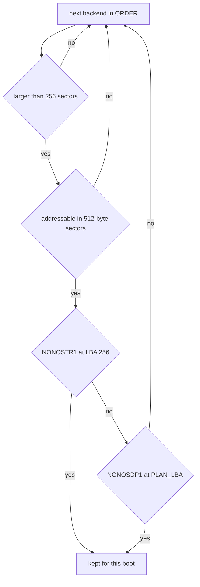

# Storage drivers

Which disks NONOS can read and write, which capsule drives each kind, and how one disk becomes the package store and the data volume.

## What is supported

| Controller | How it is matched | Capsule | State in 0.9.2 |
|---|---|---|---|
| NVMe SSD | PCI class 01h, subclass 08h, prog-if 02h | `driver.nvme0` | Served. See [NVMe](nvme.md). |
| SATA disk on an AHCI controller | PCI class 01h, subclass 06h; Intel class 01h, subclass 04h | `driver.ahci0` | Served, one disk. See [AHCI and Intel RST](ahci-and-rst.md). |
| NVMe behind an Intel VMD | 13 Intel VMD device ids | kernel PCI layer, then `driver.nvme0` | In the kernel, not run on hardware or under QEMU. See [Intel VMD](vmd.md). |
| eMMC on an SD host controller | PCI class 08h, subclass 05h | `driver.ahci0` | Served when no SATA disk comes up, not tested on hardware. See [SD cards and eMMC](sd-and-emmc.md). |
| Realtek PCIe SD card reader | 10ec:5227, 10ec:522a | `driver.rtsx0` | Source and host proofs only, not in the image. See [SD cards and eMMC](sd-and-emmc.md). |
| USB stick or USB disk | interface class 08h, subclass 06h, protocol 50h | `driver.usb_msc0` | Served on root ports. See [USB mass storage](usb-mass-storage.md). |
| virtio-blk under QEMU | 1af4:1001, 1af4:1042 | `driver.virtio_blk0` | Served. |

The virtio-blk ids are `VIRTIO_BLK_TRANSITIONAL` and `VIRTIO_BLK_MODERN` (`userland/capsule_driver_virtio_blk/src/constants/pci.rs:16-18`).

Every storage driver is a [capsule](../../overview/glossary.md#capsule) in ring 3. The PCI drivers take their controller from the [hardware broker](../../overview/glossary.md#hardware-broker); the USB mass-storage driver reaches its device through the xHCI driver. The kernel block layer decides which disk holds NONOS, and the file system above it reads what is on that disk.

## How a disk becomes the NONOS disk

The kernel block layer asks the drivers in a fixed order and keeps the first disk that carries NONOS: a USB stick first, then NVMe, then SATA or eMMC, then virtio-blk (`src/hardware/block_device/select.rs:39-48`, `ORDER`). The firmware does not tell the kernel which disk it booted, so this order stands in for that answer. A stick goes first because a person who boots from a stick keeps that boot's state on it.

The cost falls on machines with an xHCI controller: every disk waits while `driver.usb_msc0` looks for a stick. With no stick plugged in, that look ends once the ports have had 1.5 s to report a device (`userland/capsule_driver_usb_msc/src/scan/scanner.rs:38-44`, `SETTLE_MS`).

For each disk the layer checks three things (`src/hardware/block_device/identify.rs:41-61`, `identify`):

1. The disk is larger than 256 sectors (`src/hardware/block_device/identify.rs:46-48`, `STORE_LBA`).
2. The disk is addressable in 512-byte sectors (`src/hardware/block_device/fit.rs:22-30`, `sectors_fit`).
3. LBA 256 starts with `NONOSTR1`, the header of the [package store](../../overview/glossary.md#package-store), or LBA 245760 starts with `NONOSDP1`, the [disk plan](../../overview/glossary.md#disk-plan) (`src/hardware/block_device/identify.rs:24-28`, `STORE_MAGIC`, `PLAN_MAGIC`).

The first disk that passes is kept for the rest of the boot. A driver that cannot answer yet stops the search instead of letting a later disk win, so reads and writes never split across two disks (`src/hardware/block_device/select.rs:59-72`, `Found::Refused`). The disk plan sits at `PLAN_LBA`, 120 MiB in (`src/fs/blockfs_volume/plan_types.rs:35-37`, `PLAN_LBA`).

Until a disk is kept, and for as long as the kept disk is a USB stick, a read that the loader's copy in memory can answer is answered from that copy (`src/hardware/block_device/read.rs:25-41`, `copy_answers`). The copy holds the live plan's sector and the model files it names, in at most 31 ranges (`src/hardware/block_device/mirror/record.rs:19-20`, `EXTENTS`). So a live boot opens its volume even from a stick no kernel driver serves.

## What the console shows

The block layer writes its own lines, so they appear whatever the drivers may print:

- one line per disk it asks, repeated only when what it saw changes, for example `[BLOCK] asked NVMe (driver.nvme0): ...` with the sector count and the first eight bytes at LBA 256 (`src/hardware/block_device/seen.rs:68-83`, `line`);
- the disk it keeps, for example `[BLOCK] NONOS disk on NVMe (driver.nvme0)` (`src/hardware/block_device/announce.rs:21-31`, `announce`);
- with no disk found, `[BLOCK] no disk carries the NONOS store or disk plan yet; block I/O refused` (`src/hardware/block_device/select.rs:73-78`, `TOLD_NONE`);
- one `[USB-MSC]` line saying where the stick search stands (`src/hardware/usb_msc_capsule/report.rs:32-38`, `report_line`).

The drivers' own lines are a different matter. They write with `mk_debug`, which needs the Debug capability. The kernel never grants it to `driver.ahci0` (`src/hardware/ahci_capsule/spawn.rs:51-57`, `requested_caps`), and the spawn grants in `src/hardware/xhci_capsule/spawn.rs`, `src/userspace/capsule_driver_usb_hid/spawn.rs` and `src/userspace/capsule_driver_usb_msc/spawn.rs` leave it out as well. `driver.nvme0` and `driver.virtio_blk0` get it only in an image built with `capsule-serial-debug` (`src/hardware/nvme_capsule/spawn.rs:51-53`, `serial_debug_cap`). The standard, qemu and dev profiles have that feature through `microkernel-desktop-base`; the hardened and air-gapped profiles drop it (`tools/nix/config.nix:60-62`, `debugFeatures`).
