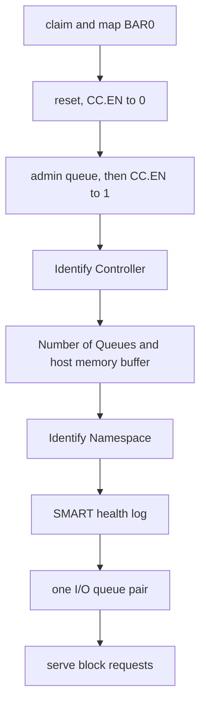

# NVMe

What the NVMe capsule `driver.nvme0` does with an NVMe SSD, where its limits are, and how it was verified.

## What it drives

`driver.nvme0` takes any PCI function of class 01h, subclass 08h, prog-if 02h whose BAR0 is a memory BAR of at least 16 KiB (`userland/capsule_driver_nvme/src/discover/pci_match.rs:23-38`, `is_nvme`, `has_register_bar`). There is no vendor list: every NVMe controller matches by its class.

The [capsule](../../overview/glossary.md#capsule) considers up to four controllers (`userland/capsule_driver_nvme/src/discover/found.rs:20-21`, `MAX_CONTROLLERS`). An Intel Optane memory cache module, 8086:2522, is tried after every other controller, because it caches another disk and holds no file system of its own (`userland/capsule_driver_nvme/src/discover/rank.rs:24-29`, `CACHE_ONLY`). One capsule serves one controller: the first disk whose namespace gets an I/O queue. A disk that failed to come up is retried before a cache module or an empty namespace is served instead, since it may be the internal SSD, slow after an unclean shutdown (`userland/capsule_driver_nvme/src/discover/choice.rs:48-73`, `choose`). A controller that is not chosen is disabled and released.

## Bring-up

The capsule claims the function through the [hardware broker](../../overview/glossary.md#hardware-broker), turns on Memory Space, Bus Master and Interrupt Disable, maps BAR0 and asks for one MSI-X vector (`userland/capsule_driver_nvme/src/setup/sequence/bring_up.rs:33-42`, `bring_up`). It refuses a controller whose CAP or VS register reads 0, or whose CAP.MQES is 0 (`userland/capsule_driver_nvme/src/controller/info/is_nvme_register_block.rs:20-23`, `is_nvme_register_block`). It also refuses one whose doorbell stride would put a doorbell past the part of BAR0 the broker mapped (`userland/capsule_driver_nvme/src/controller/info/doorbells_fit.rs:21-35`, `doorbells_fit`).

It then resets the controller (CC.EN to 0), programs the admin queue, and enables it with 64-byte submission and 16-byte completion entries (`userland/capsule_driver_nvme/src/admin/controller.rs:38-45`, `CC_IOSQES_64`, `CC_IOCQES_16`). The controller's smallest memory page size must be 4 KiB, or it is refused as `UnsupportedPageSize`. After the enable it sends Identify Controller, then SET FEATURES Number of Queues and the host memory buffer, then Identify Namespace, reads the SMART health log and creates one I/O queue pair (`userland/capsule_driver_nvme/src/setup/sequence/after_enable.rs:29-58`, `after_enable`). Only then does it serve block requests. A drive that refuses the SMART health log leaves a zeroed snapshot and is served all the same (`userland/capsule_driver_nvme/src/setup/sequence/served.rs:44-55`, `SmartHealth::unread`).

Every completion is polled. MSI-X is asked for but not needed: a refused bind leaves the driver polling, and the driver then sets INTMS so the controller's pin and MSI interrupts stay masked (`userland/capsule_driver_nvme/src/setup/irq.rs:23-46`, `mask_unbound`).

## NVMe versions

A controller whose VS register reads 0 is refused at bring-up. Past that, the version matters in one place: the active namespace list, Identify CNS 02h, is asked only of a controller that reports NVMe 1.1 or later, since NVMe 1.0 has no such list, and otherwise NSID 1 is used (`userland/capsule_driver_nvme/src/admin/active_ns.rs:46-58`, `lists_active_namespaces`, `FALLBACK_NSID`). A controller that refuses the list is served through NSID 1 as well (`userland/capsule_driver_nvme/src/setup/namespace.rs:50-55`, `list_refused`).

## Namespaces and formats

One namespace is served per controller: the first active NSID the list names. It gets an I/O queue only when all of these hold (`userland/capsule_driver_nvme/src/nvm/geometry/check.rs:31-70`, `NamespaceGeometry::check`):

- the controller reports a namespace and its size is not 0;
- FLBAS selects a format the namespace has;
- that format carries no metadata;
- its block size is 512 or 4096 bytes;
- the controller's MDTS lets one command move at least one block.

Otherwise the controller is still served for identify and health, and read and write requests answer `E_NODEV` (`userland/capsule_driver_nvme/src/server/handlers/read.rs:28-31`, `E_NODEV`). The kernel addresses 512-byte sectors and maps them onto a 4096-byte namespace itself; see [Storage drivers](README.md#sector-sizes).

## Queues and transfer sizes

- The admin queue has 64 entries (`userland/capsule_driver_nvme/src/admin/queue/constants.rs:17`, `ADMIN_ENTRIES`).
- There is one I/O submission and completion queue pair, queue id 1, with 8 entries each (`userland/capsule_driver_nvme/src/nvm/constants.rs:17-18`, `IO_QID`, `IO_ENTRIES`). Before creating it the driver asks for exactly one pair with SET FEATURES Number of Queues, and carries on when the controller refuses (`userland/capsule_driver_nvme/src/setup/hmb/queues.rs:24-43`, `number_of_queues`).
- One command moves at most 64 sectors of 512 bytes, the 32 KiB data buffer (`userland/capsule_driver_nvme/src/nvm/constants.rs:22-24`, `MAX_SECTORS`, `DATA_BYTES`). A smaller MDTS lowers that, and MDTS 0 means the whole buffer (`userland/capsule_driver_nvme/src/nvm/geometry/transfer.rs:21-37`, `max_transfer_bytes`).
- A transfer of more than two 4 KiB pages uses a PRP list (`userland/capsule_driver_nvme/src/nvm/prp.rs:20-35`, `build_prp`).
- The kernel's client cuts larger requests into commands of that size (`src/hardware/nvme_capsule/client/write_blocks.rs:47-52`, `chunks`).

## Host memory buffer

A DRAM-less SSD keeps its mapping tables in host memory when the host offers some. The driver offers what Identify Controller asks for (`userland/capsule_driver_nvme/src/admin/hmb/ask.rs:20-31`, `HmbAsk`):

- the preferred size up to 64 MiB, raised to the controller's minimum when that is larger, and never more than 128 MiB (`userland/capsule_driver_nvme/src/admin/hmb/plan.rs:24-27`, `BUDGET_PAGES`, `CEILING_PAGES`);
- in pieces of at most 4 MiB, each one broker DMA map, and at most 256 pieces, as many as one 4 KiB page of descriptors names (`userland/capsule_driver_nvme/src/admin/hmb/plan.rs:28-31`, `MAX_CHUNK_PAGES`, `MAX_DESCRIPTORS`);
- nothing when the controller asks for none, needs more than 128 MiB, or wants pieces larger than 4 MiB (`userland/capsule_driver_nvme/src/admin/hmb/plan.rs:51-57`, `plan`).

SET FEATURES Host Memory Buffer gets 30 s, because a controller may copy its tables into the buffer before it answers (`userland/capsule_driver_nvme/src/admin/hmb/budget.rs:22-26`, `ENABLE_TIMEOUT_MS`). A controller that refuses the buffer is served without one. A controller that never answers fails the attempt, and it is disabled before the memory is unmapped, because only a disable takes the buffer back (`userland/capsule_driver_nvme/src/setup/hmb/held.rs:25-53`, `after_disable`). The same holds when the SMART health log gets no answer right after the buffer was given (`userland/capsule_driver_nvme/src/setup/sequence/served.rs:44-55`, `hmb_given`). Once an attempt that asked for the queue count and the buffer has failed, no later attempt asks for either (`userland/capsule_driver_nvme/src/setup/hmb/extras.rs:22-39`, `EXTRAS_FAILED`).

## Timeouts

| Wait | Limit | Where |
|---|---|---|
| Ready after CC.EN, and disabled after a reset | CAP.TO times 500 ms, at least 5 s, at most 127.5 s | `ready_timeout_ms` in `userland/capsule_driver_nvme/src/admin/ready_step.rs:20-39` |
| An admin command | 5 s | `COMPLETION_TIMEOUT_MS` in `userland/capsule_driver_nvme/src/admin/queue/constants.rs:23` |
| SET FEATURES Number of Queues | 5 s | `QUEUES_TIMEOUT_MS` in `userland/capsule_driver_nvme/src/admin/hmb/budget.rs:27-28` |
| SET FEATURES Host Memory Buffer | 30 s | `ENABLE_TIMEOUT_MS` in `userland/capsule_driver_nvme/src/admin/hmb/budget.rs:22-26` |
| A read, write or flush | 30 s | `COMPLETION_TIMEOUT_MS` in `userland/capsule_driver_nvme/src/nvm/constants.rs:26-29` |

A wait reads the clock once every 1024 polls, so the loop makes no system call per poll (`userland/capsule_driver_nvme/src/admin/completion_wait.rs:22-24`, `DEADLINE_CHECK_SPINS`). A CSTS that reads all ones, a device gone from the bus, ends a wait at once, and CSTS.CFS ends the enable wait (`userland/capsule_driver_nvme/src/admin/ready_step.rs:53-75`, `ready_step`). A completion entry is taken only when its phase tag, queue id and command id all match the command, and any other entry is consumed while the wait goes on (`userland/capsule_driver_nvme/src/admin/completion_wait.rs:48-92`, `wait_noting_foreign`). A read or write whose wait ran out is waited out before the data buffer is used again, so a late completion cannot land under the next request (`userland/capsule_driver_nvme/src/nvm/wait.rs:41-53`, `settle`).

## Operations and access

The capsule serves `driver.nvme0` on service endpoint 4220 (`userland/capsule_driver_nvme/Capsule.mk:13`, `CAPSULE_SERVICE_ENDPOINT`). Its operations are listed in `userland/capsule_driver_nvme/src/protocol/ops.rs:17-25` (`OP_HEALTHCHECK`), with reply sizes in `userland/capsule_driver_nvme/src/protocol/limits.rs:17-25` (`CONTROLLER_INFO_PAYLOAD_LEN`).

| Operation | Answers |
|---|---|
| `OP_HEALTHCHECK` | liveness, to any sender |
| `OP_CONTROLLER_INFO` | a 52-byte register and setup record |
| `OP_IDENTIFY_CONTROLLER` | 88 bytes of Identify Controller fields |
| `OP_IDENTIFY_NAMESPACE` | 36 bytes for the served namespace |
| `OP_SMART_HEALTH` | 177 bytes of SMART health fields |
| `OP_CAPACITY` | the namespace size in LBAs |
| `OP_READ_BLOCKS`, `OP_WRITE_BLOCKS`, `OP_FLUSH` | block I/O |

Every operation but the health check answers only the kernel's own client and a sender holding `StoreWrite`; see [Storage drivers](README.md#who-may-read-and-write-a-disk).

The capsule holds the [capabilities](../../overview/glossary.md#capability) IPC, Memory, Driver, DeviceEnum, Mmio, Irq and Dma, the word 0xF8018 (`userland/capsule_driver_nvme/Capsule.mk:15-16`, `CAPSULE_REQUIRED_CAPS`). A kernel compiled with `capsule-serial-debug` also grants Debug, 0x100, and only then do the capsule's own lines reach the console: each controller it saw, each admin command that failed with its status, and why a namespace got no I/O queue (`userland/capsule_driver_nvme/Capsule.mk:17-21`, `CAPSULE_OPTIONAL_CAPS`). The standard, qemu and dev profiles compile that feature in; the hardened and air-gapped profiles do not (`tools/nix/config.nix:60-62`, `debugFeatures`).

## When it gives up

On a machine whose inventory shows no NVMe controller the kernel does not start the capsule, and its boot log says `no controller present, not spawned` for `DRIVER-NVME` (`src/userspace/init/spawn_plan/drivers_storage.rs:55-60`, `spawn_nvme`). A capsule that starts and finds no usable controller exits with code 2 before claiming anything; with Debug it first says `driver.nvme: no controller present, not started` (`userland/libc/src/bringup/run.rs:64-67`, `say_absent`). One attempt brings up the controllers found in rank order until one gives a disk with an I/O queue, and a failed attempt is retried on the shared schedule of 7 tries described in [Storage drivers](README.md#when-drivers-start-and-when-they-give-up) (`userland/capsule_driver_nvme/src/setup/sequence/run.rs:25-67`, `run`).
