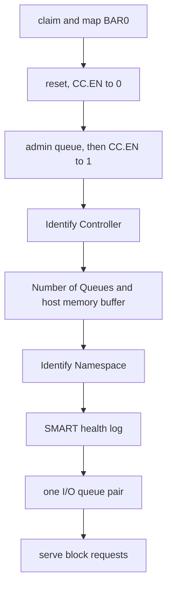

# NVMe

What the NVMe capsule `driver.nvme0` does with an NVMe SSD, where its limits are, and how it was verified.

## What it drives

`driver.nvme0` takes any PCI function of class 01h, subclass 08h, prog-if 02h whose BAR0 is a memory BAR of at least 16 KiB (`userland/capsule_driver_nvme/src/discover/pci_match.rs:23-38`, `is_nvme`, `has_register_bar`). There is no vendor list: every NVMe controller matches by its class.

The [capsule](../../overview/glossary.md#capsule) considers up to four controllers (`userland/capsule_driver_nvme/src/discover/found.rs:20-21`, `MAX_CONTROLLERS`). An Intel Optane memory cache module, 8086:2522, is tried after every other controller, because it caches another disk and holds no file system of its own (`userland/capsule_driver_nvme/src/discover/rank.rs:24-29`, `CACHE_ONLY`). One capsule serves one controller: the first disk whose namespace gets an I/O queue. A disk that failed to come up is retried before a cache module or an empty namespace is served instead, since it may be the internal SSD, slow after an unclean shutdown (`userland/capsule_driver_nvme/src/discover/choice.rs:48-73`, `choose`). A controller that is not chosen is disabled and released.

## Bring-up

The capsule claims the function through the [hardware broker](../../overview/glossary.md#hardware-broker), turns on Memory Space, Bus Master and Interrupt Disable, maps BAR0 and asks for one MSI-X vector (`userland/capsule_driver_nvme/src/setup/sequence/bring_up.rs:33-42`, `bring_up`). It refuses a controller whose CAP or VS register reads 0, or whose CAP.MQES is 0 (`userland/capsule_driver_nvme/src/controller/info/is_nvme_register_block.rs:20-23`, `is_nvme_register_block`). It also refuses one whose doorbell stride would put a doorbell past the part of BAR0 the broker mapped (`userland/capsule_driver_nvme/src/controller/info/doorbells_fit.rs:21-35`, `doorbells_fit`).

It then resets the controller (CC.EN to 0), programs the admin queue, and enables it with 64-byte submission and 16-byte completion entries (`userland/capsule_driver_nvme/src/admin/controller.rs:38-45`, `CC_IOSQES_64`, `CC_IOCQES_16`). The controller's smallest memory page size must be 4 KiB, or it is refused as `UnsupportedPageSize`. After the enable it sends Identify Controller, then SET FEATURES Number of Queues and the host memory buffer, then Identify Namespace, reads the SMART health log and creates one I/O queue pair (`userland/capsule_driver_nvme/src/setup/sequence/after_enable.rs:29-58`, `after_enable`). Only then does it serve block requests. A drive that refuses the SMART health log leaves a zeroed snapshot and is served all the same (`userland/capsule_driver_nvme/src/setup/sequence/served.rs:44-55`, `SmartHealth::unread`).

Every completion is polled. MSI-X is asked for but not needed: a refused bind leaves the driver polling, and the driver then sets INTMS so the controller's pin and MSI interrupts stay masked (`userland/capsule_driver_nvme/src/setup/irq.rs:23-46`, `mask_unbound`).

## NVMe versions

A controller whose VS register reads 0 is refused at bring-up. Past that, the version matters in one place: the active namespace list, Identify CNS 02h, is asked only of a controller that reports NVMe 1.1 or later, since NVMe 1.0 has no such list, and otherwise NSID 1 is used (`userland/capsule_driver_nvme/src/admin/active_ns.rs:46-58`, `lists_active_namespaces`, `FALLBACK_NSID`). A controller that refuses the list is served through NSID 1 as well (`userland/capsule_driver_nvme/src/setup/namespace.rs:50-55`, `list_refused`).

## Namespaces and formats

One namespace is served per controller: the first active NSID the list names. It gets an I/O queue only when all of these hold (`userland/capsule_driver_nvme/src/nvm/geometry/check.rs:31-70`, `NamespaceGeometry::check`):

- the controller reports a namespace and its size is not 0;
- FLBAS selects a format the namespace has;
- that format carries no metadata;
- its block size is 512 or 4096 bytes;
- the controller's MDTS lets one command move at least one block.

Otherwise the controller is still served for identify and health, and read and write requests answer `E_NODEV` (`userland/capsule_driver_nvme/src/server/handlers/read.rs:28-31`, `E_NODEV`). The kernel addresses 512-byte sectors and maps them onto a 4096-byte namespace itself; see [Storage drivers](README.md#sector-sizes).

## Queues and transfer sizes

- The admin queue has 64 entries (`userland/capsule_driver_nvme/src/admin/queue/constants.rs:17`, `ADMIN_ENTRIES`).
- There is one I/O submission and completion queue pair, queue id 1, with 8 entries each (`userland/capsule_driver_nvme/src/nvm/constants.rs:17-18`, `IO_QID`, `IO_ENTRIES`). Before creating it the driver asks for exactly one pair with SET FEATURES Number of Queues, and carries on when the controller refuses (`userland/capsule_driver_nvme/src/setup/hmb/queues.rs:24-43`, `number_of_queues`).
- One command moves at most 64 sectors of 512 bytes, the 32 KiB data buffer (`userland/capsule_driver_nvme/src/nvm/constants.rs:22-24`, `MAX_SECTORS`, `DATA_BYTES`). A smaller MDTS lowers that, and MDTS 0 means the whole buffer (`userland/capsule_driver_nvme/src/nvm/geometry/transfer.rs:21-37`, `max_transfer_bytes`).
- A transfer of more than two 4 KiB pages uses a PRP list (`userland/capsule_driver_nvme/src/nvm/prp.rs:20-35`, `build_prp`).
- The kernel's client cuts larger requests into commands of that size (`src/hardware/nvme_capsule/client/write_blocks.rs:47-52`, `chunks`).
