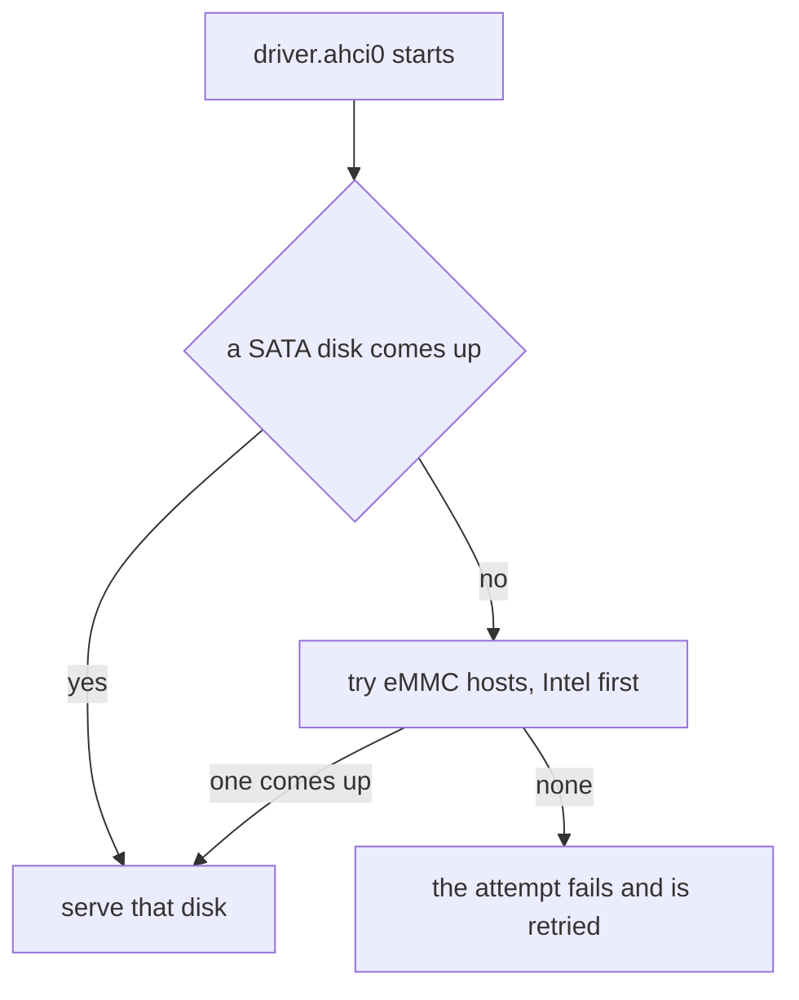

# SD cards and eMMC

What NONOS does with soldered eMMC storage and with SD card readers in this release.

## In short

| Hardware | Matched by | Driver | State in 0.9.2 |
|---|---|---|---|
| eMMC on an Intel SD host controller | PCI class 08h, subclass 05h, 13 Intel device ids | `driver.ahci0` | Served when no SATA disk comes up |
| eMMC on another SD host controller | PCI class 08h, subclass 05h, slot type embedded | `driver.ahci0` | Served the same way, but only when the capsule was started for another controller |
| SD card or SDIO slot on an Intel SD host controller | 14 Intel device ids | none | Refused by id |
| SD card slot on another SD host controller | slot type not embedded | none | Skipped |
| Realtek PCIe card reader RTS5227 or RTS522A | 10ec:5227, 10ec:522a | `driver.rtsx0` | Written, not in the image |
| Other Realtek PCIe card readers | 12 more Realtek ids | none | Not supported |
| USB card reader | USB mass storage, Bulk-Only | `driver.usb_msc0` | Served |

So an SD card in a built-in PCIe or SDHCI slot cannot be read in this release. An SD card in a USB card reader is served by the USB mass-storage driver.

## eMMC

eMMC is storage soldered to the board. NONOS serves it from the SATA [capsule](../../overview/glossary.md#capsule) `driver.ahci0` until the eMMC driver has publisher keys of its own (`src/hardware/inventory/emmc.rs:17-34`, `INTEL_EMMC_DEVICE_IDS`). The kernel starts that capsule only when its inventory sees an AHCI controller or an Intel eMMC host from that list (`src/userspace/init/spawn_plan/drivers_storage.rs:26-41`, `spawn_ahci`). An eMMC on any other SD host is therefore reached only on a machine that also has an AHCI controller or a listed Intel eMMC host.

The capsule tries SATA first, and tries the eMMC hosts, Intel first, only when no SATA disk comes up. Whichever disk comes up first, the capsule will serve that disk. When neither gives one, the attempt fails and is retried on the shared schedule (`userland/capsule_driver_ahci/src/served/bring_up.rs:25-53`, `bring_up`). The kernel block layer sees the eMMC disk as its SATA backend, `driver.ahci0`. When that driver has not come up on a machine with an Intel eMMC host and no SATA controller, the installer's list says `eMMC controller present, its driver did not come up` (`userland/nonos_blk_client/src/disks/scan.rs:154-162`, `fault`).

### Which hosts

A PCI function of class 08h, subclass 05h with prog-if up to 02h is an SD host controller. The capsule takes (`userland/capsule_driver_ahci/src/emmc/pci/classify.rs:31-46`, `classify`):

- the 13 Intel eMMC hosts, from Bay Trail to Jasper Lake, first (`userland/capsule_driver_ahci/src/emmc/pci/ids.rs:23-39`, `INTEL_EMMC`);
- any other SD host, but only when its slot reports the embedded slot type (`userland/capsule_driver_ahci/src/emmc/platform/open/embedded.rs:28-44`, `check_embedded`);
- never the 14 Intel SD card and SDIO hosts (`userland/capsule_driver_ahci/src/emmc/pci/ids.rs:41-57`, `INTEL_NOT_EMMC`).

The kernel's own start list holds 12 of the 13 Intel ids: 8086:9d2b (Sunrise Point) is missing from `INTEL_EMMC_DEVICE_IDS` in `src/hardware/inventory/emmc.rs:32-34`. On a machine with that host and no SATA controller the capsule is not started.

### How it talks to the card

The host is driven as SDHCI 3.0 or 4.x and the card as JEDEC eMMC 5.1 (`userland/capsule_driver_ahci/src/emmc/mod.rs:17-18`, `SDHCI`).

- Identification runs at 400 kHz. The card then runs High Speed SDR at 52 or 26 MHz when card and host both take it, and legacy timing at 20 MHz otherwise (`userland/capsule_driver_ahci/src/emmc/sdhci/clock.rs:23-30`, `HS52_HZ`).
- The bus is 8, 4 or 1 lines wide, 8 only on a host that offers it: the widest whose EXT_CSD reads back the same (`userland/capsule_driver_ahci/src/emmc/mmc/speed/select.rs:27-35`, `widths`).
- HS200, HS400 and DDR52 are not attempted. The first two need tuning (`userland/capsule_driver_ahci/src/emmc/mmc/speed/mod.rs:17-23`, `mmc_select_timing`).
- ADMA2 descriptors move the data. Completions are polled, and the INTx pin is turned off (`userland/capsule_driver_ahci/src/emmc/platform/open/open_host.rs:40-57`, `MK_PCI_CMD_INTX_DISABLE`).
- One request moves at most 64 sectors of 512 bytes (`userland/capsule_driver_ahci/src/emmc/disk/sizes.rs:19-21`, `MAX_SECTORS`).

### How it was verified

`userland/emmc_proofs` runs the real bring-up, read, write, flush and recovery against a register-level model of an SDHCI host with an eMMC device behind it (`userland/emmc_proofs/src/lib.rs:17-21`, `model`). It is the [proof crate](../../overview/glossary.md#proof-crate) for this path, and its 83 tests pass on this commit. eMMC has not been tested on hardware in this release, and no QEMU target in `mk/` attaches an SD host.
