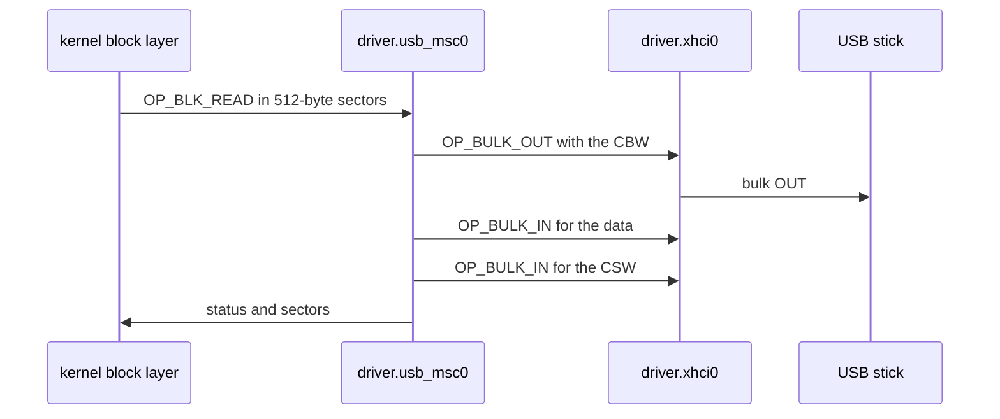

# USB mass storage

How NONOS reads and writes USB sticks and USB disks through `driver.usb_msc0`, and what it does not support.

## What it binds

`driver.usb_msc0` binds a USB interface of class 08h (mass storage), subclass 06h (SCSI transparent) and protocol 50h, the Bulk-Only Transport, with one bulk IN and one bulk OUT endpoint (`userland/capsule_driver_usb_msc/src/descriptors/visitor.rs:43-52`, `PROTOCOL_BULK_ONLY`). USB Attached SCSI (UAS) is not implemented in this release, so a device that offers only UAS is not served. The driver reads the SuperSpeed endpoint companion, so a USB 3 device's burst size reaches the controller (`userland/capsule_driver_usb_msc/src/descriptors/visitor.rs:71-93`, `visit_companion`).

## Where it sits

The driver is a class [capsule](../../overview/glossary.md#capsule) with no hardware [capability](../../overview/glossary.md#capability): it holds CoreExec, IPC and Memory, the word 0x19 (`userland/capsule_driver_usb_msc/Capsule.mk:15-18`, `CAPSULE_REQUIRED_CAPS`). Every transfer goes through the xHCI driver `driver.xhci0`, which the kernel lets only this driver and `driver.usb_hid0` reach (`src/services/registry/held_table.rs:30-32`, `driver.xhci0`). Its own endpoint, service 4224, is held to the kernel: no capsule may send to it (`userland/capsule_driver_usb_msc/Capsule.mk:13`, `CAPSULE_SERVICE_ENDPOINT`).

The kernel block layer sends `OP_BLK_READ`, `OP_BLK_WRITE` or `OP_BLK_FLUSH` in 512-byte sectors (`userland/capsule_driver_usb_msc/src/protocol/ops.rs:32-35`, `OP_BLK_READ`). A read, or a write that covers whole device blocks, becomes one SCSI command; a write that covers part of a block becomes a read and a write. Each command goes out in a Command Block Wrapper (CBW) with `OP_BULK_OUT`, its data moves in pieces of at most 4096 bytes, and the answer comes back in a Command Status Wrapper (CSW) read with `OP_BULK_IN` (`userland/capsule_driver_usb_msc/src/disk/bot.rs:17-27`, `data_phase`; `userland/capsule_driver_xhci/src/protocol/limits.rs:37-38`, `BULK_MAX`).

## Finding the device

The kernel starts this driver on any machine with an xHCI controller, since a stick is known only after USB enumeration. The driver then (`userland/capsule_driver_usb_msc/src/scan/scanner.rs:38-44`, `WINDOW_MS`):

- waits up to 30 s for `driver.xhci0` to register;
- looks for a device for 10 s after that, and gives the ports 1.5 s to report their devices;
- once that window closes, looks at the ports again every 5 s, so a stick plugged in late is still taken.

Each root port gets three tries (`userland/capsule_driver_usb_msc/src/scan/pass.rs:27-28`, `TRIES`). A device of another class is left to its own driver. The first device that binds is served for the rest of the boot, and the driver does not look for a second one (`userland/capsule_driver_usb_msc/src/server/runner.rs:47-71`, `Medium::Absent`).

The driver looks at the root ports of the xHCI controllers only. A stick behind a USB hub is not found in this release (`userland/capsule_driver_usb_msc/src/xhci/port.rs:34-47`, `connected_ports`); see [USB hubs](../usb/hubs.md).
