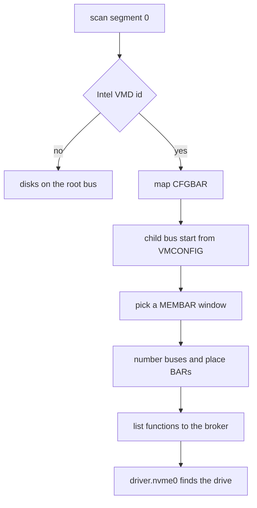

# Intel VMD

How NONOS reaches an NVMe drive that firmware hides behind an Intel Volume Management Device, what has not been tested, and what to change in firmware setup when the drive does not show.

## What VMD does to a disk

With RST or VMD on in firmware, the NVMe drives, and on some boards the SATA controller, leave PCI segment 0. They sit in a private PCI domain behind one Intel function: config space through its BAR0 (CFGBAR), memory through BAR2 and BAR4 (`src/drivers/pci/vmd/domain/mod.rs:17-30`, `ConfigPort`). No disk driver can see a drive there until something brings that domain up, and the installer then shows no disk.

## What NONOS does

The kernel's PCI layer brings each VMD's domain up itself, with Linux's vmd driver as the reference its comments name, and lists the drives behind it after the functions of segment 0 (`src/drivers/pci/manager/probe.rs:136-147`, `children`). For each VMD it finds (`src/drivers/pci/vmd/bring_up.rs:33-73`, `bring_up`):

1. It turns on memory decoding and bus mastering on the VMD.
2. It maps CFGBAR, which must be at least 1 MiB: one MiB of config space per child bus.
3. It reads where the child buses start from VMCAP (0x40) and VMCONFIG (0x44): bus 0, 128 or 224 (`src/drivers/pci/vmd/domain/bus.rs:23-40`, `bus_start`).
4. It picks the window for child memory from one MEMBAR: MEMBAR1 below 4 GiB first, then MEMBAR2 past the VMD's own 8 KiB of MSI-X pages, then MEMBAR1 above 4 GiB (`src/drivers/pci/vmd/domain/window.rs:36-57`, `pick_window`).
5. It goes on to number the child buses and place every child BAR itself, instead of trusting what the firmware left.
6. It gives the domain a PCI segment from 0x1000 up, and routes the domain's config space through CFGBAR (`src/drivers/pci/vmd/registry.rs:26-28`, `SEGMENT_BASE`).

The kernel does a scan of segment 0 first, then goes on to list the functions behind each VMD to the [hardware broker](../../overview/glossary.md#hardware-broker) like any others. The NVMe [capsule](../../overview/glossary.md#capsule) `driver.nvme0` then finds the drive by its class, as on a machine without VMD; see [NVMe](nvme.md).

A drive behind a VMD never interrupts: its MSI lands on the VMD's own vectors, which nothing services, so it is listed with no interrupt and the NVMe driver polls, as it does on every machine (`src/drivers/pci/vmd/probe.rs:55-57`, `interrupt_line`). Its DMA reaches the IOMMU under the VMD's requester id, and the broker uses that id when it confines the drive to its capsule's domain (`src/drivers/pci/vmd/registry.rs:53-60`, `dma_requester`; `src/hardware/broker/confine/table.rs:35-43`, `pci_address`).

The VMD function itself gets no driver. The kernel's inventory files a VMD of class 01h as `StorageVmd`, which nothing starts (`src/hardware/inventory/classify_storage.rs:26-36`, `StorageVmd`), and the SATA capsule refuses it by id (`userland/capsule_driver_ahci/src/discover/rule.rs:33-41`, `INTEL_VMD_DEVICE_IDS`).

## Which VMDs

Thirteen Intel device ids, taken from the table of Linux's vmd driver: 8086:201d, 28c0, 467f, 4c3d, 7d0b, 9a0b, a77f, ad0b, b06f, b60b, b07f, d70b and d73b (`src/drivers/pci/vmd/domain/ids.rs:20-29`, `VMD_DEVICE_IDS`). 8086:28c1 is left out: the comment there says its bus range comes from BIOS data in MEMBAR2, which NONOS does not read, so a drive behind it stays hidden. For twelve of the ids the child buses may start above bus 0, as VMCAP and VMCONFIG say; 201d always starts at bus 0 (`src/drivers/pci/vmd/domain/ids.rs:31-36`, `BUS_RESTRICTED`).

## What has not been tested

The bring-up has not run on a machine with a VMD in this release, and no QEMU target in `mk/` attaches one. What is tested is the part that needs no hardware. `userland/kernel_proofs` drives the id table, the bus start, the CFGBAR offsets, the window choice and the whole assignment walk against a simulated bus (`userland/kernel_proofs/src/vmd_domain/mod.rs:17-33`, `sim`). The crate's 388 tests pass on this commit.
