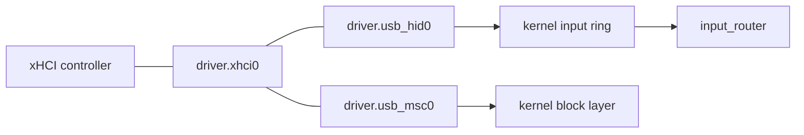

# USB and the xHCI host controller

How NONOS drives USB: one xHCI capsule owns every USB controller, and class capsules above it bind keyboards, mice and disks.

## What is supported

| Hardware | Matched by | Capsule | State in 0.9.2 |
|---|---|---|---|
| xHCI host controller, USB 2 and USB 3 ports | PCI class 0Ch, subclass 03h, prog-if 30h | `driver.xhci0` | Served |
| Intel Thunderbolt and USB4 xHCI controllers | 15 Intel device ids | `driver.xhci0` | Served after the chipset's controller, best effort |
| EHCI, OHCI and UHCI host controllers | prog-if 20h, 10h and 00h | none | Not supported: no driver |
| Keyboards and mice in boot protocol | interface class 03h | `driver.usb_hid0` | Served. See [USB keyboards and mice](hid.md). |
| USB sticks and disks, Bulk-Only | interface class 08h | `driver.usb_msc0` | Served. See [USB mass storage](../storage/usb-mass-storage.md). |
| Hubs | interface class 09h | `driver.usb_hid0` | The hub comes up; devices behind it are not reached. See [USB hubs](hubs.md). |
| USB network adapters | per adapter | none in the image | Not in the image. See [USB network adapters](../ethernet/usb-net.md). |
| Audio devices, cameras | | none | Not supported: no isochronous transfers |

## How the pieces fit

`driver.xhci0` owns the xHCI controllers: their registers, rings and DMA. It knows nothing of keyboards or disks. The class [capsules](../../overview/glossary.md#capsule) `driver.usb_hid0` and `driver.usb_msc0` read descriptors and run transfers through it. The kernel lets only those two send to it, because the controller carries raw transfers to every device behind it (`src/services/registry/held_table.rs:30-32`, `driver.xhci0`). Keyboard and mouse events go to the kernel input ring and from there to `input_router`; disk sectors go to the kernel block layer.

## Finding controllers

`driver.xhci0` takes every PCI function of class 0Ch, subclass 03h, prog-if 30h with a memory BAR0 (`userland/capsule_driver_xhci/src/discover.rs:59-77`, `raw_xhci`). The chipset's controller comes first, ahead of the 15 Intel Thunderbolt and USB4 controllers, whose ports are the Type-C ones only (`userland/capsule_driver_xhci/src/discover.rs:30-37`, `INTEL_THUNDERBOLT_XHCI`). Discovery reads at most 64 device records (`userland/capsule_driver_xhci/src/discover.rs:25`, `MAX_DEVICES`).

The kernel starts `driver.xhci0` at every boot (`src/userspace/init/spawn_plan/drivers_usb.rs:23-32`, `spawn_xhci`). Without a controller it exits with code 2. The first controller must come up, on the shared bring-up schedule of 7 tries; the others are best effort, so a Thunderbolt controller that is powered down leaves the chipset's ports served (`userland/capsule_driver_xhci/src/main.rs:49-63`, `start_driver`). All controllers sit behind the one endpoint `driver.xhci0`: root ports are numbered across them, the first controller's from 1, and slot ids are the capsule's own (`userland/capsule_driver_xhci/src/server/mux.rs:17-26`, `driver.xhci0`).

## Bring-up

For each controller (`userland/capsule_driver_xhci/src/setup/sequence.rs:41-94`, `run`):

- It claims the controller from the [hardware broker](../../overview/glossary.md#hardware-broker), turns on bus mastering and maps BAR0 up to 512 KiB, enough for Intel's doorbells at 0x3000 and extended capabilities near 0x8000 (`userland/capsule_driver_xhci/src/setup/mmio_map.rs:19-31`, `REGISTER_WINDOW_LEN`).
- It asks for one MSI-X vector. Every completion is decided from the event ring, and the interrupt only parks the driver between polls (`userland/capsule_driver_xhci/src/setup/irq_bind.rs:20-31`, `irq_bind`).
- It takes the controller from the firmware's legacy USB support through USBLEGSUP before the reset (`userland/capsule_driver_xhci/src/controller/legacy_handoff/legacy_handoff.rs:24-43`, `legacy_handoff`).
- It waits for CNR to clear, halts and resets the controller, and touches nothing for 1 ms after HCRST, the wait Linux's XHCI_INTEL_HOST quirk gives Intel controllers (`userland/capsule_driver_xhci/src/controller/reset.rs:22-41`, `POST_HCRST_MS`).
- It keeps all DMA below 4 GiB on a controller without 64-bit addressing, and refuses one with no device slots (`userland/capsule_driver_xhci/src/controller/refuse_unsupported.rs:19-28`, `refuse_unsupported`).
- It sets up the scratchpads, the device context array, the command ring and the event ring, starts the controller, powers every root port and runs a No-op command.

The capsule marks each step with a `[driver_xhci]` line written with `mk_debug` (`userland/capsule_driver_xhci/src/setup/marker.rs:17-19`, `marker`). The kernel grants `driver.xhci0` no Debug capability, so those lines do not reach the console in this release (`src/hardware/xhci_capsule/spawn.rs:51-57`, `requested_caps`).

## USB 2 and USB 3 ports

The driver reads the Supported Protocol capabilities, so it knows each root port as USB 2 or USB 3. A chipset numbers its USB 2 and USB 3 ports as separate ranges, and the two kinds are reset differently (`userland/capsule_driver_xhci/src/regs/cap/port_protocols.rs:17-36`, `PortProtocols`).

Before a device is addressed, its port is (`userland/capsule_driver_xhci/src/controller/reset_port.rs:36-71`, `port_action`):

- powered, with 20 ms for the power to settle;
- debounced: the connection must hold for 100 ms, read every 25 ms, within 1.5 s;
- reset, with a warm reset for a USB 3 link stuck in Inactive or Compliance, and the reset must finish within 1 s;
- given 50 ms to recover.

Every port is reset before it is addressed, a USB 3 port that is already enabled included, because another class driver may have addressed and released the device on it (`userland/capsule_driver_xhci/src/controller/reset_port.rs:65-70`, `PortAction::Reset`).

## Transfers

| Kind | Used for | Limits |
|---|---|---|
| Control, on endpoint 0 | descriptors and class requests | 5 s each, `TRANSFER_TIMEOUT_MS` in `userland/capsule_driver_xhci/src/controller/wait_transfer_completion.rs:25-27` |
| Interrupt IN | keyboard and mouse reports | 4 endpoints per device and 8 bytes per report, `MAX_INTERRUPT_ENDPOINTS` in `userland/capsule_driver_xhci/src/slots/resources.rs:26` and `HID_REPORT_MAX` in `userland/capsule_driver_xhci/src/protocol/limits.rs:36` |
| Bulk IN and OUT | mass storage | 4096 bytes per transfer, `BULK_MAX` in `userland/capsule_driver_xhci/src/protocol/limits.rs:37-38`, and 5 s, `BULK_TIMEOUT_MS` in `userland/capsule_driver_xhci/src/controller/bulk/wait.rs:28` |

Isochronous transfers and interrupt OUT are not implemented. The driver configures control, interrupt IN and bulk endpoints only (`userland/capsule_driver_xhci/src/controller/bulk/input.rs:20-21`, `EP_TYPE_BULK_IN`; `userland/capsule_driver_xhci/src/contexts/configure_ep.rs:20`, `EP_TYPE_INTERRUPT_IN`). USB audio devices and cameras therefore have no path in this release.

A command such as Address Device gets 5 s (`userland/capsule_driver_xhci/src/controller/wait_command_completion.rs:24-26`, `COMPLETION_TIMEOUT_MS`), and one that does not complete is aborted so the commands behind it are not stuck (`userland/capsule_driver_xhci/src/controller/run_command.rs:37`, `abort`). After a STALL, another error or a timeout, the endpoint is reset or stopped and its ring moved past the failed transfer (`userland/capsule_driver_xhci/src/controller/recover_endpoint.rs:51-77`, `recover_endpoint`).

## Operations and access

`driver.xhci0` serves service endpoint 4206 (`userland/capsule_driver_xhci/Capsule.mk:14`, `CAPSULE_SERVICE_ENDPOINT`). Its operations are health check, controller status, port status, enable and disable slot, address device, device and configuration descriptors, transfer ring allocation, control transfer, interrupt IN, and bulk configure, OUT, IN and reset (`userland/capsule_driver_xhci/src/protocol/ops.rs:16-30`, `OP_ADDRESS_DEVICE`). Any other operation is answered `E_INVAL` (`userland/capsule_driver_xhci/src/server/dispatch.rs:26-46`, `E_INVAL`). Port status reports each root port as free, addressed or claimed by a class driver, so one class driver does not reset a device another is still reading (`userland/capsule_driver_xhci/src/slots/table/port_state.rs:16-26`, `PORT_CLAIMED`).

The capsule holds the [capabilities](../../overview/glossary.md#capability) IPC, Memory, Driver, DeviceEnum, Mmio, Irq and Dma, the word 0xF8018 (`userland/capsule_driver_xhci/Capsule.mk:16-17`, `CAPSULE_REQUIRED_CAPS`).

## Controllers without a driver

EHCI, OHCI and UHCI controllers are listed by the kernel's inventory and get no driver (`src/hardware/inventory/missing.rs:28-30`, `UsbEhci`; `src/hardware/inventory/classify_serial_bus.rs:19-28`, `classify_serial_bus`). On a machine whose ports hang off such a controller, USB devices do not work in NONOS.

The USB network adapter capsules (CDC-ECM, CDC-NCM, RNDIS, ASIX AX88179, Realtek RTL8153) exist as source under `userland/`, but the build includes none of them (`mk/20-build.mk:528-547`, `capsule_driver_xhci`), and the kernel would not let them send to `driver.xhci0` (`src/services/registry/held_table.rs:32`, `driver.xhci0`).

## How it was verified

- `userland/xhci_proofs` is the [proof crate](../../overview/glossary.md#proof-crate) for the controller. It runs the TRB layer, the event ring and the bring-up against a register window and host DMA memory. Its flake check fails on this commit: clippy, run with warnings as errors, rejects two assertions in its tests (`userland/xhci_proofs/src/conformance/silicon_tests.rs:255`, `slept_ms`; `userland/xhci_proofs/src/event_ring/address_tests.rs:39`, `SET_ADDRESS_SETTLE_MS`). The check recorded no test count.
- `userland/usb_proofs` covers the class side, with keyboards, mice, tablets and hub routing checked against the controller's request limits: 83 tests pass on this commit.
- Ten of the twelve QEMU command lines in `mk/40-run.mk` attach a `qemu-xhci` controller (`mk/10-qemu.mk:99-102`, `QEMU_USB`), and so does every `make boot` (`tools/nonos_qemu/machine.py:91-93`, `devices`). Those boots take the keyboard and mouse from PS/2. The comment on `QEMU_USB` gives the reason: USB HID interrupt-IN transfers were not serviced under the macOS hvf accelerator. That host behaviour is not tested in this release.
- USB has not been tested on hardware in this release.

## See also

- [USB keyboards and mice](hid.md)
- [USB hubs](hubs.md)
- [USB mass storage](../storage/usb-mass-storage.md)
- [The driver model](../README.md)
- [Broker API](../broker-api.md)
- [Input drivers](../input/README.md)
- [Hardware support matrix](../../hardware/MATRIX.md)
